# 一、NoSql和概述

## 1.1）概述

### 1.1.1）是什么

NoSQL(NoSQL = **Not Only SQL** )，意即“**不仅仅是SQL**”，**泛指非关系型的数据库**。随着互联网web2.0网站的兴起，传统的关系数据库在应付web2.0网站，特别是超大规模和高并发的SNS类型的web2.0纯动态网站已经显得力不从心，暴露了很多难以克服的问题，而非关系型的数据库则由于其本身的特点得到了非常迅速的发展。NoSQL数据库的产生就是为了解决大规模数据集合多重数据种类带来的挑战，尤其是大数据应用难题，包括超大规模数据的存储。

（例如谷歌或Facebook每天为他们的用户收集万亿比特的数据）。**这些类型的数据存储不需要固定的模式，无需多余操作就可以横向扩展。**

### 1.1.2）能干嘛

#### 1.1.2.1）易扩展

NoSQL数据库种类繁多，但是一个共同的特点都是**去掉关系数据库的关系型特性。**
**数据之间无关系，这样就非常容易扩展**。也无形之间，在架构的层面上带来了可扩展的能力。

#### 1.1.2.2）大数据量高性能

- NoSQL数据库都具有非常高的读写性能，尤其在大数据量下，同样表现优秀。**这得益于它的无关系性，数据库的结构简单。**
- 一般MySQL使用Query Cache，每次表的更新Cache就失效，是一种大粒度的Cache，在针对web2.0的交互频繁的应用，Cache性能不高。而NoSQL的Cache是记录级的，是一种细粒度的Cache，所以NoSQL在这个层面上来说就要性能高很多了

#### 1.1.2.3）多样灵活的数据模型

**NoSQL无需事先为要存储的数据建立字段，随时可以存储自定义的数据格式**。而在关系数据库里，增删字段是一件非常麻烦的事情。如果是非常大数据量的表，增加字段简直就是一个噩梦。

#### 1.1.2.4）传统RDBMS VS NOSQL

RDBMS
- 高度组织化结构化数据
- 结构化查询语言（SQL）
- 数据和关系都存储在单独的表中。
- 数据操纵语言，数据定义语言
- 严格的一致性
- 基础事务

NoSQL
- 代表着不仅仅是SQL
- 没有声明性查询语言
- 没有预定义的模式
- 键 - 值对存储，列存储，文档存储，图形数据库
- 最终一致性，而非ACID属性
- 非结构化和不可预知的数据
- CAP定理
- 高性能，高可用性和可伸缩性

### 1.1.3）去哪下

Redis

Memcache

Mongdb

### 1.1.4）怎么玩

- KV(键值对)

- Cache（缓存）

- Persistence(持久化)

- ...

## 1.2）3V+3高

### 1.2.1）大数据时代的3V

- 海量Volume
- 多样Variety
- 实时Velocity

### 1.2.2）互联网需求的3高

- 高并发
- 高扩展
- 高性能

## 1.3）NoSQL数据模型简介

### 1.3.1）电商客户模型对比

以一个电商客户、订单、订购、地址模型来对比下关系型数据库和非关系型数据库

#### ①、传统的关系型数据库你如何设计？

ER图(1:1/1:N/N:N,主外键等常见)

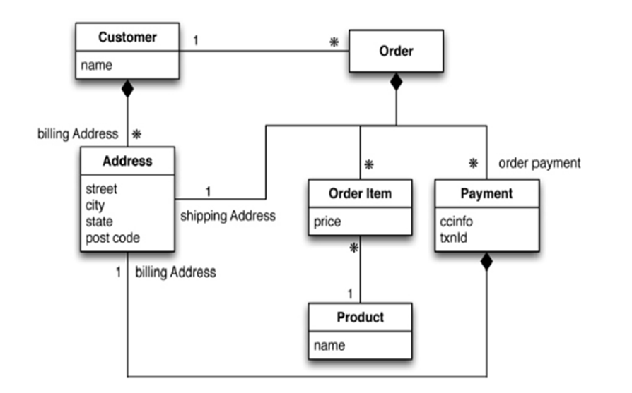

#### ②、Nosql如何设计？

- 什么是BSON

BSON（）是一种**类json的一种二进制形式的存储格式**，简称**Binary JSON**，它和JSON一样，支持内嵌的**文档对象和数组对象**

- BSon画出构建的数据模型

```json
 {
 "customer":{
   "id":1136,
   "name":"Z3",
   "billingAddress":[{"city":"beijing"}],
   "orders":[
    {
      "id":17,
      "customerId":1136,
      "orderItems":[{"productId":27,"price":77.5,"productName":"thinking in java"}],
      "shippingAddress":[{"city":"beijing"}]
      "orderPayment":[{"ccinfo":"111-222-333","txnid":"asdfadcd334","billingAddress":{"city":"beijing"}}],
      }
    ]
  }
}
```

#### ③、两者对比，问题和难点

关系型数据库需要大量的连表查询效率会慢，但是redis直接把关系放在了类json字符串中，所有的关系一个字符串就可以解决，这一点会比较方便。

### 1.3.2）聚合模型

- KV键值
- Bson（类json）
- 列族

顾名思义，是**按列存储数据的**。最大的特点是**方便存储结构化和半结构化数据**，方便做数据压缩，对针对某一列或者某几列的查询有非常大的IO优势。

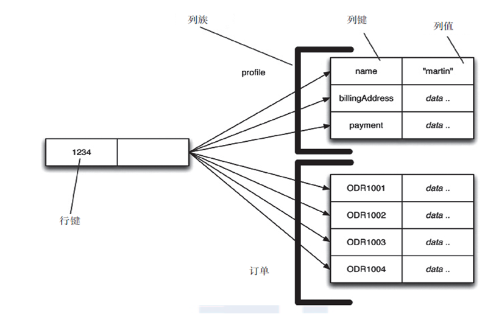

- 图形(关系)

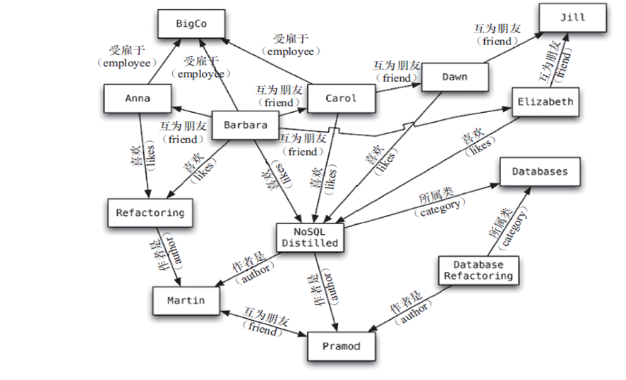

## 1.4）NoSQL数据库的四大分类

#### 1.4.1）分类

- KV键值
  - 新浪：BerkeleyDB+redis
  - 美团：redis+tair
  - 阿里、百度：memcache+redis

- 文档型数据库(bson格式比较多)
  - CouchDB
  - MongoDB
    - MongoDB 是一个基于分布式文件存储的数据库。由 C++ 语言编写。旨在为 WEB 应用提供可扩展的高性能数据存储解决方案。
    - MongoDB 是一个介于关系数据库和非关系数据库之间的产品，是非关系数据库当中功能最丰富，最像关系数据库的。

- 列存储数据库
  - Cassandra, HBase
  - 分布式文件系统

- 图关系数据库
  - 它不是放图形的，放的是关系比如:朋友圈社交网络、广告推荐系统
  - 社交网络，推荐系统等。专注于构建关系图谱
  - Neo4J, InfoGrid

#### 1.4.2）四者对比


## 1.5)在分布式数据库中CAP原理CAP+BASE

### 1.5.1）传统的ACID分别是什么

关系型数据库遵循ACID规则
事务在英文中是transaction，和现实世界中的交易很类似，它有如下四个特性：

1、**A (Atomicity) 原子性**
原子性很容易理解，也就是说事务里的所有操作要么全部做完，要么都不做，事务成功的条件是事务里的所有操作都成功，只要有一个操作失败，整个事务就失败，需要回滚。比如银行转账，从A账户转100元至B账户，分为两个步骤：1）从A账户取100元；2）存入100元至B账户。这两步要么一起完成，要么一起不完成，如果只完成第一步，第二步失败，钱会莫名其妙少了100元。

2、**C (Consistency) 一致性**
一致性也比较容易理解，也就是说数据库要一直处于一致的状态，事务的运行不会改变数据库原本的一致性约束。

也就是从一个正确的状态到另一个正确的状态，例如：**账户中的余额就 90 元，而 此时 要转出100元，很明显 转出 90-100=-10，这个-10就是不正确的状态，没有保证一致性。**

3、**I (Isolation) 独立性**
所谓的独立性是指并发的事务之间不会互相影响，如果一个事务要访问的数据正在被另外一个事务修改，只要另外一个事务未提交，它所访问的数据就不受未提交事务的影响。比如现有有个交易是从A账户转100元至B账户，在这个交易还未完成的情况下，如果此时B查询自己的账户，是看不到新增加的100元的

4、**D (Durability) 持久性**
持久性是指一旦事务提交后，它所做的修改将会永久的保存在数据库上，即使出现宕机也不会丢失。

### 1.5.2）CAP

**C:Consistency（强一致性）**

**A:Availability（可用性）**

**P:Partition tolerance（分区容错性）**

### 1.5.3）CAP的3进2

CAP理论就是说在分布式存储系统中，最多只能实现上面的两点。而由于当前的网络硬件肯定会出现延迟丢包等问题，所以 **分区容忍性是我们必须需要实现的**

所以我们只能在一致性和可用性之间进行权衡，没有NoSQL系统能同时保证这三点 。       

- C:强一致性 A：高可用性 P：分布式容忍性
  -  CA 传统Oracle数据库
  -  **AP 大多数网站架构的选择**
  - CP Redis、Mongodb

 注意：**分布式架构的时候必须做出取舍**。
一致性和可用性之间取一个平衡。多余大多数web应用，其实并不需要强一致性。
因此**牺牲C换取P**，这是目前分布式数据库产品的方向

### 1.5.4）经典CAP图

CAP理论的核心是：一个分布式系统不可能同时很好的满足一致性，可用性和分区容错性这三个需求，最多只能同时较好的**满足两个**。
因此，根据 CAP 原理将 NoSQL 数据库分成了满足 **CA 原则**、满足 **CP 原则**和满足 **AP 原则**三 大类：

- CA - 单点集群，满足一致性，可用性的系统，通常在可扩展性上不太强大。
- CP - 满足一致性，分区容忍必的系统，通常性能不是特别高。
- AP - 满足可用性，分区容忍性的系统，通常可能对一致性要求低一些。

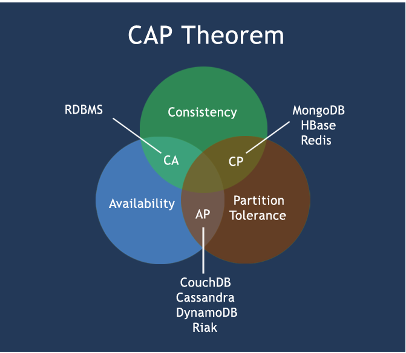

### 1.5.5）BASE

BASE就是为了解决关系数据库强一致性引起的问题而引起的可用性降低而提出的解决方案。

BASE其实是下面三个术语的缩写：

-  基本可用（**B**asically **A**vailable）
- 软状态（**S**oft state）
- 最终一致（**E**ventually consistent）

**它的思想是通过让系统放松对某一时刻数据一致性的要求来换取系统整体伸缩性和性能上改观**。为什么这么说呢，缘由就在于大型系统往往由于地域分布和极高性能的要求，不可能采用分布式事务来完成这些指标，要想获得这些指标，我们必须采用另外一种方式来完成，这里BASE就是解决这个问题的办法.(例如：优惠券)

### 1.5.6）分布式+集群简介

分布式系统

分布式系统（distributed system）
由多台计算机和通信的软件组件通过计算机网络连接（本地网络或广域网）组成。分布式系统是建立在网络之上的软件系统。正是因为软件的特性，所以分布式系统具有高度的内聚性和透明性。因此，网络和分布式系统之间的区别更多的在于高层软件（特别是操作系统），而不是硬件。分布式系统可以应用在在不同的平台上如：Pc、工作站、局域网和广域网上等。

简单来讲：
**1分布式：不同的多台服务器上面部署不同的服务模块（工程），他们之间通过Rpc/Rmi之间通信和调用，对外提供服务和组内协作。**

**2集群：不同的多台服务器上面部署相同的服务模块，通过分布式调度软件进行统一的调度，对外提供服务和访问。**

# 二、Redis介绍

## 2.1）概述

### 2.1.1）是什么

**Redis**:**RE**mote **DI**ctionary **S**erver(远程字典服务器)

是完全开源免费的，用C语言编写的，遵守BSD协议，是一个高性能的(key/value)分布式内存数据库，基于内存运行并支持持久化的NoSQL数据库，是当前最热门的NoSql数据库之一,也被人们称为数据结构服务器。

### 2.1.2）Redis 与其他 key - value 缓存产品有以下三个特点

- **Redis支持数据的持久化**，可以将内存中的数据保持在磁盘中，重启的时候可以再次加载进行使用
- Redis**不仅仅支持简单的key-value类型的数据**，同时还提供**list，set，zset，hash等**数据结构的存储
- Redis支持数据的备份，即master-slave模式的数据备份‘

### 2.1.2） 能干嘛

- 内存存储和持久化：redis支持异步将内存中的数据写到硬盘上，同时不影响继续服务
- 取最新N个数据的操作，如：可以将最新的10条评论的ID放在Redis的List集合里面
- 模拟类似于HttpSession这种需要设定过期时间的功能
- 发布、订阅消息系统
- 定时器、计数器

### 2.1.3）去哪下

- Http://redis.io/

- Http://www.redis.cn/

### 2.1.4） 怎么玩

- 数据类型、基本操作和配置
- 持久化和复制，RDB/AOF
- 事务的控制
- 复制
- .......

## 2.2）Redis的安装(redis-3.0.4.tar.gz)

#### 2.2.1）下载获得redis-3.0.4.tar.gz后将它放入我们的Linux目录/opt

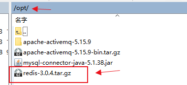

#### 2.2.2）/opt目录下，解压命令:`tar -zxvf redis-3.0.4.tar.gz`

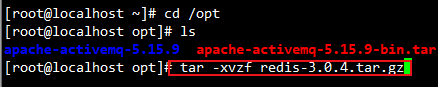

```shell
[root@localhost opt]# tar -xvzf redis-3.0.4.tar.gz 
```

#### 2.2.3）进入刚刚解压的目录:`cd redis-3.0.4`

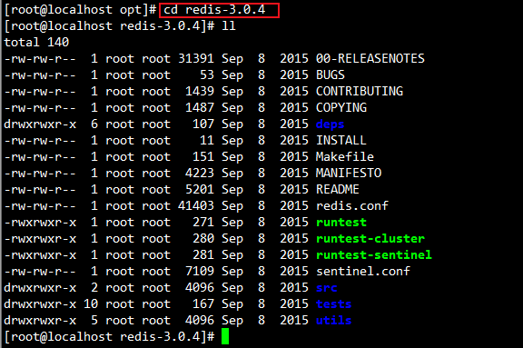

```shell
[root@localhost opt]# cd redis-3.0.4
[root@localhost redis-3.0.4]# ll
```

#### 2.2.4）在redis-3.0.4目录下执行make命令

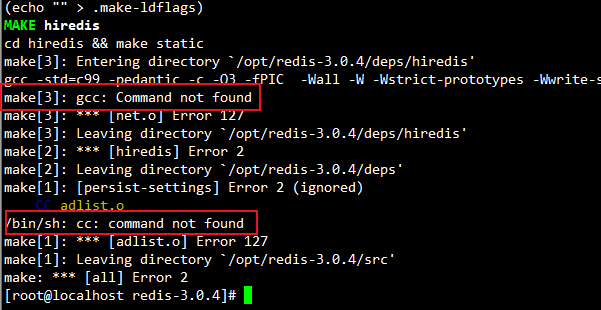

①、出现gcc找不到，说明没有安装gcc,需要安装gcc，执行 `yum -y install gcc-c++`


```shell
[root@localhost redis-3.0.4]# yum -y install gcc-c++
```

②、继续执行`make`命令，如果再出现Jemalloc/jemalloc.h：没有那个文件或目录 ，需要执行`make distclean`）

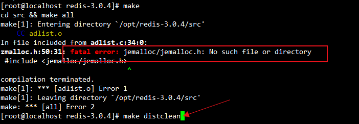

```shell
[root@localhost redis-3.0.4]# make distclean
```

③、再次执行`make`


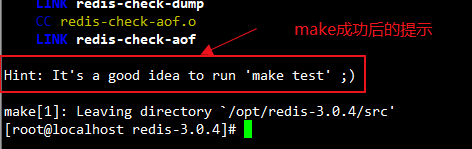

```shell
[root@localhost redis-3.0.4]# make
```

④、************注意注意: **Redis Test(可以不用执行)**，这个步骤**了解一下**

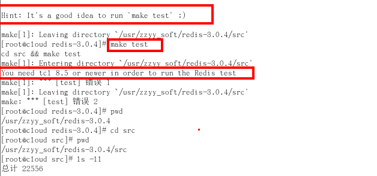

下载TCL的网址：http://www.linuxfromscratch.org/blfs/view/cvs/general/tcl.html

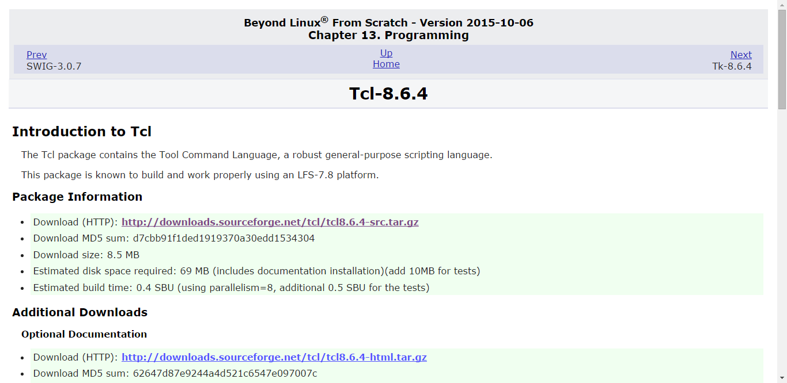

安装TCL

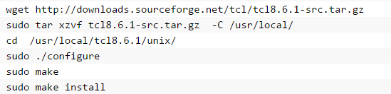

#### 2.2.5）如果make完成后继续执行make install

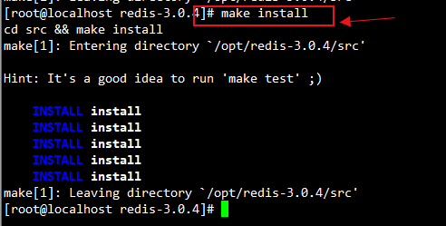

```shell
[root@localhost redis-3.0.4]# make install
```

#### 2.2.6）查看默认安装目录：`usr/local/bin`

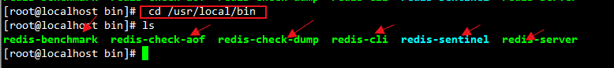

```shell
[root@localhost bin]#  cd /usr/local/bin
[root@localhost bin]# ls
```

- Redis-benchmark:性能测试工具，可以在自己本子运行，看看自己本子性能如何
  - 注意：服务启动起来后执行

- Redis-check-aof：修复有问题的AOF文件，rdb和aof后面讲
- Redis-check-dump：修复有问题的dump.rdb文件
- Redis-cli：客户端，操作入口
- Redis-sentinel：redis集群使用
- Redis-server：Redis服务器启动命令

#### 2.2.7）将安装好的redis文件夹中的配置文件`redis.conf`，拷贝一份到自己建的`/myredis`文件夹下

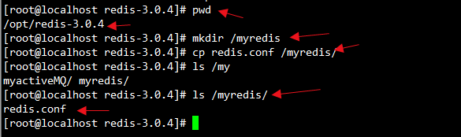

```shell
[root@localhost redis-3.0.4]# pwd
[root@localhost redis-3.0.4]# mkdir /myredis
[root@localhost redis-3.0.4]# cp redis.conf /myredis/
[root@localhost redis-3.0.4]# ls /myredis/
[root@localhost redis-3.0.4]# 
```

#### 2.2.8）修改`/myredis/redis.conf`文件将里面的`daemonize no` 改成 `yes`，让服务在后台启动

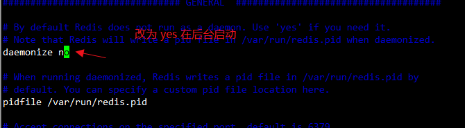

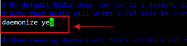

```shell
# By default Redis does not run as a daemon. Use 'yes' if you need it.
# Note that Redis will write a pid file in /var/run/redis.pid when daemonized.

#把no 改为 yes
daemonize yes
```

#### 2.2.9）启动redis


进入 `/usr/local/bin`路径下，启动redis,执行：`./redis-server /myredis/redis.conf`

查看进程启动情况： `ps -ef | grep redis | grep -v grep`

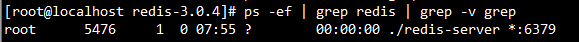

```shell
[root@localhost bin]# cd /usr/local/bin
[root@localhost bin]# ./redis-server /myredis/redis.conf
[root@localhost redis-3.0.4]# ps -ef | grep redis | grep -v grep
```

####  2.2.10）连通测试`./redis-cli`

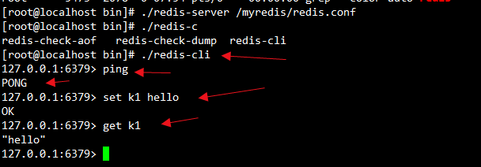

```shell
[root@localhost bin]# ./redis-cli
127.0.0.1:6379> ping 
PONG
127.0.0.1:6379> set k1 hello
OK
127.0.0.1:6379> get k1
"hello"
127.0.0.1:6379> 
```

#### 2.2.11）关闭 `shutdown`


```shell
127.0.0.1:6379> shutdown
not connected> quit
[root@localhost bin]# ps -ef | grep redis | grep -v grep
```

①、单实例关闭：redis-cli shutdown

②、多实例关闭，指定端口关闭:redis-cli -p 6379 shutdown


### 2.3）Redis启动后杂项基础知识讲解

#### 2.3.1）单进程

- 单进程模型来处理客户端的请求。对读写等事件的响应
  是通过对epoll函数的包装来做到的。Redis的实际处理速度完全依靠主进程的执行效率

- Epoll是Linux内核为处理大批量文件描述符而作了改进的epoll，是Linux下多路复用IO接口select/poll的增强版本，它能显著提高程序在大量并发连接中只有少量活跃的情况下的系统CPU利用率。

#### 2.3.2）默认16个数据库，类似数组下表从零开始，初始默认使用零号库

配置文件中`redis.conf`可以看到默认是 16 个库


#### 2.3.3）Select命令切换数据库


```shell
#启动redis
[root@localhost bin]# ./redis-server /myredis/redis.conf 
[root@localhost bin]# ./redis-c 
#启动redis的客户端
[root@localhost bin]# ./redis-cli
#获取索引为第 0 号库的数据 k1
127.0.0.1:6379> get k1
"hello"
#切换到索引为第 6 号库
127.0.0.1:6379> select 6
OK
#查找k1的值，查找不到，因为在不同的库里
127.0.0.1:6379[6]> get k1
(nil)
127.0.0.1:6379[6]> 
```

#### 2.3.4）Dbsize查看当前数据库的key的数量

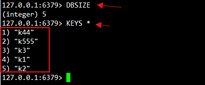

```shell
#查询当前数据库的key的数量
127.0.0.1:6379> DBSIZE
(integer) 5
#查看所有的key,一般不建议使用这个命令
127.0.0.1:6379> KEYS *
1) "k44"
2) "k555"
3) "k3"
4) "k1"
5) "k2"
127.0.0.1:6379> 
```

Redis `Keys` 命令用于查找所有符合给定模式 pattern 的 key 如：`keys k??`   `KEYS runoob*`

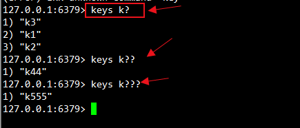

```shell
#使用给定模式 pattern查找key
127.0.0.1:6379> keys k?
1) "k3"
2) "k1"
3) "k2"
127.0.0.1:6379> keys k??
1) "k44"
127.0.0.1:6379> keys k???
1) "k555"
127.0.0.1:6379> 
```

#### 2.3.5）Flushdb：清空当前库

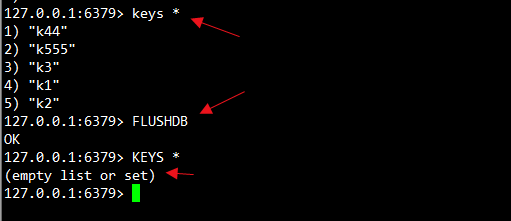

```shell
127.0.0.1:6379> keys *
1) "k44"
2) "k555"
3) "k3"
4) "k1"
5) "k2"
#清空当前的库
127.0.0.1:6379> FLUSHDB
OK
127.0.0.1:6379> KEYS *
(empty list or set)
127.0.0.1:6379> 
```


#### 2.3.6）Flushall；通杀全部库

这个不演示了，不推荐使用

#### 2.3.7）**统一密码管理**，16个库都是同样密码，要么都OK要么一个也连接不上

#### 2.3.8）Redis索引都是从零开始

#### 2.3.9）为什么默认端口是6379 ： merz


# 三、Redis数据类型

## 3.1）Redis的五大数据类型

### 3.1.1）String（字符串）

- string是redis最基本的类型，你可以理解成与Memcached一模一样的类型，**一个key对应一个value**。
- string类型是**二进制安全的**。意思是**redis的string可以包含任何数据**。比如**jpg图片或者序列化的对象** 。
- string类型是Redis最基本的数据类型，**一个redis中字符串**value**最多**可以**是512M**

### 3.1.2）Hash（哈希，类似java里的Map）[HashMap无序无重复]

- Redis hash 是一个**键值对集合**。
- Redis hash是一个s**tring类型的field和value的映射表**，hash**特别适合用于存储对象**。
- **类似Java里面的Map<String,Object>**

### 3.1.3）List（列表）[arrayList有序有重复]

- Redis 列表是简单的**字符串列表**，按照插入顺序排序。你可以添加一个元素导列表的**头部（左边）或者尾部（右边）**。
- 它的底层实际**是个链表**

### 3.1.4）Set（集合）[hashSet无序无重复]

- Redis的Set是string类型的**无序集合**。它是通过**HashTable实现**的，

### 3.1.5）Zset(sorted set：有序集合)

- Redis zset 和 set 一样也是string类型元素的集合,且**不允许重复**的成员。
- **不同的是每个元素都会关联一个double类型的分数**。
- redis正是通过**分数来为集合中的成员进行从小到大的排序**。zset的成员是唯一的,但分数(score)却可以重复。

## 3.2）哪里去获得redis常见数据类型操作命令

- (全) Http://redisdoc.com/    
- (全) http://www.redis.cn/

## 3.3）Redis 键(key)

### 3.3.1）常用的命令表


### 3.3.2）常用的部分例子：

#### ① `keys *` 查找给定模式的key

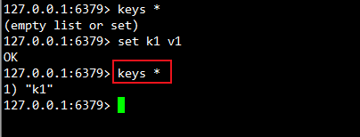

```shell
127.0.0.1:6379> keys *
(empty list or set)
127.0.0.1:6379> set k1 v1
OK
#查找给定模式的key
127.0.0.1:6379> keys *
1) "k1"
127.0.0.1:6379> 
```

#### ②`exists key`的名字，判断某个key是否存在

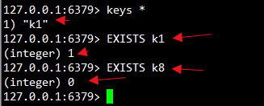

```shell
127.0.0.1:6379> keys *
1) "k1"
#判断 k1是否存在 返回 1 存在
127.0.0.1:6379> EXISTS k1
(integer) 1
#判断 k8是否存在 返回 0 不存在
127.0.0.1:6379> EXISTS k8
(integer) 0
127.0.0.1:6379> 
```

####  ③`move key db`   --->当前库就没有了，被移除了

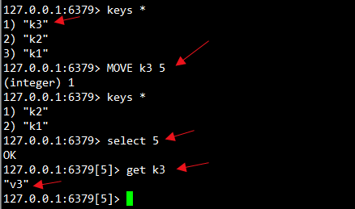

```shell
127.0.0.1:6379> keys *
1) "k3"
2) "k2"
3) "k1"
#移动 k3 到索引为 5号的库 返回 1 移动成功
127.0.0.1:6379> MOVE k3 5
(integer) 1
127.0.0.1:6379> keys *
1) "k2"
2) "k1"
#切换到 索引为 5号的库
127.0.0.1:6379> select 5
OK
#取出 key 为 k3 的值
127.0.0.1:6379[5]> get k3
"v3"
127.0.0.1:6379[5]>
```

#### ④ `expire key` 秒钟：为给定的key设置过期时间

参见⑤

#### ⑤ ttl key 查看还有多少秒过期，-1表示永不过期，-2表示已过期

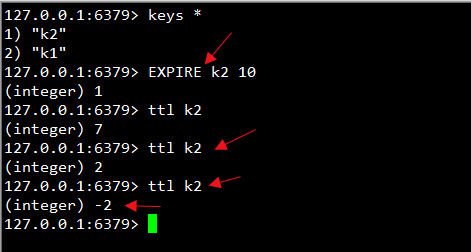

```shell
127.0.0.1:6379> keys *
1) "k2"
2) "k1"
#设置 k2的过期时间为 10 秒
127.0.0.1:6379> EXPIRE k2 10
(integer) 1
127.0.0.1:6379> ttl k2
(integer) 7
127.0.0.1:6379> ttl k2
(integer) 2
#已过期返回 -2
127.0.0.1:6379> ttl k2
(integer) -2
127.0.0.1:6379> 
```

#### ⑥ `type key` 查看你的key是什么类型

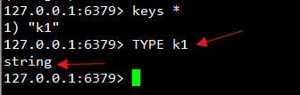

```shell
127.0.0.1:6379> keys *
1) "k1"
#查看 k1是什么类型
127.0.0.1:6379> TYPE k1
string
127.0.0.1:6379> 
```


## 3.4）Redis字符串(String)-单值单value

### 3.4.1）常用命令表

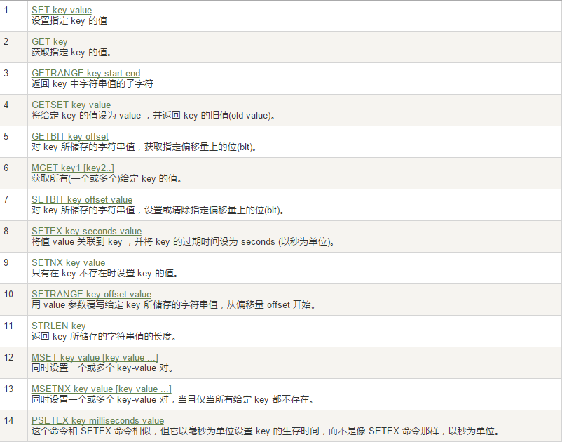

### 3.4.2）常用的部分例子：

#### ①`set/get/del/append/strlen`

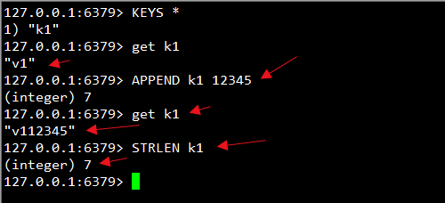

```shell
127.0.0.1:6379> KEYS *
1) "k1"
127.0.0.1:6379> get k1
"v1"
#在 相应的key对应的value后追加 值
127.0.0.1:6379> APPEND k1 12345
(integer) 7
127.0.0.1:6379> get k1
"v112345"
#获取指定key对应value的长度
127.0.0.1:6379> STRLEN k1
(integer) 7
127.0.0.1:6379>
```

#### ②`Incr/decr/incrby/decrby`,一定要是数字才能进行加减

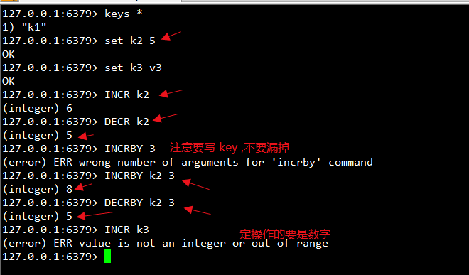

```shell
127.0.0.1:6379> keys *
1) "k1"
127.0.0.1:6379> set k2 5
OK
127.0.0.1:6379> set k3 v3
OK
#逐 1 增加
127.0.0.1:6379> INCR k2
(integer) 6
#逐 1 减少
127.0.0.1:6379> DECR k2
(integer) 5
#漏掉的key 报错
127.0.0.1:6379> INCRBY 3
(error) ERR wrong number of arguments for 'incrby' command
#按照指定的值 进行增加
127.0.0.1:6379> INCRBY k2 3
(integer) 8
#按照指定的值 进行减少
127.0.0.1:6379> DECRBY k2 3
(integer) 5
#不能操作非数值
127.0.0.1:6379> INCR k3
(error) ERR value is not an integer or out of range
127.0.0.1:6379> 
```

#### ③`getrange/setrange`

- **getrange**:获取指定区间范围内的值，类似between......and的关系
- **从零到负一表示全部**

- **setrange**设置指定区间范围内的值，格式是setrange key值 具体值

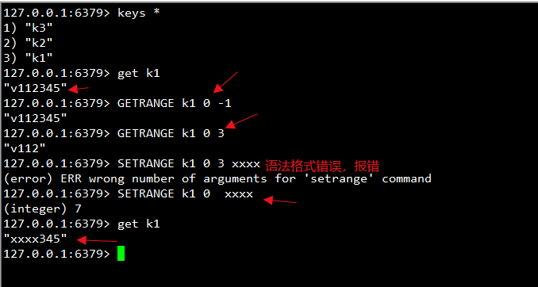

```shell
127.0.0.1:6379> keys *
1) "k3"
2) "k2"
3) "k1"
127.0.0.1:6379> get k1
"v112345"
#获取k1指定范围的值 ， 0 -1 代表获取所有
127.0.0.1:6379> GETRANGE k1 0 -1
"v112345"
#获取k1指定范围的值  获取从0 开始 到 3 之间的值
127.0.0.1:6379> GETRANGE k1 0 3
"v112"
127.0.0.1:6379> SETRANGE k1 0 3 xxxx
(error) ERR wrong number of arguments for 'setrange' command
#设置k1指定范围的值，从 0 索引开始 set xxxx
127.0.0.1:6379> SETRANGE k1 0  xxxx
(integer) 7
127.0.0.1:6379> get k1
"xxxx345"
127.0.0.1:6379> 
```

#### ④ setex(set with expire)键秒值/setnx(set if not exist)

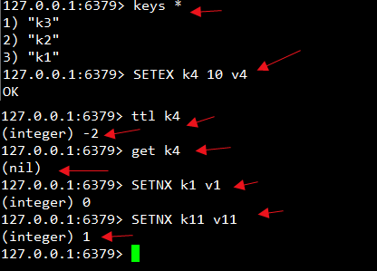

```shell
127.0.0.1:6379> keys *
1) "k3"
2) "k2"
3) "k1"
#设置key为k4的值，10秒过期 
127.0.0.1:6379> SETEX k4 10 v4
OK
#查询 k4的key 已经过期
127.0.0.1:6379> ttl k4
(integer) -2
#找不到k4，已经过期了
127.0.0.1:6379> get k4
(nil)
#当 设置的key 不存在的时候，才能设置成功，返回0 表示 当前 k1已经存在
127.0.0.1:6379> SETNX k1 v1
(integer) 0
#当 设置的key 不存在的时候，才能设置成功，返回1 表示 当前 k1设置成功
127.0.0.1:6379> SETNX k11 v11
(integer) 1
127.0.0.1:6379> 
```

#### ⑤`mset/mget/msetnx` 同时操作多个

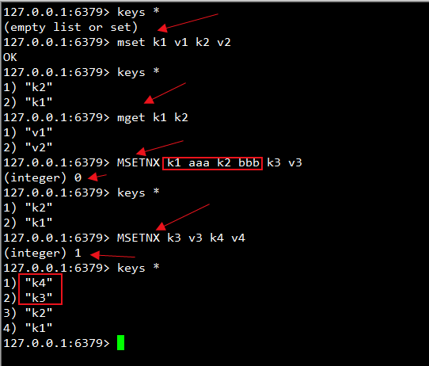


```shell
127.0.0.1:6379> keys *
(empty list or set)
#同时设置 k1 k2
127.0.0.1:6379> mset k1 v1 k2 v2
OK
127.0.0.1:6379> keys *
1) "k2"
2) "k1"
#同时获取 k1 k2
127.0.0.1:6379> mget k1 k2
1) "v1"
2) "v2"
#同时设置 k1 k2 k3 ，当设置的key不存在时，注意：有一个存在，此命令就会执行失败，一损皆损
127.0.0.1:6379> MSETNX k1 aaa k2 bbb k3 v3
#返回值 为 0 ，没有设置成功
(integer) 0
127.0.0.1:6379> keys *
1) "k2"
2) "k1"
#同时设置 k3 k4 ，当设置的key不存在时
127.0.0.1:6379> MSETNX k3 v3 k4 v4
#返回值 为 1 ，设置成功
(integer) 1
127.0.0.1:6379> keys *
1) "k4"
2) "k3"
3) "k2"
4) "k1"
127.0.0.1:6379> 
```

#### ⑥`getset`(先get再set)

- getset:将给定 key 的值设为 value ，并返回 key 的旧值(old value)。
- **简单一句话，先get然后立即set**

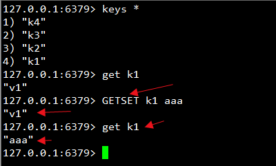

```shell
127.0.0.1:6379> keys *
1) "k4"
2) "k3"
3) "k2"
4) "k1"
127.0.0.1:6379> get k1
"v1"
#设置 k1 的新值为 aaa 并返回 k1 的旧值 v1
127.0.0.1:6379> GETSET k1 aaa
"v1"
127.0.0.1:6379> get k1
"aaa"
127.0.0.1:6379> 
```

