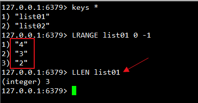

# 一、NoSql和概述

## 1.1）概述

### 1.1.1）是什么

NoSQL(NoSQL = **Not Only SQL** )，意即“**不仅仅是SQL**”，**泛指非关系型的数据库**。随着互联网web2.0网站的兴起，传统的关系数据库在应付web2.0网站，特别是超大规模和高并发的SNS类型的web2.0纯动态网站已经显得力不从心，暴露了很多难以克服的问题，而非关系型的数据库则由于其本身的特点得到了非常迅速的发展。NoSQL数据库的产生就是为了解决大规模数据集合多重数据种类带来的挑战，尤其是大数据应用难题，包括超大规模数据的存储。

（例如谷歌或Facebook每天为他们的用户收集万亿比特的数据）。**这些类型的数据存储不需要固定的模式，无需多余操作就可以横向扩展。**

### 1.1.2）能干嘛

#### 1.1.2.1）易扩展

NoSQL数据库种类繁多，但是一个共同的特点都是**去掉关系数据库的关系型特性。**
**数据之间无关系，这样就非常容易扩展**。也无形之间，在架构的层面上带来了可扩展的能力。

#### 1.1.2.2）大数据量高性能

- NoSQL数据库都具有非常高的读写性能，尤其在大数据量下，同样表现优秀。**这得益于它的无关系性，数据库的结构简单。**
- 一般MySQL使用Query Cache，每次表的更新Cache就失效，是一种大粒度的Cache，在针对web2.0的交互频繁的应用，Cache性能不高。而NoSQL的Cache是记录级的，是一种细粒度的Cache，所以NoSQL在这个层面上来说就要性能高很多了

#### 1.1.2.3）多样灵活的数据模型

**NoSQL无需事先为要存储的数据建立字段，随时可以存储自定义的数据格式**。而在关系数据库里，增删字段是一件非常麻烦的事情。如果是非常大数据量的表，增加字段简直就是一个噩梦。

#### 1.1.2.4）传统RDBMS VS NOSQL

RDBMS
- 高度组织化结构化数据
- 结构化查询语言（SQL）
- 数据和关系都存储在单独的表中。
- 数据操纵语言，数据定义语言
- 严格的一致性
- 基础事务

NoSQL
- 代表着不仅仅是SQL
- 没有声明性查询语言
- 没有预定义的模式
- 键 - 值对存储，列存储，文档存储，图形数据库
- 最终一致性，而非ACID属性
- 非结构化和不可预知的数据
- CAP定理
- 高性能，高可用性和可伸缩性

### 1.1.3）去哪下

Redis

Memcache

Mongdb

### 1.1.4）怎么玩

- KV(键值对)

- Cache（缓存）

- Persistence(持久化)

- ...

## 1.2）3V+3高

### 1.2.1）大数据时代的3V

- 海量Volume
- 多样Variety
- 实时Velocity

### 1.2.2）互联网需求的3高

- 高并发
- 高扩展
- 高性能

## 1.3）NoSQL数据模型简介

### 1.3.1）电商客户模型对比

以一个电商客户、订单、订购、地址模型来对比下关系型数据库和非关系型数据库

#### ①、传统的关系型数据库你如何设计？

ER图(1:1/1:N/N:N,主外键等常见)


#### ②、Nosql如何设计？

- 什么是BSON

BSON（）是一种**类json的一种二进制形式的存储格式**，简称**Binary JSON**，它和JSON一样，支持内嵌的**文档对象和数组对象**

- BSon画出构建的数据模型

```json
 {
 "customer":{
   "id":1136,
   "name":"Z3",
   "billingAddress":[{"city":"beijing"}],
   "orders":[
    {
      "id":17,
      "customerId":1136,
      "orderItems":[{"productId":27,"price":77.5,"productName":"thinking in java"}],
      "shippingAddress":[{"city":"beijing"}]
      "orderPayment":[{"ccinfo":"111-222-333","txnid":"asdfadcd334","billingAddress":{"city":"beijing"}}],
      }
    ]
  }
}
```

#### ③、两者对比，问题和难点

关系型数据库需要大量的连表查询效率会慢，但是redis直接把关系放在了类json字符串中，所有的关系一个字符串就可以解决，这一点会比较方便。

### 1.3.2）聚合模型

- KV键值
- Bson（类json）
- 列族

顾名思义，是**按列存储数据的**。最大的特点是**方便存储结构化和半结构化数据**，方便做数据压缩，对针对某一列或者某几列的查询有非常大的IO优势。


- 图形(关系)


## 1.4）NoSQL数据库的四大分类

#### 1.4.1）分类

- KV键值
  - 新浪：BerkeleyDB+redis
  - 美团：redis+tair
  - 阿里、百度：memcache+redis

- 文档型数据库(bson格式比较多)
  - CouchDB
  - MongoDB
    - MongoDB 是一个基于分布式文件存储的数据库。由 C++ 语言编写。旨在为 WEB 应用提供可扩展的高性能数据存储解决方案。
    - MongoDB 是一个介于关系数据库和非关系数据库之间的产品，是非关系数据库当中功能最丰富，最像关系数据库的。

- 列存储数据库
  - Cassandra, HBase
  - 分布式文件系统

- 图关系数据库
  - 它不是放图形的，放的是关系比如:朋友圈社交网络、广告推荐系统
  - 社交网络，推荐系统等。专注于构建关系图谱
  - Neo4J, InfoGrid

#### 1.4.2）四者对比


## 1.5)在分布式数据库中CAP原理CAP+BASE

### 1.5.1）传统的ACID分别是什么

关系型数据库遵循ACID规则
事务在英文中是transaction，和现实世界中的交易很类似，它有如下四个特性：

1、**A (Atomicity) 原子性**
原子性很容易理解，也就是说事务里的所有操作要么全部做完，要么都不做，事务成功的条件是事务里的所有操作都成功，只要有一个操作失败，整个事务就失败，需要回滚。比如银行转账，从A账户转100元至B账户，分为两个步骤：1）从A账户取100元；2）存入100元至B账户。这两步要么一起完成，要么一起不完成，如果只完成第一步，第二步失败，钱会莫名其妙少了100元。

2、**C (Consistency) 一致性**
一致性也比较容易理解，也就是说数据库要一直处于一致的状态，事务的运行不会改变数据库原本的一致性约束。

也就是从一个正确的状态到另一个正确的状态，例如：**账户中的余额就 90 元，而 此时 要转出100元，很明显 转出 90-100=-10，这个-10就是不正确的状态，没有保证一致性。**

3、**I (Isolation) 独立性**
所谓的独立性是指并发的事务之间不会互相影响，如果一个事务要访问的数据正在被另外一个事务修改，只要另外一个事务未提交，它所访问的数据就不受未提交事务的影响。比如现有有个交易是从A账户转100元至B账户，在这个交易还未完成的情况下，如果此时B查询自己的账户，是看不到新增加的100元的

4、**D (Durability) 持久性**
持久性是指一旦事务提交后，它所做的修改将会永久的保存在数据库上，即使出现宕机也不会丢失。

### 1.5.2）CAP

**C:Consistency（强一致性）**

**A:Availability（可用性）**

**P:Partition tolerance（分区容错性）**

### 1.5.3）CAP的3进2

CAP理论就是说在分布式存储系统中，最多只能实现上面的两点。而由于当前的网络硬件肯定会出现延迟丢包等问题，所以 **分区容忍性是我们必须需要实现的**

所以我们只能在一致性和可用性之间进行权衡，没有NoSQL系统能同时保证这三点 。       

- C:强一致性 A：高可用性 P：分布式容忍性
  -  CA 传统Oracle数据库
  -  **AP 大多数网站架构的选择**
  - CP Redis、Mongodb

 注意：**分布式架构的时候必须做出取舍**。
一致性和可用性之间取一个平衡。多余大多数web应用，其实并不需要强一致性。
因此**牺牲C换取P**，这是目前分布式数据库产品的方向

### 1.5.4）经典CAP图

CAP理论的核心是：一个分布式系统不可能同时很好的满足一致性，可用性和分区容错性这三个需求，最多只能同时较好的**满足两个**。
因此，根据 CAP 原理将 NoSQL 数据库分成了满足 **CA 原则**、满足 **CP 原则**和满足 **AP 原则**三 大类：

- CA - 单点集群，满足一致性，可用性的系统，通常在可扩展性上不太强大。
- CP - 满足一致性，分区容忍必的系统，通常性能不是特别高。
- AP - 满足可用性，分区容忍性的系统，通常可能对一致性要求低一些。


### 1.5.5）BASE

BASE就是为了解决关系数据库强一致性引起的问题而引起的可用性降低而提出的解决方案。

BASE其实是下面三个术语的缩写：

-  基本可用（**B**asically **A**vailable）
- 软状态（**S**oft state）
- 最终一致（**E**ventually consistent）

**它的思想是通过让系统放松对某一时刻数据一致性的要求来换取系统整体伸缩性和性能上改观**。为什么这么说呢，缘由就在于大型系统往往由于地域分布和极高性能的要求，不可能采用分布式事务来完成这些指标，要想获得这些指标，我们必须采用另外一种方式来完成，这里BASE就是解决这个问题的办法.(例如：优惠券)

### 1.5.6）分布式+集群简介

分布式系统

分布式系统（distributed system）
由多台计算机和通信的软件组件通过计算机网络连接（本地网络或广域网）组成。分布式系统是建立在网络之上的软件系统。正是因为软件的特性，所以分布式系统具有高度的内聚性和透明性。因此，网络和分布式系统之间的区别更多的在于高层软件（特别是操作系统），而不是硬件。分布式系统可以应用在在不同的平台上如：Pc、工作站、局域网和广域网上等。

简单来讲：  
**1分布式：不同的多台服务器上面部署不同的服务模块（工程），他们之间通过Rpc/Rmi之间通信和调用，对外提供服务和组内协作。**

**2集群：不同的多台服务器上面部署相同的服务模块，通过分布式调度软件进行统一的调度，对外提供服务和访问。**

# 二、Redis介绍

## 2.1）概述

### 2.1.1）是什么

**Redis**:**RE**mote **DI**ctionary **S**erver(远程字典服务器)

是完全开源免费的，用C语言编写的，遵守BSD协议，是一个高性能的(key/value)分布式内存数据库，基于内存运行并支持持久化的NoSQL数据库，是当前最热门的NoSql数据库之一,也被人们称为数据结构服务器。

### 2.1.2）Redis 与其他 key - value 缓存产品有以下三个特点

- **Redis支持数据的持久化**，可以将内存中的数据保持在磁盘中，重启的时候可以再次加载进行使用
- Redis**不仅仅支持简单的key-value类型的数据**，同时还提供**list，set，zset，hash等**数据结构的存储
- Redis支持数据的备份，即master-slave模式的数据备份‘

### 2.1.2） 能干嘛

- 内存存储和持久化：redis支持异步将内存中的数据写到硬盘上，同时不影响继续服务
- 取最新N个数据的操作，如：可以将最新的10条评论的ID放在Redis的List集合里面
- 模拟类似于HttpSession这种需要设定过期时间的功能
- 发布、订阅消息系统
- 定时器、计数器

### 2.1.3）去哪下

- Http://redis.io/

- Http://www.redis.cn/

### 2.1.4） 怎么玩

- 数据类型、基本操作和配置
- 持久化和复制，RDB/AOF
- 事务的控制
- 复制
- .......

## 2.2）Redis的安装(redis-3.0.4.tar.gz)

#### 2.2.1）下载获得redis-3.0.4.tar.gz后将它放入我们的Linux目录/opt


#### 2.2.2）/opt目录下，解压命令:`tar -zxvf redis-3.0.4.tar.gz`


```shell
[root@localhost opt]# tar -xvzf redis-3.0.4.tar.gz 
```

#### 2.2.3）进入刚刚解压的目录:`cd redis-3.0.4`


```shell
[root@localhost opt]# cd redis-3.0.4
[root@localhost redis-3.0.4]# ll
```

#### 2.2.4）在redis-3.0.4目录下执行make命令


①、出现gcc找不到，说明没有安装gcc,需要安装gcc，执行 `yum -y install gcc-c++`


```shell
[root@localhost redis-3.0.4]# yum -y install gcc-c++
```

②、继续执行`make`命令，如果再出现Jemalloc/jemalloc.h：没有那个文件或目录 ，需要执行`make distclean`）


```shell
[root@localhost redis-3.0.4]# make distclean
```

③、再次执行`make`


```shell
[root@localhost redis-3.0.4]# make
```

④、************注意注意: **Redis Test(可以不用执行)**，这个步骤**了解一下**


下载TCL的网址：http://www.linuxfromscratch.org/blfs/view/cvs/general/tcl.html


安装TCL


#### 2.2.5）如果make完成后继续执行make install


```shell
[root@localhost redis-3.0.4]# make install
```

#### 2.2.6）查看默认安装目录：`usr/local/bin`


```shell
[root@localhost bin]#  cd /usr/local/bin
[root@localhost bin]# ls
```

- Redis-benchmark:性能测试工具，可以在自己本子运行，看看自己本子性能如何
  - 注意：服务启动起来后执行

- Redis-check-aof：修复有问题的AOF文件，rdb和aof后面讲
- Redis-check-dump：修复有问题的dump.rdb文件
- Redis-cli：客户端，操作入口
- Redis-sentinel：redis集群使用
- Redis-server：Redis服务器启动命令

#### 2.2.7）将安装好的redis文件夹中的配置文件`redis.conf`，拷贝一份到自己建的`/myredis`文件夹下


```shell
[root@localhost redis-3.0.4]# pwd
[root@localhost redis-3.0.4]# mkdir /myredis
[root@localhost redis-3.0.4]# cp redis.conf /myredis/
[root@localhost redis-3.0.4]# ls /myredis/
[root@localhost redis-3.0.4]# 
```

#### 2.2.8）修改`/myredis/redis.conf`文件将里面的`daemonize no` 改成 `yes`，让服务在后台启动


```shell
# By default Redis does not run as a daemon. Use 'yes' if you need it.
# Note that Redis will write a pid file in /var/run/redis.pid when daemonized.

#把no 改为 yes
daemonize yes
```

#### 2.2.9）启动redis


进入 `/usr/local/bin`路径下，启动redis,执行：`./redis-server /myredis/redis.conf`

查看进程启动情况： `ps -ef | grep redis | grep -v grep`


```shell
[root@localhost bin]# cd /usr/local/bin
[root@localhost bin]# ./redis-server /myredis/redis.conf
[root@localhost redis-3.0.4]# ps -ef | grep redis | grep -v grep
```

####  2.2.10）连通测试`./redis-cli`


```shell
[root@localhost bin]# ./redis-cli
127.0.0.1:6379> ping 
PONG
127.0.0.1:6379> set k1 hello
OK
127.0.0.1:6379> get k1
"hello"
127.0.0.1:6379> 
```

#### 2.2.11）关闭 `shutdown`


```shell
127.0.0.1:6379> shutdown
not connected> quit
[root@localhost bin]# ps -ef | grep redis | grep -v grep
```

①、单实例关闭：redis-cli shutdown

②、多实例关闭，指定端口关闭:redis-cli -p 6379 shutdown


### 2.3）Redis启动后杂项基础知识讲解

#### 2.3.1）单进程

- 单进程模型来处理客户端的请求。对读写等事件的响应
  是通过对epoll函数的包装来做到的。Redis的实际处理速度完全依靠主进程的执行效率

- Epoll是Linux内核为处理大批量文件描述符而作了改进的epoll，是Linux下多路复用IO接口select/poll的增强版本，它能显著提高程序在大量并发连接中只有少量活跃的情况下的系统CPU利用率。

#### 2.3.2）默认16个数据库，类似数组下标从零开始，初始默认使用零号库

配置文件中`redis.conf`可以看到默认是 16 个库


#### 2.3.3）Select命令切换数据库


```shell
#启动redis
[root@localhost bin]# ./redis-server /myredis/redis.conf 
[root@localhost bin]# ./redis-c 
#启动redis的客户端
[root@localhost bin]# ./redis-cli
#获取索引为第 0 号库的数据 k1
127.0.0.1:6379> get k1
"hello"
#切换到索引为第 6 号库
127.0.0.1:6379> select 6
OK
#查找k1的值，查找不到，因为在不同的库里
127.0.0.1:6379[6]> get k1
(nil)
127.0.0.1:6379[6]> 
```

#### 2.3.4）Dbsize查看当前数据库的key的数量


```shell
#查询当前数据库的key的数量
127.0.0.1:6379> DBSIZE
(integer) 5
#查看所有的key,一般不建议使用这个命令
127.0.0.1:6379> KEYS *
1) "k44"
2) "k555"
3) "k3"
4) "k1"
5) "k2"
127.0.0.1:6379> 
```

Redis `Keys` 命令用于查找所有符合给定模式 pattern 的 key 如：`keys k??`   `KEYS runoob*`


```shell
#使用给定模式 pattern查找key
127.0.0.1:6379> keys k?
1) "k3"
2) "k1"
3) "k2"
127.0.0.1:6379> keys k??
1) "k44"
127.0.0.1:6379> keys k???
1) "k555"
127.0.0.1:6379> 
```

#### 2.3.5）Flushdb：清空当前库


```shell
127.0.0.1:6379> keys *
1) "k44"
2) "k555"
3) "k3"
4) "k1"
5) "k2"
#清空当前的库
127.0.0.1:6379> FLUSHDB
OK
127.0.0.1:6379> KEYS *
(empty list or set)
127.0.0.1:6379> 
```


#### 2.3.6）Flushall；通杀全部库

这个不演示了，不推荐使用

#### 2.3.7）**统一密码管理**，16个库都是同样密码，要么都OK要么一个也连接不上

#### 2.3.8）Redis索引都是从零开始

#### 2.3.9）为什么默认端口是6379 ： merz


# 三、Redis数据类型

## 3.1）Redis的五大数据类型

### 3.1.1）String（字符串）

- string是redis最基本的类型，你可以理解成与Memcached一模一样的类型，**一个key对应一个value**。
- string类型是**二进制安全的**。意思是**redis的string可以包含任何数据**。比如**jpg图片或者序列化的对象** 。
- string类型是Redis最基本的数据类型，**一个redis中字符串**value**最多**可以**是512M**

### 3.1.2）Hash（哈希，类似java里的Map）[HashMap无序无重复]

- Redis hash 是一个**键值对集合**。
- Redis hash是一个s**tring类型的field和value的映射表**，hash**特别适合用于存储对象**。
- **类似Java里面的Map<String,Object>**

### 3.1.3）List（列表）[arrayList有序有重复]

- Redis 列表是简单的**字符串列表**，按照插入顺序排序。你可以添加一个元素导列表的**头部（左边）或者尾部（右边）**。
- 它的底层实际**是个链表**

### 3.1.4）Set（集合）[hashSet无序无重复]

- Redis的Set是string类型的**无序集合**。它是通过**HashTable实现**的，

### 3.1.5）Zset(sorted set：有序集合)

- Redis zset 和 set 一样也是string类型元素的集合,且**不允许重复**的成员。
- **不同的是每个元素都会关联一个double类型的分数**。
- redis正是通过**分数来为集合中的成员进行从小到大的排序**。zset的成员是唯一的,但分数(score)却可以重复。

## 3.2）哪里去获得redis常见数据类型操作命令

- (全) Http://redisdoc.com/    
- (全) http://www.redis.cn/

## 3.3）Redis 键(key)

### 3.3.1）常用的命令表


### 3.3.2）常用的部分例子：

#### ① `keys *` 查找给定模式的key


```shell
127.0.0.1:6379> keys *
(empty list or set)
127.0.0.1:6379> set k1 v1
OK
#查找给定模式的key
127.0.0.1:6379> keys *
1) "k1"
127.0.0.1:6379> 
```

#### ②`exists key`的名字，判断某个key是否存在


```shell
127.0.0.1:6379> keys *
1) "k1"
#判断 k1是否存在 返回 1 存在
127.0.0.1:6379> EXISTS k1
(integer) 1
#判断 k8是否存在 返回 0 不存在
127.0.0.1:6379> EXISTS k8
(integer) 0
127.0.0.1:6379> 
```

####  ③`move key db`   --->当前库就没有了，被移除了


```shell
127.0.0.1:6379> keys *
1) "k3"
2) "k2"
3) "k1"
#移动 k3 到索引为 5号的库 返回 1 移动成功
127.0.0.1:6379> MOVE k3 5
(integer) 1
127.0.0.1:6379> keys *
1) "k2"
2) "k1"
#切换到 索引为 5号的库
127.0.0.1:6379> select 5
OK
#取出 key 为 k3 的值
127.0.0.1:6379[5]> get k3
"v3"
127.0.0.1:6379[5]>
```

#### ④ `expire key` 秒钟：为给定的key设置过期时间

参见⑤

#### ⑤ ttl key 查看还有多少秒过期，-1表示永不过期，-2表示已过期


```shell
127.0.0.1:6379> keys *
1) "k2"
2) "k1"
#设置 k2的过期时间为 10 秒
127.0.0.1:6379> EXPIRE k2 10
(integer) 1
127.0.0.1:6379> ttl k2
(integer) 7
127.0.0.1:6379> ttl k2
(integer) 2
#已过期返回 -2
127.0.0.1:6379> ttl k2
(integer) -2
127.0.0.1:6379> 
```

#### ⑥ `type key` 查看你的key是什么类型


```shell
127.0.0.1:6379> keys *
1) "k1"
#查看 k1是什么类型
127.0.0.1:6379> TYPE k1
string
127.0.0.1:6379> 
```


## 3.4）Redis字符串(String)-单值单value

### 3.4.1）常用命令表


### 3.4.2）常用的部分例子：

#### ①`set/get/del/append/strlen`


```shell
127.0.0.1:6379> KEYS *
1) "k1"
127.0.0.1:6379> get k1
"v1"
#在 相应的key对应的value后追加 值
127.0.0.1:6379> APPEND k1 12345
(integer) 7
127.0.0.1:6379> get k1
"v112345"
#获取指定key对应value的长度
127.0.0.1:6379> STRLEN k1
(integer) 7
127.0.0.1:6379>
```

#### ②`Incr/decr/incrby/decrby`,一定要是数字才能进行加减


```shell
127.0.0.1:6379> keys *
1) "k1"
127.0.0.1:6379> set k2 5
OK
127.0.0.1:6379> set k3 v3
OK
#逐 1 增加
127.0.0.1:6379> INCR k2
(integer) 6
#逐 1 减少
127.0.0.1:6379> DECR k2
(integer) 5
#漏掉的key 报错
127.0.0.1:6379> INCRBY 3
(error) ERR wrong number of arguments for 'incrby' command
#按照指定的值 进行增加
127.0.0.1:6379> INCRBY k2 3
(integer) 8
#按照指定的值 进行减少
127.0.0.1:6379> DECRBY k2 3
(integer) 5
#不能操作非数值
127.0.0.1:6379> INCR k3
(error) ERR value is not an integer or out of range
127.0.0.1:6379> 
```

#### ③`getrange/setrange`

- **getrange**:获取指定区间范围内的值，类似between......and的关系
- **从零到负一表示全部**

- **setrange**设置指定区间范围内的值，格式是setrange key值 具体值


```shell
127.0.0.1:6379> keys *
1) "k3"
2) "k2"
3) "k1"
127.0.0.1:6379> get k1
"v112345"
#获取k1指定范围的值 ， 0 -1 代表获取所有
127.0.0.1:6379> GETRANGE k1 0 -1
"v112345"
#获取k1指定范围的值  获取从0 开始 到 3 之间的值
127.0.0.1:6379> GETRANGE k1 0 3
"v112"
127.0.0.1:6379> SETRANGE k1 0 3 xxxx
(error) ERR wrong number of arguments for 'setrange' command
#设置k1指定范围的值，从 0 索引开始 set xxxx
127.0.0.1:6379> SETRANGE k1 0  xxxx
(integer) 7
127.0.0.1:6379> get k1
"xxxx345"
127.0.0.1:6379> 
```

#### ④ setex(set with expire)键秒值/setnx(set if not exist)


```shell
127.0.0.1:6379> keys *
1) "k3"
2) "k2"
3) "k1"
#设置key为k4的值，10秒过期 
127.0.0.1:6379> SETEX k4 10 v4
OK
#查询 k4的key 已经过期
127.0.0.1:6379> ttl k4
(integer) -2
#找不到k4，已经过期了
127.0.0.1:6379> get k4
(nil)
#当 设置的key 不存在的时候，才能设置成功，返回0 表示 当前 k1已经存在
127.0.0.1:6379> SETNX k1 v1
(integer) 0
#当 设置的key 不存在的时候，才能设置成功，返回1 表示 当前 k1设置成功
127.0.0.1:6379> SETNX k11 v11
(integer) 1
127.0.0.1:6379> 
```

#### ⑤`mset/mget/msetnx` 同时操作多个


```shell
127.0.0.1:6379> keys *
(empty list or set)
#同时设置 k1 k2
127.0.0.1:6379> mset k1 v1 k2 v2
OK
127.0.0.1:6379> keys *
1) "k2"
2) "k1"
#同时获取 k1 k2
127.0.0.1:6379> mget k1 k2
1) "v1"
2) "v2"
#同时设置 k1 k2 k3 ，当设置的key不存在时，注意：有一个存在，此命令就会执行失败，一损皆损
127.0.0.1:6379> MSETNX k1 aaa k2 bbb k3 v3
#返回值 为 0 ，没有设置成功
(integer) 0
127.0.0.1:6379> keys *
1) "k2"
2) "k1"
#同时设置 k3 k4 ，当设置的key不存在时
127.0.0.1:6379> MSETNX k3 v3 k4 v4
#返回值 为 1 ，设置成功
(integer) 1
127.0.0.1:6379> keys *
1) "k4"
2) "k3"
3) "k2"
4) "k1"
127.0.0.1:6379> 
```

#### ⑥`getset`(先get再set)

- getset:将给定 key 的值设为 value ，并返回 key 的旧值(old value)。
- **简单一句话，先get然后立即set**


```shell
127.0.0.1:6379> keys *
1) "k4"
2) "k3"
3) "k2"
4) "k1"
127.0.0.1:6379> get k1
"v1"
#设置 k1 的新值为 aaa 并返回 k1 的旧值 v1
127.0.0.1:6379> GETSET k1 aaa
"v1"
127.0.0.1:6379> get k1
"aaa"
127.0.0.1:6379> 
```

## 3.5）Redis列表(List)-单值多value

#### 3.5.1）常用命令表


#### 3.5.2）常用的部分例子：

#### ①`lpush/rpush/lrange`


```shell
127.0.0.1:6379> keys *
(empty list or set)
#后面的新增往左边增加，和插入的顺序相反，可以理解为倒序
127.0.0.1:6379> LPUSH list01 1 2 3 4 5
(integer) 5
#获取指定key范围中list的值
127.0.0.1:6379> LRANGE list01 0 -1
1) "5"
2) "4"
3) "3"
4) "2"
5) "1"
#后面的新增往右边增加，和插入的顺序一致，可以理解为正序
127.0.0.1:6379> RPUSH list02 1 2 3 4 5
(integer) 5
#获取指定key范围中list的值
127.0.0.1:6379> LRANGE list02 0 -1
1) "1"
2) "2"
3) "3"
4) "4"
5) "5"
127.0.0.1:6379> 
```

#### ②`lpop/rpop`


```shell
127.0.0.1:6379> keys *
1) "list01"
2) "list02"
127.0.0.1:6379> LRANGE list01 0 -1
1) "5"
2) "4"
3) "3"
4) "2"
5) "1"
#从左边弹出一个值，可以理解为栈顶
127.0.0.1:6379> LPOP list01
"5"
#从右边弹出一个值，可以理解为栈底
127.0.0.1:6379> RPOP list01
"1"
127.0.0.1:6379> LRANGE list01 0 -1
1) "4"
2) "3"
3) "2"
```

#### ③ `lindex`，按照索引下标获得元素(从上到下)

**通过索引获取列表中的元素 lindex key index**


```shell
127.0.0.1:6379> clear
127.0.0.1:6379> keys *
1) "list01"
2) "list02"
127.0.0.1:6379> LRANGE list01 0 -1
1) "4"
2) "3"
3) "2"
#获取指定key的下标索引数据
127.0.0.1:6379> LINDEX list01 0 
"4"
#获取指定key的下标索引数据
127.0.0.1:6379> LINDEX list01 2
"2"
127.0.0.1:6379> 
```

#### ④`llen`获取list的长度



```shell
127.0.0.1:6379> keys *
1) "list01"
2) "list02"
127.0.0.1:6379> LRANGE list01 0 -1
1) "4"
2) "3"
3) "2"
#获取 list01的长度 3 
127.0.0.1:6379> LLEN list01
(integer) 3
127.0.0.1:6379> 
```

#### ⑤ `lrem key` 删N个value


```shell
127.0.0.1:6379> keys *
1) "list01"
2) "list03"
3) "list02"
127.0.0.1:6379> LRANGE list03 0 -1
1) "1"
2) "1"
3) "1"
4) "3"
5) "3"
6) "3"
7) "5"
#删除list03 中的2 个 3 
127.0.0.1:6379> LREM list03 2 3
(integer) 2
127.0.0.1:6379> LRANGE list03 0 -1
1) "1"
2) "1"
3) "1"
4) "3"
5) "5"
127.0.0.1:6379> 
```

#### ⑥ `ltrim key` 开始index 结束index，截取指定范围的值后再赋值给key


```shell
127.0.0.1:6379> keys *
1) "list01"
2) "list03"
3) "list02"
127.0.0.1:6379> LRANGE list02 0 -1
1) "1"
2) "2"
3) "3"
4) "4"
5) "5"
#截取保留索引0到2 位置的字符串
127.0.0.1:6379> LTRIM list02 0 2
OK
127.0.0.1:6379> LRANGE list02 0 -1
1) "1"
2) "2"
3) "3"
127.0.0.1:6379> 
```

#### ⑦ `rpoplpush` 源列表 目的列表

**移除列表的最后一个元素，并将该元素添加到另一个列表并返回**


```shell
127.0.0.1:6379> KEYS *
1) "list01"
2) "list03"
3) "list02"
127.0.0.1:6379> LRANGE list01 0 -1
1) "4"
2) "3"
3) "2"
127.0.0.1:6379> LRANGE list02 0 -1
1) "1"
2) "2"
3) "3"
#从list01的右侧栈底中弹出一个元素，添加到list02的栈顶
127.0.0.1:6379> RPOPLPUSH list01 list02
"2"
127.0.0.1:6379> LRANGE list01 0 -1
1) "4"
2) "3"
127.0.0.1:6379> LRANGE list02 0 -1
1) "2"
2) "1"
3) "2"
4) "3"
127.0.0.1:6379> 
```

#### ⑧ `lset key index value`


```shell
127.0.0.1:6379> keys *
1) "list01"
2) "list03"
3) "list02"
127.0.0.1:6379> LRANGE list02 0 -1
1) "2"
2) "1"
3) "2"
4) "3"
#指定 list02 的索引为1 的值 替换为 x
127.0.0.1:6379> LSET list02 1 x
OK
127.0.0.1:6379> LRANGE list02 0 -1
1) "2"
2) "x"
3) "2"
4) "3"
127.0.0.1:6379> 
```

#### ⑨ `linsert key  before/after 值1 值2`


```shell
127.0.0.1:6379> keys *
1) "list01"
2) "list03"
3) "list02"
127.0.0.1:6379> LRANGE list02 0 -1
1) "2"
2) "x"
3) "2"
4) "3"
#在list02的 x值的前面 添加 java
127.0.0.1:6379> LINSERT list02 before x java 
(integer) 5
127.0.0.1:6379> LRANGE list02 0 -1
1) "2"
2) "java"
3) "x"
4) "2"
5) "3"
#在list02的 x值的后面 添加 mysql
127.0.0.1:6379> LINSERT list02 after x mysql
(integer) 6
127.0.0.1:6379> LRANGE list02 0 -1
1) "2"
2) "java"
3) "x"
4) "mysql"
5) "2"
6) "3"
127.0.0.1:6379> 
```

## 3.5.3）list性能总结

- 它是一个字符串链表，**left、right都可以插入添加**；
- 如果键**不存在，创建新的链表**；
- 如果键**已存在**，**新增内容**；
- **如果值全移除，对应的键也就消失了**。
- **链表的操作无论是头和尾效率都极高**，但假如是对**中间元素进行操作，效率就很惨淡了**。

## 3.6）Redis集合(Set)-单值多value【不重复，无序】

### 3.6.1）常用命令表


### 3.6.2）常用的部分例子

#### ①`sadd/smembers/sismember`


```shell
127.0.0.1:6379> keys *
(empty list or set)
#添加set集合key为set01，重复的值将不会set 进去
127.0.0.1:6379> sadd set01 1 1 2 2 3 3 
(integer) 3
#查看key为set01，set中的值
127.0.0.1:6379> SMEMBERS set01
1) "1"
2) "2"
3) "3"
#判断set中key为set01 中的值是否有 2
127.0.0.1:6379> SISMEMBER set01 2
#返回 1 代表有 0 则没有
(integer) 1
127.0.0.1:6379> SISMEMBER set01 1
(integer) 1
127.0.0.1:6379> 
```

#### ②`scard`，获取集合里面的元素个数


```shell
127.0.0.1:6379> keys *
1) "set01"
127.0.0.1:6379> SMEMBERS set01
1) "1"
2) "2"
3) "3"
#获取 key为set01的值长度
127.0.0.1:6379> SCARD set01
(integer) 3
127.0.0.1:6379> 
```

#### ③ `srem key value` 删除集合中元素


```shell
127.0.0.1:6379> keys *
1) "set01"
127.0.0.1:6379> SMEMBERS set01
1) "1"
2) "2"
3) "3"
#删除 key为 set01的中的 1 值
127.0.0.1:6379> SREM set01 1
(integer) 1
127.0.0.1:6379> SMEMBERS set01
1) "2"
2) "3"
127.0.0.1:6379> 
```

#### ④ `srandmember key` 某个整数(随机出几个数)


```shell
127.0.0.1:6379> keys *
1) "set01"
127.0.0.1:6379> SMEMBERS set01
1) "1"
2) "2"
3) "3"
4) "4"
5) "5"
#随机抽取 key 为set01 的一个值
127.0.0.1:6379> SRANDMEMBER set01
"4"
127.0.0.1:6379> SRANDMEMBER set01
"2"
127.0.0.1:6379>
```

#### ⑤ spop key 随机出栈


```shell
127.0.0.1:6379> keys *
1) "set01"
127.0.0.1:6379> SMEMBERS set01
1) "1"
2) "2"
3) "3"
4) "4"
5) "5"
#随机弹出 key为 set01,一个值 出栈
127.0.0.1:6379> SPOP set01
"5"
127.0.0.1:6379> 
127.0.0.1:6379> SPOP set01
"3"
127.0.0.1:6379>
```

#### ⑥ `smove key1 key2 在key1里某个值`      作用是将key1里的某个值赋给key2


```shell
127.0.0.1:6379> keys *
1) "set01"
2) "set02"
127.0.0.1:6379> SMEMBERS set01
1) "1"
2) "2"
3) "4"
127.0.0.1:6379> SMEMBERS set02
1) "d"
2) "c"
3) "a"
4) "b"
#把key 为set01的里面的值 1 移动到 set02 中去 
127.0.0.1:6379> SMOVE set01 set02 1
(integer) 1
127.0.0.1:6379> SMEMBERS set01
1) "2"
2) "4"
127.0.0.1:6379> SMEMBERS set02
1) "d"
2) "c"
3) "a"
4) "b"
5) "1"
127.0.0.1:6379> 
```

#### ⑦数学集合类

##### 差集：`sdiff`


```shell
127.0.0.1:6379> keys *
1) "set01"
2) "set02"
127.0.0.1:6379> SMEMBERS set01
1) "1"
2) "2"
3) "3"
4) "4"
5) "5"
127.0.0.1:6379> SMEMBERS set02
1) "a"
2) "3"
3) "2"
4) "1"
5) "b"
#计算 key为set01、set02之间的差集，是以第一个（set01）为参考的差集
127.0.0.1:6379> SDIFF set01 set02
1) "4"
2) "5"
```

##### 交集：`sinter`


```shell
127.0.0.1:6379> keys *
1) "set01"
2) "set02"
127.0.0.1:6379> SMEMBERS set01
1) "1"
2) "2"
3) "3"
4) "4"
5) "5"
127.0.0.1:6379> SMEMBERS set02
1) "3"
2) "b"
3) "2"
4) "a"
5) "1"
#计算 key为set01、set02之间的交集
127.0.0.1:6379> SINTER set01 set02
1) "1"
2) "2"
3) "3"
127.0.0.1:6379>
```

##### 并集：`sunion`


```shell
127.0.0.1:6379> keys *
1) "set01"
2) "set02"
127.0.0.1:6379> SMEMBERS set01
1) "1"
2) "2"
3) "3"
4) "4"
5) "5"
127.0.0.1:6379> SMEMBERS set02
1) "3"
2) "b"
3) "2"
4) "a"
5) "1"
#计算 key为set01、set02之间的并集
127.0.0.1:6379> SUNION set01 set02
1) "4"
2) "3"
3) "5"
4) "b"
5) "a"
6) "2"
7) "1"
127.0.0.1:6379> 
```

## 3.7）Redis哈希(Hash)【KV模式不变，但V是一个键值对】

### 3.7.1）常用命令表


### 3.7.2）常用的部分例子

#### ①`hset/hget/hgetall/hmset/hmget/hdel`

- 设置单个值


```shell
127.0.0.1:6379> keys *
(empty list or set)
#设置hash中的单个值 注意 key（user） 对应的value也是一个键值对
127.0.0.1:6379> hset user id 1
(integer) 1
#设置hash中的单个值 注意 key（user） 对应的value也是一个键值对 
127.0.0.1:6379> hset user name wck
(integer) 1
#获取hash中的单个值 ，获取user 中的id
127.0.0.1:6379> hget user id
"1"
#获取hash中的单个值 ，获取user 中的name
127.0.0.1:6379> hget user name
"wck"
127.0.0.1:6379>
```

- 设置多个值


```shell
127.0.0.1:6379> keys *
1) "user"
#获取hash指定key的值
127.0.0.1:6379> HGETALL user
1) "id"
2) "1"
3) "name"
4) "wck"
#设置hash,key为goods多个值
127.0.0.1:6379> HMSET goods id 1 name iphone 
OK
#获取hash,key为goods多个值
127.0.0.1:6379> HMGET goods id name
1) "1"
2) "iphone"
127.0.0.1:6379> keys *
1) "goods"
2) "user"
#删除hash,key为goods name 的值
127.0.0.1:6379> HDEL goods name
(integer) 1
127.0.0.1:6379> HGETALL goods
1) "id"
2) "1"
127.0.0.1:6379> 
```

#### ②`hlen`获取hash  key值的长度


```shell
127.0.0.1:6379> keys *
1) "goods"
2) "user"
127.0.0.1:6379> HGETALL user
1) "id"
2) "1"
3) "name"
4) "wck"
#获取 hash 的key 为 user 的长度
127.0.0.1:6379> HLEN user
(integer) 2
127.0.0.1:6379> 
```

#### ③ `hexists key` 在key里面的某个值的key是否存在


```shell
127.0.0.1:6379> keys *
1) "goods"
2) "user"
127.0.0.1:6379> HGETALL user
1) "id"
2) "1"
3) "name"
4) "wck"
#在key里面的某个值的key是否存在
#判断hash是否存在key 为user中的id的key是否存在
127.0.0.1:6379> HEXISTS user id
(integer) 1
#在key里面的某个值的key是否存在
#判断hash是否存在key 为user中的email的key是否存在
127.0.0.1:6379> HEXISTS user email
(integer) 0
127.0.0.1:6379> 
```

#### ④`hkeys/hvals` 获取hash 的key 和valus


```shell
127.0.0.1:6379> keys *
1) "goods"
2) "user"
127.0.0.1:6379> HGETALL user
1) "id"
2) "1"
3) "name"
4) "wck"
#获取hash 中key 为user的里面所有的key 值
127.0.0.1:6379> HKEYS user
1) "id"
2) "name"
#获取hash 中key 为user的里面所有的value 值
127.0.0.1:6379> HVALS user
1) "1"
2) "wck"
127.0.0.1:6379>
```

#### ⑤`hincrby/hincrbyfloat`  按照指定的值增长整数/浮点数（数值）


```shell
127.0.0.1:6379> keys *
1) "goods"
2) "user"
127.0.0.1:6379> HGETALL user
1) "id"
2) "1"
3) "name"
4) "wck"
5) "score"
6) "77.5"
#按照hash指定的key（user）中的key(id)增加 指定的值（2），增加的是整数
127.0.0.1:6379> HINCRBY user id 2
(integer) 3
#按照hash指定的key（user）中的key(score)增加 指定的值（ 0.5），增加的是浮点数
127.0.0.1:6379> HINCRBYFLOAT user score 0.5
"78"
#增加的非数值类型报错
127.0.0.1:6379> HINCRBY user name 2
(error) ERR hash value is not an integer
#增加的非数值类型报错
127.0.0.1:6379> HINCRBYFLOAT user name 0.5
(error) ERR hash value is not a valid float
127.0.0.1:6379> 
```

#### ⑥`hsetnx` 设置hash的值，如果存在则不设置，不存在则设置


```shell
127.0.0.1:6379> keys *
1) "goods"
2) "user"
127.0.0.1:6379> HGETALL user
1) "id"
2) "3"
3) "name"
4) "wck"
5) "score"
6) "78"
#插入hash 的key为 user 的key 为id ，因为其已经存在，返回0
127.0.0.1:6379> HSETNX user id 4
(integer) 0
#插入hash 的key为 user 的key 为email ，因为其不存在，返回1
127.0.0.1:6379> HSETNX user email  admin@qq.com
(integer) 1
127.0.0.1:6379> HGETALL user
1) "id"
2) "3"
3) "name"
4) "wck"
5) "score"
6) "78"
7) "email"
8) "admin@qq.com"
127.0.0.1:6379> 
```


## 3.8）Redis有序集合Zset(sorted set)

### 3.8.1）多说一句

在set基础上，**加一个score值**。

- **之前set是k1 v1 v2 v3**
- **现在zset是k1 score1 v1 score2 v2**

### 3.8.2）常用命令表


### 3.8.3）常用的部分例子

#### ①`zadd/zrange` 添加和查看范围


```shell
127.0.0.1:6379> keys *
(empty list or set)
#添加zset的值 key 为 zset01 分数 和 值 
127.0.0.1:6379> ZADD zset01 60 v1 70 v2 80 v3 90 v4 100 v5 
(integer) 5
#添加zset的值 key 为 zset01 的取值范围的值
127.0.0.1:6379> ZRANGE zset01 0 -1
1) "v1"
2) "v2"
3) "v3"
4) "v4"
5) "v5"
127.0.0.1:6379> 
```


```shell
127.0.0.1:6379> keys *
1) "zset01"
#查看zset 的范围 不含有分数，只有值
127.0.0.1:6379> ZRANGE zset01 0 -1
1) "v1"
2) "v2"
3) "v3"
4) "v4"
5) "v5"
#查看zset 的范围 含有分数和值
127.0.0.1:6379> ZRANGE zset01 0 -1 withscores
 1) "v1"
 2) "60"
 3) "v2"
 4) "70"
 5) "v3"
 6) "80"
 7) "v4"
 8) "90"
 9) "v5"
10) "100"
127.0.0.1:6379> 
```

#### ② `zrangebyscore key 开始score 结束score`

#####  withscores

#####  (   不包含

##### Limit 作用是返回限制 ：limit 开始下标步 多少步

这个图是操作本第②点的基础数据：


###### ⑴`ZRANGEBYSCORE zset01 60 80`  

查找60 至 80的分数之间的值 ，**没有加 括弧（ 是等于包含60 和 80**  注： **[60,80]**


```shell
#查找60 至 80的分数之间的值，没有加 括弧（ 是等于包含60 和 80** 注： [60,80]
127.0.0.1:6379> ZRANGEBYSCORE zset01 60 80
1) "v1"
2) "v2"
3) "v3"
127.0.0.1:6379> 
```

###### ⑵`ZRANGEBYSCORE zset01 60 80 withscores`

查找[60,80] 分数的值，并且带有分数


```shell
#查找[60,80] 分数的值，并且带有分数
127.0.0.1:6379> ZRANGEBYSCORE zset01 60 80 withscores
1) "v1"
2) "60"
3) "v2"
4) "70"
5) "v3"
6) "80"
127.0.0.1:6379> 
```

###### ⑶`ZRANGEBYSCORE zset01 (60 80 withscores`

查找(60,80]的分数的值，不包含60 包含 80


```shell
#查找(60,80]的分数的值，不包含60 包含 80
127.0.0.1:6379> ZRANGEBYSCORE zset01 (60 80 withscores
1) "v2"
2) "70"
3) "v3"
4) "80"
127.0.0.1:6379> 
```

###### ⑷`ZRANGEBYSCORE zset01 60 (100 withscores limit 0 2`

查找[60,100)分数之间的值，**并且 再一次筛选结果**，筛选条件为： **左闭右开的值[0,2)的值**，即 60 和 70


```shell
#查找[60,100)分数之间的值，并且 再一次筛选结果，筛选条件为： 左闭右开的值[0,2)的值，即 60 和 70
127.0.0.1:6379> ZRANGEBYSCORE zset01 60 (100 withscores limit 0 2
1) "v1"
2) "60"
3) "v2"
4) "70"
127.0.0.1:6379> 
```

###### ⑸`ZRANGEBYSCORE zset01 -inf (100 withscores`

**查找范围 分数为 小于100的值 （-∞，100）**


```shell
#查找范围 分数为 小于100的值 （-∞，100）
127.0.0.1:6379> ZRANGEBYSCORE zset01 -inf (100 withscores
1) "v1"
2) "60"
3) "v2"
4) "70"
5) "v3"
6) "80"
7) "v4"
8) "90"
```

###### ⑹`ZRANGEBYSCORE zset01 70 +inf  withscores`

**查找范围 分数为 大于等于70的值 [70,∞）**


```shell
#查找范围 分数为 大于等于100的值 [70,∞）
127.0.0.1:6379> ZRANGEBYSCORE zset01 70 +inf  withscores
1) "v2"
2) "70"
3) "v3"
4) "80"
5) "v4"
6) "90"
7) "v5"
8) "100"
```

###### ⑺`ZRANGEBYSCORE zset01 -inf +inf  withscores`

**查找范围 分数为 所有的值 [-∞,∞]**


```shell
#查找范围 分数为 所有的值 [-∞,∞]
127.0.0.1:6379> ZRANGEBYSCORE zset01 -inf +inf  withscores
 1) "v1"
 2) "60"
 3) "v2"
 4) "70"
 5) "v3"
 6) "80"
 7) "v4"
 8) "90"
 9) "v5"
10) "100"
```

#### ③ `zrem key 某score下对应的value值`，作用是删除元素

删除元素，格式是zrem zset的key 项的值，**项的值可以是多个**


```shell
127.0.0.1:6379> keys *
1) "zset01"
127.0.0.1:6379> ZRANGE zset01 0 -1 withscores
 1) "v1"
 2) "60"
 3) "v2"
 4) "70"
 5) "v3"
 6) "80"
 7) "v4"
 8) "90"
 9) "v5"
10) "100"
#删除 值是v5 的元素
127.0.0.1:6379> ZREM zset01 v5
(integer) 1
127.0.0.1:6379> ZRANGE zset01 0 -1 withscores
1) "v1"
2) "60"
3) "v2"
4) "70"
5) "v3"
6) "80"
7) "v4"
8) "90"
127.0.0.1:6379>
```

#### ④ `zcard/zcount key score区间/zrank key values值，作用是获得下标值/zscore key 对应值,获得分数`

下面的这个图示本④的基础数据


##### `zcard` ：获取集合中元素个数


```shell
#获取集合中元素个数
127.0.0.1:6379> ZCARD zset01
(integer) 4
127.0.0.1:6379> 
```

##### `zcount` ：获取分数区间内元素个数，zcount key 开始分数区间 结束分数区间


```shell
#获取集合中元素个数
127.0.0.1:6379> ZCOUNT zset01 60 80
(integer) 3
127.0.0.1:6379> 
```

##### `zrank`： 获取value在zset中的下标位置


```shell
#获取value在zset中的下标位置
127.0.0.1:6379> zrank zset01 v1
(integer) 0
127.0.0.1:6379> zrank zset01 v2
(integer) 1
127.0.0.1:6379>
```

##### `zscore`：按照值获得对应的分数


```shell
#按照值获得对应的分数 要使用值，因为获取的是分数
127.0.0.1:6379> ZSCORE zset01 100
(nil)
127.0.0.1:6379> ZSCORE zset01 60 
(nil)
127.0.0.1:6379> ZSCORE zset01 v1
"60"
127.0.0.1:6379> ZSCORE zset01 v2
"70"
127.0.0.1:6379> 
```


#### ④ `zrevrank key values值`，作用是逆序获得下标值


```shell
#zrevrank key values值，作用是逆序获得下标值
127.0.0.1:6379> keys *
1) "zset01"
127.0.0.1:6379> ZRANGE zset01 0 -1 withscores
1) "v1"
2) "60"
3) "v2"
4) "70"
5) "v3"
6) "80"
#正序获取v1的索引号
127.0.0.1:6379> ZRANK zset01 v1
(integer) 0
#逆序获取v1的索引号
127.0.0.1:6379> ZrevRANK zset01 v1
(integer) 2
127.0.0.1:6379> 

```

#### ⑤`zrevrange`：反转所有的下标值序列号


```shell
127.0.0.1:6379> keys *
1) "zset01"
#正向取值范围
127.0.0.1:6379> ZRANGE zset01 0 -1 withscores
1) "v1"
2) "60"
3) "v2"
4) "70"
5) "v3"
6) "80"
#反向取值范围
127.0.0.1:6379> ZREVRANGE zset01 0 -1 withscores
1) "v3"
2) "80"
3) "v2"
4) "70"
5) "v1"
6) "60"
127.0.0.1:6379> 
```

#### ⑥ `zrevrangebyscore  key 结束score 开始score`


```shell
#zrevrangebyscore  key 结束score 开始score
127.0.0.1:6379> keys *
1) "zset01"
127.0.0.1:6379> ZRANGE zset01 0 -1 withscores
1) "v1"
2) "60"
3) "v2"
4) "70"
5) "v3"
6) "80"
127.0.0.1:6379> ZREVRANGEBYSCORE zset01 70 80
(empty list or set)
#取反转后的值，结束的值为 80 开始的值 为70
127.0.0.1:6379> ZREVRANGEBYSCORE zset01 80 70
1) "v3"
2) "v2"
127.0.0.1:6379>
```

# 四、解析配置文件redis.conf

## 4.1）它在哪

配置文件在安装**解压的目录中**


## 4.2）Units单位


-  1  配置大小单位,开头定义了一些基本的度量单位，**只支持bytes，不支持bit**
-  2  **对大小写不敏感**

## 4.3）INCLUDES包含


-   和我们的Struts2配置文件类似，可以**通过includes包含**，**redis.conf可以作为总闸**，包含其他

## 4.4）GENERAL通用

### 4.4.1）`Daemonize`

### 4.4.2）`rename-command`

### 4.4.3）`Pidfile`

### 4.4.4）`Port`

### 4.4.5）`Tcp-backlog`

- tcp-backlog
  - 设置tcp的backlog，backlog其实是一个连接队列，**backlog队列总和=未完成三次握手队列 + 已经完成三次握手队列**。
  - 在高并发环境下你需要一个高backlog值来避免慢客户端连接问题。注意Linux内核会将这个值减小到/proc/sys/net/core/somaxconn的值，所以需要确认增大somaxconn和tcp_max_syn_backlog两个值
    来达到想要的效果

### 4.4.6）`Timeout`

### 4.4.7）`Bind `

### 4.4.8）`Tcp-keepalive`

- **单位为秒，如果设置为0，则不会进行Keepalive检测，建议设置成60** 

### 4.4.9）`Loglevel`

### 4.4.10）`Logfile`

### 4.4.11）`Syslog-enabled`

- **是否把日志输出到syslog中**

### 4.4.12）`Syslog-ident`

- 指定syslog里的日志标志 	

### 4.4.13）`Syslog-facility`

- 指定syslog设备，值可以是USER或LOCAL0-LOCAL7

### 4.4.14）`Databases`


## 4.5）SNAPSHOTTING快照

### 4.5.1）`Save`  秒钟 写操作次数


**RDB是整个内存的压缩过的Snapshot，RDB的数据结构，可以配置复合的快照触发条件，**
默认

- 是**1分钟**内改了**1万次**，
- 或**5分钟**内改了**10次**，
- 或**15分钟**内改了**1次**。

### 4.5.2）禁用


如果想禁用RDB持久化的策略，只要**不设置任何save指令**，**或者给save传入一个空字符串参数也可以**

### 4.5.3）`Stop-writes-on-bgsave-error`


如果配置成no，表示你不在乎数据不一致或者有其他的手段发现和控制

### 4.5.4）`rdbcompression`


**rdbcompression**：对于存储到磁盘中的快照，可以设置是否进行压缩存储。如果是的话，redis会采用
LZF算法进行压缩。如果你不想消耗CPU来进行压缩的话，可以设置为关闭此功能

### 4.5.5）`rdbchecksum`


**rdbchecksum**：在存储快照后，还可以让redis使用CRC64算法来进行数据校验，但是这样做会增加大约
10%的性能消耗，如果希望获取到最大的性能提升，可以关闭此功能

### 4.5.6）`dbfilename`

备份文件的名称

### 4.5.7）`dir`

备份文件的路径

## ---后续看4.6）REPLICATION复制

## 4.7）SECURITY安全

### 4.7.1）访问密码的查看、设置和取消


```shell
#获取当前的密码
127.0.0.1:6379> CONFIG get requirepass
1) "requirepass"
2) ""
#设置密码 为 123456
127.0.0.1:6379> CONFIG set requirepass "123456"
OK
127.0.0.1:6379> ping
(error) NOAUTH Authentication required.
#使用auth 密码验证
127.0.0.1:6379> auth 123456
OK
127.0.0.1:6379> ping
PONG
#获取当前的密码
127.0.0.1:6379> CONFIG get requirepass
1) "requirepass"
2) "123456"
#设置密码 为 “”
127.0.0.1:6379> CONFIG set requirepass ""
OK
127.0.0.1:6379> ping
PONG
127.0.0.1:6379> 
```

## 4.8）LIMITS限制

### 4.8.1）`Maxclients`

- 设置redis同时可以与多少个客户端进行连接。默认情况下为**10000个客户端**。
- 当你无法设置进程文件句柄限制时，redis会设置为当前的文件句柄限制值减去32，因为redis会为自
  身内部处理逻辑留一些句柄出来。
- 如果达到了此限制，redis则会拒绝新的连接请求，并且向这些连接请求方发出“max number of clients reached”以作回应。

### 4.8.2）`Maxmemory`

- 设置redis可以使用的内存量。一旦到达内存使用上限，redis将会试图移除内部数据。
- 移除规则可以通过maxmemory-policy来指定。如果redis无法根据移除规则来移除内存中的数据，或者设置了“不允许移除”，那么redis则会针对那些需要申请内存的指令返回错误信息，比如SET、LPUSH等。
- 但是对于无内存申请的指令，仍然会正常响应，比如GET等。如果你的redis是主redis（说明你的redis有从redis），那么在设置内存使用上限时，需要在系统中留出一些内存空间给同步队列缓存，只有在你设置的是“不移除”的情况下，才不用考虑这个因素

### 4.8.3）`Maxmemory-policy`

- （1）volatile-lru：使用LRU算法移除key，只对设置了过期时间的键
- （2）allkeys-lru：使用LRU算法移除key
- （3）volatile-random：在过期集合中移除随机的key，只对设置了过期时间的键
- （4）allkeys-random：移除随机的key
- （5）volatile-ttl：移除那些TTL值最小的key，即那些最近要过期的key
- （6）noeviction：不进行移除。针对写操作，只是返回错误信息

### 4.8.4）Maxmemory-samples

- 设置样本数量，LRU算法和最小TTL算法都并非是精确的算法，而是估算值，所以你可以设置样本的大小，
  **redis默认会检查这么多个key并选择其中LRU的那个**

## ---后续看4.9）APPEND ONLY MODE追加

### 4.10）重点常见配置redis.conf介绍

```shell
参数说明
redis.conf 配置项说明如下：
1. Redis默认不是以守护进程的方式运行，可以通过该配置项修改，使用yes启用守护进程
  daemonize no
2. 当Redis以守护进程方式运行时，Redis默认会把pid写入/var/run/redis.pid文件，可以通过pidfile指定
  pidfile /var/run/redis.pid
3. 指定Redis监听端口，默认端口为6379，作者在自己的一篇博文中解释了为什么选用6379作为默认端口，因为6379在手机按键上MERZ对应的号码，而MERZ取自意大利歌女Alessia Merz的名字
  port 6379
4. 绑定的主机地址
  bind 127.0.0.1
5.当 客户端闲置多长时间后关闭连接，如果指定为0，表示关闭该功能
  timeout 300
6. 指定日志记录级别，Redis总共支持四个级别：debug、verbose、notice、warning，默认为verbose
  loglevel verbose
7. 日志记录方式，默认为标准输出，如果配置Redis为守护进程方式运行，而这里又配置为日志记录方式为标准输出，则日志将会发送给/dev/null
  logfile stdout
8. 设置数据库的数量，默认数据库为0，可以使用SELECT <dbid>命令在连接上指定数据库id
  databases 16
9. 指定在多长时间内，有多少次更新操作，就将数据同步到数据文件，可以多个条件配合
  save <seconds> <changes>
  Redis默认配置文件中提供了三个条件：
  save 900 1
  save 300 10
  save 60 10000
  分别表示900秒（15分钟）内有1个更改，300秒（5分钟）内有10个更改以及60秒内有10000个更改。
 
10. 指定存储至本地数据库时是否压缩数据，默认为yes，Redis采用LZF压缩，如果为了节省CPU时间，可以关闭该选项，但会导致数据库文件变的巨大
  rdbcompression yes
11. 指定本地数据库文件名，默认值为dump.rdb
  dbfilename dump.rdb
12. 指定本地数据库存放目录
  dir ./
13. 设置当本机为slav服务时，设置master服务的IP地址及端口，在Redis启动时，它会自动从master进行数据同步
  slaveof <masterip> <masterport>
14. 当master服务设置了密码保护时，slav服务连接master的密码
  masterauth <master-password>
15. 设置Redis连接密码，如果配置了连接密码，客户端在连接Redis时需要通过AUTH <password>命令提供密码，默认关闭
  requirepass foobared
16. 设置同一时间最大客户端连接数，默认无限制，Redis可以同时打开的客户端连接数为Redis进程可以打开的最大文件描述符数，如果设置 maxclients 0，表示不作限制。当客户端连接数到达限制时，Redis会关闭新的连接并向客户端返回max number of clients reached错误信息
  maxclients 128
17. 指定Redis最大内存限制，Redis在启动时会把数据加载到内存中，达到最大内存后，Redis会先尝试清除已到期或即将到期的Key，当此方法处理 后，仍然到达最大内存设置，将无法再进行写入操作，但仍然可以进行读取操作。Redis新的vm机制，会把Key存放内存，Value会存放在swap区
  maxmemory <bytes>
18. 指定是否在每次更新操作后进行日志记录，Redis在默认情况下是异步的把数据写入磁盘，如果不开启，可能会在断电时导致一段时间内的数据丢失。因为 redis本身同步数据文件是按上面save条件来同步的，所以有的数据会在一段时间内只存在于内存中。默认为no
  appendonly no
19. 指定更新日志文件名，默认为appendonly.aof
   appendfilename appendonly.aof
20. 指定更新日志条件，共有3个可选值： 
  no：表示等操作系统进行数据缓存同步到磁盘（快） 
  always：表示每次更新操作后手动调用fsync()将数据写到磁盘（慢，安全） 
  everysec：表示每秒同步一次（折衷，默认值）
  appendfsync everysec
 
21. 指定是否启用虚拟内存机制，默认值为no，简单的介绍一下，VM机制将数据分页存放，由Redis将访问量较少的页即冷数据swap到磁盘上，访问多的页面由磁盘自动换出到内存中（在后面的文章我会仔细分析Redis的VM机制）
   vm-enabled no
22. 虚拟内存文件路径，默认值为/tmp/redis.swap，不可多个Redis实例共享
   vm-swap-file /tmp/redis.swap
23. 将所有大于vm-max-memory的数据存入虚拟内存,无论vm-max-memory设置多小,所有索引数据都是内存存储的(Redis的索引数据 就是keys),也就是说,当vm-max-memory设置为0的时候,其实是所有value都存在于磁盘。默认值为0
   vm-max-memory 0
24. Redis swap文件分成了很多的page，一个对象可以保存在多个page上面，但一个page上不能被多个对象共享，vm-page-size是要根据存储的 数据大小来设定的，作者建议如果存储很多小对象，page大小最好设置为32或者64bytes；如果存储很大大对象，则可以使用更大的page，如果不 确定，就使用默认值
   vm-page-size 32
25. 设置swap文件中的page数量，由于页表（一种表示页面空闲或使用的bitmap）是在放在内存中的，，在磁盘上每8个pages将消耗1byte的内存。
   vm-pages 134217728
26. 设置访问swap文件的线程数,最好不要超过机器的核数,如果设置为0,那么所有对swap文件的操作都是串行的，可能会造成比较长时间的延迟。默认值为4
   vm-max-threads 4
27. 设置在向客户端应答时，是否把较小的包合并为一个包发送，默认为开启
  glueoutputbuf yes
28. 指定在超过一定的数量或者最大的元素超过某一临界值时，采用一种特殊的哈希算法
  hash-max-zipmap-entries 64
  hash-max-zipmap-value 512
29. 指定是否激活重置哈希，默认为开启（后面在介绍Redis的哈希算法时具体介绍）
  activerehashing yes
30. 指定包含其它的配置文件，可以在同一主机上多个Redis实例之间使用同一份配置文件，而同时各个实例又拥有自己的特定配置文件
  include /path/to/local.conf

```


# 五、Redis的持久化

## 5.1）RDB（Redis DataBase）

### 5.1.1）是什么

- 在**指定的时间间隔内将内存中的数据集快照写入磁盘**，也就是行话讲的**Snapshot快照**，**它恢复时是将快照文件直接读到内存里**

- **Redis会单独创建（fork）一个子进程来进行持久化，会先将数据写入到一个临时文件中，待持久化过程都结束了，再用这个临时文件替换上次持久化好的文件。整个过程中，主进程是不进行任何IO操作的，这就确保了极高的性能如果需要进行大规模数据的恢复，且对于数据恢复的完整性不是非常敏感，那RDB方式要比AOF方式更加的高效。RDB的缺点是最后一次持久化后的数据可能丢失。**

### 5.1.2）Fork

Fork的作用是**复制一个与当前进程一样的进程**。**新进程的所有数据（变量、环境变量、程序计数器等）**
**数值都和原进程一致，但是是一个全新的进程，并作为原进程的子进程**

### 5.1.3）Rdb 保存的是dump.rdb文件

### 5.1.4）配置位置上面的配置4.5有记录

### 5.1.5）如何触发RDB快照

#### ①配置文件中默认的快照配置

​	需要修改配置文件中的快照的设置，由原先的300秒改10次修改为120秒改10次，这里就不做记录了

​	**注意：冷拷贝后重新使用 例如：可以`cp dump.rdb dump_new.rdb`**

#### ②命令`save`或者是`bgsave`

- `Save`：**save时只管保存，其它不管，全部阻塞**
- `BGSAVE`：Redis会在后台**异步进行快照操作**，**快照同时还可以响应客户端请求。可以通过lastsave命令获取最后一次成功执行快照的时间**

#### ③执行`flushall`命令，也会产生dump.rdb文件，但里面是空的，无意义

### 5.1.6）如何恢复

#### ①将备份文件 (dump.rdb) 移动到 redis 安装目录并启动服务即可

#### ②CONFIG GET dir获取目录

### 5.1.7）优势

#### ①适合大规模的数据恢复

#### ②对数据完整性和一致性要求不高

### 5.1.8）劣势

- **在一定间隔时间做一次备份，所以如果redis意外down掉的话，就会丢失最后一次快照后的所有修改**

- **Fork的时候，内存中的数据被克隆了一份，大致2倍的膨胀性需要考虑**

### 5.1.9）如何停止

**动态所有停止RDB保存规则的方法：**

#### `redis-cli config set save ""`

### 5.1.10）RDB总结


## 5.2）AOF（Append Only File）

