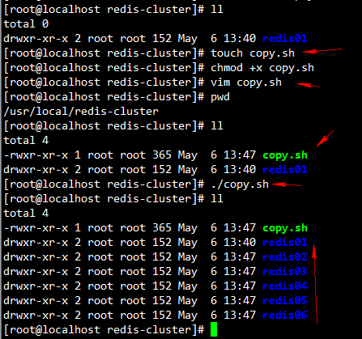
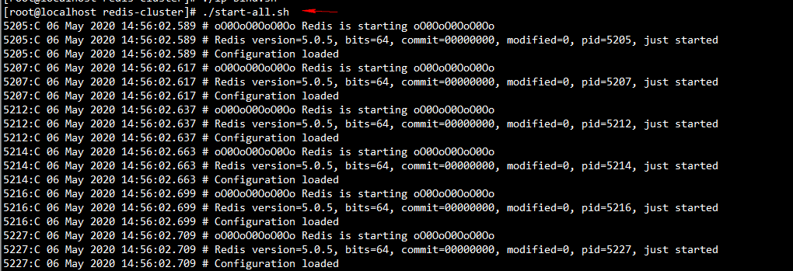

# Redis集群搭建

## *注意要关闭防火墙

#### 1、在`usr/local`目录下新建`redis-cluster`目录，用于存放集群节点


```shell
[root@localhost local]# mkdir redis-cluster
```

#### 2、 把`/usr/local/bin`目录下的`bin`目录下的所有文件复制到`/usr/local/redis-cluster/redis01`目录下


```shell
[root@localhost local]# cp -r /usr/local/bin  redis-cluster/redis01
# 全路径 复制
[root@localhost local]# cp -r /usr/local/bin  /usr/local/redis-cluster/redis01
```

#### 3、 删除`redis01`目录下的快照文件`dump.rdb`，并且修改该目录下的`redis.conf`文件，具体修改四处地方。

##### 3.1)删除 `dump.rdb`


```shell
[root@localhost redis01]# rm -rf dump.rdb 
```

##### 3.2）配置文件，修改为后台启动`daemonize:no` 改为`daemonize:yse`


```shell
# By default Redis does not run as a daemon. Use 'yes' if you need it.
# Note that Redis will write a pid file in /var/run/redis.pid when daemonized.
daemonize yes
```


##### 3.3）配置文件，修改端口号为7001,默认是6379


```shell
# If port 0 is specified Redis will not listen on a TCP socket.
port 7001
```

##### 3.4）配置文件，将`cluster-enabled yes` 的注释打开


#### 4、 将`redis-cluster/redis01`文件复制5份到`redis-cluster`目录下（redis02-redis06），创建6个`redis`实例，模拟Redis集群的6个节点。然后将其余5个文件下的`redis.conf`里面的端口号分别修改为`7002-7006`，并修改`bind 127.0.0.1 `为：`bind 本机ip`

##### 4.1）复制5份`redis01`到`redis-cluster`下



```shell
[root@localhost redis-cluster]# pwd
/usr/local/redis-cluster
[root@localhost redis-cluster]# touch copy.sh
[root@localhost redis-cluster]# chmod +x copy.sh 
[root@localhost redis-cluster]# vim copy.sh 
[root@localhost redis-cluster]# pwd
[root@localhost redis-cluster]# ./copy.sh
```

 **copy.sh 内容如下：**


```shell
[root@localhost redis-cluster]# cat copy.sh 
cp -r /usr/local/redis-cluster/redis01  /usr/local/redis-cluster/redis02
cp -r /usr/local/redis-cluster/redis01  /usr/local/redis-cluster/redis03
cp -r /usr/local/redis-cluster/redis01  /usr/local/redis-cluster/redis04
cp -r /usr/local/redis-cluster/redis01  /usr/local/redis-cluster/redis05
cp -r /usr/local/redis-cluster/redis01  /usr/local/redis-cluster/redis06
```

##### 4.2）将其余5个文件下的`redis.conf`里面的端口号分别修改为`7002-7006`


```shell
[root@localhost redis-cluster]# pwd
/usr/local/redis-cluster
[root@localhost redis-cluster]# touch port.sh
[root@localhost redis-cluster]# chmod +x port.sh 
[root@localhost redis-cluster]# vim port.sh 
[root@localhost redis-cluster]# ./port.sh 
[root@localhost redis-cluster]# 
```

**port.sh内容如下：**

```shell
[root@localhost redis-cluster]# cat port.sh 
sed -i 's#port 7001#port 7002#g' /usr/local/redis-cluster/redis02/redis.conf
sed -i 's#port 7001#port 7003#g' /usr/local/redis-cluster/redis03/redis.conf
sed -i 's#port 7001#port 7004#g' /usr/local/redis-cluster/redis04/redis.conf
sed -i 's#port 7001#port 7005#g' /usr/local/redis-cluster/redis05/redis.conf
sed -i 's#port 7001#port 7006#g' /usr/local/redis-cluster/redis06/redis.conf
```

##### 4.3）将其余5个文件下的`redis.conf`里面的绑定ip 改为 `本机ip地址`


```shell
[root@localhost redis-cluster]# ./ip-bind.sh 
```


**ip-bind.sh内容如下：** 

```shell
[root@localhost redis-cluster]# cat ip-bind.sh 
sed -i 's#bind 127.0.0.1#bind 192.168.56.103#g' /usr/local/redis-cluster/redis02/redis.conf
sed -i 's#bind 127.0.0.1#bind 192.168.56.103#g' /usr/local/redis-cluster/redis03/redis.conf
sed -i 's#bind 127.0.0.1#bind 192.168.56.103#g' /usr/local/redis-cluster/redis04/redis.conf
sed -i 's#bind 127.0.0.1#bind 192.168.56.103#g' /usr/local/redis-cluster/redis05/redis.conf
sed -i 's#bind 127.0.0.1#bind 192.168.56.103#g' /usr/local/redis-cluster/redis06/redis.conf
```

#### 5、启动所有redis节点



```shell
[root@localhost redis-cluster]# ./start-all.sh 
```


```shell
[root@localhost redis01]# ps -ef | grep redis
```


