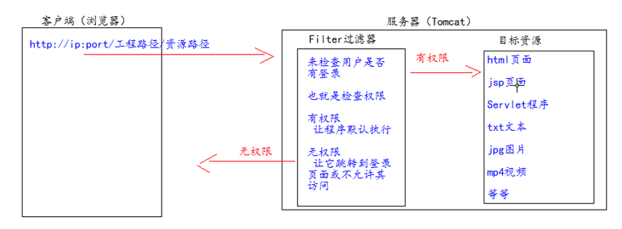
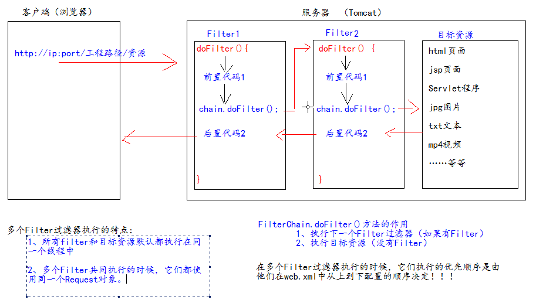

# 1、Filter 

## 1、Filter 什么是过滤器

1、Filter 过滤器它是 JavaWeb 的三大组件之一。三大组件分别是：Servlet 程序、Listener 监听器、Filter 过滤器
2、Filter 过滤器它是 JavaEE 的规范。也就是接口
3、Filter 过滤器它的作用是：拦截请求，过滤响应。
拦截请求常见的应用场景有：
1、权限检查
2、日记操作
3、事务管理
……等等

## 2、Filter 的初体验

要求：在你的 web 工程下，有一个 admin 目录。这个 admin 目录下的所有资源（html 页面、jpg 图片、jsp 文件、等等）都必
须是用户登录之后才允许访问。
思考：根据之前我们学过内容。我们知道，用户登录之后都会把用户登录的信息保存到 Session 域中。所以要检查用户是否
登录，可以判断 Session 中否包含有用户登录的信息即可！！！


可以在jsp页面中这样写：

```jsp
<%
Object user = session.getAttribute("user");
// 如果等于 null，说明还没有登录
if (user == null) {
request.getRequestDispatcher("/login.jsp").forward(request,response);
return;
}
%>
```




Filter 的代码：

```java
public class AdminFilter implements Filter {
/**
* doFilter 方法，专门用于拦截请求。可以做权限检查
*/
@Override
public void doFilter(ServletRequest servletRequest, ServletResponse servletResponse, FilterChain
    filterChain) throws IOException, ServletException {
    HttpServletRequest httpServletRequest = (HttpServletRequest) servletRequest;
    HttpSession session = httpServletRequest.getSession();
    Object user = session.getAttribute("user");
    // 如果等于 null，说明还没有登录
    if (user == null) {
    servletRequest.getRequestDispatcher("/login.jsp").forward(servletRequest,servletResponse);
    return;
    } else {
    // 让程序继续往下访问用户的目标资源
    filterChain.doFilter(servletRequest,servletResponse);
    }
    }
}
```


web.xml

```xml
<!--filter 标签用于配置一个 Filter 过滤器-->
<filter>
<!--给 filter 起一个别名-->
<filter-name>AdminFilter</filter-name>
<!--配置 filter 的全类名-->
<filter-class>com.atguigu.filter.AdminFilter</filter-class>
</filter>
<!--filter-mapping 配置 Filter 过滤器的拦截路径-->
<filter-mapping>
<!--filter-name 表示当前的拦截路径给哪个 filter 使用-->
<filter-name>AdminFilter</filter-name>
<!--url-pattern 配置拦截路径
/ 表示请求地址为：http://ip:port/工程路径/ 映射到 IDEA 的 web 目录
/admin/* 表示请求地址为：http://ip:port/工程路径/admin/*
-->
<url-pattern>/admin/*</url-pattern>
</filter-mapping>
```

Filter 过滤器的使用步骤：
1、编写一个类去实现 Filter 接口
2、实现过滤方法 doFilter()
3、到 web.xml 中去配置 Filter 的拦截路径


## 3、Filter 的生命周期

Filter 的生命周期包含几个方法
1、构造器方法
2、init 初始化方法
	第 1，2 步，在 web 工程启动的时候执行（Filter 已经创建）
3、doFilter 过滤方法
	第 3 步，每次拦截到请求，就会执行
4、destroy 销毁
	第 4 步，停止 web 工程的时候，就会执行（停止 web 工程，也会销毁 Filter 过滤器）

## 4、FilterConfig 类

FilterConfig 类见名知义，它是 Filter 过滤器的配置文件类。
Tomcat 每次创建 Filter 的时候，也会同时创建一个 FilterConfig 类，这里包含了 Filter 配置文件的配置信息。
FilterConfig 类的作用是获取 filter 过滤器的配置内容
1、获取 Filter 的名称 filter-name 的内容
2、获取在 Filter 中配置的 init-param 初始化参数
3、获取 ServletContext 对象

java代码：

```java
@Override
public void init(FilterConfig filterConfig) throws ServletException {
System.out.println("2.Filter 的 init(FilterConfig filterConfig)初始化");
// 1、获取 Filter 的名称 filter-name 的内容
System.out.println("filter-name 的值是：" + filterConfig.getFilterName());
// 2、获取在 web.xml 中配置的 init-param 初始化参数
System.out.println("初始化参数 username 的值是：" + filterConfig.getInitParameter("username"));
System.out.println("初始化参数 url 的值是：" + filterConfig.getInitParameter("url"));
// 3、获取 ServletContext 对象
System.out.println(filterConfig.getServletContext());
}
```

web.xml

```xml
<!--filter 标签用于配置一个 Filter 过滤器-->
<filter>
<!--给 filter 起一个别名-->
<filter-name>AdminFilter</filter-name>
<!--配置 filter 的全类名-->
<filter-class>com.atguigu.filter.AdminFilter</filter-class>
<init-param>
<param-name>username</param-name>
<param-value>root</param-value>
</init-param>
<init-param>
<param-name>url</param-name>
<param-value>jdbc:mysql://localhost3306/test</param-value>
</init-param>
</filter>

```


## 5、FilterChain 过滤器链

Filter 过滤器
Chain 链，链条
FilterChain 就是过滤器链（多个过滤器如何一起工作）



## 6、Filter 的拦截路径

```xml
--精确匹配
<url-pattern>/target.jsp</url-pattern>
以上配置的路径，表示请求地址必须为：http://ip:port/工程路径/target.jsp --目录匹配
<url-pattern>/admin/*</url-pattern>
以上配置的路径，表示请求地址必须为：http://ip:port/工程路径/admin/* --后缀名匹配
<url-pattern>*.html</url-pattern>
以上配置的路径，表示请求地址必须以.html 结尾才会拦截到
<url-pattern>*.do</url-pattern>
以上配置的路径，表示请求地址必须以.do 结尾才会拦截到
<url-pattern>*.action</url-pattern>
以上配置的路径，表示请求地址必须以.action 结尾才会拦截到
Filter 过滤器它只关心请求的地址是否匹配，不关心请求的资源是否存在！！！
```

# 2、ThreadLocal 的使用

ThreadLocal 的作用，它可以解决多线程的数据安全问题。
**ThreadLocal 它可以给当前线程关联一个数据（可以是普通变量，可以是对象，也可以是数组，集合）**
ThreadLocal 的特点：
1、ThreadLocal 可以为当前线程关联一个数据。（它可以像 Map 一样存取数据，key 为当前线程）
2、每一个 ThreadLocal 对象，只能为当前线程**关联一个数据**，如果要为当前线程关联多个数据，就需要使用多个
ThreadLocal 对象实例。
3、每个 ThreadLocal 对象实例定义的时候，一般都是 **static** 类型
4、ThreadLocal 中保存数据，在线程销毁后。会由 JVM 虚拟自动释放。
测试类：

```java
public class OrderService
{
    public void createOrder()
    {
        String name = Thread.currentThread().getName();
        System.out.println("OrderService 当前线程[" + name + "]中保存的数据是：" + ThreadLocalTest.threadLocal.get());
        new OrderDao().saveOrder();
    }
}
public class OrderDao
{
    public void saveOrder()
    {
        String name = Thread.currentThread().getName();
        System.out.println("OrderDao 当前线程[" + name + "]中保存的数据是：" + ThreadLocalTest.threadLocal.get());
    }
}
public class ThreadLocalTest
{
    // public static Map<String,Object> data = new Hashtable<String,Object>();
    public static ThreadLocal < Object > threadLocal = new ThreadLocal < Object > ();
    private static Random random = new Random();
    public static class Task implements Runnable
    {@
        Override
        public void run()
        {
            // 在 Run 方法中，随机生成一个变量（线程要关联的数据），然后以当前线程名为 key 保存到 map 中
            Integer i = random.nextInt(1000);
            // 获取当前线程名
            String name = Thread.currentThread().getName();
            System.out.println("线程[" + name + "]生成的随机数是：" + i);
            // data.put(name,i);
            threadLocal.set(i);
            try
            {
                Thread.sleep(3000);
            }
            catch(InterruptedException e)
            {
                e.printStackTrace();
            }
            new OrderService().createOrder();
            // 在 Run 方法结束之前，以当前线程名获取出数据并打印。查看是否可以取出操作
            // Object o = data.get(name);
            Object o = threadLocal.get();
            System.out.println("在线程[" + name + "]快结束时取出关联的数据是：" + o);
        }
    }
    public static void main(String[] args)
    {
        for(int i = 0; i < 3; i++)
        {
            new Thread(new Task()).start();
        }
    }
}
```

