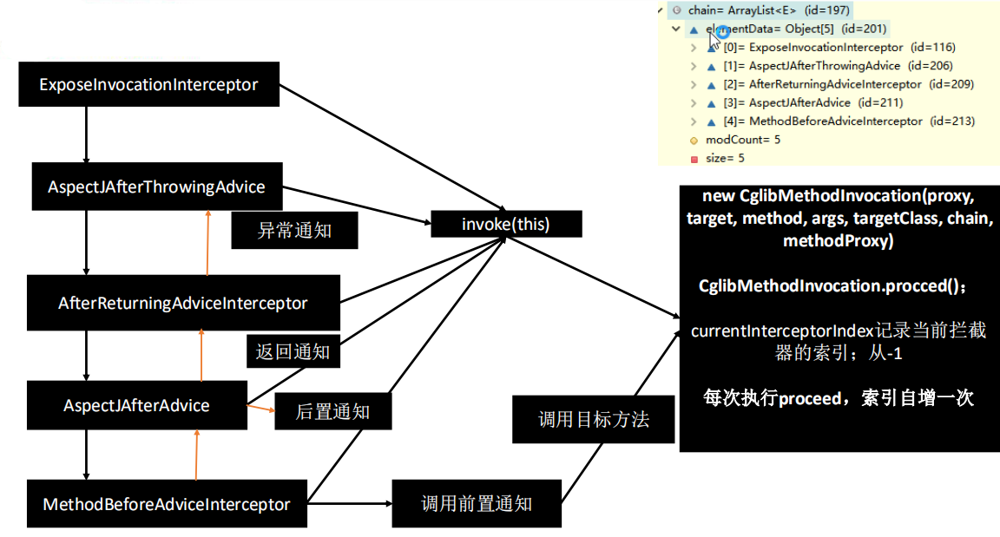

# MainConfig:

### @ComponentScans 

### @Configuration

### @Bean

# MainConfig2:

### @Conditional

### @Import 

### @Scope 

### @Lazy

### @Bean 

### FactoryBean 

### ImportSelector

# MainConfigOfAutoWired:

### @Autowired 

### @Qualifier 

### @Resources（JSR250） 

### @Primary

# MainConfigOfLifeCycle：

### @Bean 指定初始化销毁

### 初始化其他方式【 

###  InitializingBean（初始化设置值之后）、DisposableBean（销毁）、JSR250【@PostConstruct、@PreDestroy】

###  】

###  BeanPostProcessor

# MainConfigOfPropertyValues：

### @Value

# MainOfProfile：

### @PropertySource  

### @Profile  

### @PropertySources  Environment（根据环境启动）  -Dspring.profiles.active=test

# ExtConfig：

### BeanFactoryPostProcessor

### BeanDefinitionRegistryPostProcessor

### ApplicationListener【@EventListener】

### Spring容器创建过程*

# TxConfig：

### @EnableTransactionManagement 

### @Transactional

# MainConfigOfAOP:

### @EnableAspectJAutoProxy 

### @Before/@After/@AfterReturning/@AfterThrowing/@Around @Pointcut

