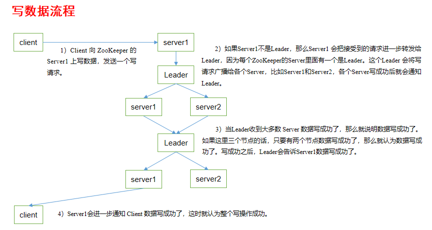
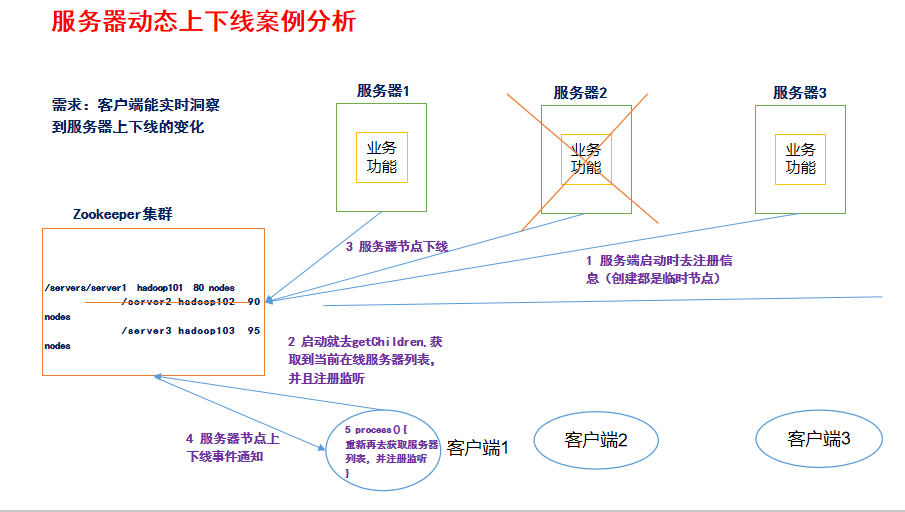

## **1.1** **概述**

Zookeeper是一个开源的分布式的，为分布式应用提供协调服务的Apache项目。


## **1.2 特点**


## **1.3** **数据结构**


## **1.4** **应用场景**

提供的服务包括：统一命名服务、统一配置管理、统一集群管理、服务器节点动态上下线、软负载均衡等。


## **1.5** **下载地址**

**1．官网首页：**

https://zookeeper.apache.org/

**2．下载截图，如图5-5，5-6，5-7所示**

 

图5-5  Zookeeper下载（一）

 

图5-6  Zookeeper下载（二）

 

图5-7  Zookeeper下载（三）

# **第2章 Zookeeper安装**

## **2.1** **本地模式安装部署**

**1．安装前准备**

（1）安装Jdk

（2）拷贝Zookeeper安装包到Linux系统下

（3）解压到指定目录

`[root]$ tar -zxvf zookeeper-3.4.10.tar.gz -C /opt/module/`

**2．配置修改**

   （1）将/opt/module/zookeeper-3.4.10/conf这个路径下的zoo_sample.cfg修改为zoo.cfg；

`[root conf]$ mv zoo_sample.cfg zoo.cfg`

​	（2）打开zoo.cfg文件，修改dataDir路径：

`[root zookeeper-3.4.10]$ vim zoo.cfg`

修改如下内容：

dataDir=/opt/module/zookeeper-3.4.10/zkData

​	（3）在/opt/module/zookeeper-3.4.10/这个目录上创建zkData文件夹

`[root zookeeper-3.4.10]$ mkdir zkData`

**3．操作Zookeeper**

（1）启动Zookeeper

`[root zookeeper-3.4.10]$ bin/zkServer.sh start`

（2）查看进程是否启动

`[root zookeeper-3.4.10]$ jps`

`4020 Jps`

`4001 QuorumPeerMain`

（3）查看状态：

`[root zookeeper-3.4.10]$ bin/zkServer.sh status`

`ZooKeeper JMX enabled by default`

`Using config: /opt/module/zookeeper-3.4.10/bin/../conf/zoo.cfg`

`Mode: standalone`

（4）启动客户端：

`[root zookeeper-3.4.10]$ bin/zkCli.sh`

`[zk: localhost:2181(CONNECTED) 7] ls /`

（5）退出客户端：

`[zk: localhost:2181(CONNECTED) 0] quit`

（6）停止Zookeeper

`[root zookeeper-3.4.10]$ bin/zkServer.sh stop`

## **2.2** **配置参数解读**

Zookeeper中的配置文件zoo.cfg中参数含义解读如下：

**1．tickTime =2000：通信心跳数，Zookeeper服务器与客户端心跳时间，单位毫秒**

Zookeeper使用的基本时间，服务器之间或客户端与服务器之间维持心跳的时间间隔，也就是每个tickTime时间就会发送一个心跳，时间单位为毫秒。

它用于心跳机制，并且设置最小的session超时时间为两倍心跳时间。(session的最小超时时间是2*tickTime)

**2．initLimit =10：LF初始通信时限**

集群中的Follower跟随者服务器与Leader领导者服务器之间初始连接时能容忍的最多心跳数（tickTime的数量），用它来限定集群中的Zookeeper服务器连接到Leader的时限。

**3．syncLimit =5：LF同步通信时限**

集群中Leader与Follower之间的最大响应时间单位，假如响应超过syncLimit * tickTime，Leader认为Follwer死掉，从服务器列表中删除Follwer。

**4．dataDir：数据文件目录+数据持久化路径**

主要用于保存Zookeeper中的数据。

**5．clientPort =2181：客户端连接端口**

监听客户端连接的端口。

# **第3章 Zookeeper内部原理**

## **3.1** **选举机制（面试重点）**

**1）半数机制：集群中半数以上机器存活，集群可用。所以Zookeeper适合安装奇数台服务器。**

2）Zookeeper虽然在配置文件中并没有指定**Master**和**Slave**。但是，Zookeeper工作时，是有一个节点为Leader，其他则为Follower，Leader是通过内部的选举机制临时产生的。

3）以一个简单的例子来说明整个选举的过程。

假设有五台服务器组成的Zookeeper集群，它们的id从1-5，同时它们都是最新启动的，也就是没有历史数据，在存放数据量这一点上，都是一样的。假设这些服务器依序启动，来看看会发生什么，如图5-8所示。


图5-8 Zookeeper的选举机制

（1）服务器1启动，此时只有它一台服务器启动了，它发出去的报文没有任何响应，所以它的选举状态一直是LOOKING状态。

（2）服务器2启动，它与最开始启动的服务器1进行通信，互相交换自己的选举结果，由于两者都没有历史数据，所以id值较大的服务器2胜出，但是由于没有达到超过半数以上的服务器都同意选举它(这个例子中的半数以上是3)，所以服务器1、2还是继续保持LOOKING状态。

（3）服务器3启动，根据前面的理论分析，服务器3成为服务器1、2、3中的老大，而与上面不同的是，此时有三台服务器选举了它，所以它成为了这次选举的Leader。

（4）服务器4启动，根据前面的分析，理论上服务器4应该是服务器1、2、3、4中最大的，但是由于前面已经有半数以上的服务器选举了服务器3，所以它只能接收当小弟的命了。

（5）服务器5启动，同4一样当小弟。

## **3.2** **节点类型**


## **3.3 Stat结构体**

1）czxid-创建节点的事务zxid

每次修改ZooKeeper状态都会收到一个zxid形式的时间戳，也就是ZooKeeper事务ID。

事务ID是ZooKeeper中所有修改总的次序。每个修改都有唯一的zxid，如果zxid1小于zxid2，那么zxid1在zxid2之前发生。

2）ctime - znode被创建的毫秒数(从1970年开始)

3）mzxid - znode最后更新的事务zxid

4）mtime - znode最后修改的毫秒数(从1970年开始)

5）pZxid-znode最后更新的子节点zxid

6）cversion - znode子节点变化号，znode子节点修改次数

7）dataversion - znode数据变化号

8）aclVersion - znode访问控制列表的变化号             

9）ephemeralOwner- 如果是临时节点，这个是znode拥有者的session id。如果不是临时节点则是0。

**10）dataLength- znode的数据长度**

**11）numChildren - znode子节点数量**

## **3.4** **监听器原理（面试重点）**


图5-10 监听器原理

## **3.5** **写数据流程**



# **第4章 Zookeeper实战（开发点）**

## **4.1** **分布式安装部署**

**1．集群规划**

在hadoop102、hadoop103和hadoop104三个节点上部署Zookeeper。

**2．解压安装**

（1）解压Zookeeper安装包到/opt/module/目录下

`[root software]$ tar -zxvf zookeeper-3.4.10.tar.gz -C /opt/module/`

（2）同步/opt/module/zookeeper-3.4.10目录内容到hadoop103、hadoop104

`[root module]$ xsync zookeeper-3.4.10/`

**3．配置服务器编号**

（1）在/opt/module/zookeeper-3.4.10/这个目录下创建zkData

`[root zookeeper-3.4.10]$ mkdir -p zkData`

（2）在/opt/module/zookeeper-3.4.10/zkData目录下创建一个myid的文件

`[root zkData]$ touch myid`

添加myid文件，注意一定要在linux里面创建，在notepad++里面很可能乱码

（3）编辑myid文件

`[root zkData]$ vi myid`

​	在文件中添加与server对应的编号：

编辑相对应的编号

（4）拷贝配置好的zookeeper到其他机器上

`[root zkData]$ xsync myid`

并分别在hadoop102、hadoop103上修改myid文件中内容为3、4

**4．配置zoo.cfg文件**

（1）重命名/opt/module/zookeeper-3.4.10/conf这个目录下的zoo_sample.cfg为zoo.cfg

`[root conf]$ mv zoo_sample.cfg zoo.cfg`

（2）打开zoo.cfg文件

`[root conf]$ vim zoo.cfg`

修改数据存储路径配置（修改配置）

`dataDir=/opt/module/zookeeper-3.4.10/zkData`

增加如下配置

\`#######################cluster##########################`

`server.2=hadoop102:2888:3888`

`server.3=hadoop103:2888:3888`

`server.4=hadoop104:2888:3888`

（3）同步zoo.cfg配置文件

`[root conf]$ xsync zoo.cfg`

（4）配置参数解读

server.A=B:C:D。

**A**是一个数字，表示这个是第几号服务器；

集群模式下配置一个文件myid，这个文件在dataDir目录下，这个文件里面有一个数据就是A的值，**Zookeeper启动时读取此文件，拿到里面的数据与zoo.cfg里面的配置信息比较从而判断到底是哪个server。**

**B**是这个服务器的ip地址；

**C**是这个服务器与集群中的Leader服务器交换信息的端口；

**D**是万一集群中的Leader服务器挂了，需要一个端口来重新进行选举，选出一个新的Leader，而这个端口就是用来执行选举时服务器相互通信的端口。

**4．集群操作**

（1）分别启动Zookeeper

`[root102 zookeeper-3.4.10]$ bin/zkServer.sh start`

`[root103 zookeeper-3.4.10]$ bin/zkServer.sh start`

`[root104 zookeeper-3.4.10]$ bin/zkServer.sh start`

（2）查看状态

`[root102 zookeeper-3.4.10]# bin/zkServer.sh status`

JMX enabled by default

Using config: /opt/module/zookeeper-3.4.10/bin/../conf/zoo.cfg

Mode: follower

`[root103 zookeeper-3.4.10]# bin/zkServer.sh status`

JMX enabled by default

Using config: /opt/module/zookeeper-3.4.10/bin/../conf/zoo.cfg

Mode: leader

`[root104 zookeeper-3.4.5]# bin/zkServer.sh status`

JMX enabled by default

Using config: /opt/module/zookeeper-3.4.10/bin/../conf/zoo.cfg

Mode: follower

## **4.2** **客户端命令行操作**

表5-1

| 命令基本语法     | 功能描述                                         |
| ---------------- | ------------------------------------------------ |
| help             | 显示所有操作命令                                 |
| ls path [watch]  | 使用 ls 命令来查看当前znode中所包含的内容        |
| ls2 path [watch] | 查看当前节点数据并能看到更新次数等数据           |
| create           | 普通创建-s  含有序列-e  临时（重启或者超时消失） |
| get path [watch] | 获得节点的值                                     |
| set              | 设置节点的具体值                                 |
| stat             | 查看节点状态                                     |
| delete           | 删除节点                                         |
| rmr              | 递归删除节点                                     |

**1．启动客户端**

`[root103 zookeeper-3.4.10]$ bin/zkCli.sh`

**2．显示所有操作命令**

`[zk: localhost:2181(CONNECTED) 1] help`

**3．查看当前znode中所包含的内容**

`[zk: localhost:2181(CONNECTED) 0] ls /`

`[zookeeper]`

**4．查看当前节点详细数据**

`[zk: localhost:2181(CONNECTED) 1] ls2 /`

[zookeeper]

cZxid = 0x0

ctime = Thu Jan 01 08:00:00 CST 1970

mZxid = 0x0

mtime = Thu Jan 01 08:00:00 CST 1970

pZxid = 0x0

cversion = -1

dataVersion = 0

aclVersion = 0

ephemeralOwner = 0x0

dataLength = 0

numChildren = 1

**5．分别创建2个普通节点**

`[zk: localhost:2181(CONNECTED) 3] create /sanguo "jinlian"`

Created /sanguo

`[zk: localhost:2181(CONNECTED) 4] create /sanguo/shuguo "liubei"`

Created /sanguo/shuguo

**6．获得节点的值**

`[zk: localhost:2181(CONNECTED) 5] get /sanguo`

jinlian

cZxid = 0x100000003

ctime = Wed Aug 29 00:03:23 CST 2018

mZxid = 0x100000003

mtime = Wed Aug 29 00:03:23 CST 2018

pZxid = 0x100000004

cversion = 1

dataVersion = 0

aclVersion = 0

ephemeralOwner = 0x0

dataLength = 7

numChildren = 1

[zk: localhost:2181(CONNECTED) 6]

[zk: localhost:2181(CONNECTED) 6] get /sanguo/shuguo

liubei

cZxid = 0x100000004

ctime = Wed Aug 29 00:04:35 CST 2018

mZxid = 0x100000004

mtime = Wed Aug 29 00:04:35 CST 2018

pZxid = 0x100000004

cversion = 0

dataVersion = 0

aclVersion = 0

ephemeralOwner = 0x0

dataLength = 6

numChildren = 0

**7．创建短暂节点**

`[zk: localhost:2181(CONNECTED) 7] create -e /sanguo/wuguo "zhouyu"`

Created /sanguo/wuguo

（1）在当前客户端是能查看到的

`[zk: localhost:2181(CONNECTED) 3] ls /sanguo` 

[wuguo, shuguo]

（2）退出当前客户端然后再重启客户端

`[zk: localhost:2181(CONNECTED) 12] quit`

`[root104 zookeeper-3.4.10]$ bin/zkCli.sh`

（3）再次查看根目录下短暂节点已经删除

`[zk: localhost:2181(CONNECTED) 0] ls /sanguo`

[shuguo]

**8．创建带序号的节点**

​	（1）先创建一个普通的根节点/sanguo/weiguo

`[zk: localhost:2181(CONNECTED) 1] create /sanguo/weiguo "caocao"`

Created /sanguo/weiguo

​	（2）创建带序号的节点

`[zk: localhost:2181(CONNECTED) 2] create -s /sanguo/weiguo/xiaoqiao "jinlian"`

Created /sanguo/weiguo/xiaoqiao0000000000

`[zk: localhost:2181(CONNECTED) 3] create -s /sanguo/weiguo/daqiao "jinlian"`

Created /sanguo/weiguo/daqiao0000000001

`[zk: localhost:2181(CONNECTED) 4] create -s /sanguo/weiguo/diaocan "jinlian"`

Created /sanguo/weiguo/diaocan0000000002

如果原来没有序号节点，序号从0开始依次递增。如果原节点下已有2个节点，则再排序时从2开始，以此类推。

**9．修改节点数据值**

`[zk: localhost:2181(CONNECTED) 6] set /sanguo/weiguo "simayi"`

**10．节点的值变化监听**

​	（1）在hadoop104主机上注册监听/sanguo节点数据变化

`[zk: localhost:2181(CONNECTED) 26] [zk: localhost:2181(CONNECTED) 8] get /sanguo watch`

​	（2）在hadoop103主机上修改/sanguo节点的数据

`[zk: localhost:2181(CONNECTED) 1] set /sanguo "xisi"`

​	（3）观察hadoop104主机收到数据变化的监听

WATCHER::

WatchedEvent state:SyncConnected type:NodeDataChanged path:/sanguo

**11．节点的子节点变化监听（路径变化）**

​	（1）在hadoop104主机上注册监听/sanguo节点的子节点变化

`[zk: localhost:2181(CONNECTED) 1] ls /sanguo watch`

[aa0000000001, server101]

​	（2）在hadoop103主机/sanguo节点上创建子节点

`[zk: localhost:2181(CONNECTED) 2] create /sanguo/jin "simayi"`

Created /sanguo/jin

​	（3）观察hadoop104主机收到子节点变化的监听

WATCHER::

WatchedEvent state:SyncConnected type:NodeChildrenChanged path:/sanguo

**12．删除节点**

`[zk: localhost:2181(CONNECTED) 4] delete /sanguo/jin`

13．递归删除节点

`[zk: localhost:2181(CONNECTED) 15] rmr /sanguo/shuguo`

**14．查看节点状态**

`[zk: localhost:2181(CONNECTED) 17] stat /sanguo`

cZxid = 0x100000003

ctime = Wed Aug 29 00:03:23 CST 2018

mZxid = 0x100000011

mtime = Wed Aug 29 00:21:23 CST 2018

pZxid = 0x100000014

cversion = 9

dataVersion = 1

aclVersion = 0

ephemeralOwner = 0x0

dataLength = 4

numChildren = 1

## **4.3 API应用**

### **4.3.1 Eclipse环境搭建**

**1．创建一个Maven工程**

**2．添加pom文件**

```java
<dependencies>
		<dependency>
			<groupId>junit</groupId>
			<artifactId>junit</artifactId>
			<version>RELEASE</version>
		</dependency>
		<dependency>
			<groupId>org.apache.logging.log4j</groupId>
			<artifactId>log4j-core</artifactId>
			<version>2.8.2</version>
		</dependency>
		<!-- https://mvnrepository.com/artifact/org.apache.zookeeper/zookeeper -->
		<dependency>
			<groupId>org.apache.zookeeper</groupId>
			<artifactId>zookeeper</artifactId>
			<version>3.4.10</version>
		</dependency>
</dependencies>
```

**3．拷贝log4j.properties文件到项目根目录**

需要在项目的src/main/resources目录下，新建一个文件，命名为“log4j.properties”，在文件中填入。

```java
log4j.rootLogger=INFO, stdout  
log4j.appender.stdout=org.apache.log4j.ConsoleAppender  
log4j.appender.stdout.layout=org.apache.log4j.PatternLayout  
log4j.appender.stdout.layout.ConversionPattern=%d %p [%c] - %m%n  
log4j.appender.logfile=org.apache.log4j.FileAppender  
log4j.appender.logfile.File=target/spring.log  
log4j.appender.logfile.layout=org.apache.log4j.PatternLayout  
log4j.appender.logfile.layout.ConversionPattern=%d %p [%c] - %m%n 
```


### **4.3.2 创建ZooKeeper客户端**

```java
//连接集群的字符串，集群以 逗号分隔
	private String connectString="192.168.0.106:2181,192.168.0.103:2181,192.168.0.101:2181";
	
	//连接服务器的超时时间 毫秒为单位： 200秒
	private int sessionTimeout=2000;
	
	private ZooKeeper zooKeeperClient;
	  InetAddress ia=null;

	//连接zookeeper
	@Before
	public void init() throws Exception {
		
		ia=ia.getLocalHost();
		           
	    String localname=ia.getHostName();
		String localip=ia.getHostAddress();
		System.out.println("本机名称是："+ localname);
		System.out.println("本机的ip是 ："+localip);
		
		
		//创建一个zookeeper的连接
		zooKeeperClient= new ZooKeeper(connectString, sessionTimeout, new Watcher() {
			public void process(WatchedEvent event) {
				System.out.println("------------start--------------");
				System.out.println("event.getType():"+event.getType());
				// 收到事件通知后的回调函数（用户的业务逻辑）
				//获取指定目录下/(根节点)下的子节点，并监听 true
				List<String> children;
				try {
					children = zooKeeperClient.getChildren("/", true);
					for (String chi : children) {
						System.out.println(chi);
					}
				} catch (KeeperException e) {
					// TODO Auto-generated catch block
					e.printStackTrace();
				} catch (InterruptedException e) {
					// TODO Auto-generated catch block
					e.printStackTrace();
				}
				
				System.out.println("------------end--------------");

			}
		});
	}
```

### **4.3.3 创建子节点**

```java
	
	//创建节点
//	@Test
	public void createNode() throws KeeperException, InterruptedException {
		System.out.println(zooKeeperClient.getSessionId());
		//创建一个节点
		String path = zooKeeperClient.create("/wck", "wck-study".getBytes(), Ids.OPEN_ACL_UNSAFE, CreateMode.PERSISTENT);
		System.out.println(path);
	}
```

### **4.3.4** **获取子节点并监听节点变化**

```java
	//创建获得子节点，并监听变化，注意这块的监听是在 init -> new Watcher() 中做监听的处理
//	@Test
	public void getChildNode() throws KeeperException, InterruptedException {
		//获取指定目录下/(根节点)下的子节点，并监听 true
//		List<String> children = zooKeeperClient.getChildren("/", true);
//		System.out.println("************start************");
//		for (String chi : children) {
//			System.out.println(chi);
//		}
		//延时加载
		Thread.sleep(Long.MAX_VALUE);
		
//		System.out.println("************end************");

	}
```

### **4.3.5 判断Znode是否存在**

```java
	//判断是否存在节点
	@Test
	public void ifExitNode() throws KeeperException, InterruptedException {
		Stat stat = zooKeeperClient.exists("/wck",false);
		System.out.println(stat == null ? "不存在" : "存在");
		
	}
```

## **4.4** **监听服务器节点动态上下线案例**

**1．需求**

某分布式系统中，主节点可以有多台，可以动态上下线，任意一台客户端都能实时感知到主节点服务器的上下线。

**2．需求分析，如图5-12所示**



图5-12 服务器动态上下线

3．具体实现

**（0）先在集群上创建/servers节点**

`[zk: localhost:2181(CONNECTED) 10] create /servers "servers"`

Created /servers

**（1）服务器端向Zookeeper注册代码**


```java
├─src
│  ├─main
│  │  ├─java
│  │  │  └─com
│  │  │      └─wck
│  │  │          └─zookeeper
│  │  │              │  TestZookeeper.java
│  │  │              │  
│  │  │              ├─client
│  │  │              │      DistributeClient.java
│  │  │              │      
│  │  │              └─server
│  │  │                      DistributeServer.java
│  │  │                      
│  │  └─resources
│  │          log4j.properties
│  │          
│  └─test
│      ├─java
│      └─resources
```

项目代码见本目录zookeeper.zip

```java
package com.wck.zookeeper.server;

import java.io.IOException;

import org.apache.zookeeper.CreateMode;
import org.apache.zookeeper.KeeperException;
import org.apache.zookeeper.WatchedEvent;
import org.apache.zookeeper.Watcher;
import org.apache.zookeeper.ZooKeeper;
import org.apache.zookeeper.ZooDefs.Ids;

public class DistributeServer {
	
	//注册zookeeper服务器类
	public static void main(String[] args) throws Exception {
		DistributeServer server = new DistributeServer();
		//连接zookeeper集群
		server.getConnect();
		System.out.println("参数："+args[0]);
		//注册
		server.register(args[0]);
		
		//处理逻辑业务
		server.business();
	}

	//保持线程为存活状态
	private void business() throws InterruptedException {
		Thread.sleep(Long.MAX_VALUE);
	}

	private void register(String hostName) throws KeeperException, InterruptedException {
		System.out.println("收到的名称为："+hostName);
		
		String path = zooKeeperClient.create("/servers/server", hostName.getBytes(), Ids.OPEN_ACL_UNSAFE, CreateMode.EPHEMERAL_SEQUENTIAL);
		System.out.println(hostName+"已经上线了，path为："+"/servers/"+hostName);
	}

	private String connectString="192.168.0.106:2181,192.168.0.103:2181,192.168.0.101:2181";
	private int sessionTimeout=2000;
	private ZooKeeper zooKeeperClient;
	//连接
	private void getConnect() throws IOException {
	 zooKeeperClient = new ZooKeeper(connectString, sessionTimeout, new Watcher() {
			public void process(WatchedEvent event) {
				System.out.println("服务器端event.getType()："+event.getType());
			}
		});
		
	}

}

```

（2）客户端代码

```java
package com.wck.zookeeper.client;

import java.io.IOException;
import java.util.ArrayList;
import java.util.List;

import org.apache.zookeeper.KeeperException;
import org.apache.zookeeper.WatchedEvent;
import org.apache.zookeeper.Watcher;
import org.apache.zookeeper.ZooKeeper;

public class DistributeClient {

	public static void main(String[] args) throws Exception {
		
		//连接
		DistributeClient client = new DistributeClient();
		client.getConnect();
		//获取字节点
		client.getChildNodes();
		//处理业务
		client.business();
	}

	//保持进程不down
	private void business() throws InterruptedException {
		Thread.sleep(Long.MAX_VALUE);
	}

	//获取指点路径下的子节点
	private void getChildNodes() throws KeeperException, InterruptedException {

		ArrayList<String> list = new ArrayList<String>();
		List<String> children = zooKeeperClient.getChildren("/servers", true);
		for (String child : children) {
			System.out.println("获取到的子节点为："+child);
			byte[] data = zooKeeperClient.getData("/servers/"+child, null, null);
			list.add("路径为：servers/"+child+"，数据为："+new String(data));
		}
		
		//打印监听的数据
		System.out.println(list);
		
//		for (String l : list) {
//			System.out.println("获取到的子节点的路径和数据为："+l);
//		}
		
	}

	private String connectString="192.168.0.106:2181,192.168.0.103:2181,192.168.0.101:2181";
	private int sessionTimeout=2000;
	private ZooKeeper zooKeeperClient;

	private void getConnect() throws IOException {
		
		 zooKeeperClient = new ZooKeeper(connectString, sessionTimeout, new Watcher() {
			public void process(WatchedEvent event) {
				System.out.println("客户端监听event.getType()："+event.getType());
				//用于循环监听
				 try {
					getChildNodes();
				} catch (KeeperException e) {
					// TODO Auto-generated catch block
					e.printStackTrace();
				} catch (InterruptedException e) {
					// TODO Auto-generated catch block
					e.printStackTrace();
				}
			}
		});
	}
}

```

# **第5章 企业面试真题**

## **5.1** **请简述ZooKeeper的选举机制**

详见3.1。

## **5.2** **ZooKeeper的监听原理是什么？**

详见3.4。

## **5.3** **ZooKeeper的部署方式有哪几种？集群中的角色有哪些？集群最少需要几台机器？**

（1）部署方式单机模式、集群模式

（2）角色：Leader和Follower

（3）集群最少需要机器数：3

## **5.4** **ZooKeeper的常用命令**

ls create get delete set…