# 一 、vagrant 安装和配置使用

# 1 安装

> virtual box 版本为 6.1.10
>
> vagrantup 版本为： vagrant_2.2.9_x86_64

## 1.1 vagrant 官方镜像库

https://app.vagrantup.com/boxes/search

## 1.2 vagrant下载地址

https://www.vagrantup.com/downloads.html

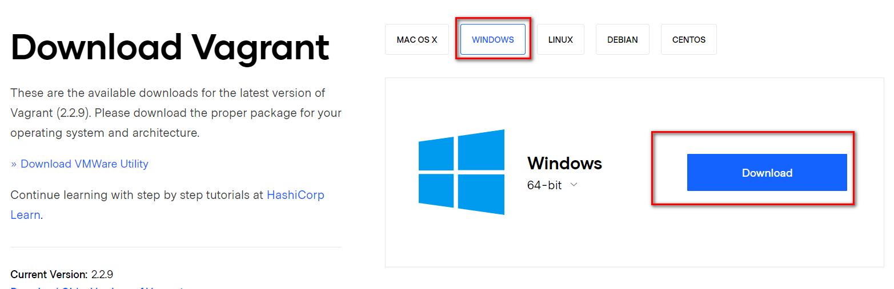

## 1.3 vagrant安装直接下一步就行,安装完重启

- 检查是否安装成功

```powershell
C:\Users\YuXiangKaoChi>vagrant
```

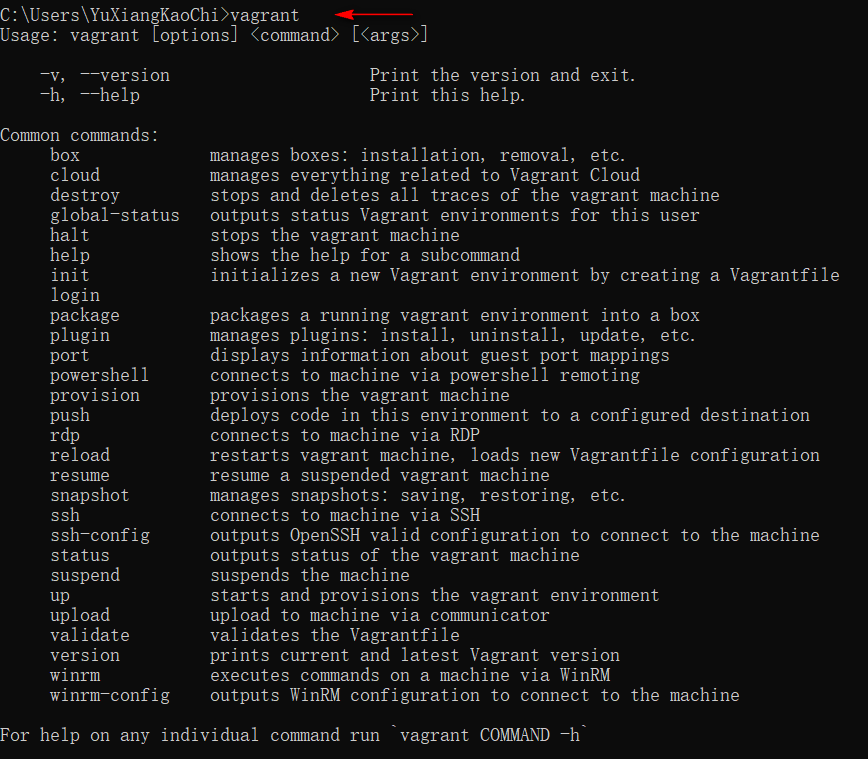

## 1.4）vagrant相关命令

官方：https://www.vagrantup.com/docs/cli/init.html

博客：https://blog.csdn.net/chszs/article/details/51925179

# 2 快速安装linux

## 2.1 初始化centos7系统

- 打开cmd命令窗口，执行下面命令，初始化一个linux系统

```powershell
C:\Users\YuXiangKaoChi>vagrant init centos/7
```

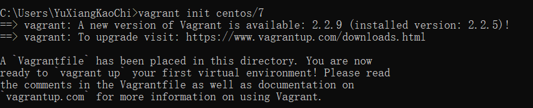

- 初始化完成，会在本地的盘路径下，多出一个文件

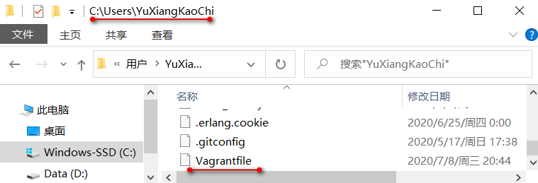

## 2.2 开启一个初始化的系统

```po
C:\Users\YuXiangKaoChi>vagrant up
```

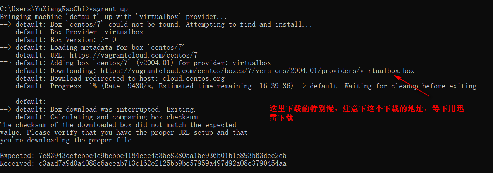

**由于这样cmd下载特别慢，遂使用了2.3的方法进行下载安装**

## 2.3）快速的安装初始化的系统方法

### 2.3.1）找到上面的下载地址

Downloading: https://vagrantcloud.com/centos/boxes/7/versions/2004.01/providers/virtualbox.box

找到上方的地址进行迅雷下载

### 2.3.2）下载完成进行安装

#### 2.3.2.1）找到下载的路径


#### 2.3.2.2）执行命令进行安装

- 安装前，可以先查看下安装的镜像列表

```powershell
C:\Users\YuXiangKaoChi>vagrant box list
```


- 命令进行安装

```powershell
C:\Users\YuXiangKaoChi>vagrant box add --location-trusted D:\vagrantImages\virtualbox.box --name CentOs/7 --force
```

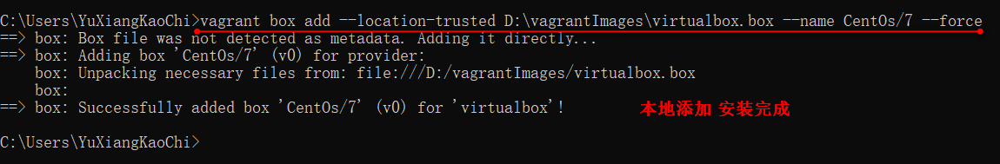

- 再进行镜像查看

```powershell
C:\Users\YuXiangKaoChi>vagrant box list
CentOs/7 (virtualbox, 0)
```

发现已经存在安装的镜像了

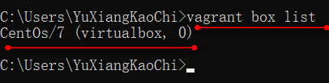

#### 2.3.2.3）启动镜像

```powershell
C:\Users\YuXiangKaoChi> vagrant up
```

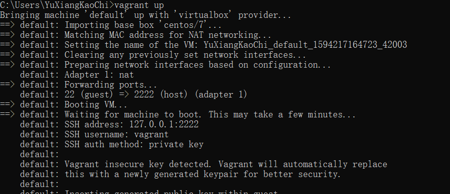

## 2.4）连接虚拟机

```powershell
vagrant ssh
```

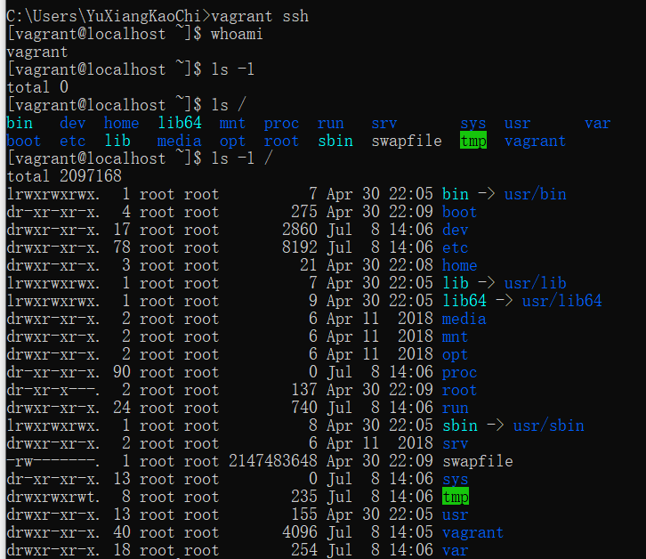

## 2.5）退出虚拟机

```powershell
exit
```

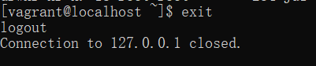

# 3.安装完成配置

## 3.1）修改账户密码登陆

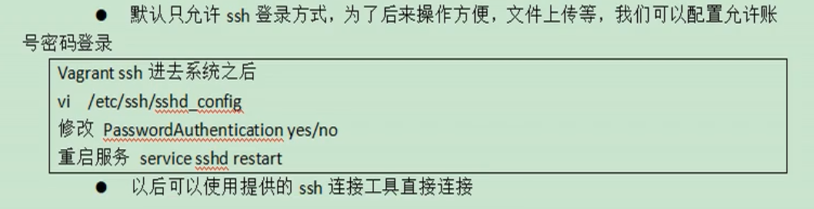

## 3.2）默认虚拟机的ip地址不是固定ip，开发不方便

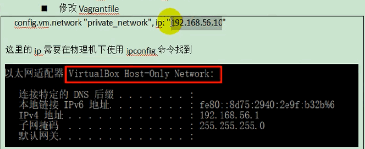

- 1.查看本机的IP地址

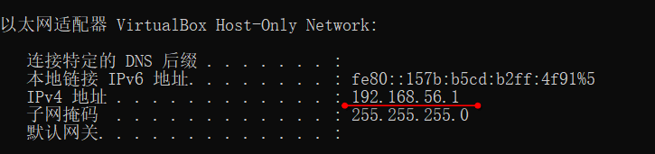

- 2.`C:\Users\YuXiangKaoChi\Vagrantfile`下修改配置

```tex
 config.vm.network "private_network", ip: "192.168.56.10"
```

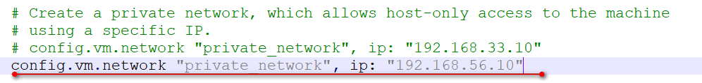

- 3.启动或者重启

重启 `vagrant reload`  启动 `vagrant up`

## 3.3）测试IP修改是否成功

- 1.查看虚拟机中的IP

```powershell
[vagrant@localhost ~]$ ip addr
```

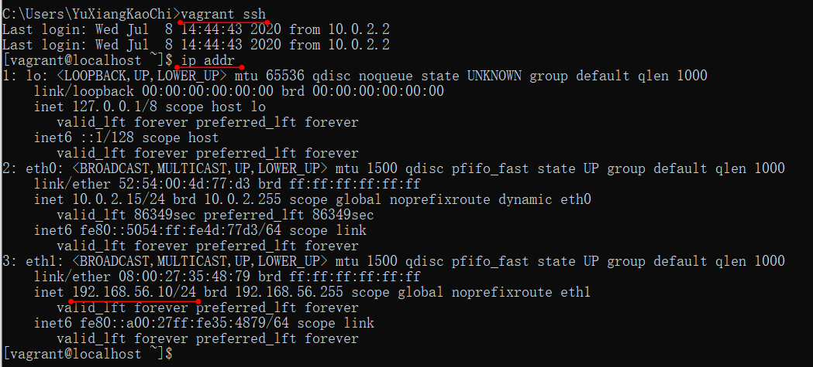

- 2.互相ping通IP

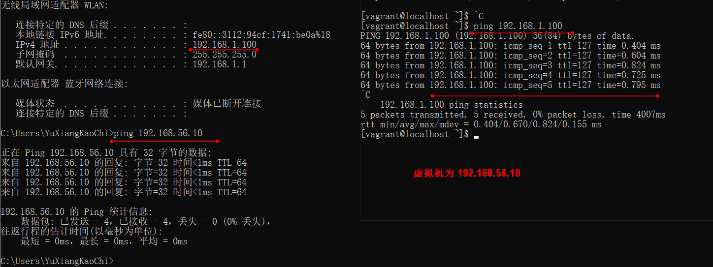

