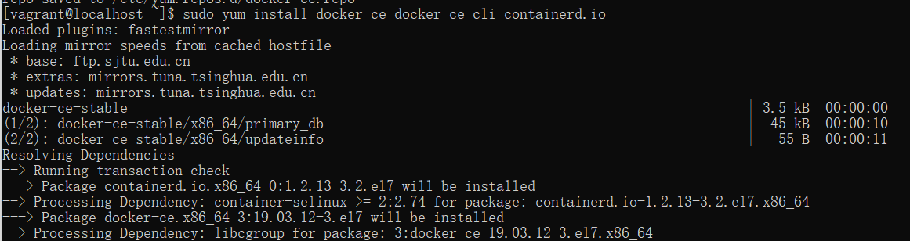
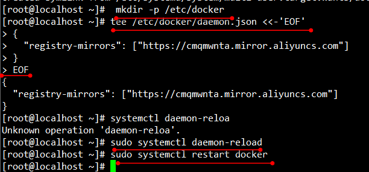
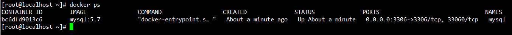

# 商城

# 1.[docker安装](https://docs.docker.com/engine/install/centos/)

## 1.1 卸载已经安装过的docker

```shell
 sudo yum remove docker \
                  docker-client \
                  docker-client-latest \
                  docker-common \
                  docker-latest \
                  docker-latest-logrotate \
                  docker-logrotate \
                  docker-engine
```


## 1.2 安装 `yum-utils` 包

```shell
sudo yum install -y yum-utils
```


## 1.3 设置仓库地址

```shell
sudo yum-config-manager \
    --add-repo \
    https://download.docker.com/linux/centos/docker-ce.repo
```


## 1.4 安装docker引擎

```shell
sudo yum install docker-ce docker-ce-cli containerd.io
```



## 1.5 启动docker

```shell
sudo systemctl start docker
```


- 检查版本

```shell
[root@localhost ~]# docker -v
Docker version 19.03.12, build 48a66213fe
```

- 查看镜像

```shell
[root@localhost ~]# docker images
REPOSITORY          TAG                 IMAGE ID            CREATED             SIZE
```

# 2.docker配置

## 2.1 开启开机自启动

```shell
[root@localhost ~]# systemctl enable docker
```


## 2.2 配置阿里云加速

```shell
#####阿里云上的配置 控制台->容器镜像服务->镜像加速器
sudo mkdir -p /etc/docker
sudo tee /etc/docker/daemon.json <<-'EOF'
{
  "registry-mirrors": ["https://cmqmwnta.mirror.aliyuncs.com"]
}
EOF

sudo systemctl daemon-reload
sudo systemctl restart docker

```



# 3.docker安装mysql

## 3.1)`docker pull mysql `指定版本 

```shell
[root@localhost ~]# docker pull mysql:5.7
[root@localhost ~]# docker images
```


## 3.2）创建实例并启动

```shell
docker run -p 3306:3306 --name mysql \
-v /mydata/mysql/log:/var/log/mysql \
-v /mydata/mysql/data:/var/lib/mysql \
-v /mydata/mysql/conf:/etc/mysql \
-e MYSQL_ROOT_PASSWORD=root \
-d mysql:5.7

参数说明
-p 3306:3306：将容器的3306端口映射到主机的3306端口
-v /mydata/mysql/conf:/etc/mysql：将配置文件夹挂载到主机
-v/mydata/mysql/log:/var/log/mysql：将日志文件夹挂载到主机
-v/mydata/mysql/data:/var/lib/mysql/：将配置文件夹挂载到主机
-e MYSQL_ROOT_PASSWORD=root：初始化root用户的密码
```

```shell
[root@localhost ~]# docker run -p 3306:3306 --name mysql \
> -v /mydata/mysql/log:/var/log/mysql \
> -v /mydata/mysql/data:/var/lib/mysql \
> -v /mydata/mysql/conf:/etc/mysql \
> -e MYSQL_ROOT_PASSWORD=root \
> -d mysql:5.7
```


## 3.3）查看启动的情况

```shell
[root@localhost ~]# docker ps
```



## 3.4）验证docker安装的mysql 是一个完整的linux

```shell
[root@localhost ~]# docker exec -it mysql /bin/bash #以命令方式交互进入mysql的linux环境
root@bc6dfd9013c6:/# ls -l
root@bc6dfd9013c6:/# whereis mysql
```


## 3.5）MySQL配置的修改

### 3.5.1）在上面的映射的文件夹中新创建一个 my.cnf配置文件

```shell
[root@localhost conf]# pwd
/mydata/mysql/conf
```


### 3.5.2）配置文件的内容为

```shell
[root@localhost conf]# vim my.cnf
[root@localhost conf]# cat my.cnf 
```

my.cnf配置的文件内容为：

```shell
[client]
default-character-set=utf8

[mysql]
default-character-set=utf8
[mysqld]
init_connect='SET collation_connection = utf8_unicode_ci'
init_connect='SET NAMES utf8'
character-set-server=utf8
collation-server=utf8_unicode_ci
skip-character-set-client-handshake
skip-name-resolve
```


### 3.5.3）重启docker中的mysql

```shell
[root@localhost conf]# docker restart mysql
```


### 3.5.4)进入docker实例中查看修改的配置文件

```shell
[root@localhost conf]# docker exec -it mysql /bin/bash
root@bc6dfd9013c6:/# cd /etc/mysql/
root@bc6dfd9013c6:/etc/mysql# pwd
/etc/mysql
root@bc6dfd9013c6:/etc/mysql# ls
my.cnf
root@bc6dfd9013c6:/etc/mysql# cat my.cnf 
[client]
default-character-set=utf8

[mysql]
default-character-set=utf8
[mysqld]
init_connect='SET collation_connection = utf8_unicode_ci'
init_connect='SET NAMES utf8'
character-set-server=utf8
collation-server=utf8_unicode_ci
skip-character-set-client-handshake
skip-name-resolve
root@bc6dfd9013c6:/etc/mysql# exit
exit
[root@localhost conf]# 
```


# 4.安装Redis

## 4.1)pull redis

```shell
[root@localhost mydata]# docker pull redis
```


## 4.2）创建挂载目录文件

如果直接挂载的话docker会以为挂载的是一个目录，所以我们先创建一个文件然后再挂载，在虚拟机中。

```shell
[root@localhost mydata]# mkdir -p /mydata/redis/conf
[root@localhost mydata]# touch /mydata/redis/conf/redis.conf
[root@localhost mydata]# cd redis/
[root@localhost redis]# cd conf/
[root@localhost conf]# ll
```


## 4.3）启动redis

```shell
docker run -p 6379:6379 --name redis \
-v /mydata/redis/data:/data \
-v /mydata/redis/conf/redis.conf:/etc/redis/redis.conf \
-d redis redis-server /etc/redis/redis.conf

```

执行的命令：

```shell
[root@localhost conf]# docker run -p 6379:6379 --name redis \
> -v /mydata/redis/data:/data \
> -v /mydata/redis/conf/redis.conf:/etc/redis/redis.conf \
> -d redis redis-server /etc/redis/redis.conf
[root@localhost conf]# docker ps
```


## 4.4）启动 redis -cli

```shell
[root@localhost conf]# docker exec -it redis redis-cli
```


## 4.5）配置开启AOF持久化

- 默认是不持久化的。

- 在配置文件中输入`appendonly yes`，就可以aof持久化了。

- 修改完`docker restart redis`，`docker -it redis redis-cli`

```shell
[root@localhost conf]# pwd
/mydata/redis/conf
[root@localhost conf]# vim redis.conf
[root@localhost conf]# docker restart redis
redis
[root@localhost conf]# cat redis.conf 
appendonly yes
```


## 4.6）测试AOF是否已经生效

```shell
[root@localhost conf]# docker ps
[root@localhost conf]# docker exec -it redis redis-cli
[root@localhost conf]# docker restart redis
redis
[root@localhost conf]# docker exec -it redis redis-cli
```


## 4.7）docker中查看redis的版本

```shell
[root@localhost conf]# docker exec -it redis redis-server -v
Redis server v=6.0.5 sha=00000000:0 malloc=jemalloc-5.1.0 bits=64 build=db63ea56716d515f
```


# 5.开发环境

## 5.1 maven jdk idea 插件

> maven 3.5.0
>
> 在settins中配置阿里云镜像，配置jdk1.8 
>
> 安装插件lombok，mybatisX。

	<mirror>
	    <id>alimaven</id>
	    <name>aliyun maven</name>
	    <url>http://maven.aliyun.com/nexus/content/groups/public/</url>
	    <mirrorOf>central</mirrorOf>       
	</mirror>
	
	<profile>
	  <id>jdk-1.8</id>
	  <activation>
		<activeByDefault>true</activeByDefault>
		<jdk>1.8</jdk>
	  </activation>
	  <properties>
		<maven.compiler.source>1.8</maven.compiler.source>
		<maven.compiler.target>1.8</maven.compiler.target>
		<maven.compiler.compilerVersion>1.8</maven.compiler.compilerVersion>
	  </properties>
	</profile>
## 5.2）安装vscode，并安装插件

vsCode ：下载vsCode用于前端管理系统。

> 在vsCode里安装插件。
>
> Auto Close Tag
> Auto Rename Tag
> Chinese (Simplified) Language Pack for Visual Studio Code
> ESlint
> HTML CSS Support
> HTML Snippets
> JavaScript ES6
> Live Server
> open in brower
> Vetur


