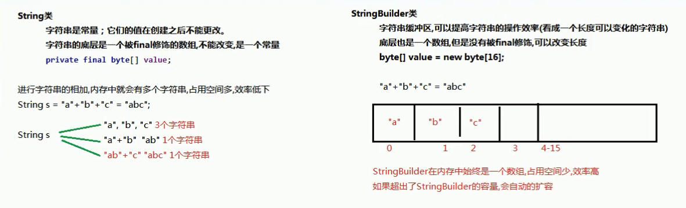

# Object

# 一、 Object类

## 1.1 equals方法

#### 方法摘要

- `public boolean equals(Object obj)`：指示其他某个对象是否与此对象“相等”。即比较2个对象是否相同

调用成员方法equals并指定参数为另一个对象，则可以判断这两个对象是否是相同的。这里的“相同”有默认和自定义两种方式。

#### equals方法的使用

##### 默认地址比较

如果没有覆盖重写equals方法，那么Object类中默认进行`==`运算符的对象地址比较，只要不是同一个对象，结果必然为false。

##### 对象内容比较

如果希望进行对象的内容比较，即所有或指定的部分成员变量相同就判定两个对象相同，则可以覆盖重写equals方法。

```java
package com.wck.demo01equals;

import java.util.Objects;

/**
 * @author 御香烤翅
 * @create 2020-03-28 9:15
 */
public class Person{

    private String name;
    private Integer age;

    /**
     * Object 类的equals方法，默认比较的是两个对象的地址值，这个没有意义
     * 所以要重写对象的equals方法，比较两个对象的属性（name、age）
     *  问题：
     *      隐含着一个多态：
     *          多态的弊端:
     *              无法使用子类特有的内容(属性和方法)
     *              object obj=p2 =new Person("zhangsan", 18);
     *       解决:可以使用向下转型(强转)把obj类型转换为 Person
     *
     * @return
     */
/*    @Override
    public boolean equals(Object obj) {

        //增加一个判断如果比较的是自己，则直接返回 true
        if(obj == this){
            return true;
        }

        //不是Person类型和null 直接返回 false
        if(!(obj instanceof Person) || obj == null){
            return false;
        }
        Person p= (Person) obj;
        return this.name.equals(p.name) && this.age== p.age;
    }*/

    @Override
    public boolean equals(Object o) {
        if (this == o) return true;
        if (o == null || getClass() != o.getClass()) return false;
        Person person = (Person) o;
        return Objects.equals(name, person.name) &&
                Objects.equals(age, person.age);
    }

    @Override
    public int hashCode() {

        return Objects.hash(name, age);
    }
    
    @Override
    public String toString() {
        return "Person{" +
                "name='" + name + '\'' +
                ", age=" + age +
                '}';
    }

    public Person(String name, Integer age) {
        this.name = name;
        this.age = age;
    }

    public Person() {
    }

    public String getName() {
        return name;
    }

    public void setName(String name) {
        this.name = name;
    }

    public Integer getAge() {
        return age;
    }

    public void setAge(Integer age) {
        this.age = age;
    }

}

```

```java
package com.wck.demo01equals;

import java.util.ArrayList;

/**
 * @author 御香烤翅
 * @create 2020-03-28 22:15
 *
 * Person类继承了Object类，所以可以使用Object的equals方法
 *
 * boolean equals(Object obj) 指示其他某个对象是否与此对象相等
 * equals源码：
 *     public boolean equals(Object obj) {
 *         return (this == obj);
 *     }
 *
 *     参数：
 *          Object obj :可以传递任意对象
 *          == 比较运算符，返回是一个布尔值 true false
 *          基本数据类型比较的是数值，引用类型比较的是 引用地址
 */
public class Demo01Equals {

    public static void main(String[] args) {
        Person person = new Person("zhangsan", 18);
        Person person1 = new Person("lisi", 19);
        Person person2 = new Person("lisi", 19);
        boolean equals = person.equals(person1);
        System.out.println(equals);//false

        boolean b = person1.equals(person2);
        System.out.println(b);//true

        ArrayList<String> strings = new ArrayList<>();
        boolean equals1 = person1.equals(strings);
        System.out.println(equals1);

    }


}

```

### 小结:

- 如果没有重写equals方法，那么Object类中的equals方法默认就是地址值比较
- 如果重写equals方法,那么就会按照重写的equals方法规则进行比较

## 1.2Objects类

在**JDK7**添加了一个Objects工具类，它提供了一些方法来操作对象，它由一些静态的实用方法组成，这些方法是null-save（空指针安全的）或null-tolerant（容忍空指针的），用于计算对象的hashcode、返回对象的字符串表示形式、比较两个对象。

在比较两个对象的时候，Object的equals方法容易抛出空指针异常，而Objects类中的equals方法就优化了这个问题。方法如下

- `public static boolean equals(Object a, Object b)`:判断两个对象是否相等。

查看一下源码，学习一下：

```java
public static boolean equals(Object a, Object b) {  
    return (a == b) || (a != null && a.equals(b));  
}
```

```java
package com.wck.demo01equals;

import java.util.Objects;

/**
 * @author 御香烤翅
 * @create 2020-03-28 22:50
 *
 * Objects.equals
 *  源码：
 *     public static boolean equals(Object a, Object b) {
 *         return (a == b) || (a != null && a.equals(b));
 *     }
 *
 */
public class Demo02Objects {

    public static void main(String[] args) {
        String s1=null;
        String s2="aBc";

        //boolean b = s1.equals(s2);//空指针异常 java.lang.NullPointerException
       // System.out.println(b);

        boolean b1 = Objects.equals(s1, s2);
        System.out.println(b1);//false


    }

}

```

### 小结:

- 在比较两个对象的时候，Object的equals方法容易抛出空指针异常，而Objects类中的equals方法就优化了这个问题

# 二、 日期时间类

## 2.1 Date类

#### 概述

`java.util.Date`类 表示特定的瞬间，精确到毫秒。

继续查阅Date类的描述，发现Date拥有多个构造函数，只是部分已经过时，但是其中有未过时的构造函数可以把毫秒值转成日期对象

- `public Date()`：分配Date对象并初始化此对象，以表示分配它的时间（精确到毫秒）。

- `public Date(long date)`：分配Date对象并初始化此对象，以表示自从标准基准时间（称为“历元（epoch）”，即1970年1月1日00:00:00 GMT）以来的指定毫秒数。

```java
package com.wck.demo02date;

import java.util.Date;

/**
 * @author 御香烤翅
 * @create 2020-03-28 23:17
 */
public class Demo02Date {

    public static void main(String[] args) {
        show03();
    }

    /**
     * long getTime() 把当前日期转换为自1970年1月1日以来的毫秒，相当于 System.currentTimeMillis()
     * 返回自1970年1月1日以来，由此 Date对象表示的00:00:00 GMT的毫秒 数 。
     */
    private static void show03() {
        long time = new Date().getTime();
        System.out.println(time);//1585409176667

    }

    /**
     * 构造方法
     * Date(long date)
     * 传递毫秒值，把毫秒值转换为Date日期
     */
    private static void show02() {
        Date date = new Date(0L);
        System.out.println(date);//Thu Jan 01 08:00:00 CST 1970

        date = new Date(1585409031462L);
        System.out.println(date);//Sat Mar 28 23:23:51 CST 2020

    }

    /**
     * 构造方法
     * Date()
     * 分配一个 Date对象，并初始化它，获取当前系统的日期和时间，测量到最近的毫秒。
     */
    private static void show01() {

        Date date = new Date();
        System.out.println(date);//Sat Mar 28 23:19:42 CST 2020

    }
}

```

### 小结:

- Date类中的构造方法
  - `public Date()`
  - `public Date(long date)`
- Date类中的常用方法
  - `public long getTime()` 把日期对象转换成对应的时间毫秒值。

## 2.2 DateFormat类

`java.text.DateFormat` 是日期/时间格式化子类的抽象类，我们通过这个类可以帮我们完成日期和文本之间的转换,也就是可以在Date对象与String对象之间进行来回转换。

- **格式化**：按照指定的格式，从Date对象转换为String对象。
- **解析**：按照指定的格式，从String对象转换为Date对象。

#### 构造方法

由于DateFormat为抽象类，不能直接使用，所以需要常用的子类`java.text.SimpleDateFormat`。这个类需要一个模式（格式）来指定格式化或解析的标准。构造方法为：

- `public SimpleDateFormat(String pattern)`：用给定的模式和默认语言环境的日期格式符号构造SimpleDateFormat。

参数pattern是一个字符串，代表日期时间的自定义格式。

#### 格式规则

常用的格式规则为：

| 标识字母（区分大小写） | 含义 |
| ---------------------- | ---- |
| y                      | 年   |
| M                      | 月   |
| d                      | 日   |
| H                      | 时   |
| m                      | 分   |
| s                      | 秒   |

> 备注：更详细的格式规则，可以参考SimpleDateFormat类的API文档。

#### 常用方法

DateFormat类的常用方法有：

- `public String format(Date date)`：将Date对象格式化为字符串。
- `public Date parse(String source)`：将字符串解析为Date对象

```java
package com.wck.demo03dateformat;

import java.text.ParseException;
import java.text.SimpleDateFormat;
import java.util.Date;

/**
 * @author 御香烤翅
 * @create 2020-03-28 23:32
 *
 * java.text.DateFormat : DateFormat是日期/时间格式化子类的抽象类
 * 功能：
 *      允许格式化（即日期->文本），解析（文本->日期）
 *
 *  成员方法：
 *      String format(Date date) 按照指定的格式，把Date日期，格式化为符合模式的字符串
 *      Date parse(String source) 把符合模式的字符串，解析成日期
 *
 * DateFormat是一个抽象类，我们无法直接使用，可以使用它的已知子类SimpleDateFormat
 *
 *  SimpleDateFormat extends DateFormat
 *
 *    构造方法：
 *        SimpleDateFormat(String pattern)
 *           用给定的模式和默认语言环境的日期格式符号构造 SimpleDateFormat。
 * 一般常用格式：
 *           y	年
 *           M	月
 *           d	日
 *           H	时
 *           m	分
 *           s	秒
 *    例如：
 *   ("yyyy-MM-dd HH:mm:ss");
 *
 */
public class Demo01DateFormat {

    public static void main(String[] args) throws ParseException {
        show02();
    }

    /**
     * Date parse(String source) 把符合模式的字符串，解析成日期
     * 使用步骤：
     *  1 创建SimpleDateFormat对象，构造方法传递 指定的格式
     *  2 使用parse()方法把指定的字符串（需要和规则对应）转换成日期
     */
    private static void show02() throws ParseException {
        String pattern="yyyy-MM-dd";
        SimpleDateFormat dateFormat = new SimpleDateFormat(pattern);
        Date parse = dateFormat.parse("2020-03-28");
        System.out.println(parse);
    }

    /**
     * DateFormat:
     * String format(Date date) 按照指定的格式，把Date日期，格式化为符合模式的字符串
     * 使用步骤：
     *  1 创建SimpleDateFormat对象，构造方法传递 指定的格式
     *  2 使用format()方法把指定的日期转换成字符串
     */
    private static void show01() {

        String pattern="yyyy-MM-dd HH:mm:ss";
        SimpleDateFormat dateFormat = new SimpleDateFormat(pattern);
        String s = dateFormat.format(new Date());
        System.out.println(s);//2020-03-28 23:49:08
    }
}

```

## 2.3 Calendar类

`java.util.Calendar`是日历类，在Date后出现，替换掉了许多Date的方法。该类将所有可能用到的时间信息封装为静态成员变量，方便获取。日历类就是方便获取各个时间属性的。

#### 获取方式

Calendar为抽象类，由于语言敏感性，Calendar类在创建对象时并非直接创建，而是通过静态方法创建，返回子类对象，如下：

Calendar静态方法

- `public static Calendar getInstance()`：使用默认时区和语言环境获得一个日历

## 2.4 Calendar类的常用方法

#### 常用方法

根据Calendar类的API文档，常用方法有：

- `public int get(int field)`：返回给定日历字段的值。
- `public void set(int field, int value)`：将给定的日历字段设置为给定值

- `public abstract void add(int field, int amount)`：根据日历的规则，为给定的日历字段添加或减去指定的时间量。
- `public Date getTime()`：返回一个表示此Calendar时间值（从历元到现在的毫秒偏移量）的Date对象

Calendar类中提供很多成员常量，代表给定的日历字段：

| 字段值       | 含义                                  |
| ------------ | ------------------------------------- |
| YEAR         | 年                                    |
| MONTH        | 月（从0开始，可以+1使用）             |
| DAY_OF_MONTH | 月中的天（几号）                      |
| HOUR         | 时（12小时制）                        |
| HOUR_OF_DAY  | 时（24小时制）                        |
| MINUTE       | 分                                    |
| SECOND       | 秒                                    |
| DAY_OF_WEEK  | 周中的天（周几，周日为1，可以-1使用） |

#### get/set方法

get方法用来获取指定字段的值，set方法用来设置指定字段的值，

#### add方法

add方法可以对指定日历字段的值进行加减操作，如果第二个参数为正数则加上偏移量，如果为负数则减去偏移量。

#### getTime方法

Calendar中的getTime方法并不是获取毫秒时刻，而是拿到对应的Date对象

```java
package com.wck.demo04calendar;

import java.util.Calendar;
import java.util.Date;

/**
 * @author 御香烤翅
 * @create 2020-03-29 13:36
 *
 * java.util.Calendar类：日历类
 *  Calendar是一个抽象类，里面提供了很多操作日历字段的方法（YEAR、MONTH、DAY_OF_MONTH、HOUR 等 ）
 *  Calendar无法直接创建对象使用，里面有一个静态方法叫static Calendar getInstance() 该方法返回了Calendar类的子类对象
 *           static Calendar getInstance()
 *           使用默认时区和语言环境获得一个日历。
 *
 *  常用方法：
 *     public int get(int field)：返回给定日历字段的值。
 *     public void set(int field, int value)：将给定的日历字段设置为给定值。
 *     public abstract void add(int field, int amount)：根据日历的规则，为给定的日历字段添加或减去指定的时间量。
 *     public Date getTime()：返回一个表示此Calendar时间值（从历元到现在的毫秒偏移量）的Date对象。
 *  成员方法参数：
 *      int field ：日历类的字段，可以使用Calendar类的静态成员变量获取
 *
 *       public final static int YEAR = 1;//年
 *       public final static int MONTH = 2;//月
 *       public final static int DATE = 5;//月中某一天
 *       public final static int DAY_OF_MONTH = 5;//月中某一天
 *       public final static int HOUR = 10;//时
 *       public final static int MINUTE = 12;//分
 *       public final static int SECOND = 13;//秒
 *
 */
public class Demo01Calendar {
    public static void main(String[] args) {
       /* Calendar calendar = Calendar.getInstance();
        System.out.println(calendar);*/

       show04();

    }

    /**
     *  public Date getTime()：返回一个表示此Calendar时间值（从历元到现在的毫秒偏移量）的Date对象。
     *      把日历对象转换为日期对象
     *
     */
    private static void show04() {
        Calendar c = Calendar.getInstance();
        Date date = c.getTime();
        System.out.println(date);

    }

    /**
     * public abstract void add(int field, int amount)：根据日历的规则，为给定的日历字段添加或减去指定的时间量。
     *  把指定的字段增加/减少 指定的值
     *
     *  参数：
     *      int field：日历类的字段，可以使用Calendar类的静态成员变量获取
     *      int amount:增加/减少 指定的值
     *                 正数增加，负数减少
     */
    private static void show03() {
        Calendar c = Calendar.getInstance();
        //把年增加两年
        c.add(Calendar.YEAR,2);
        int year = c.get(Calendar.YEAR);
        System.out.println(year);//2022

        //把月增加两月
        c.add(Calendar.MONTH,2);
        int month = c.get(Calendar.MONTH);
        System.out.println(month);//4


        int day = c.get(Calendar.DAY_OF_MONTH);
//        int day = c.get(Calendar.DATE);//DATE和DAY_OF_MONTH是一样的
        System.out.println(day);//29


    }

    /**
     *  public void set(int field, int value)：将给定的日历字段设置为给定值。
     *
     *  参数：
     *      int field ：日历类的字段，可以使用Calendar类的静态成员变量获取
     *      int value ：给指定字段设置的值
     *
     */
    private static void show02() {
        Calendar c = Calendar.getInstance();
        //设置年为 2021
        c.set(Calendar.YEAR,2021);
        //设置月为 1月
        c.set(Calendar.MONTH,0);
        //设置日为 1日
        c.set(Calendar.DATE,1);

        //同时设置年月日
        c.set(2021,1,1);


        int year = c.get(Calendar.YEAR);//2021
        System.out.println(year);//2021


        int month = c.get(Calendar.MONTH);//西方的月份从0 开始，中国的月份从 1 开始
        System.out.println(month);//0

        int day = c.get(Calendar.DAY_OF_MONTH);
        System.out.println(day);//1

    }


    /**
     *  public int get(int field)：返回给定日历字段的值。
     *
     *   int field ：日历类的字段，可以使用Calendar类的静态成员变量获取
     */
    private static void show01() {
        Calendar c = Calendar.getInstance();
        int year = c.get(Calendar.YEAR);
        System.out.println(year);//2020

        int month = c.get(Calendar.MONTH);//西方的月份从0 开始，中国的月份从 1 开始
        System.out.println(month);//2 实际要加一 三月

        int day = c.get(Calendar.DAY_OF_MONTH);
//        int day = c.get(Calendar.DATE);//DATE和DAY_OF_MONTH是一样的
        System.out.println(day);//29
    }
}

```

# 三、 System类

#### 概述

`java.lang.System`类中提供了大量的静态方法，可以获取与系统相关的信息或系统级操作，在System类的API文档中，常用的方法有：

- `public static long currentTimeMillis()`：返回以毫秒为单位的当前时间。

- `public static void arraycopy(Object src, int srcPos, Object dest, int destPos, int length)`：将数组中指定的数据拷贝到另一个数组中。

#### currentTimeMillis方法

实际上，currentTimeMillis方法就是 获取当前系统时间与1970年01月01日00:00点之间的毫秒差值

#### arraycopy方法

- `public static void arraycopy(Object src, int srcPos, Object dest, int destPos, int length)`：将数组中指定的数据拷贝到另一个数组中。

```java
package com.wck.demo05system;

import java.util.Arrays;

/**
 * @author 御香烤翅
 * @create 2020-03-29 14:29
 * java.lang.System
 *
 *     public static long currentTimeMillis()：返回以毫秒为单位的当前时间。
 *     public static void arraycopy(Object src, int srcPos, Object dest, int destPos, int length)：将数组中指定的数据拷贝到另一个数组中。
 */
public class Demo01System {

    public static void main(String[] args) {
        show02();
    }

    /**
     *public static void arraycopy(Object src, int srcPos, Object dest, int destPos, int length)：将数组中指定的数据拷贝到另一个数组中。
     * 参数：
     *     src - 源数组。
     *     srcPos - 源数组中的起始位置。
     *     dest - 目标数组。
     *     destPos - 目标数据中的起始位置。
     *     length - 要复制的数组元素的数量。
     */

    private static void show02() {
        int[] src = new int[]{1,2,3,4,5};
        int[] dest = new int[]{6,7,8,9,10};
        System.arraycopy( src, 0, dest, 0, 3);
        /*代码运行后：两个数组中的元素发生了变化
         src数组元素[1,2,3,4,5]
         dest数组元素[1,2,3,9,10]
        */
        System.out.println(Arrays.toString(src));
        System.out.println(Arrays.toString(dest));
    }

    /**
     *  public static long currentTimeMillis()：返回以毫秒为单位的当前时间。
     */
    private static void show01() {
        //获取当前时间毫秒值
        System.out.println(System.currentTimeMillis()); // 1585463386394
    }
}
```

# 第四章 StringBuilder类

## 4.1 字符串拼接问题

在API中对String类有这样的描述：字符串是常量，它们的值在创建后不能被更改。

根据这句话分析我们的代码，其实总共产生了三个字符串，即`"Hello"`、`"World"`和`"HelloWorld"`。引用变量s首先指向`Hello`对象，最终指向拼接出来的新字符串对象，即`HelloWord` 。

由此可知，如果对字符串进行拼接操作，每次拼接，都会构建一个新的String对象，既耗时，又浪费空间。为了解决这一问题，可以使用`java.lang.StringBuilder`类。

## 4.2 StringBuilder概述

### 讲解:

查阅`java.lang.StringBuilder`的API，StringBuilder又称为可变字符序列，它是一个类似于 String 的字符串缓冲区，通过某些方法调用可以改变该序列的长度和内容。

原来StringBuilder是个字符串的缓冲区，即它是一个容器，容器中可以装很多字符串。并且能够对其中的字符串进行各种操作。

它的内部拥有一个数组用来存放字符串内容，进行字符串拼接时，直接在数组中加入新内容。StringBuilder会自动维护数组的扩容。原理如下图所示：(默认16字符空间，超过自动扩充)



根据StringBuilder的API文档，常用构造方法有2个：

- `public StringBuilder()`：构造一个空的StringBuilder容器。
- `public StringBuilder(String str)`：构造一个StringBuilder容器，并将字符串添加进去。

```java
public class StringBuilderDemo {
    public static void main(String[] args) {
        StringBuilder sb1 = new StringBuilder();
        System.out.println(sb1); // (空白)
        // 使用带参构造
        StringBuilder sb2 = new StringBuilder("abc");
        System.out.println(sb2); // itcast
    }
}
```

## 4.4 StringBuilder常用方法

StringBuilder常用的方法有2个：

- `public StringBuilder append(...)`：添加任意类型数据的字符串形式，并返回当前对象自身。
- `public String toString()`：将当前StringBuilder对象转换为String对象。

```java
public class Demo02StringBuilder {
	public static void main(String[] args) {
		//创建对象
		StringBuilder builder = new StringBuilder();
		//public StringBuilder append(任意类型)
		StringBuilder builder2 = builder.append("hello");
		//对比一下
		System.out.println("builder:"+builder);
		System.out.println("builder2:"+builder2);
		System.out.println(builder == builder2); //true
	    // 可以添加 任何类型
		builder.append("hello");
		builder.append("world");
		builder.append(true);
		builder.append(100);
		// 在我们开发中，会遇到调用一个方法后，返回一个对象的情况。然后使用返回的对象继续调用方法。
        // 这种时候，我们就可以把代码现在一起，如append方法一样，代码如下
		//链式编程
		builder.append("hello").append("world").append(true).append(100);
		System.out.println("builder:"+builder);
	}
}
```

#### toString方法

通过toString方法，StringBuilder对象将会转换为不可变的String对象。如

```java
public class Demo16StringBuilder {
    public static void main(String[] args) {
        // 链式创建
        StringBuilder sb = new StringBuilder("Hello").append("World").append("Java");
        // 调用方法
        String str = sb.toString();
        System.out.println(str); // HelloWorldJava
    }
}
```

# 五、 包装类

## 5.1 概述

- 介绍包装类类型

Java提供了两个类型系统，基本类型与引用类型，使用基本类型在于效率，然而很多情况，会创建对象使用，因为对象可以做更多的功能，如果想要我们的基本类型像对象一样操作，就可以使用基本类型对应的包装类，如下：

| 基本类型 | 对应的包装类（位于java.lang包中） |
| -------- | --------------------------------- |
| byte     | Byte                              |
| short    | Short                             |
| int      | Integer                           |
| long     | Long                              |
| float    | Float                             |
| double   | Double                            |
| char     | Character                         |
| boolean  | Boolean                           |

## 5.2 装箱与拆箱

基本类型与对应的包装类对象之间，来回转换的过程称为”装箱“与”拆箱“：

- **装箱**：从基本类型转换为对应的包装类对象。
- **拆箱**：从包装类对象转换为对应的基本类型。

```java
package com.wck.demo07integer;

/**
 * @author 御香烤翅
 * @create 2020-03-29 15:58
 *
 *  装箱：把基本类型的数据，包装到包装类中
 *  （基本数据类型->包装类）
 *
 *  构造方法：
 *  Integer(int value)
 *           构造一个新分配的 Integer 对象，它表示指定的 int 值。
 * Integer(String s)
 *           构造一个新分配的 Integer 对象，它表示 String 参数所指示的 int 值。
 *
 *  静态方法：
 *  static Integer valueOf(String s)
 *           返回保存指定的 String 的值的 Integer 对象。
 *  static Integer valueOf(String s, int radix)
 *           返回一个 Integer 对象，该对象中保存了用第二个参数提供的基数进行解析时从指定的 String 中提取的值。
 *
 *  拆箱：在包装类中取出基本类型的数据
 *         (包装类->基本类型数据)
 *     成员方法：
 *      int intValue()
 *           以 int 类型返回该 Integer 的值。
 */
public class Demo01Integer {
    public static void main(String[] args) {
        Integer i1 = new Integer("1");
        System.out.println(i1);
        Integer i2 = new Integer(2);
        System.out.println(i2);

        Integer i3 = Integer.valueOf("3");
        System.out.println(i3);

        Integer i4 = Integer.valueOf(4);
        System.out.println(i4);

        int i = i4.intValue();
        System.out.println(i);
    }

}

```

## 5.3 自动装箱与自动拆箱

由于我们经常要做基本类型与包装类之间的转换，从Java 5（JDK 1.5）开始，基本类型与包装类的装箱、拆箱动作可以自动完成。例如：

```java
package com.wck.demo07integer;

/**
 * @author 御香烤翅
 * @create 2020-03-29 16:14
 *
 * 自动装箱与自动拆箱：基本类型的数据和包装类之间可以自动的相互转换
 * JDK1.5之后出现的特性
 */
public class Demo02Integer {

    public static void main(String[] args) {
        /**
         * 自动装箱：直接把int类型的整数赋值给包装类
         * Integer in= 1 ;就相当于 Integer in=new Integer(1);
         */
        Integer in= 1 ;

        /**
         * 自动拆箱 ： in是包装类，无法直接参与运算，可以自动转换为基本数据类型，进行运算
         * in+2;就相当于 in.intValue()+2=3
         * in =in.intValue()+2=3 又是一个自动装箱 相当于 in=new Integer(3);
         */
        in=in+2;

    }
}

```

## 5.3 基本类型与字符串之间的转换

#### 基本类型转换为String

基本类型转换String总共有三种方式，查看课后资料可以得知，这里只讲最简单的一种方式：

```java
//第一种 直接 +""
//第二种 包装类中的toString(参数)
//第三种 String.valueOf(参数)
```


#### String转换成对应的基本类型

除了Character类之外，其他所有包装类都具有parseXxx静态方法可以将字符串参数转换为对应的基本类型：

- `public static byte parseByte(String s)`：将字符串参数转换为对应的byte基本类型。
- `public static short parseShort(String s)`：将字符串参数转换为对应的short基本类型。

- `public static int parseInt(String s)`：将字符串参数转换为对应的int基本类型。
- `public static long parseLong(String s)`：将字符串参数转换为对应的long基本类型。

- `public static float parseFloat(String s)`：将字符串参数转换为对应的float基本类型。
- `public static double parseDouble(String s)`：将字符串参数转换为对应的double基本类型。

- `public static boolean parseBoolean(String s)`：将字符串参数转换为对应的boolean基本类型。

```java
public class Demo18WrapperParse {
    public static void main(String[] args) {
        int num = Integer.parseInt("100");
    }
}
```

