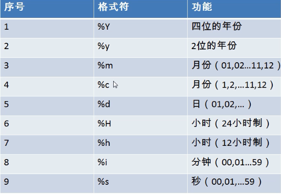
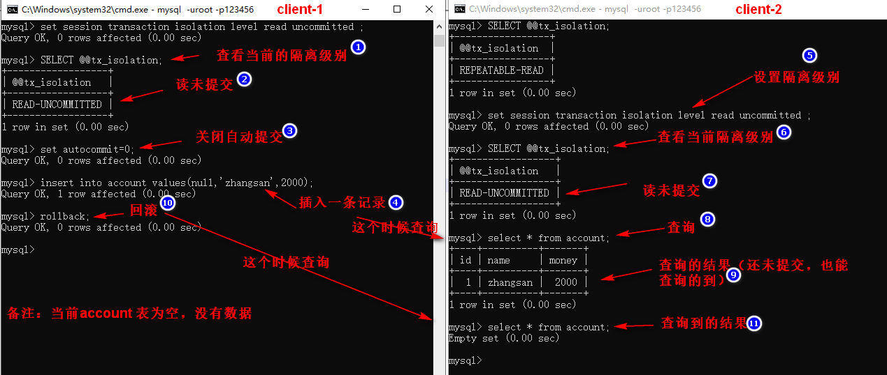
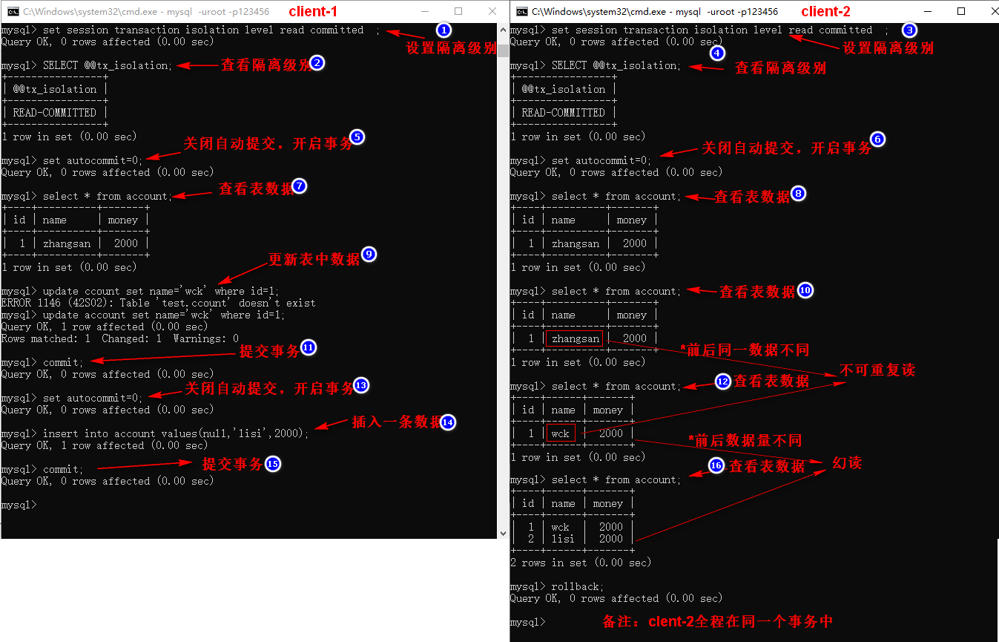
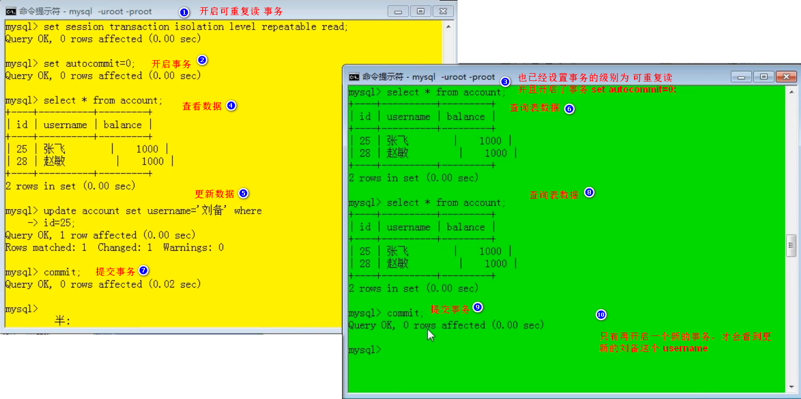
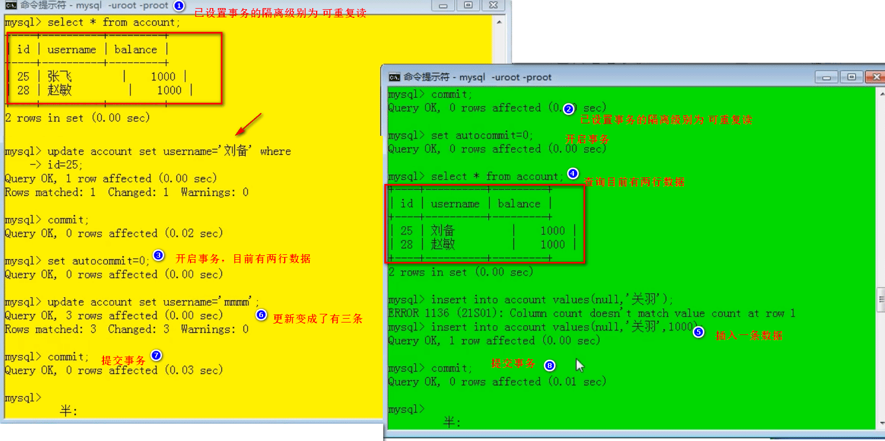

# 一、数据库概述

## 1.1）数据库相关概念

### 1.1.1）数据库的好处

- 1.持久化数据到本地    
- 2.可以实现结构化查询，方便管理            

### 1.1.2）数据库相关概念

- 1、**DB**：**数据库，保存一组有组织的数据的容器**    
- 2、DBMS：数据库管理系统，又称为**数据库软件（产品）**，用于管理DB中的数据    
- 3、SQL:结构化查询语言，用于和DBMS通信的语言        

### 1.1.3）数据库存储数据的特点

- 1、**将数据放到表中（相当于文件页），表再放到库中，数据先放到文件页中，再放入数据库中。**
- 2、一个数据库中可以有多个表，每个表都有一个的名字，用来标识自己。表名具有唯一性。
- 3、表具有一些特性，这些特性定义了数据在表中如何存储，类似java中 “类”的设计。
- 4、表由列组成，我们也称为字段。所有表都是由一个或多个列组成的，每一列类似java 中的”属性”
- 5、**表中的数据是按行存储的，每一行类似于java中的“对象”。**

## 1.2）MySQL产品的介绍和安装

### 1.2.1）MySQL服务的启动和停止

```mysql
	方式一：计算机——右击管理——服务
	方式二：通过管理员身份运行
	net start 服务名（启动服务）
	net stop 服务名（停止服务）
```

### 1.2.2）MySQL服务的登录和退出   

```mysq
方式一：通过mysql自带的客户端
	只限于root用户

​	方式二：通过windows自带的客户端
​	登录：
​	mysql 【-h主机名 -P端口号 】-u用户名 -p密码

​	退出：
​	exit或ctrl+C
```

### 1.2.3）MySQL的常见命令      

```mysql
#1.查看当前所有的数据库
show databases;
#2.打开指定的库
use 库名
#3.查看当前库的所有表
show tables;
#4.查看其它库的所有表
show tables from 库名;
#5.创建表
create table 表名(
	列名 列类型,
	列名 列类型，
	。。。
);
#6.查看表结构
desc 表名;
#7.查看服务器的版本
方式一：登录到mysql服务端
select version();
方式二：没有登录到mysql服务端
mysql --version
或
mysql --V
```

### 1.2.4）MySQL的语法规范

- 1.**不区分大小写**,但建议关键字大写，表名、列名小写
- 2.每条命令**最好用分号结尾**
- 3.每条命令根据需要，**可以进行缩进 或换行**
- 4.**注释**
  		单行注释：#注释文字
    		单行注释：-- 注释文字 （注意杠杠和注释文字之间要有空格）
    		多行注释：/* 注释文字  */

### 1.2.5）SQL的语言分类

- **DQL（Data Query Language）：数据查询语言**
  		`select` 
- **DML(Data Manipulate Language):数据操作语言**
  		`insert 、update、delete`
- **DDL（Data Define Languge）：数据定义语言**
  		`create、drop、alter`
- **TCL（Transaction Control Language）：事务控制语言**
  		`commit、rollback`


# 二、DQL(DataBase Query Language)语言学习

## 2.1）基础查询【进阶一-基础查询】

### 2.1.1）语法

`select 查询列表 from 表名;`

### 2.1.2）特点

- 1、**查询列表**可以是**字段、常量、表达式、函数，也可以是多个**
- 2、**查询结果是一个虚拟表**

### 2.1.3）示例

#### 2.1.3.1）查询单个字段

`select 字段名 from 表名;`

#### 2.1.3.2）查询多个字段

`select 字段名，字段名 from 表名;`

#### 2.1.3.3）查询所有字段

`select * from 表名;`

#### 2.1.3.4）查询常量

`select 常量值;`

**注意**：字符型和日期型的常量值必须用单引号引起来，数值型不需要

#### 2.1.3.5）查询函数

`select 函数名(实参列表);`

#### 2.1.3.6）查询表达式

`select 100/1234;`

#### 2.1.3.7）起别名

- ①as

- ②空格

#### 2.1.3.8）去重

`select distinct 字段名 from 表名;`

#### 2.1.3.9）+  作用：做加法运算

- `select 数值+数值;`  直接运算

- `select 字符+数值;` 先试图将字符转换成数值，如果转换成功，则继续运算；否则转换成0，再做运算

- `select null+值; `  结果都为null，只要有一方为null 则就为 null

#### 2.1.3.10）【补充】concat函数 功能：拼接字符

`select concat(字符1，字符2，字符3,...);`

#### 2.1.3.11）【补充】ifnull函数 功能：判断某字段或表达式是否为null，如果为null 返回指定的值，否则返回原本的值

`select ifnull(commission_pct,0) from employees;`

#### 2.1.3.12）【补充】isnull函数 功能：判断某字段或表达式是否为null，如果是，则返回1，否则返回0

`SELECT ISNULL(commission_pct) AS "奖金",commission_pct FROM employees;`

## 2.2）条件查询【进阶二-条件查询】

### 2.2.1）语法

`select 查询列表 from 表名 where 筛选条件`

### 2.2.2）筛选条件的分类

#### 2.2.2.1）简单条件运算符

`< = <> != >= <=  <=>安全等于`

#### 2.2.2.2）逻辑运算符

`&& and`
`|| or`
`!  not`

#### 2.2.2.3）模糊查询

`like`:一般搭配通配符使用，可以判断字符型或数值型

**通配符**：`%`任意多个字符，`_`任意单个字符

`between and` ：范围  在值之间
`in` ：在什么中
`is null /is not null`：用于判断null值

#### 2.2.2.4）`is null` 对比 `<=>`

|         | 普通类型的数值 | null值 | 可读性 |
| ------- | -------------- | ------ | ------ |
| is null | ×              | √      | √      |
| <=>     | √              | √      | ×      |

## 2.3）排序查询[进阶三-排序查询]

### 2.3.1）语法

`select 查询列表`
`from 表`
`where 筛选条件`
`order by 排序列表 【asc|desc】`

### 2.3.2）特点

- 1、升降序
  - `asc` ：升序，如果不写默认升序
  - `desc`：降序

- 2、排序列表 支持 单个字段、多个字段、函数、表达式、别名

- 3、`order by`的位置一般放在查询语句的最后（除`limit`语句之外）

## 2.4）常见函数[进阶四-常见的函数]

### 2.4.1）概述

- 功能：**类似于java中的方法**

- 好处：提高重用性和隐藏实现细节
- 调用：`select 函数名(实参列表);`

### 2.4.2）单行函数

#### 2.4.2.1）字符函数

- `concat`:连接
- `substr:`截取子串
- `upper`:变大写
- `lower`：变小写
- `replace`：替换
- `length`：获取字节长度
- `trim`:去前后空格
- `lpad`：左填充
- `rpad`：右填充
- `instr`:获取子串第一次出现的索引

#### 2.4.2.2）数学函数

`ceil`:向上取整
`round`：四舍五入
`mod`:取模
`floor`：向下取整
`truncate`:截断
`rand`:获取随机数，返回0-1之间的小数

#### 2.4.2.3）日期函数

`now`：**返回当前日期+时间**
`year`:返回年
`month`：返回月
`day`:返回日
`date_format`:**将日期转换成字符**
`curdate`:返回当前日期
`str_to_date`:**将字符转换成日期**
`curtime`：**返回当前时间**
`hour`:小时
`minute`:分钟
`second`：秒
`datediff`:**返回两个日期相差的天数**
`monthname`:**以英文形式返回月**

**日期的格式：**



#### 2.4.2.4）其他函数

`version() ` 当前数据库服务器的版本
`database()` 当前打开的数据库
`user()`当前用户
`password('字符')`：返回该字符的密码形式
`md5('字符')`:返回该字符的md5加密形式

#### 2.4.2.5）流程控制函数

- ①`if(条件表达式，表达式1，表达式2)：如果条件表达式成立，返回表达式1，否则返回表达式2`

- ②**case情况1(类似java switch语句)**

  `case 变量或表达式或字段`
  `when 常量1 then 值1`
  `when 常量2 then 值2`
  `...`
  `else 值n`
  `end`

- ③**case情况2(类似java if(){} else if{}else{} )**

  `case` 
  `when 条件1 then 值1`
  `when 条件2 then 值2`
  `...`
  `else 值n`
  `end`

### 2.4.3）分组函数

#### 2.4.3.1）分类

`max` 最大值
`min` 最小值
`sum` 和
`avg` 平均值
`count` 计算个数

#### 2.4.3.2）特点

- ①**语法**
  `select max(字段) from 表名;`

- ②支持的类型
  - **sum和avg一般用于处理数值型**
  - **max、min、count**可以处理**任何数据类型**

- ③**以上分组函数都忽略null(重点)**

- ④**都可以搭配distinct使用**，实现去重的统计
  
- `select sum(distinct 字段) from 表;`
  
- ⑤count函数

  - `count(字段)`：**统计**该字段**非空值的个数**
  - `count(*)`:统计结果集的行数
  - `count(1)`:统计结果集的行数

  效率上：     

  MyISAM存储引擎，`count(*)`最高    
  InnoDB存储引擎，`count(*)`和`count(1)`效率>`count(字段)`     

- ⑥ **和分组函数一同查询的字段，要求是group by后出现的字段（重点）**

## 2.5）分组查询【进阶五-分组查询】

### 2.5.1）语法

`select 分组函数，分组后的字段`
`from 表`
`【where 筛选条件】`
  `group by 分组的字段`
`【having 分组后的筛选】`
`【order by 排序列表】`

### 2.5.2）特点

|            | 使用关键字 | 筛选的表     | 位置            |
| ---------- | ---------- | ------------ | --------------- |
| 分组前筛选 | where      | 原始表       | group by的前面  |
| 分组后筛选 | having     | 分组后的结果 | group by 的后面 |

## 2.6）连接查询【进阶六-连接查询-92标准|进阶六-连接查询-99标准】

### 2.6.1）含义

当查询中涉及到了多个表的字段，需要使用多表连接          

`select 字段1，字段2 from 表1，表2,...;`

笛卡尔乘积：当查询多个表时，**没有添加有效的连接条件，导致多个表所有行实现完全连接**     
如何解决：添加有效的连接条件

### 2.6.2）分类

- 按年代分类：

  - sql92：
    - 等值
    - 非等值
    - 自连接
    - 也支持一部分外连接（用于oracle、sqlserver，mysql不支持）

  - **sql99【推荐使用】**

    - 内连接
      - 等值
      - 非等值
      - 自连接

    - 外连接
      - 左外
      - 右外
      - 全外（mysql不支持）

    - 交叉连接

### 2.6.3）SQL92语法

#### 2.6.3.1）等值连接

##### 2.6.3.1.1）语法：

`select 查询列表`
	`from 表1 别名,表2 别名`
	`where 表1.key=表2.key`
	`【and 筛选条件】`
	`【group by 分组字段】`
	`【having 分组后的筛选】`
	`【order by 排序字段】` 

##### 2.6.3.1.2）特点：

- ① 一般为表起别名

- ②多表的顺序可以调换
- ③n表连接至少需要n-1个连接条件
- ④等值连接的结果是多表的交集部分

#### 2.6.3.2）非等值连接

##### 2.6.3.2.1）语法：

​	`select 查询列表`
​	`from 表1 别名,表2 别名`
​	`where 非等值的连接条件`
​	`【and 筛选条件】`
​	`【group by 分组字段】`
​	`【having 分组后的筛选】`
​	`【order by 排序字段】`

#### 2.6.3.3）自连接

##### 2.6.3.3.1）语法：

​	`select 查询列表`
​	`from 表 别名1,表 别名2`
​	`where 等值的连接条件`
​	`【and 筛选条件】`
​	`【group by 分组字段】`
​	`【having 分组后的筛选】`
​	`【order by 排序字段】`

### 2.6.4）SQL99语法

#### 2.6.4.1）内连接

##### 2.6.4.1.1）语法

`select 查询列表`
`from 表1 别名`
`【inner】 join 表2 别名 on 连接条件`
`where 筛选条件`
`group by 分组列表`
`having 分组后的筛选`
`order by 排序列表`
`limit 子句;`

##### 2.6.4.1.2）特点

- ①表的顺序可以调换
- ②内连接的结果=多表的交集
- ③n表连接至少需要n-1个连接条件

##### 2.6.4.1.3）分类

- **等值连接**
- **非等值连接**
- **自连接**

#### 2.6.4.2）外连接

##### 2.6.4.2.1）语法

`select 查询列表`
`from 表1 别名`
`left|right|full【outer】 join 表2 别名 on 连接条件`
`where 筛选条件`
`group by 分组列表`
`having 分组后的筛选`
`order by 排序列表`
`limit 子句;`

##### 2.6.4.2.2）特点

- ①**查询的结果=主表中所有的行**，如果从表和它匹配的将显示匹配行，如果从**表没有匹配的则显示null**
- ②**left join 左边的就是主表，right join 右边的就是主表full join 两边都是主表**
- ③一般用于**查询除了交集部分的剩余的不匹配的行**

#### 2.6.4.3）交叉连接

##### 2.6.4.3.1）语法

`select 查询列表`
`from 表1 别名`
`cross join 表2 别名;`

##### 2.6.4.3.2）特点

类似于笛卡尔乘积

## 2.7）子查询【进阶七-子查询】

### 2.7.1）含义

- 嵌套在其他语句内部的select语句称为子查询或内查询，
- 外面的语句可以是insert、update、delete、select等，一般select作为外面语句较多
- 外面如果为select语句，则此语句称为外查询或主查询

### 2.7.2）分类

#### 2.7.2.1）按出现位置

- `select`后面：
  - **仅仅支持标量子查询**
- `from`后面：
  - 表子查询
- `where`或`having`后面：
  - **标量子查询**
  - **列子查询**
  - **行子查询**
- `exists`后面：
  - **标量子查询**
  - **列子查询**
  - **行子查询**
  - **表子查询**

#### 2.7.2.2）按结果集的行列

- 标量子查询（单行子查询）：结果集为一行一列
- 列子查询（多行子查询）：结果集为多行一列
- 行子查询：结果集为多行多列
- 表子查询：结果集为多行多列

#### 2.7.2.3）示例

#### 2.7.2.3.1）`where`或`having`后面

###### 1、标量子查询

案例：查询最低工资的员工姓名和工资

- ①最低工资

  `select min(salary) from employees;`

- ②查询员工的姓名和工资，要求工资=①
  `select last_name,salary`
  `from employees`
  `where salary=(`
  	`select min(salary) from employees`
  `);`

###### 2、列子查询

案例：查询所有是领导的员工姓名

- ①查询所有员工的 manager_id
  `select manager_id`
  `from employees;`

- ②查询姓名，employee_id属于①列表的一个
  `select last_name`
  `from employees`
  `where employee_id in(`
  	`select manager_id`
  	`from employees`
  `);`


## 2.8）分页查询【进阶八-分页查询】

### 2.8.1）应用场景

当要查询的条目数太多，一页显示不全

### 2.8.2）语法

`select 查询列表`
`from 表`
`limit 【offset,】size;`
注意：
`offset`代表的是起始的条目索引，默认从0卡死
`size`代表的是显示的条目数

### 2.8.3）公式

假如**要显示的页数为page**，**每一页条目数为size**
`select 查询列表`
`from 表`
`limit (page-1)*size,size;`

## 2.9）联合查询【进阶九-联合查询】

### 2.9.1）含义

`union`：合并、联合，将**多次查询结果合并成一个结果**

### 2.9.2）语法

`查询语句1`
`union 【all】`
`查询语句2`
`union 【all】`
`...`

### 2.9.3）意义

- 1、将一条比较复杂的查询语句拆分成多条语句
- 2、适用于查询多个表的时候，**查询的列基本是一致**

### 2.9.4）特点

- 1、要求**多条查询语句的查询列数必须一致**
- 2、要求**多条查询语句的查询的各列类型、顺序**最好**一致**
- 3、**union 是去重的，union all包含重复项**

## 2.10）查询总结

### 2.10.1）语法及执行顺序：

- `select 查询列表`    ⑦
- `from 表1 别名`      ①
- `连接类型 join 表2`   ②
- `on 连接条件`         ③
-  `where 筛选`    ④
- `group by 分组列表`   ⑤
- `having 筛选`         ⑥
- `order by排序列表`    ⑧
- `limit 起始条目索引，条目数;`  ⑨

# 三、DML语言【进阶十一-DML语言】

## 3.1）插入

### 3.1.1）语法

#### 方式一：

`insert into 表名(字段名,...) values(值,...);`

#### 特点

- 1、要求值的类型和字段的类型要一致或兼容
- 2、字段的个数和顺序不一定与原始表中的字段个数和顺序一致但必须保证值和字段一一对应
- 3、假如表中有可以为null的字段，注意可以通过以下两种方式插入null值
  - ①字段和值都省略
  - ②字段写上，值使用null
- 4、字段和值的个数必须一致
- 5、**字段名可以省略，默认所有列**

#### 方式二：

`insert into 表名 set 字段=值,字段=值,...;`


### 3.1.2）两种方式 的区别：

- 1.**方式一支持一次插入多行**，语法如下：
  `insert into 表名【(字段名,..)】 values(值，..),(值，...),...;`
- 2.**方式一支持子查询**，语法如下：
  `insert into 表名`
  `查询语句;`

## 3.2）修改

### 3.2.1）修改单表的记录

#### 语法：

`update 表名 set 字段=值,字段=值 【where 筛选条件】;`

### 3.2.2）修改多表的记录【补充】

#### 语法：

`update 表1 别名` 
`left|right|inner join 表2 别名` 
`on 连接条件  
set 字段=值,字段=值` 
`【where 筛选条件】;`

## 3.3）删除

### 3.3.1）方式一：使用delete

#### 一、删除单表的记录★

##### 语法：

`delete from 表名 【where 筛选条件】【limit 条目数】；`

#### 二、级联删除[补充]

##### 语法：

`delete 别名1,别名2 from 表1 别名` 
`inner|left|right join 表2 别名` 
`on 连接条件`
 `【where 筛选条件】`

### 3.3.1）方式二：使用truncate

#### 语法：

`truncate table 表名`


### 3.3.2）两种方式的区别【面试题】★

- 1.`truncate`删除后，如果再插入，标识列从1开始
    `delete`删除后，如果再插入，标识列从断点开始
- 2.`delete`可以添加筛选条件
   `truncate`不可以添加筛选条件
- 3.`truncate`效率较高
- 4.`truncate`没有返回值
  `delete`可以返回受影响的行数
- 5.`truncate`不可以回滚
  `delete`可以回滚


# 四、DDL语言【进阶十一-DDL】


## 4.1）库的管理

### 4.1.1）创建库

`create database 【if not exists】 库名【 character set 字符集名】;`

### 4.1.2）修改库

`alter database 库名 character set 字符集名;`

### 4.1.3）删除库

`drop database 【if exists】 库名;`

## 4.2）表的管理

### 4.2.1）创建表 ★

`create table 【if not exists】 表名(`
	`字段名 字段类型 【约束】,`
	`字段名 字段类型 【约束】,`
	`...`
	`字段名 字段类型 【约束】` 

`)`

### 4.2.2）修改表

#### 4.2.2.1）添加列

`alter table 表名 add column 列名 类型 【first|after 字段名】;`

#### 4.2.2.2）修改列的类型或约束

`alter table 表名 modify column 列名 新类型 【新约束】;`

#### 4.2.2.3）修改列名

`alter table 表名 change column 旧列名 新列名 类型`;

#### 4.2.2.4）删除列

`alter table 表名 drop column 列名;`

#### 4.2.2.5）修改表名

`alter table 表名 rename 【to】 新表名;`

### 4.2.3）删除表

`drop table【if exists】 表名;`

### 4.2.4）复制表

#### 4.2.4.1）复制表的结构

`create table 表名 like 旧表;`

#### 4.2.4.2）复制表的结构+数据

`create table 表名` 
`select 查询列表 from 旧表【where 筛选】;`

## 4.3）数据类型【进阶十二-常见的数据类型】

### 4.3.1）数值型

#### 4.3.1.1）整型

| 类型 | tinyint | smallint | mediumint | int/integer | bigint |
| ---- | ------- | -------- | --------- | ----------- | ------ |
| 字节 | 1       | 2        | 3         | 4           | 8      |

#### 4.3.1.2）特点：

- ①都可以设置无符号和有符号，**默认有符号**，通过`unsigned`**设置无符号**
- ②如果超出了范围，**会报out or range异常，插入临界值**
- ③**长度**可以**不指定**，**默认会有一个长度**
  - **长度代表显示的最大宽度，如果不够则左边用0填充，但需要搭配zerofill，并且默认变为无符号整型**

### 4.3.2）浮点型

#### 4.3.2.1）定点数

`decimal(M,D)`

#### 4.3.2.2）浮点数

`float(M,D)`   4 个字节

`double(M,D)`  8个字节

##### 4.3.2.2.1）特点：

- ①**M代表整数部位+小数部位的个数，D代表小数部位**
- ②**如果超出范围，则报out or range异常，并且插入临界值**
- ③**M和D都可以省略，但对于定点数，M默认为10，D默认为0**
- ④**如果精度要求较高，则优先考虑使用定点数**

### 4.3.3）字符型

`char、varchar、binary、varbinary、enum、set、text、blob`

`char`：**固定长度的字符**，写法为char(M)，最大长度不能超过M，其中M可以省略，默认为1    
`varchar`：**可变长度的字符**，写法为varchar(M)，最大长度不能超过M，其中M不可以省略

### 4.3.4）日期型

- year年
- date日期
- time时间
- datetime 日期+时间        
- timestamp 日期+时间     **比较容易受时区、语法模式、版本的影响，更能反映当前时区的真实时间**

## 4.4）常见的约束【进阶十三-常见约束】

### 4.4.1）常见的约束

- `NOT NULL`：非空，该字段的值必填
- `UNIQUE`：唯一，该字段的值不可重复
- `DEFAULT`：默认，该字段的值不用手动插入有默认值
- `CHECK`：检查，mysql不支持
- `PRIMARY KEY`：主键，该字段的值不可重复并且非空  unique+not null
- `FOREIGN KEY`：外键，该字段的值引用了另外的表的字段

#### 4.4.1.1）主键和唯一

##### 4.4.1.1.1）区别：

- ①、**一个表至多有一个主键，但可以有多个唯一**
- ②、**主键不允许为空，唯一可以为空**

##### 4.4.1.1.2）、相同点

- 都具有唯一性
- **都支持组合键，但不推荐**

##### 4.4.1.1.3）外键

- 1、用于限制两个表的关系，**从表的字段值引用了主表的某字段值**
- 2、**外键列和主表的被引用列要求类型一致**，意义一样，名称无要求
- 3、**主表的被引用列要求是一个key（一般就是主键）**
- 4、**插入数据，先插入主表**
- 5、**删除数据，先删除从表**，可以通过以下两种方式来删除主表的记录
  - 方式一：级联删除
    - `ALTER TABLE stuinfo ADD CONSTRAINT fk_stu_major FOREIGN KEY(majorid) REFERENCES major(id) ON DELETE CASCADE;`
  - 方式二：级联置空
    - `ALTER TABLE stuinfo ADD CONSTRAINT fk_stu_major FOREIGN KEY(majorid) REFERENCES major(id) ON DELETE SET NULL;`


### 4.4.2）创建表时添加约束

`create table 表名(`
	`字段名 字段类型 not null,#非空`
	`字段名 字段类型 primary key,#主键`
	`字段名 字段类型 unique,#唯一`
	`字段名 字段类型 default 值,#默认`
	`constraint 约束名 foreign key(字段名) references 主表（被引用列）`
`)`

**注意：**

|          | 支持类型       | 可以起约束名       |
| -------- | -------------- | ------------------ |
| 列级约束 | 除了外键       | 不可以             |
| 表级约束 | 除了非空和默认 | 可以，但对主键无效 |

**列级约束可以在一个字段上追加多个，中间用空格隔开，没有顺序要求**

### 4.4.3）修改表时添加或删除约束

#### 4.4.3.1）非空

- 添加非空
  `alter table 表名 modify column 字段名 字段类型 not null;`
- 删除非空
  `alter table 表名 modify column 字段名 字段类型 ;`

#### 4.4.3.2）默认

- 添加默认
  `alter table 表名 modify column 字段名 字段类型 default 值;`
- 删除默认
  `alter table 表名 modify column 字段名 字段类型 ;`

#### 4.4.3.3）主键

- 添加主键
  `alter table 表名 add【 constraint 约束名】 primary key(字段名);`
- 删除主键
  `alter table 表名 drop primary key;`

#### 4.4.3.4）唯一

- 添加唯一
  `alter table 表名 add【 constraint 约束名】 unique(字段名);`
- 删除唯一
  `alter table 表名 drop index 索引名;`

#### 4.4.3.5）外键

- 添加外键
  `alter table 表名 add【 constraint 约束名】 foreign key(字段名) references 主表（被引用列）;`
- 删除外键
  `alter table 表名 drop foreign key 约束名;`

### 4.4.4）自增长列

#### 4.4.4.1）特点

- 1、**不用手动插入值，可以自动提供序列值，默认从1开始，步长为1**

  `auto_increment_increment`

- 2、如果要更改起始值：手动插入值

- 3、如果要更改步长：更改系统变量

  `set auto_increment_increment=值;`

- 4、一个**表至多有一个自增长列**
- 5、**自增长列只能支持数值型**
- 6、**自增长列必须为一个key**

#### 4.4.4.2）创建表时设置自增长列

`create table 表(`
	`字段名 字段类型 约束 auto_increment`
`)`

#### 4.4.4.3）修改表时设置自增长列

`alter table 表 modify column 字段名 字段类型 约束 auto_increment;`

#### 4.4.4.4）删除自增长列

`alter table 表 modify column 字段名 字段类型 约束 ;`

# 五 、TCL语言【进阶十四-TCL】

## 5.1）事务

### 5.1.1）含义

事务：一条或多条sql语句组成一个执行单位，一组sql语句要么都执行要么都不执行

### 5.1.2）特点（ACID）

A 原子性：一个事务是不可再分割的整体，要么都执行要么都不执行
C 一致性：一个事务可以使数据从一个一致状态切换到另外一个一致的状态
I 隔离性：一个事务不受其他事务的干扰，多个事务互相隔离的
D 持久性：一个事务一旦提交了，则永久的持久化到本地

### 5.1.3）事务的使用步骤 ★

#### 5.1.3.1）两种事务（隐式、显式）

- 隐式（自动）事务：没有明显的开启和结束，**本身就是一条事务可以自动提交，比如insert、update、delete**
- 显式事务：**具有明显的开启和结束**

#### 5.1.3.2）使用显式事务

##### ①开启事务

`set autocommit=0;`
`start transaction;`#可以省略

##### ②编写一组逻辑sql语句

注意：**sql语句支持的是insert、update、delete**

设置回滚点：

`savepoint 回滚点名;`

##### ③结束事务

提交：`commit;`
回滚：`rollback;`
回滚到指定的地方：`rollback to 回滚点名;`

### 5.1.4）并发事务

#### 5.1.4.1）事务的并发问题是如何发生的？

多个事务 同时 操作 同一个数据库的相同数据时

#### 5.1.4.2）并发问题都有哪些？

- 脏读：一个事务读取了其他事务还没有提交的数据，读到的是其他事务“更新”和“删除”的数据
- 不可重复读：一个事务多次读取，结果不一样
- 幻读：一个事务读取了其他事务还没有提交的数据，只是读到的是 其他事务“插入”的数据

简单来说：

- **脏读即为session B读取到了session A中未提交的数据**

- **不可重复读即为sessionB读取到了session A提交的数据，即前后session B读取的数据不一致**

-  **幻读即为session A读取到了session B insert的数据。**

幻读为读到别人已提交的写入数据库的数据。

**幻读与不可重复读的区别为幻读为读到新插入的数据（insert），而不可重复读主要是更改与删除（update、delete）**。

#### 5.1.4.3）如何解决并发问题

通过设置隔离级别来解决并发问题

#### 5.1.4.4）隔离级别

|                           | 脏读 | 不可重复读 | 幻读          |
| ------------------------- | ---- | ---------- | ------------- |
| read uncommitted 读未提交 | ×    | ×          | ×             |
| read committed 读已提交   | √    | ×          | ×             |
| repeatable read 可重复读  | √    | √          | ×（mysql是√） |
| serializable 串行化       | √    | √          | √             |

##### 5.1.4.4.1）read uncommitted 读未提交



##### 5.1.4.4.2）read committed 读已提交



##### 5.1.4.4.3）repeatable read 可重复读

特别说明：      

**这样说来 Mysql 也跟其他的数据库一样，当 Repeatable Read的时候会出现幻读的情况，其实不然，Mysql还有一种机制可以保证即使在Repeatable Read级别下面也不会出现幻读；**



不能避免幻读，**幻读的演示为**：



##### 5.1.4.4.4）serializable 串行化

Serializable是最高的事务隔离级别，同时代价也花费最高，性能很低，一般很少使用，在该级别下，事**务顺序执行**，不仅可以避免脏读、不可重复读，还避免了幻像读。

可以避免脏读，不可重复读和幻读，但是执行 增删改查，要阻塞（类似于单线程），效率太差。

```mysql
set session transaction isolation level serializable; #设置隔离级别
SELECT @@tx_isolation; #查看隔离级别
set autocommit=0; #取消自动提交

insert into account values(null,'lisi',2000); #添加一条数据

select * from account; #查看表
```


# 六 、其他

## 6.1）视图【进阶十五-视图】

### 6.1.1）含义

mysql5.1版本出现的新特性，本身**是一个虚拟表，它的数据来自于表，通过执行时动态生成**。

### 6.1.2）好处

- 1、简化sql语句
- 2、提高了sql的重用性
- 3、保护基表的数据，提高了安全性

### 6.1.3）创建

`create view 视图名`
`as`
`查询语句;`

### 6.1.4）修改

- 方式一：

`create or replace view 视图名`
`as`
`查询语句;`

- 方式二：

`alter view 视图名`
`as`
`查询语句`

### 6.1.5）删除

`drop view 视图1，视图2,...;`

### 6.1.6）查看

`desc 视图名;`
`show create view 视图名;`

### 6.1.7）使用

- 1.插入
  `insert`
- 2.修改
  `update`
- 3.删除
  `delete`
- 4.查看
  `select`

### 6.1.8）使用注意：

视图**一般用于查询的，而不是更新的**，所以具备以下特点的视图都不允许更新

- ①包含分组函数、`group by`、`distinct`、`having`、`union`、
- ②`join`
- ③常量视图
- ④`where`后的子查询用到了`from`中的表
- ⑤用到了不可更新的视图

### 6.1.9）视图和表的对比

|      | 关键字 | 是否占用物理空间        | 使用         |
| ---- | ------ | ----------------------- | ------------ |
| 视图 | view   | 占用较小，只保存sql逻辑 | 一般用于查询 |
| 表   | table  | 保存实际的数据          | 增删改查     |

## 6.2）变量【进阶十五-变量】

### 6.2.1）系统变量

**说明**：**变量由系统提供的，不用自定义**     

#### 6.2.1.1）语法  

- ①查看系统变量

`show 【global|session 】variables like '';` 如果没有显式声明global还是session，则**默认是session**

- ②查看指定的系统变量的值

`select @@【global|session】.变量名;` 如果没有显式声明global还是session，则**默认是session**

- 为系统变量赋值

  - 方式一

    `set 【global|session 】 变量名=值;` 如果没有显式声明global还是session，则**默认是session**

  - 方式二

    `set @@global.变量名=值;`
    `set @@变量名=值；`

#### 6.2.1.2）全局变量

服务器层面上的，必须拥有**super权限才能为系统变量赋值，作用域为整个服务器**，也就是**针对于所有连接（会话）有效**

#### 6.2.1.3）会话变量

服务器为每一个连接的客户端都提供了系统变量，**作用域为当前的连接（会话）**

### 6.2.2）自定义变量

#### 6.2.2.1）用户变量

- 作用域：针对于**当前连接（会话）生效**

- 位置：**begin end里面，也可以放在外面**

使用：

##### ①声明并赋值：

`set @变量名=值;`或
`set @变量名:=值;`或
`select @变量名:=值;`

##### ②更新值

- 方式一：
  	`set @变量名=值;`或
    	`set @变量名:=值;`或
    	`select @变量名:=值;`

- 方式二：

  ​	`select xx into @变量名 from 表;`

##### ③使用

`select @变量名;`

#### 6.2.2.2）局部变量

- 作用域：**仅仅在定义它的begin end中有效**
- 位置：只能放在begin end中，而且只能放在第一句

使用：

##### ①声明

`declare 变量名 类型 【default 值】;`

##### ②赋值或更新

- 方式一：

`set 变量名=值;`或
`set 变量名:=值;`或
`select @变量名:=值;`

- 方式二：

`select xx into 变量名 from 表;`

##### ③使用

`select 变量名;`

## 6.3）存储过程和函数

### 6.3.1）存储过程【进阶十六-存储过程】

#### 6.3.1.1）创建 ★

`create procedure 存储过程名(参数模式 参数名 参数类型)`
`begin`
		`存储过程体`
`end`

**注意：**

- 1.**参数模式**：**in、out、inout，其中in可以省略**
- 2.**存储过程体的每一条sql语句都需要用分号结尾**

#### 6.3.1.2）调用

`call 存储过程名(实参列表)`

**举例：**

- **调用in模式**的参数：`call sp1（‘值’）;`
- **调用out模式**的参数：`set @name;` `call sp1(@name);select @name;`
- **调用inout模式**的参数：`set @name=值;` `call sp1(@name);` `select @name;`

#### 6.3.1.3）查看

`show create procedure 存储过程名;`

#### 6.3.1.4）删除

`drop procedure 存储过程名;`

### 6.3.2）函数【进阶十七-函数】

**函数和存储过程的区别**

- **存储过程**：**可以有0个返回，也可以有多个返回，适合做批量的插入、批量的更新**
- **函数**：**有且仅有1个返回 ，适合做处理数据后返回一个结果**

#### 6.3.2.1）创建

`create function 函数名(参数名 参数类型) returns  返回类型`
`begin`
	`函数体`
`end`

**注意**：**函数体中肯定需要有return语句**

#### 6.3.2.2）调用

`select 函数名(实参列表);`

#### 6.3.2.3）查看

`show create function 函数名;`

#### 6.3.2.4）删除

`drop function 函数名；`

## 6.4）流程控制结构【进阶十八-流程控制结构】

### 6.4.1）分支结构

#### 6.4.1.1）1、if函数

##### ①功能：实现简单双分支

##### ②语法：

`if(条件，值1，值2)`

##### ③位置

可以作为表达式放在任何位置

#### 6.4.1.2）2、case结构

##### ①功能：实现多分支

##### ②语法1

`case 表达式或字段`
`when 值1 then 语句1;`
`when 值2 then 语句2；`
`..`
`else 语句n;`
`end [case];`

语句中使用要加case，详见：进阶十八-流程控制结构

##### ③语法2

`case` 
`when 条件1 then 语句1;`
`when 条件2 then 语句2；`
`..`
`else 语句n;`
`end [case];`

##### ④位置：

- **可以放在任何位置**，
- 如果**放在begin end 外面**，作为表达式结合着其他语句使用
- 如果**放在begin end 里面**，一般作为独立的语句使用

#### 6.4.1.3）3、if结构

##### ①功能：实现多分支

##### ②语法：

`if 条件1 then 语句1;`
`elseif 条件2 then 语句2;`
`...`
`else 语句n;`
`end if;`

##### ③位置：

只能放在begin end中

## 6.5）循环结构

### 6.5.1）位置:

只能放在begin end中

### 6.5.2）特点：

都能实现循环结构

### 6.5.3）对比：

- ①这**三种循环**都**可以省略名称**，但如果**循环中添加了循环控制语句（leave或iterate）则必须添加名称**

- ②
  **loop 一般用于实现简单的死循环**
  **while 先判断后执行**
  **repeat 先执行后判断，无条件至少执行一次**

### 6.5.4）while

**语法：**

`【名称:】while 循环条件 do`
		`循环体`
`end while 【名称】;`

### 6.5.5）loop

**语法：**
`【名称：】loop`
		`循环体`
`end loop 【名称】;`

### 6.5.6）repeat

**语法：**
`【名称:】repeat`
		`循环体`
`until 结束条件` 
`end repeat 【名称】;`

### 6.5.7）循环控制语句

- **leave**：类似于break，用于跳出所在的循环
- **iterate**：类似于continue，用于结束本次循环，继续下一次


