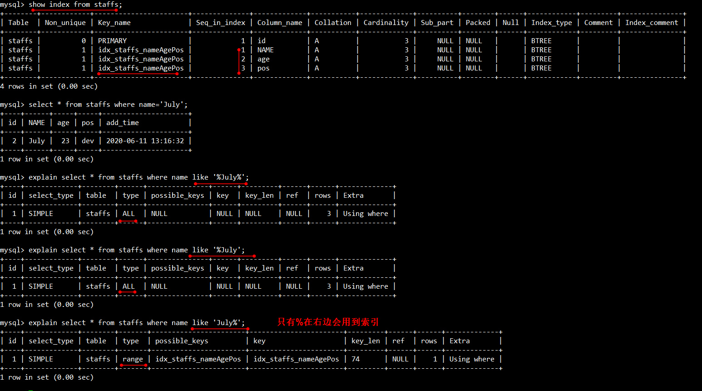
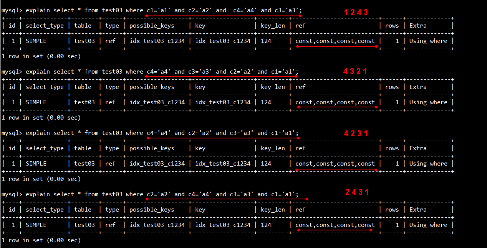

# 一、mysql的架构介绍

## 1.1 Mysql简介

### 1.1.1）高级MySQL

1. mysql内核
2. sql优化工程师
3. mysql服务器的优化
4. 查询语句优化
5. 主从复制
6. 软硬件升级
7. 容灾备份
8. sql编程

## 1.2）MysqlLinux版本的安装--mysql5.5

### 1.2.1）下载地址

下载地址:https://dev.mysql.com/downloads/mysql/

国内镜像地址：https://mirrors.tuna.tsinghua.edu.cn/mysql/downloads/MySQL-5.5/

### 1.2.2）检查当前系统是否安装过mysql/mariadb

- 可以用 `rpm -qa|grep mysql`看当前的系统进程，如果有mysql服务的就会显示的，删除已安装的和下面的类似，`rpm -e --nodeps  xxxx`
- 检查 mariadb


```shell
[root@localhost opt]# rpm -qa|grep mariadb
[root@localhost opt]# rpm -e --nodeps  mariadb-libs-5.5.52-1.el7.x86_64
[root@localhost opt]# rpm -qa|grep mariadb
[root@localhost opt]# ll
```

### 1.2.3）安装mysql服务端(注意提示)

1. 将 rpm 安装包拷贝到 opt 目录下


2. 在安装目录下执行 rpm 安装

   - 安装server

   

   ```shell
   [root@localhost opt]# rpm -ivh MySQL-server-5.5.48-1.linux2.6.x86_64.rpm  --force --nodeps
   
   #####提示可以修改密码
   /usr/bin/mysqladmin -u root password 'new-password'
   /usr/bin/mysqladmin -u root -h localhost.localdomain password 'new-password'
   ```

   ### 1.2.3）安装mysql客户端

   

   ```shell
   [root@localhost opt]# rpm -ivh MySQL-client-5.5.48-1.linux2.6.x86_64.rpm --force --nodeps
   ```

   ### 1.2.4）查看Mysql安装时创建的mysql用户和mysql组


```shell
[root@localhost opt]# cat /etc/passwd|grep mysql
[root@localhost opt]# cat /etc/group|grep mysql
[root@localhost opt]# mysqladmin --version
```

### 1.2.4）mysql服务的启+停

- 启动


```shell
[root@localhost opt]# service mysql start
[root@localhost opt]# ps -ef | grep mysql
```

- 停止


```shell
[root@localhost opt]# service mysql stop
[root@localhost opt]# ps -ef | grep mysql
```

### 1.2.5）mysql服务启动后开始连接

#### 1.2.5.1）首次连接成功

**注意这里,**因为mysql默认没有密码,所以这里我们没有输入密码就直接连上了


```shell
[root@localhost opt]# mysql
```

#### 1.2.5.2）按照安装server中的提示修改登录密码


```shell
[root@localhost opt]# /usr/bin/mysqladmin -u root password '123456'
[root@localhost opt]# mysql
[root@localhost opt]# mysql -uroot -p
```

### 1.2.6）自启动mysql服务


```shell
[root@localhost opt]# chkconfig mysql on
[root@localhost opt]# chkconfig --list| grep mysql
```

### 1.2.7）修改配置文件位置


```shell
[root@localhost mysql]# cp /usr/share/mysql/my-huge.cnf /etc/my.cnf
```

重启mysql


```shell
[root@localhost mysql]# service mysql stop
[root@localhost mysql]# service mysql start
```

### 1.2.8）修改字符集

1. 准备工作

创建一个数据库，并创建一张表，插入数据，查看数据（会乱码）

```mysql
CREATE database mydb;
use mydb;
CREATE table mytable(id int,name varchar(30));
insert into mytable(id,name) values (1,'jack');
insert into mytable(id,name) values (2,'张三');
select * from mytable;
```


1. 查看字符集

   

```mysql
mysql> show variables like 'character%';
mysql> show variables like '%char%';
```

2. 修改的地方汇总（标红的地方）


2. 1按照上图修改的地方进行在 `vim /etc/my.cnf`文件中修改


```shell
[root@localhost etc]# vim /etc/my.cnf
###修改的内容为：
[client]
default-character-set=utf8
[mysqld]
character_set_server=utf8
character_set_client=utf8
collation-server=utf8_general_ci
[mysql]
default-character-set=utf8
```

2. 2重启mysql


2. 3重新连接mysql后，重新`CREATE database`建库，并使用新库，建新表试试字符集


```mysql
CREATE database mydb2;
use mydb2;
CREATE table mytable2(id int,name varchar(30));
insert into mytable2(id,name) values (1,'张三');
select * from mytable2;
```

备注：

- （1）修改已创建库、表字符集
  修改数据库的字符集
  `mysql> alter datbase mydb charcter set 'uf8';`
  修改数据表的字符集
  `mysql> alter table mytbl converto charcter set 'uf8';`
- （2）**修改已经乱码数据**
  **无论是修改 mysql 配置文件或是修改库、表字符集，都无法改变已经变成乱码的数据。**
  **只能删除数据重新插入或更新数据才可以完全解决**

### 1.2.9）设置大小写不敏感

①查看大小写是否敏感：`show variables like '%lower_case_names%';`

windows系统默认大小写是不敏感的，**但是linux默认大小写是敏感的**

```mysql
mysql> show variables like '%lower_case_table_names%';
+------------------------+-------+
| Variable_name          | Value |
+------------------------+-------+
| lower_case_table_names | 0     |
+------------------------+-------+
1 row in set (0.00 sec)

```

②设置大小写不敏感：在` /etc/my.cnf` 这个配置文件 `[mysqld]` 中加入 `lower_case_table_names = 1 `，然后重启服务器


```mysql
lower_case_table_names = 1
```

| 属性设置 | 描述                                                         |
| -------- | ------------------------------------------------------------ |
| 0        | 大小写敏感                                                   |
| 1        | 大小写不敏感。创建的表，数据库都是以小写形式存放在磁盘上，对于 sql 语句都是转换为<br/>小写对表和 DB 进行查找 |
| 2        | 创建的表和 DB 依据语句上格式存放，凡是查找都是转换为小写进行 |

**注意：注意：如果要设置属性为大小写不敏感，要在重启数据库实例之前就需要将原来的数据库和表转换为小写，否则将找不到数据库名。在进行数据库参数设置之前，需要掌握这个参数带来的影响，切不可盲目设置。**


### 1.2.10）Mysql的安装位置，在linux下查看安装目录 `ps -ef|grep mysql`

在 使用`ps -ef|grep mysql`命令后 ,可以看到   --datadir=/var/lib/mysql 数据库的存放路径

| 路径              | 解释                      | 备注                       |
| ----------------- | ------------------------- | -------------------------- |
| /var/lib/mysql/   | mysql数据库文件的存放路径 |                            |
| /usr/share/mysql  | 配置文件目录              | mysql.server命令及配置文件 |
| /usr/bin          | 相关命令目录              | mysqladmin mysqldump等命令 |
| /etc/init.d/mysql | 启停相关脚本              |                            |


```shell
[root@localhost mysql]# ps -ef | grep mysql
```

## 1.3）Mysql配置文件   

**主要配置文件：**

- **二进制日志log-bin**


- **错误日志log-error**

  **默认是关闭的**,记录严重的警告和错误信息,每次启动和关闭的详细信息等.

- **查询日志log**

  **默认关闭**,记录查询的sql语句，如果开启会减低mysql的整体性能，因为记录日志也是需要消耗系统资源的

- **数据文件**

  - 两系统
    - windows：`D:\ProgramFiles\MySQL\MySQLServer5.5\data`目录下可以挑选很多库
    - linux：默认路径：`/var/lib/mysql`

  - **frm文件：存放表结构**

  - **myd文件：存放表数据**
  - **myi文件：存放表索引**

- **如何配置**
  - windows：my.ini文件
  - Linux：/etc/my.cnf文件

## 1.4）Mysql逻辑架构介绍

### 1.4.1）总体概览

和其它数据库相比，MySQL有点与众不同，它的架构可以在多种不同场景中应用并发挥良好作用。**主要体现在存储引擎的架构上，插件式的存储引擎架构将查询处理和其它的系统任务以及数据的存储提取相分离。**这种架构可以根据业务的需求和实际需要选择合适的存储引擎。


1. 连接层
   最上层是一些客户端和连接服务，包含本地sock通信和大多数基于客户端/服务端工具实现的类似于tcp/ip的通信。主要完成一些类似于连接处理、授权认证、及相关的安全方案。在该层上引入了线程池的概念，为通过认证安全接入的客户端提供线程。同样在该层上可以实现基于SSL的安全链接。服务器也会为安全接入的每个客户端验证它所具有的操作权限。

2. 服务层
   第二层架构主要完成大多数的核心服务功能，如SQL接口，并完成缓存的查询，SQL的分析和优化及部分内置函数的执行。所有跨存储引擎的功能也在这一层实现，如过程、函数等。在该层，服务器会解析查询并创建相应的内部解析树，并对其完成相应的优化，如确定查询表的顺序，是否利用索引等，最后生成相应的执行操作。如果是select语句，服务器还会查询内部的缓存。如果缓存空间足够大，这样在解决大量读操作的环境中能够很好的提升系统的性能。

3. 引擎层
   存储引擎层，存储引擎真正的负责了MySQL中数据的存储和提取，服务器通过APl与存储引擎进行通信。不同的存储引擎具有的功能不同，这样我们可以根据自己的实际需要进行选取。后面介绍MyISAM和InnoDB

4. 存储层
   数据存储层，主要是将数据存储在运行于裸设备的文件系统之上，并完成与存储引擎的交互。

| Connectors                       | 指的是不同语言中与SQL的交互                                  |
| -------------------------------- | ------------------------------------------------------------ |
| Management Serveices & Utilities | 系统管理和控制工具                                           |
| Connection Pool                  | 连接池管理缓冲用户连接，线程处理等需要缓存的需求。负责监听对 MySQL Server 的各种请求，接收连接请求，转发所有连接请求到线程管理模块。每一个连接上 MySQL Server 的客户端请求都会被分配（或创建）一个连接线程为其单独服务。而连接线程的主要工作就是负责 MySQL Server 与客户端的通信，接受客户端的命令请求，传递 Server 端的结果信息等。线程管理模块则负责管理维护这些连接线程。包括线程的创建，线程的 cache 等。 |
| SQL Interface                    | SQL接口。接受用户的SQL命令，并且返回用户需要查询的结果。比如select from就是调用SQL Interface |
| Parser                           | 解析器。SQL命令传递到解析器的时候会被解析器验证和解析。解析器是由Lex和YACC实现的，是一个很长的脚本。在 MySQL中我们习惯将所有 Client 端发送给 Server 端的命令都称为 query ，在 MySQL Server 里面，连接线程接收到客户端的一个 Query 后，会直接将该 query 传递给专门负责将各种 Query 进行分类然后转发给各个对应的处理模块。主要功能：<br/> a . 将SQL语句进行语义和语法的分析，分解成数据结构，然后按照不同的操作类型进行分类，然后做出针对性的转发到后续步骤，以后SQL语句的传递和处理就是基于这个结构的。<br/> b.  如果在分解构成中遇到错误，那么就说明这个sql语句是不合理的 |
| Optimizer                        | 查询优化器。SQL语句在查询之前会使用查询优化器对查询进行优化。就是优化客户端请求的 query（sql语句） ，根据客户端请求的 query 语句，和数据库中的一些统计信息，在一系列算法的基础上进行分析，得出一个最优的策略，告诉后面的程序如何取得这个 query 语句的结果他使用的是“选取-投影-联接”策略进行查询。 <br/> 用一个例子就可以理解： select uid,name from user where gender = 1;       这个select 查询先根据where 语句进行选取，而不是先将表全部查询出来以后再进行gender过滤       这个select查询先根据uid和name进行属性投影，而不是将属性全部取出以后再进行过滤       将这两个查询条件联接起来生成最终查询结果 |
| Cache和Buffer                    | 查询缓存。他的主要功能是将客户端提交 给MySQL 的 Select 类 query 请求的返回结果集 cache 到内存中，与该 query 的一个 hash 值 做一个对应。该 Query 所取数据的基表发生任何数据的变化之后， MySQL 会自动使该 query 的Cache 失效。在读写比例非常高的应用系统中， Query Cache 对性能的提高是非常显著的。当然它对内存的消耗也是非常大的。如果查询缓存有命中的查询结果，查询语句就可以直接去查询缓存中取数据。这个缓存机制是由一系列小缓存组成的。比如表缓存，记录缓存，key缓存，权限缓存等 |
| 优点                             | 存储引擎接口模块可以说是 MySQL 数据库中最有特色的一点了。目前各种数据库产品中，基本上只有 MySQL 可以实现其底层数据存储引擎的插件式管理。这个模块实际上只是 一个抽象类，但正是因为它成功地将各种数据处理高度抽象化，才成就了今天 MySQL 可插拔存储引擎的特色。<br/>从图2还可以看出，MySQL区别于其他数据库的最重要的特点就是其插件式的表存储引擎。MySQL插件式的存储引擎架构提供了一系列标准的管理和服务支持，这些标准与存储引擎本身无关，可能是每个数据库系统本身都必需的，如SQL分析器和优化器等，而存储引擎是底层物理结构的实现，每个存储引擎开发者都可以按照自己的意愿来进行开发。    注意：**存储引擎是基于表的，而不是数据库。** |

## 1.5）Mysql存储引擎

### 1.5.1）查看命令

查看mysql支持的引擎


查看mysql现在使用的是什么引擎


```mysql
mysql> show engines;
mysql> show variables like '%storage_engine%';
```

### 1.5.2）MyISAM和InnoDB

| 对比项   | MyISAM                                                   | InnoDB不支持                                                 |
| -------- | -------------------------------------------------------- | ------------------------------------------------------------ |
| 主外键   | 不支持                                                   | 支持                                                         |
| 事务     | 不支持                                                   | 支持                                                         |
| 行表锁   | 表锁，即使操作一条记录也会锁住整个表，不适合高并发的操作 | 行锁，操作时只锁某一行，不对其他行有影响，适合高并发操作     |
| 缓存     | 只缓存索引，不缓存真实数据                               | 不仅缓存索引还要缓存真实数据，对内存要求较高，而且内存大小对性能有决定性的影响 |
| 表空间   | 小                                                       | 大                                                           |
| 关注点   | 性能                                                     | 事务                                                         |
| 默认安装 | Y                                                        | Y                                                            |

# 二、索引优化分析

## 2.1）性能下降SQL慢 -执行时间长 -等待时间长

- 查询语句写的烂
- 索引失效
  - 单值
  - 复合

- 关联查询太多join(设计缺陷或不得已的需求)
- 服务器调优及各个参数设置(缓冲\线程数等)

## 2.2）常见通用的join查询

### 2.2.1）SQL执行顺序

- 手写

```mysql
SELECT DISTINCT
<select_list>
FROM
<left_table><join_type>
JOIN<right_table>ON<join_condition>
WHERE
<where_condition>
GROUP BY
<group_by_list>
HAVING
<having_condition>
ORDER BY
<order_by_condition>
LIMIT<limit_number>
```

- 机读

```mysql
FROM <left_table>
ON <join_condition>
<join_type> JOIN <right_table>
WHERE <where_condition>
GROUP BY <group_by_list>
HAVING <having_condition>
SELECT 
DISTINCT <select_list>
ORDER BY <order_by_condition>
LIMIT<limit_number>
```

- 总结


### 2.2.2）Join图


### 2.2.3）建表SQL

```mysql
CREATE TABLE `tbl_dept` (
`id` INT(11) NOT NULL AUTO_INCREMENT,
`deptName` VARCHAR(30) DEFAULT NULL,
`locAdd` VARCHAR(40) DEFAULT NULL,
PRIMARY KEY (`id`)
) ENGINE=INNODB AUTO_INCREMENT=1 DEFAULT CHARSET=utf8;

CREATE TABLE `tbl_emp` (
`id` INT(11) NOT NULL AUTO_INCREMENT,
`name` VARCHAR(20) DEFAULT NULL,
`deptId` INT(11) DEFAULT NULL, 
PRIMARY KEY (`id`),
KEY `fk_dept_id` (`deptId`)
#CONSTRAINT `fk_dept_jid` FOREIGN KEY (`deptId`) REFERENCES `tbl_dept` (`id`)
) ENGINE=INNODB AUTO_INCREMENT=1 DEFAULT CHARSET=utf8;

INSERT INTO tbl_dept(deptName,locAdd) VALUES('RD',11);
INSERT INTO tbl_dept(deptName,locAdd) VALUES('HR',12);
INSERT INTO tbl_dept(deptName,locAdd) VALUES('MK',13);
INSERT INTO tbl_dept(deptName,locAdd) VALUES('MIS',14);
INSERT INTO tbl_dept(deptName,locAdd) VALUES('FD',15);

INSERT INTO tbl_emp(NAME ,deptId) VALUES('z3',1);
INSERT INTO tbl_emp(NAME,deptId) VALUES('z4',1);
INSERT INTO tbl_emp(NAME ,deptId) VALUES('z5',1);
INSERT INTO tbl_emp(NAME ,deptId) VALUES('w5',2);
INSERT INTO tbl_emp(NAME,deptId) VALUES('w6',2);
INSERT INTO tbl_emp(NAME,deptId) VALUES('s7',3);
INSERT INTO tbl_emp(NAME,deptId) VALUES('s8',4);
INSERT INTO tbl_emp(NAME,deptId) VALUES('s9',51 );


INSERT INTO tbl_dept(deptName,locAdd) VALUES('BSR',250);
INSERT INTO tbl_emp(NAME,deptId) VALUES('wgk',999);
```

### 2.2.4）7种Join

**准备工作**

```mysql
mysql> select * from tbl_emp;
+----+------+--------+
| id | name | deptId |
+----+------+--------+
|  1 | z3   |      1 |
|  2 | z4   |      1 |
|  3 | z5   |      1 |
|  4 | w5   |      2 |
|  5 | w6   |      2 |
|  6 | s7   |      3 |
|  7 | s8   |      4 |
|  8 | s9   |     51 |
+----+------+--------+
8 rows in set (0.00 sec)
mysql> select * from tbl_dept;
+----+----------+--------+
| id | deptName | locAdd |
+----+----------+--------+
|  1 | RD       | 11     |
|  2 | HR       | 12     |
|  3 | MK       | 13     |
|  4 | MIS      | 14     |
|  5 | FD       | 15     |
+----+----------+--------+
5 rows in set (0.00 sec)
```


1. 内连接`inner join` 

```mysql
mysql> select * from tbl_emp a inner join tbl_dept b on a.deptId=b.id;
+----+------+--------+----+----------+--------+
| id | name | deptId | id | deptName | locAdd |
+----+------+--------+----+----------+--------+
|  1 | z3   |      1 |  1 | RD       | 11     |
|  2 | z4   |      1 |  1 | RD       | 11     |
|  3 | z5   |      1 |  1 | RD       | 11     |
|  4 | w5   |      2 |  2 | HR       | 12     |
|  5 | w6   |      2 |  2 | HR       | 12     |
|  6 | s7   |      3 |  3 | MK       | 13     |
|  7 | s8   |      4 |  4 | MIS      | 14     |
+----+------+--------+----+----------+--------+
7 rows in set (0.00 sec)
```

2. 左连接 `left join`

```mysql
mysql> select * from tbl_emp a left join tbl_dept b on a.deptId=b.id;
+----+------+--------+------+----------+--------+
| id | name | deptId | id   | deptName | locAdd |
+----+------+--------+------+----------+--------+
|  1 | z3   |      1 |    1 | RD       | 11     |
|  2 | z4   |      1 |    1 | RD       | 11     |
|  3 | z5   |      1 |    1 | RD       | 11     |
|  4 | w5   |      2 |    2 | HR       | 12     |
|  5 | w6   |      2 |    2 | HR       | 12     |
|  6 | s7   |      3 |    3 | MK       | 13     |
|  7 | s8   |      4 |    4 | MIS      | 14     |
|  8 | s9   |     51 | NULL | NULL     | NULL   |
+----+------+--------+------+----------+--------+
8 rows in set (0.00 sec)
```

3. 右连接 `right join`

```mysql
mysql> select * from tbl_emp a right join tbl_dept b on a.deptId=b.id;
+------+------+--------+----+----------+--------+
| id   | name | deptId | id | deptName | locAdd |
+------+------+--------+----+----------+--------+
|    1 | z3   |      1 |  1 | RD       | 11     |
|    2 | z4   |      1 |  1 | RD       | 11     |
|    3 | z5   |      1 |  1 | RD       | 11     |
|    4 | w5   |      2 |  2 | HR       | 12     |
|    5 | w6   |      2 |  2 | HR       | 12     |
|    6 | s7   |      3 |  3 | MK       | 13     |
|    7 | s8   |      4 |  4 | MIS      | 14     |
| NULL | NULL |   NULL |  5 | FD       | 15     |
+------+------+--------+----+----------+--------+
8 rows in set (0.00 sec)
```

4. a 表中独享的数据

```mysql
mysql> select * from tbl_emp a left join tbl_dept b on a.deptId=b.id where b.id is null;
+----+------+--------+------+----------+--------+
| id | name | deptId | id   | deptName | locAdd |
+----+------+--------+------+----------+--------+
|  8 | s9   |     51 | NULL | NULL     | NULL   |
+----+------+--------+------+----------+--------+
1 row in set (0.00 sec)
```

5. b 表中独享的数据

```mysql
mysql> select * from tbl_emp a right join tbl_dept b on a.deptId=b.id where a.deptId is null;
+------+------+--------+----+----------+--------+
| id   | name | deptId | id | deptName | locAdd |
+------+------+--------+----+----------+--------+
| NULL | NULL |   NULL |  5 | FD       | 15     |
+------+------+--------+----+----------+--------+
1 row in set (0.00 sec)
```

6. `full outer join` MySql不支持，可以使用下面的替代倒数第二种情况

```mysql
mysql> select * from tbl_emp a left join tbl_dept b on a.deptId=b.id
    -> union
    -> select * from tbl_emp a right join tbl_dept b on a.deptId=b.id;
+------+------+--------+------+----------+--------+
| id   | name | deptId | id   | deptName | locAdd |
+------+------+--------+------+----------+--------+
|    1 | z3   |      1 |    1 | RD       | 11     |
|    2 | z4   |      1 |    1 | RD       | 11     |
|    3 | z5   |      1 |    1 | RD       | 11     |
|    4 | w5   |      2 |    2 | HR       | 12     |
|    5 | w6   |      2 |    2 | HR       | 12     |
|    6 | s7   |      3 |    3 | MK       | 13     |
|    7 | s8   |      4 |    4 | MIS      | 14     |
|    8 | s9   |     51 | NULL | NULL     | NULL   |
| NULL | NULL |   NULL |    5 | FD       | 15     |
+------+------+--------+------+----------+--------+
9 rows in set (0.00 sec)
```

7. `full outer join` MySql不支持，可以使用下面的替代倒数第一种情况

```mysql
mysql> select * from tbl_emp a left join tbl_dept b on a.deptId=b.id where b.id is null 
    -> union
    -> select * from tbl_emp a right join tbl_dept b on a.deptId=b.id where a.deptId is null;
+------+------+--------+------+----------+--------+
| id   | name | deptId | id   | deptName | locAdd |
+------+------+--------+------+----------+--------+
|    8 | s9   |     51 | NULL | NULL     | NULL   |
| NULL | NULL |   NULL |    5 | FD       | 15     |
+------+------+--------+------+----------+--------+
2 rows in set (0.00 sec)
```

## 2.3）索引简介

### 2.3.1）是什么

- MySQL官方对索引的定义为：索引(Index)是帮助MySQL高效获取数据的数据结构。
  可以得到索引的本质：**索引是数据结构**

- 你可以简单理解为"**排好序的快速查找数据结构**"。

  - **详解**

  在数据之外，数据库系统还维护着满足特定查找算法的数据结构，这些数据结构以某种方式引用（指向）数据，这样就可以在这些数据结构上实现高级查找算法。这种数据结构，就是索引。下图就是一种可能的索引方式示例：

  

  为了加快Col2的查找，可以维护一个右边所示的二叉查找树，每个节点分别包含索引键值和一个指向对应数据记录物理地址的指针，这样就可以运用二又查找在一定的复杂度内获取到相应数据，从而快速的检索出符合条件的记录。

  - 结论

  **数据本身之外,数据库还维护着一个满足特定查找算法的数据结构，这些数据结构以某种方式指向数据，**
  **这样就可以在这些数据结构的基础上实现高级查找算法,这种数据结构就是索引。**

- 一般来说**索引本身也很大**，不可能全部存储在内存中，**因此索引往往以文件形式存储在硬盘上**

- **我们平时所说的索引，如果没有特别指明，都是指B树(多路搜索树，并不一定是二叉树)结构组织的索引。其中聚集索引，次要索引，覆盖索引，复合索引，前缀索引，唯一索引默认都是使用B+树索引，统称索引。当然,除了B+树这种类型的索引之外，还有哈希索引(hash index)等。**

### 2.3.2）优势

- 类似大学图书馆建书目索引，提高数据检索效率，降低数据库的IO成本
- 通过索引列对数据进行排序，降低数据排序成本，降低了CPU的消耗

### 2.3.3）劣势

- 实际上索引也是一张表，该表保存了主键和索引字段，并指向实体表的记录,所以索引列也是要占用空间的

- 虽然索引大大提高了查询速度，同时却会降低更新表的速度,**如果对表INSERT,UPDATE和DELETE。**
  **因为更新表时，MySQL不仅要不存数据，还要保存一下索引文件每次更新添加了索引列的字段，**
  **都会调整因为更新所带来的键值变化后的索引信息**

- **索引只是提高效率的一个因素，如果你的MySQL有大数据量的表，就需要花时间研究建立优秀的索引，或优化查询语句**

### 2.3.4）mysql索引分类

- 单值索引

即一个索引只包含单个列，一个表可以有多个单列索引【建议一张表索引不要超过5个优先考虑复合索引】

- 唯一索引 

索引列的值必须唯一，但允许有空值

- 复合索引

即一个索引包含多个列

- 基本语法

1. 创建

- `CREATE [UNIQUE] INDEX  indexName ON mytable(columnname(length));`

如果是CHAR,VARCHAR类型，length可以小于字段实际长度；
如果是BLOB和TEXT类型，必须指定length。

- `ALTER mytable ADD [UNIQUE]  INDEX [indexName] ON(columnname(length));`

2. 删除

`DROP INDEX [indexName] ON mytable;`

3. 查看

`SHOW INDEX FROM table_name\G;`


4. 使用ALTER命令

四种方式来添加数据表的索引：

- `ALTER TABLE tbl_name ADD PRIMARY KEY（column_list）`：该语句添加一个主键，这意味着索引值必须是唯一的，且不能为NULL。
- `ALTER TABLE tbl_name ADD UNIQUE index_name（column_list）`；这条语句创建索引的值必须是唯一的（除了NULL外，NULL可能会出现多次）。
- `ALTER TABLE tbl_name ADD INDEX index_name（column_list）`：添加普通索引，索引值可出现多次。
- `ALTER TABLE tbl_name ADD FULLTEXT index_name（column_list）`，该语句指定了索引为FULLTEXT，用于全文索引。

### 2.3.5）mysql索引结构

#### 2.3.5.1）BTree索引


【初始化介绍】

一颗 b 树，浅蓝色的块我们称之为一个磁盘块，可以看到每个磁盘块包含几个数据项（深蓝色所示）和指针（黄色所示），如磁盘块 1 包含数据项 17 和 35，包含指针 P1、P2、P3，

P1 表示小于 17 的磁盘块，P2 表示在 17 和 35 之间的磁盘块，P3 表示大于 35 的磁盘块。
**真实的数据存在于叶子节点即 3、5、9、10、13、15、28、29、36、60、75、79、90、9。**
**非叶子节点只不存储真实的数据，只存储指引搜索方向的数据项，如 17、35 并不真实存在于数据表中。**

【查找过程】

如果要查找数据项 29，那么首先会把磁盘块 1 由磁盘加载到内存，此时发生一次 IO，在内存中用二分查找确定 29在 17 和 35 之间，锁定磁盘块 1 的 P2 指针，内存时间因为非常短（相比磁盘的 IO）可以忽略不计，通过磁盘块 1的 P2 指针的磁盘地址把磁盘块 3 由磁盘加载到内存，发生第二次 IO，29 在 26 和 30 之间，锁定磁盘块 3 的 P2 指针，通过指针加载磁盘块 8 到内存，发生第三次 IO，同时内存中做二分查找到 29，结束查询，总计三次 IO。

真实的情况是，3 层的 b+树可以表示上百万的数据，如果上百万的数据查找只需要三次 IO，性能提高将是巨大的，如果没有索引，每个数据项都要发生一次 IO，那么总共需要百万次的 IO，显然成本非常非常高。

#### 2.3.5.2）B+tree 索引

MySQL 使用的是 B+tree 索引。


B+Tree 与 B-Tree 的区别

1）B-树的关键字和记录是放在一起的，叶子节点可以看作外部节点，不包含任何信息；B+树的非叶子节点中只

有关键字和指向下一个节点的索引，记录只放在叶子节点中。

2）在 B-树中，越靠近根节点的记录查找时间越快，只要找到关键字即可确定记录的存在；而 B+树中每个记录
的查找时间基本是一样的，都需要从根节点走到叶子节点，而且在叶子节点中还要再比较关键字。从这个角度看 B- 树的性能好像要比 B+树好，而在实际应用中却是 B+树的性能要好些。因为 B+树的非叶子节点不存放实际的数据，这样每个节点可容纳的元素个数比 B-树多，树高比 B-树小，这样带来的好处是减少磁盘访问次数。尽管 B+树找到一个记录所需的比较次数要比 B-树多，但是一次磁盘访问的时间相当于成百上千次内存比较的时间，因此实际中B+树的性能可能还会好些，而且 B+树的叶子节点使用指针连接在一起，方便顺序遍历（例如查看一个目录下的所有文件，一个表中的所有记录等），这也是很多数据库和文件系统使用 B+树的缘故。


思考：为什么说 B+树比 B-树更适合实际应用中操作系统的文件索引和数据库索引？

- 1) B+树的磁盘读写代价更低

  B+树的内部结点并没有指向关键字具体信息的指针。因此其内部结点相对 B 树更小。如果把所有同一内部结点的关键字存放在同一盘块中，那么盘块所能容纳的关键字数量也越多。一次性读入内存中的需要查找的关键字也就越多。相对来说 IO 读写次数也就降低了。

- 2) B+树的查询效率更加稳定
  由于非终结点并不是最终指向文件内容的结点，而只是叶子结点中关键字的索引。所以任何关键字的查找必须
  走一条从根结点到叶子结点的路。所有关键字查询的路径长度相同，导致每一个数据的查询效率相当。

#### 2.3.5.3)Hash索引【了解】

#### 2.3.5.4)full-text全文索引【了解】

#### 2.3.5.5)R-Tree索引【了解】


### 2.3.6）哪些情况需要创建索引

1. 主键自动建立唯一索引
2. 频繁作为查询的条件的字段应该创建索引
3. 查询中与其他表关联的字段，外键关系建立索引
4. 频繁更新的字段不适合创建索引【因为每次更新不单单是更新了记录还会更新索引，加重IO负担】
5. Where条件里用不到的字段不创建索引
6. 单值/组合索引的选择问题，which？（在高并发下倾向创建组合索引）
7. 查询中排序的字段，排序字段若通过索引去访问将大大提高排序的速度
8. .查询中统计或者分组字段

### 2.3.7）哪些情况不要创建索引

1. 表记录太少
2. 经常增删改的表【如果对表INSERT,UPDATE和DELETE。
   因为更新表时，MySQL不仅要不存数据，还要保存一下索引文件每次更新添加了索引列的字段，
   都会调整因为更新所带来的键值变化后的索引信息】
3. 数据重复且分布平均的表字段，因此应该只为经常查询和经常排序的数据列建立索引。
   注意，如果某个数据列包含许多重复的内容，为它建立索引就没有太大的实际效果。

## 2.4）性能分析

### 2.4.1）MySQL Query Optimizer

1. Mysql中有专门负责优化SELECT语句的优化器模块，主要功能：通过计算分析系统中收集到的统计信息，为客户端请求的Query提供他认为最优的执行计划（他认为最优的数据检索方式，但不见得是DBA认为是最优的，这部分最耗费时间）
2. 当客户端向MySQL 请求一条Query，命令解析器模块完成请求分类，区别出是SELECT 并转发给MySQL Query Optimizer时，MySQL Query Optimizer 首先会对整条Query进行优化，处理掉一些常量表达式的预算，直接换算成常量值。并对Query中的查询条件进行简化和转换，如去掉一些无用或显而易见的条件、结构调整等。然后分析Query中的Hint信息（如果有），看显示Hint信息是否可以完全确定该Query的执行计划。如果没有Hint 或Hint 信息还不足以完全确定执行计划，则会读取所涉及对象的统计信息，根据Query进行写相应的计算分析，然后再得出最后的执行计划。

### 2.4.2）MySQL常见瓶颈

1. CPU:CPU在饱和的时候一般发生在数据装入在内存或从磁盘上读取数据时候
2. IO:磁盘I/O瓶颈发生在装入数据远大于内存容量时
3. 服务器硬件的性能瓶颈：top,free,iostat和vmstat来查看系统的性能状态

### 2.4.3）Explain

#### 2.4.3.1）是什么（查看执行计划）

- 使用EXPLAIN关键字可以模拟优化器执行SQL语句，从而知道MySQL是
  如何处理你的SQL语句的。分析你的查询语句或是结构的性能瓶颈
- 官网介绍：https://dev.mysql.com/doc/refman/8.0/en/explain-output.html

#### 2.4.3.2）能干嘛

1. 表的读取顺序
2. 数据读取操作的操作类型
3. 哪些索引可以使用
4. 哪些索引被实际使用
5. 表之间的引用
6. 每张表有多少行被优化器查询

#### 2.4.3.3）怎么用

- 用法： Explain+SQL 语句。

- 执行计划包含的信息（Explain 执行后返回的信息）


#### 2.4.3.4）各个字段解释

##### ① id

selct 查询的序列号,包含一组数字，表示查询中执行 select 子句或操作表的顺序。

**三种情况**

- 1.**id相同，执行顺序由上至下**


- 2.**id不同，如果是子查询，id的序号会递增，id值越大优先级越高，越先被执行**


- 3.**有相同也有不同**


**关注点：id 号每个号码，表示一趟独立的查询。一个 sql 的查询趟数越少越好。**


##### ②select_type

**selct_ype 代表查询的类型，主要是用于区别普通查询、联合查询、子查询等的复杂查询**


**标出来的为常见6个**

| selct_ype 属性      | 含义                                                         |
| ------------------- | ------------------------------------------------------------ |
| **SIMPLE**          | 简单的 select 查询,查询中不包含子查询或者 UNION              |
| **PRIMARY**         | 查询中若包含任何复杂的子部分，最外层查询则被标记为 Primary   |
| **SUBQUERY**        | 在SELECT或WHERE列表中包含了子查询                            |
| **DERIVED**         | 在 FROM 列表中包含的子查询被标记为 DERIVED(衍生)<br/>MySQL 会递归执行这些子查询, 把结果放在临时表里 |
| **UNION**           | 若第二个SELECT出现在UNION之后，则被标记为UNION；<br/>若UNION包含在FROM子句的子查询中,外层SELECT将被标记为：DERIVED |
| **UNION RESULT**    | 从UNION表获取结果的SELECT                                    |
| DEPDENT SUBQUERY    | 在SELECT或WHERE列表中包含了子查询,子查询基于外层             |
| UNCAHEABLE SUBQUERY | 无法使用缓存的子查询                                         |

##### ③table

这个数据是基于哪张表的。

##### ④type


- **访问类型排列**

type 是查询的访问类型。是较为重要的一个指标，结果值从最好到最坏依次是：

`sytem > const > eq_ref > ref >ultex > ref_ornul > index_merg > unique_subquery > index_subquery > range > index >All` ，一般来说，得保证查询至少达到 range 级别，最好能达到 ref。

- **常见的为：**    

显示查询使用了何种类型    
从最好到最差依次是：   
`system>const>eq_ref>ref>range>index>ALL`

1.**sytem**

表只有一行记录（等于系统表），这是 const 类型的特列，平时不会出现，这个也可以忽略不计

2.**const**

表示通过**索引一次就找到了**,const 用于比较 primary key 或者 unique 索引。因为只匹配一行数据，所以很快
如将主键置于 wher 列表中，MySQL 就能将该查询转换为一个常量。


3. **eq_ref**

**唯一性索引扫描**，对于每个索引键，表中只有一条记录与之匹配。常见于主键或唯一索引扫描。


4. **ref**

非唯一性索引扫描，返回匹配某个单独值的所有行.**本质上也是一种索引访问**，它返回所有匹配某个单独值的行，
然而，**它可能会找到多个符合条件的行**，所以他应该属于查找和扫描的混合体。


5. **range**

只检索给定范围的行,**使用一个索引来选择行**。key 列显示使用了哪个索引一般就是在你的 where 语句中出现
了 `betwen、<、>、in` 等的查询这种范围扫描索引扫描比全表扫描要好，因为它只需要开始于索引的某一点，而
结束语另一点，不用扫描全部索引。


6. **index**

**Full Index Scan,index与ALL区别为index类型只遍历索引树。这通常比ALL快，因为索引文件通常比数据文件小。（也就是说虽然all和index都是读全表，但index是从索引中读取的，而all是从硬盘中读的）**


7. **all**

Ful Table Scan，将遍历全表以找到匹配的行。


##### ⑤possible_keys

显示可能应用在这张表中的索引，一个或多个。查询涉及到的字段上若存在索引，则该索引将被列出，**但不一**
**定被查询实际使用。**

##### ⑥key

- 实际使用的索引。如果为NULL，则没有使用索引。

- 查询中若使用了**覆盖索引**，则索引和查询的select字段重叠


##### ⑦key_len

- 表示索引中使用的字节数，可通过该列计算查询中使用的索引的长度。在不损失精确性的情况下，长度越短越好
- key_len显示的值为索引最大可能长度，并非实际使用长度，即key_len是根据表定义计算而得，不是通过表内检索出的


##### ⑧ref

显示索引那一列被使用了，如果可能的话，是一个常数。那些列或常量被用于查找索引列上的值


##### ⑨rows

根据表统计信息及索引选用情况，大致估算出找到所需的记录所需要读取的行数【越少越好】


##### ⑩Extra

包含不适合在其他列中显示但十分重要的额外信息

1. **Using filesort(危险)**

说明mysql会对数据使用一个外部的索引排序，而不是按照表内的索引顺序进行读取。
MySQL中无法利用索引完成排序操作成为“文件排序”。


2. **Using temporary(危险)**

使用了临时表保存中间结果，MySQL在对查询结果排序时使用临时表。常见于排序order by 和分组查询 group by


3. **USING index(很好)**

表示相应的select操作中使用了覆盖索引（Coveing Index）,避免访问了表的数据行，效率不错！

- 如果同时出现`using where`，表明索引被用来执行索引键值的**查找**；
- 如果没有同时出现`using where`，表面索引用来读取数据**而非执行查找动作**。


覆盖索引（Covering Index）


4. Using where

表明使用了where过滤

5. using join buffer

使用了连接缓存

6. impossible where

where子句的值总是false，不能用来获取任何元组,下面的例子是 查询的名称既是July，又是 z3 所以不可能出现既是July 又是 z3的记录，所以是 `impossible where`


7. select tables optimized away

在没有GROUPBY子句的情况下，基于索引优化MIN/MAX操作或者
对于MyISAM存储引擎优化COUNT(*)操作，不必等到执行阶段再进行计算，
查询执行计划生成的阶段即完成优化。

8. distinct

优化distinct，在找到第一匹配的元组后即停止找同样值的工作

#### 2.4.3.5）热身Case


## 2.5）索引优化

### 2.5.1）索引分析

#### ①单表

1. 建表SQL

```mysql
单表
CREATE TABLE IF NOT EXISTS `article`(
`id` INT(10) UNSIGNED NOT NULL PRIMARY KEY AUTO_INCREMENT,
`author_id` INT (10) UNSIGNED NOT NULL,
`category_id` INT(10) UNSIGNED NOT NULL , 
`views` INT(10) UNSIGNED NOT NULL , 
`comments` INT(10) UNSIGNED NOT NULL,
`title` VARBINARY(255) NOT NULL,
`content` TEXT NOT NULL
);
 
INSERT INTO `article`(`author_id`,`category_id` ,`views` ,`comments` ,`title` ,`content` )VALUES
(1,1,1,1,'1','1'),
(2,2,2,2,'2','2'),
(1,1,3,3,'3','3');
 
SELECT * FROM ARTICLE;
```

2. 案例


```mysql
mysql> CREATE TABLE IF NOT EXISTS `article`(
    -> `id` INT(10) UNSIGNED NOT NULL PRIMARY KEY AUTO_INCREMENT,
    -> `author_id` INT (10) UNSIGNED NOT NULL,
    -> `category_id` INT(10) UNSIGNED NOT NULL , 
    -> `views` INT(10) UNSIGNED NOT NULL , 
    -> `comments` INT(10) UNSIGNED NOT NULL,
    -> `title` VARBINARY(255) NOT NULL,
    -> `content` TEXT NOT NULL
    -> );
Query OK, 0 rows affected (0.01 sec)

mysql>  
mysql>  
mysql> INSERT INTO `article`(`author_id`,`category_id` ,`views` ,`comments` ,`title` ,`content` )VALUES
    -> (1,1,1,1,'1','1'),
    -> (2,2,2,2,'2','2'),
    -> (1,1,3,3,'3','3');
Query OK, 3 rows affected (0.00 sec)
Records: 3  Duplicates: 0  Warnings: 0
mysql> SELECT * FROM ARTICLE;
+----+-----------+-------------+-------+----------+-------+---------+
| id | author_id | category_id | views | comments | title | content |
+----+-----------+-------------+-------+----------+-------+---------+
|  1 |         1 |           1 |     1 |        1 | 1     | 1       |
|  2 |         2 |           2 |     2 |        2 | 2     | 2       |
|  3 |         1 |           1 |     3 |        3 | 3     | 3       |
+----+-----------+-------------+-------+----------+-------+---------+
mysql> select id,author_id from article where category_id=1 and comments > 1 order by views desc limit 1;
+----+-----------+
| id | author_id |
+----+-----------+
|  3 |         1 |
+----+-----------+
1 row in set (0.00 sec)
mysql> show index from article;
+---------+------------+----------+--------------+-------------+-----------+-------------+----------+--------+------+------------+---------+---------------+
| Table   | Non_unique | Key_name | Seq_in_index | Column_name | Collation | Cardinality | Sub_part | Packed | Null | Index_type | Comment | Index_comment |
+---------+------------+----------+--------------+-------------+-----------+-------------+----------+--------+------+------------+---------+---------------+
| article |          0 | PRIMARY  |            1 | id          | A         |           3 |     NULL | NULL   |      | BTREE      |         |               |
+---------+------------+----------+--------------+-------------+-----------+-------------+----------+--------+------+------------+---------+---------------+
1 row in set (0.00 sec)
mysql> explain select id,author_id from article where category_id=1 and comments > 1 order by views desc limit 1;
+----+-------------+---------+------+---------------+------+---------+------+------+-----------------------------+
| id | select_type | table   | type | possible_keys | key  | key_len | ref  | rows | Extra                       |
+----+-------------+---------+------+---------------+------+---------+------+------+-----------------------------+
|  1 | SIMPLE      | article | ALL  | NULL          | NULL | NULL    | NULL |    3 | Using where; Using filesort |
+----+-------------+---------+------+---------------+------+---------+------+------+-----------------------------+
1 row in set (0.00 sec)
mysql> create index idx_article_ccv on article(category_id,comments,views);
Query OK, 0 rows affected (0.02 sec)
Records: 0  Duplicates: 0  Warnings: 0

mysql> show index from article;
+---------+------------+-----------------+--------------+-------------+-----------+-------------+----------+--------+------+------------+---------+---------------+
| Table   | Non_unique | Key_name        | Seq_in_index | Column_name | Collation | Cardinality | Sub_part | Packed | Null | Index_type | Comment | Index_comment |
+---------+------------+-----------------+--------------+-------------+-----------+-------------+----------+--------+------+------------+---------+---------------+
| article |          0 | PRIMARY         |            1 | id          | A         |           3 |     NULL | NULL   |      | BTREE      |         |               |
| article |          1 | idx_article_ccv |            1 | category_id | A         |           3 |     NULL | NULL   |      | BTREE      |         |               |
| article |          1 | idx_article_ccv |            2 | comments    | A         |           3 |     NULL | NULL   |      | BTREE      |         |               |
| article |          1 | idx_article_ccv |            3 | views       | A         |           3 |     NULL | NULL   |      | BTREE      |         |               |
+---------+------------+-----------------+--------------+-------------+-----------+-------------+----------+--------+------+------------+---------+---------------+
4 rows in set (0.00 sec)
mysql> explain select id,author_id from article where category_id=1 and comments > 1 order by views desc limit 1;
+----+-------------+---------+-------+-----------------+-----------------+---------+------+------+-----------------------------+
| id | select_type | table   | type  | possible_keys   | key             | key_len | ref  | rows | Extra                       |
+----+-------------+---------+-------+-----------------+-----------------+---------+------+------+-----------------------------+
|  1 | SIMPLE      | article | range | idx_article_ccv | idx_article_ccv | 8       | NULL |    1 | Using where; Using filesort |
+----+-------------+---------+-------+-----------------+-----------------+---------+------+------+-----------------------------+
1 row in set (0.00 sec)

mysql> explain select id,author_id from article where category_id=1 and comments = 1 order by views desc limit 1;
+----+-------------+---------+------+-----------------+-----------------+---------+-------------+------+-------------+
| id | select_type | table   | type | possible_keys   | key             | key_len | ref         | rows | Extra       |
+----+-------------+---------+------+-----------------+-----------------+---------+-------------+------+-------------+
|  1 | SIMPLE      | article | ref  | idx_article_ccv | idx_article_ccv | 8       | const,const |    1 | Using where |
+----+-------------+---------+------+-----------------+-----------------+---------+-------------+------+-------------+
1 row in set (0.00 sec)
mysql> drop index idx_article_ccv on article;
Query OK, 0 rows affected (0.01 sec)
Records: 0  Duplicates: 0  Warnings: 0

mysql> explain select id,author_id from article where category_id=1 and comments = 1 order by views desc limit 1;
+----+-------------+---------+------+---------------+------+---------+------+------+-----------------------------+
| id | select_type | table   | type | possible_keys | key  | key_len | ref  | rows | Extra                       |
+----+-------------+---------+------+---------------+------+---------+------+------+-----------------------------+
|  1 | SIMPLE      | article | ALL  | NULL          | NULL | NULL    | NULL |    3 | Using where; Using filesort |
+----+-------------+---------+------+---------------+------+---------+------+------+-----------------------------+
1 row in set (0.00 sec)
mysql> create index idx_article_cv on article(category_id,views);
Query OK, 0 rows affected (0.01 sec)
Records: 0  Duplicates: 0  Warnings: 0
mysql> show index from article;
+---------+------------+----------------+--------------+-------------+-----------+-------------+----------+--------+------+------------+---------+---------------+
| Table   | Non_unique | Key_name       | Seq_in_index | Column_name | Collation | Cardinality | Sub_part | Packed | Null | Index_type | Comment | Index_comment |
+---------+------------+----------------+--------------+-------------+-----------+-------------+----------+--------+------+------------+---------+---------------+
| article |          0 | PRIMARY        |            1 | id          | A         |           3 |     NULL | NULL   |      | BTREE      |         |               |
| article |          1 | idx_article_cv |            1 | category_id | A         |           3 |     NULL | NULL   |      | BTREE      |         |               |
| article |          1 | idx_article_cv |            2 | views       | A         |           3 |     NULL | NULL   |      | BTREE      |         |               |
+---------+------------+----------------+--------------+-------------+-----------+-------------+----------+--------+------+------------+---------+---------------+
3 rows in set (0.00 sec)
mysql> explain select id,author_id from article where category_id=1 and comments >1 order by views desc limit 1;
+----+-------------+---------+------+----------------+----------------+---------+-------+------+-------------+
| id | select_type | table   | type | possible_keys  | key            | key_len | ref   | rows | Extra       |
+----+-------------+---------+------+----------------+----------------+---------+-------+------+-------------+
|  1 | SIMPLE      | article | ref  | idx_article_cv | idx_article_cv | 4       | const |    2 | Using where |
+----+-------------+---------+------+----------------+----------------+---------+-------+------+-------------+
1 row in set (0.00 sec)
```

#### ②两表

1. 建表语句

```mysql
CREATE TABLE IF NOT EXISTS `class`(
`id` INT(10) UNSIGNED NOT NULL PRIMARY KEY AUTO_INCREMENT,
`card` INT (10) UNSIGNED NOT NULL
);
 
CREATE TABLE IF NOT EXISTS `book`(
`bookid` INT(10) UNSIGNED NOT NULL PRIMARY KEY AUTO_INCREMENT,
`card` INT (10) UNSIGNED NOT NULL
);
INSERT INTO class(card)VALUES(FLOOR(1+(RAND()*20)));
INSERT INTO class(card)VALUES(FLOOR(1+(RAND()*20)));
INSERT INTO class(card)VALUES(FLOOR(1+(RAND()*20)));
INSERT INTO class(card)VALUES(FLOOR(1+(RAND()*20)));
INSERT INTO class(card)VALUES(FLOOR(1+(RAND()*20)));
INSERT INTO class(card)VALUES(FLOOR(1+(RAND()*20)));
INSERT INTO class(card)VALUES(FLOOR(1+(RAND()*20)));
INSERT INTO class(card)VALUES(FLOOR(1+(RAND()*20)));
INSERT INTO class(card)VALUES(FLOOR(1+(RAND()*20)));
INSERT INTO class(card)VALUES(FLOOR(1+(RAND()*20)));
INSERT INTO class(card)VALUES(FLOOR(1+(RAND()*20)));
INSERT INTO class(card)VALUES(FLOOR(1+(RAND()*20)));
INSERT INTO class(card)VALUES(FLOOR(1+(RAND()*20)));
INSERT INTO class(card)VALUES(FLOOR(1+(RAND()*20)));
INSERT INTO class(card)VALUES(FLOOR(1+(RAND()*20)));
INSERT INTO class(card)VALUES(FLOOR(1+(RAND()*20)));
INSERT INTO class(card)VALUES(FLOOR(1+(RAND()*20)));
INSERT INTO class(card)VALUES(FLOOR(1+(RAND()*20)));
INSERT INTO class(card)VALUES(FLOOR(1+(RAND()*20)));
INSERT INTO class(card)VALUES(FLOOR(1+(RAND()*20)));
 
INSERT INTO book(card)VALUES(FLOOR(1+(RAND()*20)));
INSERT INTO book(card)VALUES(FLOOR(1+(RAND()*20)));
INSERT INTO book(card)VALUES(FLOOR(1+(RAND()*20)));
INSERT INTO book(card)VALUES(FLOOR(1+(RAND()*20)));
INSERT INTO book(card)VALUES(FLOOR(1+(RAND()*20)));
INSERT INTO book(card)VALUES(FLOOR(1+(RAND()*20)));
INSERT INTO book(card)VALUES(FLOOR(1+(RAND()*20)));
INSERT INTO book(card)VALUES(FLOOR(1+(RAND()*20)));
INSERT INTO book(card)VALUES(FLOOR(1+(RAND()*20)));
INSERT INTO book(card)VALUES(FLOOR(1+(RAND()*20)));
INSERT INTO book(card)VALUES(FLOOR(1+(RAND()*20)));
INSERT INTO book(card)VALUES(FLOOR(1+(RAND()*20)));
INSERT INTO book(card)VALUES(FLOOR(1+(RAND()*20)));
INSERT INTO book(card)VALUES(FLOOR(1+(RAND()*20)));
INSERT INTO book(card)VALUES(FLOOR(1+(RAND()*20)));
INSERT INTO book(card)VALUES(FLOOR(1+(RAND()*20)));
INSERT INTO book(card)VALUES(FLOOR(1+(RAND()*20)));
INSERT INTO book(card)VALUES(FLOOR(1+(RAND()*20)));
INSERT INTO book(card)VALUES(FLOOR(1+(RAND()*20)));
INSERT INTO book(card)VALUES(FLOOR(1+(RAND()*20)));
```

2. 案例

案例总结： 

1. 当使用`left  join `的时候，左侧的表会全表扫描，则索引要建在连接的右侧的表的哪个连接条件
2. 当使用`right join `的时候，右侧的表会被全表扫描，则索引要建在左侧的哪个表的连接条件

**总结就是：两表 进行 `left join /right join` 的时候，相应的索引要建在相反的表的连接条件。**

代码参考：

```mysql
mysql> explain select * from class left join book on class.card=book.card;
+----+-------------+-------+------+---------------+------+---------+------+------+-------+
| id | select_type | table | type | possible_keys | key  | key_len | ref  | rows | Extra |
+----+-------------+-------+------+---------------+------+---------+------+------+-------+
|  1 | SIMPLE      | class | ALL  | NULL          | NULL | NULL    | NULL |   20 |       |
|  1 | SIMPLE      | book  | ALL  | NULL          | NULL | NULL    | NULL |   20 |       |
+----+-------------+-------+------+---------------+------+---------+------+------+-------+
2 rows in set (0.00 sec)
mysql> alter table `book` add index Y (`card`);
Query OK, 0 rows affected (0.01 sec)
Records: 0  Duplicates: 0  Warnings: 0
mysql> explain select * from class left join book on class.card=book.card;
+----+-------------+-------+------+---------------+------+---------+-------------------+------+-------------+
| id | select_type | table | type | possible_keys | key  | key_len | ref               | rows | Extra       |
+----+-------------+-------+------+---------------+------+---------+-------------------+------+-------------+
|  1 | SIMPLE      | class | ALL  | NULL          | NULL | NULL    | NULL              |   20 |             |
|  1 | SIMPLE      | book  | ref  | Y             | Y    | 4       | db0629.class.card |    1 | Using index |
+----+-------------+-------+------+---------------+------+---------+-------------------+------+-------------+
2 rows in set (0.00 sec)
mysql> drop index Y on book;
```

#### ③三表

1.建表语句

**在上面两表的基础上再增加下面一个表**

```mysql
CREATE TABLE IF NOT EXISTS `phone`(
`phoneid` INT(10) UNSIGNED NOT NULL PRIMARY KEY AUTO_INCREMENT,
`card` INT (10) UNSIGNED NOT NULL
)ENGINE = INNODB;
INSERT INTO phone(card)VALUES(FLOOR(1+(RAND()*20)));
INSERT INTO phone(card)VALUES(FLOOR(1+(RAND()*20)));
INSERT INTO phone(card)VALUES(FLOOR(1+(RAND()*20)));
INSERT INTO phone(card)VALUES(FLOOR(1+(RAND()*20)));
INSERT INTO phone(card)VALUES(FLOOR(1+(RAND()*20)));
INSERT INTO phone(card)VALUES(FLOOR(1+(RAND()*20)));
INSERT INTO phone(card)VALUES(FLOOR(1+(RAND()*20)));
INSERT INTO phone(card)VALUES(FLOOR(1+(RAND()*20)));
INSERT INTO phone(card)VALUES(FLOOR(1+(RAND()*20)));
INSERT INTO phone(card)VALUES(FLOOR(1+(RAND()*20)));
INSERT INTO phone(card)VALUES(FLOOR(1+(RAND()*20)));
INSERT INTO phone(card)VALUES(FLOOR(1+(RAND()*20)));
INSERT INTO phone(card)VALUES(FLOOR(1+(RAND()*20)));
INSERT INTO phone(card)VALUES(FLOOR(1+(RAND()*20)));
INSERT INTO phone(card)VALUES(FLOOR(1+(RAND()*20)));
INSERT INTO phone(card)VALUES(FLOOR(1+(RAND()*20)));
INSERT INTO phone(card)VALUES(FLOOR(1+(RAND()*20)));
INSERT INTO phone(card)VALUES(FLOOR(1+(RAND()*20)));
INSERT INTO phone(card)VALUES(FLOOR(1+(RAND()*20)));
INSERT INTO phone(card)VALUES(FLOOR(1+(RAND()*20)));
```

2. 案例


```mysql
mysql> explain select * from class left join book on class.card=book.card left join phone on book.card=phone.card;
+----+-------------+-------+------+---------------+------+---------+------+------+-------+
| id | select_type | table | type | possible_keys | key  | key_len | ref  | rows | Extra |
+----+-------------+-------+------+---------------+------+---------+------+------+-------+
|  1 | SIMPLE      | class | ALL  | NULL          | NULL | NULL    | NULL |   20 |       |
|  1 | SIMPLE      | book  | ALL  | NULL          | NULL | NULL    | NULL |   20 |       |
|  1 | SIMPLE      | phone | ALL  | NULL          | NULL | NULL    | NULL |   20 |       |
+----+-------------+-------+------+---------------+------+---------+------+------+-------+
3 rows in set (0.00 sec)
mysql> alter table phone add index z(card);
Query OK, 0 rows affected (0.02 sec)
Records: 0  Duplicates: 0  Warnings: 0

mysql> alter table book add index Y(card);
Query OK, 0 rows affected (0.01 sec)
Records: 0  Duplicates: 0  Warnings: 0

mysql> explain select * from class left join book on class.card=book.card left join phone on book.card=phone.card;
+----+-------------+-------+------+---------------+------+---------+-------------------+------+-------------+
| id | select_type | table | type | possible_keys | key  | key_len | ref               | rows | Extra       |
+----+-------------+-------+------+---------------+------+---------+-------------------+------+-------------+
|  1 | SIMPLE      | class | ALL  | NULL          | NULL | NULL    | NULL              |   20 |             |
|  1 | SIMPLE      | book  | ref  | Y             | Y    | 4       | db0629.class.card |    1 | Using index |
|  1 | SIMPLE      | phone | ref  | z             | z    | 4       | db0629.book.card  |    1 | Using index |
+----+-------------+-------+------+---------------+------+---------+-------------------+------+-------------+
3 rows in set (0.00 sec)

mysql> 
```

### 2.5.2）索引失效（应该避免）

#### 2.5.2.1）建表SQL

```mysql
CREATE TABLE staffs(
id INT PRIMARY KEY AUTO_INCREMENT,
NAME VARCHAR(24) NOT NULL DEFAULT '' COMMENT '姓名',
age INT NOT NULL DEFAULT 0 COMMENT '年龄',
pos VARCHAR(20) NOT NULL DEFAULT '' COMMENT '职位',
add_time TIMESTAMP NOT NULL DEFAULT CURRENT_TIMESTAMP COMMENT '入职时间'
)CHARSET utf8 COMMENT '员工记录表';
 
INSERT INTO staffs(NAME,age,pos,add_time) VALUES('z3',22,'manager',NOW());
INSERT INTO staffs(NAME,age,pos,add_time) VALUES('July',23,'dev',NOW());
INSERT INTO staffs(NAME,age,pos,add_time) VALUES('2000',23,'dev',NOW());
 
SELECT * FROM staffs;
ALTER TABLE staffs ADD INDEX idx_staffs_nameAgePos(name,age,pos);
```

#### 2.5.2.2）案例（索引失效）

##### 1.全值匹配我最爱


##### 2.最佳左前缀法则【带头大哥不能死，中间兄弟不能断。】

如果索引了多列，**要遵守最左前缀法则**。指的是查询从索引的最左前列开始**并且不跳过索引中的列**。


##### 3.不在索引列上做任何操作（计算、函数、（自动or手动）类型转换），否则会导致索引失效而转向全表扫描


##### 4.存储引擎不能使用索引中范围条件右边的列


##### 5.尽量使用覆盖索引（只访问索引的查询（索引列和查询列一致）），减少`select*`


##### 6.mysql在使用不等于`（！=或者<>）`的时候无法使用索引会导致全表扫描


##### 7.`is null,is not null `也无法使用索引


##### 8.`like`以通配符开头`（'%abc...'）`mysql索引失效会变成全表扫描操作



**如何解决搜索条件`%abc%`失效的问题？解决like'%字符串%'索引不被使用的方法？？**

建表语句：

```mysql
CREATE TABLE tbl_user ( id INT(11) NOT NULL AUTO_INCREMENT, NAME VARCHAR(20) DEFAULT NULL, age INT(11) DEFAULT NULL,  email VARCHAR(20) DEFAULT NULL, PRIMARY KEY (id) ) ENGINE=INNODB AUTO_INCREMENT=1 DEFAULT CHARSET=utf8;

#drop table tbl_user 
INSERT INTO tbl_user(NAME, age, email) VALUES('1aa1',21,'b@163.com'); 
INSERT INTO tbl_user(NAME, age, email) VALUES('2aa2',222,'a@163.com');
INSERT INTO tbl_user(NAME, age, email) VALUES('3aa3',265,'c@163.com'); 
INSERT INTO tbl_user(NAME, age, email) VALUES('4aa4',21,'d@163.com');	
INSERT INTO tbl_user(NAME, age, email) VALUES('aa',121,'e@163.com');
#在建索引之前
select * from tbl_user;
explain select name,age from tbl_user where name like '%aa%';
explain select id from tbl_user where name like '%aa%';
explain select * from tbl_user where name like '%aa%';
explain select name from tbl_user where name like '%aa%';
explain select age from tbl_user where name like '%aa%';
explain select id,name from tbl_user where name like '%aa%';
explain select id,name,age from tbl_user where name like '%aa%';
explain select id,name,age,email from tbl_user where name like '%aa%';
#没建索引之前，全部都是全表扫描

######添加索引
create index idx_user_nameAge on tbl_user(name,age);
explain select name,age from tbl_user where name like '%aa%';
explain select id from tbl_user where name like '%aa%';
explain select name from tbl_user where name like '%aa%';
explain select age from tbl_user where name like '%aa%';
explain select id,name from tbl_user where name like '%aa%';
explain select id,name,age from tbl_user where name like '%aa%';
explain select name,age from tbl_user where name like '%aa%';
explain select * from tbl_user where name like '%aa%';
explain select id,name,age,email from tbl_user where name like '%aa%';

```


##### 9.字符串不加单引号索引失效


##### 10.少用or,用它连接时会索引失效


##### 11.小总结


`like KK%`相当于=常量    ` %KK`和`%KK%` 相当于范围

**【优化总结口决】**

全值匹配我最爱，最左前缀要遵守；

带头大哥不能死，中间兄弟不能断；

素引列上少计算，范围之后全失效；

LIKE百分写最右，覆盖素引不写星；

不等空值还有or，索引失效要少用；

VAR引号不可丢，SQL高级也不难！

### 2.5.6）试题讲解

#### 2.5.6.1）题目sql

```mysql
create table test03(
	id int primary key not null auto_increment, 
	c1 char(10),
	c2 char(10),
	c3 char(10),
	c4 char(10), 
	c5 char(10)
);

insert into test03(c1,c2,c3,c4,c5) values('a1','a2','a3','a4','a5');
insert into test03(c1,c2,c3,c4,c5) values('b1','b2','b3','b4','b5'); 
insert into test03(c1,c2,c3,c4,c5) values('c1','c2','c3','c4','c5'); 
insert into test03(c1,c2,c3,c4,c5) values('d1','d2','d3','d4','d5'); 
insert into test03(c1,c2,c3,c4,c5) values('e1','e2','e3','e4','e5');

select * from test03;
create index idx_test03_c1234 on test03(c1,c2,c3,c4);
show index from test03;
```

#### 2.5.6.2）索引命中-排序-分组-问题

我们创建了复合索引idx_test03_c1234,根据以下sql分析下索引使用情况？


- **情况一：`where `顺序使用，并且和索引顺序一致**

**图1 `where `顺序使用，并且和索引顺序一致**


图1中全部是`where`和索引的顺序一致，使用到了索引，并且为 `const`


- **情况二 `where` 中的查找字段都在索引之中，并且是 等值 `where` 顺序颠倒**

**图2 `where` 中的查找字段都在索引之中，并且是 等值 `where` 顺序颠倒**



图2中，where中的查询顺序和索引中的不一致，也能使用到索引，命中了索引。为什么呢？


mysql对查询语句优化 特别是常量,因此才会内部进行了顺序的调整从而用上了索引


- **情况三 按照索引顺序，但是 c3 是范围 查找，则 c4 不会用到索引** 


`explain select * from test03 where c1='a1' and c2='a2' and c3> 'a3' and c4='a4'; `c1和c2用上了索引，从c3开始就是range了，c4就没法用索引了


- **情况四 接上面的情况三，再换个顺序 把范围查找放在 c4上**


`explain select * from test03 where c1='a1' and c2='a2' and c4>'a4' and c3='a3';`

mysql自己会调整顺序，c1,c2,c3,c4都用到了索引，c4被调整到了最后,key_len说明c4被调整了到了最后面。


- **情况五 带上`orderby` 索引使用的情况**


`explain select * from test03 where c1='a1' and c2='a2' and c4='a4' order by c3;`

用上了`order by`  本来` c2 `和 `c4 `中间 断了`c3`  如果 `order by c3` 会怎么样？

可以看到 索引用到了两个，分别是 `c1和c2` ，`c3`被用在了 排序上

原因是：索引两大功能：**查找和排序**。**c1，c2用到了索引，用于查找。c3也用到了索引，用于排序。**


- **情况六 接上面情况五，去掉`c4`**


结果和情况五 一样


- **情况七 接上面情况六，把`order by c3 ` 改成`c4`**

`explain select * from test03 where c1='a1' and c2='a2' order by c4;`


用到了 索引，但 出现了`Using filesort`


- **情况八**

`explain select * from test03 where c1='a1' and c5='a5' order by c2 ,c3;`


`c1`用到了索引 ，`c2，c3`用在了排序。


- **情况九 接上面的情况八，把`order by c2 ,c3 `的顺序换下**

`explain select * from test03 where c1='a1' and c5='a5' order by c3,c2;`


出现了`Using filesort `，我们建的索引是`（c1,c2,c3,c4）`它没有按照顺序来 顺序颠倒了`（3 ，2）`


- **情况十** 


`explain select * from test03 where c1='a1' and c2='a2' order by c2,c3;`

`where` 条件的顺序和` order by `的条件 都和 索引的顺序一致，`where和order by ` 都用到了索引。


- **情况十一  接情况十 多了个 `c5` ,但是没影响**


`explain select * from test03 where c1='a1' and c2='a2' and c5='a5' order by c2,c3;`


- **情况十二  `c3,c2`排序却没有`filesort`**


`explain select * from test03 where c1='a1' and c2='a2' and c5='a5' order by c3,c2;`

`order byc3,c2`不出现`filesort`的特殊原因就是因为排序字段`c2`已经是一个常量`(c2='a2')`了。
所以相当于 `order by c3,'a2常量'`


- **情况十三 增加 `group by `**


`explain select * from test03 where c1='a1' and c4='a4' group by c2,c3;`

`explain select * from test03 where c1='a1' group by c2,c3;`

`explain select * from test03 where c1='a1' and c4='a4' group by c3,c2;`

**注意：分组之前，肯定是先排序。对于索引优化来说，其实都差不多。**


# 三、查询截取分析

## 3.1）查询优化

### 3.1.1）永远小表驱动大表类似嵌套循环Nested Loop

例子：

优化原则：小表驱动大表，即小的数据集驱动大的数据集

################原理（RBO）#############

> `select * from A where id in (select id from B)`
>
> 等价于：
>
> **for select id from B**
>
> **for select * from A  where A.id = B.id**
>
> 当B表的数据集必须小于A表的数据集时，用`in`优于`exists`
>
> 注意：A表与B表的ID字段应建立索引


> `select * from A where exists (select 1 from B where B.id = A.id) `
>
> 等价于
>
> **for select  *  from A**
>
> **for select  *  from B where B.id = A.id**
>
> 当A表的数据集小于B表的数据集时，用`exists`优于`in`
>
> 注意：A表与B表的ID字段应建立索引

- exists

`SELECT ... FROM table WHERE EXISTS(subquery)`

该语法可以理解为：**将主查询的数据，放到子查询中做条件验证，根据验证结果（TRUE 或 FALSE）来决定主查询的数据结果是否得以保留。**

- 提示

1. `EXISTS(subquery) `只返回`TRUE `或 `FALSE` ，因此子查询中的 `SELECT * `也可以是` SELECT 1 `或` select 'X'`，官方说法是实际执行时会忽略`SELECT `清单，因此没有区别
2. `EXISTS` 子查询的实际执行过程可能经过了优化而不是我们理解上的逐条对比，如果担忧效率问题，可进行实际检验以确定是否有效率问题。
3. `EXISTS` 子查询往往也可以用条件表达式、其他子查询或者`JOIN`来替代，何种最优需要具体问题具体分析。


### 3.1.2 order by关键字优化

#### 3.1.2.1）ORDER BY子句，尽量使用Index方式排序，避免使用FileSort方式排序

##### 3.1.2.1.1）建表SQL

```mysql
CREATE TABLE tblA(
	age INT,
	birth TIMESTAMP NOT NULL
);

INSERT INTO tblA(age,birth) VALUES(22,NOW());
INSERT INTO tblA(age,birth) VALUES(23,NOW());
INSERT INTO tblA(age,birth) VALUES(24,NOW());

CREATE INDEX idx_A_ageBirth ON tblA(age,birth);

SELECT * FROM tblA;
```

##### 3.1.2.1.2）Case1


```mysql
SELECT * FROM tblA;
show index from tblA;
explain select * from tblA where age>20 order by age;
explain select * from tblA where age>20 order by age,birth;
explain select * from tblA where age>20 order by birth;
```

##### 3.1.2.1.3）Case2


```mysql
 explain select * from tblA order by birth;
 explain select * from tblA where birth > '2016-01-28 00:00:00' order by birth;
 explain select * from tblA where birth > '2016-01-28 00:00:00' order by age;
 explain select * from tblA order by age asc,birth desc;
```

##### 3.1.2.1.4）MySQL支持二种方式的排序，FileSort和Index,Index效率高。它指MySQL扫描索引本身完成排序。FileSort方式效率较低。

##### 3.1.2.1.5）ORDER BY满足两情况，会使用Index方式排序

①`ORDER BY`语句使用索引最左前列

②使用`where`子句与`OrderBy`子句条件列组合满足索引最左前列

#### 3.1.2.2）尽可能在索引列上完成排序操作，遵照索引建的最佳左前缀

#### 3.1.2.3）如果不在索引列上，filesort有两种算法：mysql就要启动双路排序和单路排序

##### 3.1.2.3.1）双路排序

①MySQL4.1之前是使用双路排序，字面意思是两次扫描磁盘，最终得到数据。
读取行指针和`order by`列，对他们进行排序，然后扫描已经排序好的列表，按照列表中的值重新从列表中读取对应的数据传输

②从磁盘取排序字段，在buffer进行排序，再从磁盘取其他字段。

**注意：取一批数据，要对磁盘进行两次扫描，众所周知，I/O是很耗时的，所以在mysql4.1之后，出现了第二种改进的算法，就是单路排序**。

##### 3.1.2.3.2）单路排序

从磁盘读取查询需要的所有列，按照`order by`列在`buffer`对它们进行排序，然后扫描排序后的列表进行输出，
它的效率更快一些，避免了第二次读取数据，并且把随机IO变成顺序IO，但是它会使用更多的空间，因为它把每一行都保存在内存中了。

##### 3.1.2.3.3）结论及引申出的问题

①由于单路是后出来的，总体而言好过双路

②但是用单路有问题


#### 3.1.2.4）优化策略

①增大sort_buffer_size参数的设置

②增大max_length_for_sort_data参数的设置

③Why


#### 3.1.2.5）小总结


### 3.1.3）GROUP BY关键字优化

#### 3.1.3.1）`group by`实质是先排序后进行分组，遵照索引建的最佳左前缀

#### 3.1.3.2）当无法使用索引列，增大max_length_for_sort_data参数的设置+增大sort_buffer_size参数的设置

#### 3.1.3.3）`where`高于`having`,能写在`where`限定的条件就不要去`having`限定了。


