#  2-3 查找树

## 1.1）2-3查找树的定义

- **2-结点：**

含有一个键(及其对应的值)和两条链，左链接指向2-3树中的键都小于该结点，右链接指向的2-3树中的键都大
于该结点。

- **3-结点：**

含有两个键(及其对应的值)和三条链，左链接指向的2-3树中的键都小于该结点，中链接指向的2-3树中的键都
位于该结点的两个键之间，右链接指向的2-3树中的键都大于该结点。

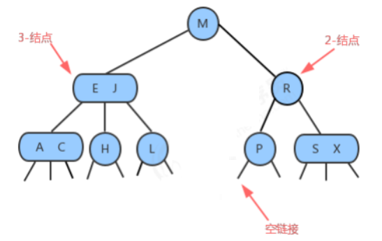

## 1.2）查找

将二叉查找树的查找算法一般化我们就能够直接得到2-3树的查找算法。要判断一个键是否在树中，我们先将它和
根结点中的键比较。如果它和其中任意一个相等，查找命中；否则我们就根据比较的结果找到指向相应区间的连
接，并在其指向的子树中递归地继续查找。如果这个是空链接，查找未命中。

- **对于H的命中查找**

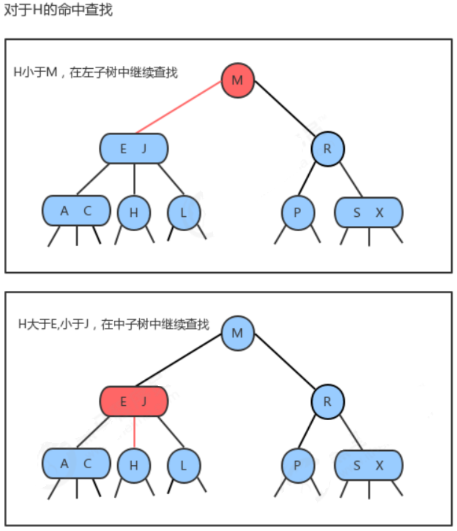

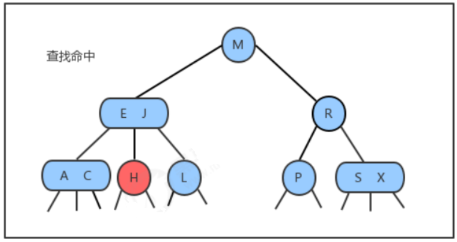

## 1.3）插入

### 1.3.1）向2-结点中插入新键

往2-3树中插入元素和往二叉查找树中插入元素一样，首先要进行查找，然后将节点挂到未找到的节点上。2-3树之
所以能够保证在最差的情况下的效率的原因在于**其插入之后仍然能够保持平衡状态**。如果**查找后未找到的节点是一**
**个2-结点**，那么很容易，我们**只需要将新的元素放到这个2-结点里面使其变成一个3-结点即可**。但是如果查找的节
点结束于一个3-结点，那么可能有点麻烦。

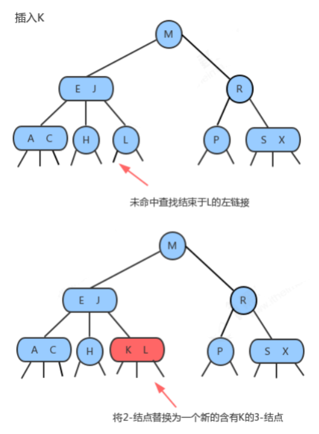

### 1.3.2）向一棵只含有一个3-结点的树中插入新键

假设2-3树只**包含一个3-结点**，这个结点有两个键，没有空间来插入第三个键了，最自然的方式是**我们假设这个结**
**点能存放三个元素，暂时使其变成一个4-结点**，同时他**包含四条链接**。然后，我们将**这个4-结点的中间元素提升**，
**左边的键作为其左子结点，右边的键作为其右子结点**。插入完成，变为平衡2-3查找树，**树的高度从0变为1**。

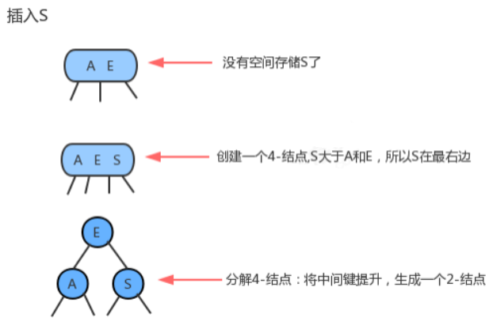

### 1.3.3）向一个父结点为2-结点的3-结点中插入新键

和上面的情况一样一样，我们也可以**将新的元素插入到3-结点中**，使其**成为一个临时的4-结点**，然后，**将该结点中**
**的中间元素提升到父结点即2-结点中**，**使其父结点成为一个3-结点**，然后**将左右结点分别挂在这个3-结点的恰当位**
**置。**

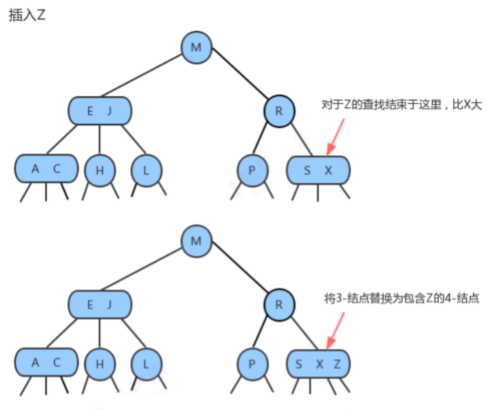

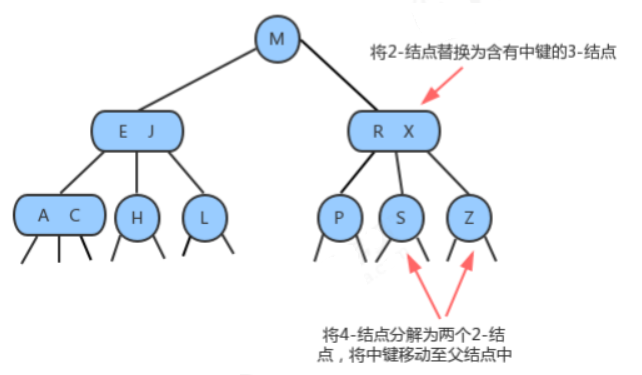

### 1.3.4）向一个父结点为3-结点的3-结点中插入新键

当我们插入的结点是3-结点的时候，我们将该结点拆分，**中间元素提升至父结点，但是此时父结点是一个3-结点，**
**插入之后，父结点变成了4-结点**，**然后继续将中间元素提升至其父结点，直至遇到一个父结点是2-结点**，**然后将其**
**变为3-结点，不需要继续进行拆分。**

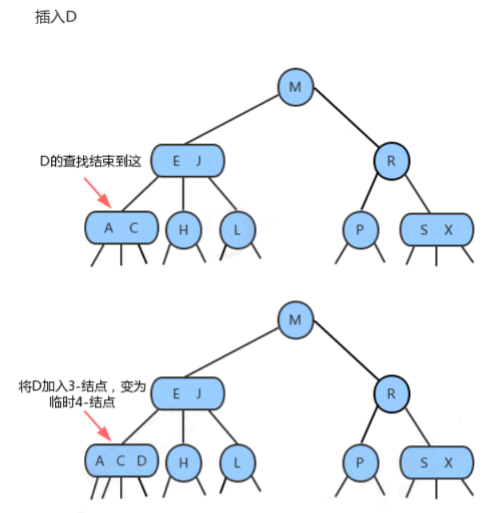

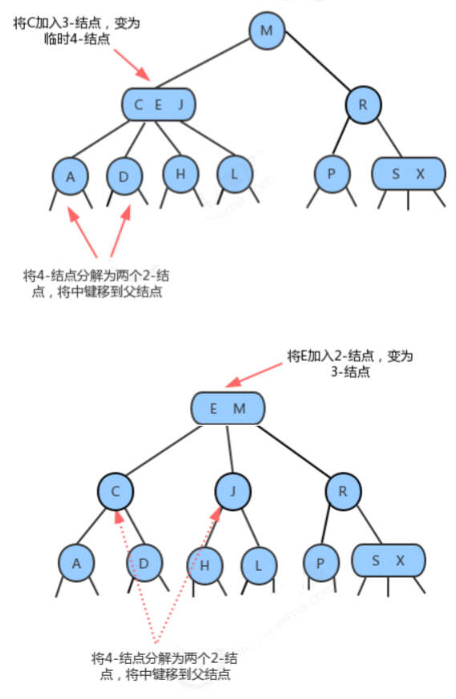

### 1.3.5）分解根结点

**当插入结点到根结点的路径上全部是3-结点的时候，最终我们的根结点会变成一个临时的4-结点，此时，就需要将**
**根结点拆分为两个2-结点，树的高度加1。**

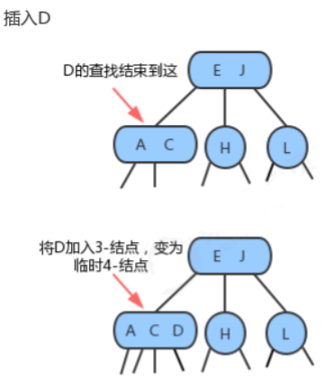

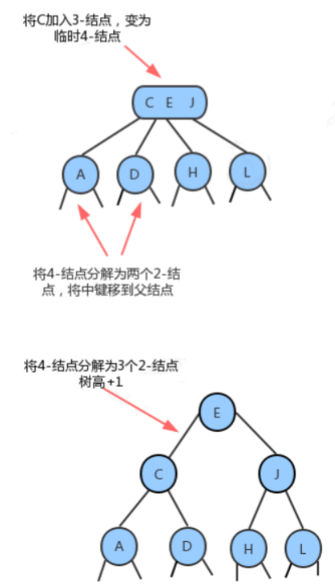

## 1.4）2-3树的性质

通过对2-3树插入操作的分析，我们发现在插入的时候，2-3树需要做一些局部的变换来保持2-3树的平衡。
一棵完全平衡的2-3树具有以下性质：
1.任意空链接到根结点的路径长度都是相等的。
2. 4-结点变换为3-结点时，树的高度不会发生变化，只有当根结点是临时的4-结点，分解根结点时，树高+1。
3. 2-3树与普通二叉查找树最大的区别在于，普通的二叉查找树是自顶向下生长，而2-3树是自底向上生长。

## 1.5）2-3树的实现

直接实现2-3树比较复杂，因为：     
需要处理不同的结点类型，非常繁琐；    
需要多次比较操作来将结点下移；       

需要上移来拆分4-结点；                      

拆分4-结点的情况有很多种；             
2-3查找树实现起来比较复杂，在某些情况插入后的平衡操作可能会使得效率降低。但是2-3查找树作为一种比较重      要的概念和思路对于我们后面要讲到的红黑树、B树和B+树非常重要。     

