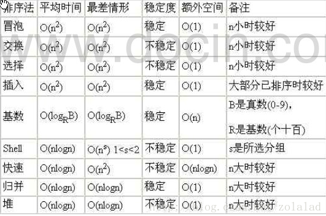
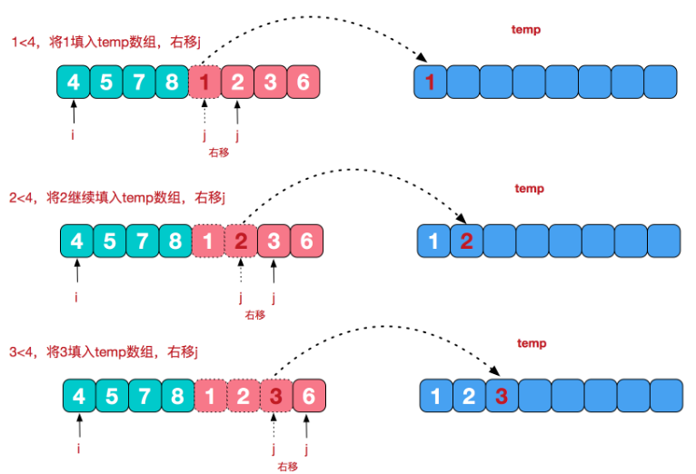
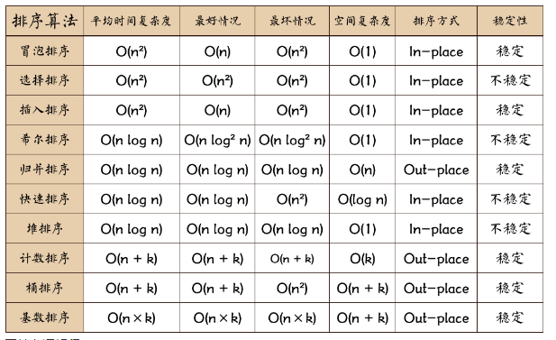
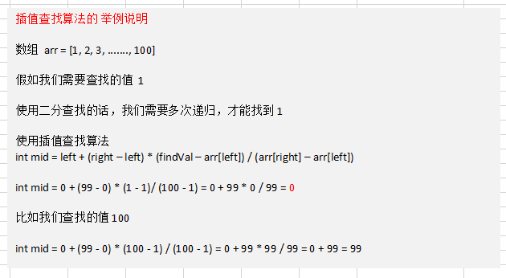
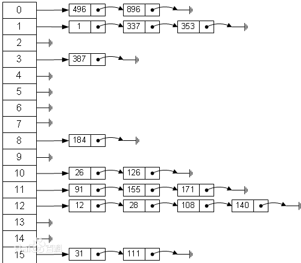
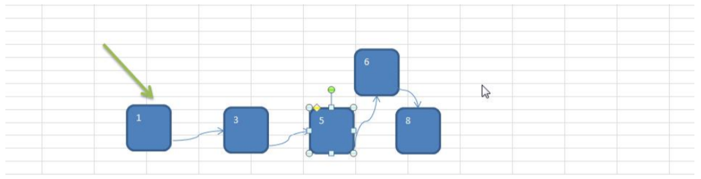
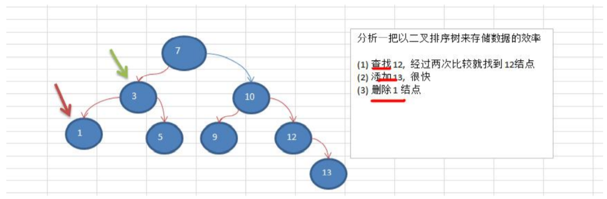
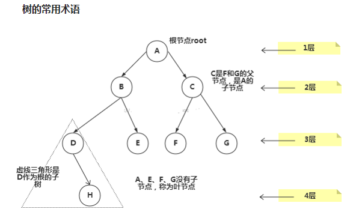
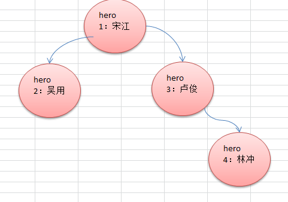
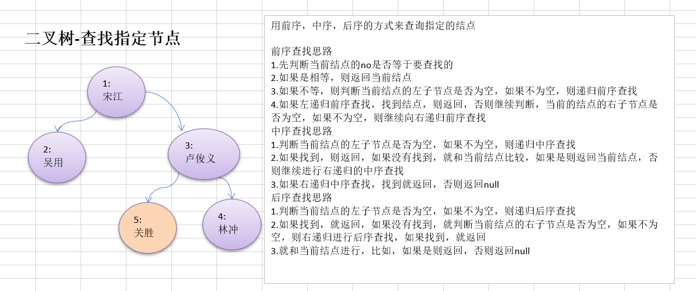

# 第六章 递归

## 6.1）递归应用场景

看个实际应用场景，**迷宫问题(回溯)， 递归(Recursion)**


## 6.2）递归的概念

简单的说: 递归就是**方法自己调用自己**,**每次调用时传入不同的变量**.递归有助于编程者解决复杂的问题,同时可以让代码变得简洁。

## 6.3）递归调用机制

**递归调用机制**

- 1）打印问题
- 2）阶乘问题

- 打印问题

```java
//输出什么? test(4)
public static void test(int n) {
if (n > 2) {
	test(n - 1);
}
System.out.println("n=" + n);
}
//n=2
//n=3
//n=4
```


- 阶乘问题

```java
//阶乘 factorial(3) =3*2*1 =6
public static int factorial(int n) {
if (n == 1) {
return 1;
} else {
return factorial(n - 1) * n;
}}

```

## 6.4）递归能解决什么样的问题

- 1）各种数学问题如: 8皇后问题 , 汉诺塔, 阶乘问题, 迷宫问题, 球和篮子的问题(google编程大赛)
- 2）各种算法中也会使用到递归，比如快排，归并排序，二分查找，分治算法等.
- 3）将用栈解决的问题-->递归代码比较简洁

## 6.5）递归需要遵守的重要规则

- 1）执行一个方法时，就创建一个新的受保护的独立空间(栈空间)
- 2）**方法的局部变量是独立的**，不会**相互影响, 比如n变量**
- 3）如果**方法中使用的是引用类型变量(比如数组)**，就**会共享该引用类型的数据.**
  递归**必须向退出递归的条件逼近**，**否则就是无限递归**,出现StackOverflowError，死龟了:)
- 4）当**一个方法执行完毕，或者遇到return**，就**会返回，遵守谁调用，就将结果返回给谁，同时当方法执行完毕或者返回时，该方法也就执行完毕。**

## 6.6）递归-迷宫问题

### 6.6.1）迷宫问题说明


### 6.6.2）迷宫问题代码实现

```java
package com.wck.recursion;
/**
* @author YuXiangKaoChi
* @createTime：2020-05-01 18:38:34
*   类说明：迷宫问题
*/


public class MiGong {

	public static void main(String[] args) {

		//首先画出数组
		int[][] map=new int[8][7];
		for(int i=0;i<7;i++) {
			map[0][i]=1;
			map[7][i]=1;
		}
		for(int i=0;i<8;i++) {
			map[i][0]=1;
			map[i][6]=1;
		}
		map[3][1]=1;
		map[3][2]=1;
//		map[1][2]=1;
//		map[2][2]=1;
		System.out.println("打印遍历数组：");
		list(map);
		
		System.out.println("--------------------------");
		
		setWay2(map, 1, 1);
		System.out.println("打印探测遍历数组：");
		list(map);
		
	}

	/**
	 * 遍历打印数组
	 * @param map
	 */
	public static void list(int[][] map) {
		for(int i=0;i<map.length;i++) {
			for (int j = 0; j < map[0].length; j++) {
				System.out.print(map[i][j]+" ");
			}
			System.out.println();
		}
	}
	
	/**
	 * 规定：
	 * 1 map 表示地图
	 * 2 i,j表示从地图的那个位置出发 (1,1)
	 * 3  如果小球能到map[6][5]位置，则说明通路找到
	 * 4  约定：
	 * 	 	   当map[i][j] 为 0  表示该点，没有走过。当为1 时表示墙，2  表示通路可以走，
	 * 		  3 表示已经走过，但是走不通
	 * 5 在走迷宫时，需确定一个策略（方法）下->右->上->左，如果该点走不通再回溯
	 */
	/**
	 * @param map  需要找的数组
	 * @param i    路径的起点 行
	 * @param j    路径的起点 列
	 * @return     是否已经走通
	 */
	public static boolean setWay(int[][] map,int i,int j) {
		if(map[6][5] == 2) {//已经找到了终点，并且走的通
			return true;
		}else {
			if(map[i][j] == 0) {
				map[i][j]=2;//先定义成走的通
				if(setWay(map, i+1, j)) {//向下走
					return true;
				}else if (setWay(map, i, j+1)) {//向右走
					return true;
				}else if (setWay(map, i-1, j)) {//向上走
					return true;
				}else if (setWay(map, i, j-1)) {//向左走
					return true;
				}else {
					map[i][j]=3;//路走不通
					return false;
				}
			}else {
				//如果map[i][j] 不为0 可能是 1 2 3 则直接返回 false
				return false;
			}
		}
	}
	
	/**
	 * 规则策略改成上右下左
	 * @param map
	 * @param i
	 * @param j
	 * @return
	 */
	public static boolean setWay2(int[][] map,int i,int j) {
		if(map[6][5] == 2) {//已经找到了终点，并且走的通
			return true;
		}else {
			if(map[i][j] == 0) {
				map[i][j]=2;//先定义成走的通
				if(setWay2(map, i-1, j)) {//向上走
					return true;
				}else if (setWay2(map, i, j+1)) {//向右走
					return true;
				}else if (setWay2(map, i+1, j)) {//向下走
					return true;
				}else if (setWay2(map, i, j-1)) {//向左走
					return true;
				}else {
					map[i][j]=3;//路走不通
					return false;
				}
			}else {
				//如果map[i][j] 不为0 可能是 1 2 3 则直接返回 false
				return false;
			}
		}
	}
}
```

### 6.6.3）对迷宫问题的讨论

说明:     

- 1）小球得到的路径，和程序员设置的**找路策略有关**即：找路的上下左右的顺序相关
- 2）再得到小球路径时，可以先使用(**下右上左)**，再改成(**上右下左**)，看看路径是不是有变化
- 3）测试回溯现象
- 4**）思考: 如何求出最短路径?**  把上下左右可能的情况，放在数组中，遍历所有可能的情况，然后把走的每一步都加入到步数的数组中，最后看 那个的 2比较少，就是最短的路径


# 第七章 排序算法

## 7.1）排序算法的介绍

排序也称排序算法(Sort Algorithm)，排序是将一组数据，依指定的顺序进行排列的过程。

### 7.1.1）排序的分类：

#### ①内部排序

指将需要处理的所有数据都**加载到内部存储器中进行排序**。

#### ②外部排序法

数据量过大，**无法全部加载到内存中**，需要**借助外部存储进行排序**。

#### ③常见的排序算法分类(见下图):


### 7.1.2）算法的时间复杂度

#### 7.1.2.1）度量一个程序(算法)执行时间的两种方法

- 事后统计的方法

这种方法可行, 但是有两个问题：一是要想对设计的算法的运行性能进行评测，需要实际运行该程序；二是所得时间的统计量依赖于计算机的硬件、软件等环境因素, 这种方式，要在同一台计算机的相同状态下运行，才能比较那个算法速度更快。

- **事前估算的方法**

通过**分析某个算法的时间复杂度来判断哪个算法更优**.

#### 7.1.2.2）时间频度

##### ①基本介绍

时间频度：一个算法花费的时间与算法中语句的执行次数成正比例，哪个算法中语句执行次数多，它花费时间就多。**一个算法中的语句执行次数称为语句频度或时间频度**。**记为T(n)**。[举例说明]

##### ②举例说明-基本案例

比如**计算1-100所有数字之和**, 我们设计两种算法：

- 1


**T(n)=n+1;**

- 2


**T(n)=1**


#### 7.1.2.3）举例说明-忽略常数项

|      | T(n)=2n+20 | T(n)=2*n | T(n)=3n+10 | T(n)=3n |
| ---- | ---------- | -------- | ---------- | ------- |
| 1    | 22         | 2        | 13         | 3       |
| 2    | 24         | 4        | 16         | 6       |
| 5    | 30         | 10       | 25         | 15      |
| 8    | 36         | 16       | 34         | 24      |
| 15   | 50         | 30       | 55         | 45      |
| 30   | 80         | 60       | 100        | 90      |
| 100  | 220        | 200      | 310        | 300     |
| 300  | 620        | 600      | 910        | 900     |


**结论:** 

- **2n+20 和 2n 随着n 变大，执行曲线无限接近, 20可以忽略**
- **3n+10 和 3n 随着n 变大，执行曲线无限接近, 10可以忽略**

#### 7.1.2.4）举例说明-忽略低次项

|      | T(n)=2n^2+3n+10 | T(n)=2n^2 | T(n)=n^2+5n+20 | T(n)=n^2 |
| ---- | --------------- | --------- | -------------- | -------- |
| 1    | 15              | 2         | 26             | 1        |
| 2    | 24              | 8         | 34             | 4        |
| 5    | 75              | 50        | 70             | 25       |
| 8    | 162             | 128       | 124            | 64       |
| 15   | 505             | 450       | 320            | 225      |
| 30   | 1900            | 1800      | 1070           | 900      |
| 100  | 20310           | 20000     | 10520          | 10000    |


**结论:** 

- **2n^2+3n+10 和 2n^2 随着n 变大, 执行曲线无限接近, 可以忽略 3n+10**
- **n^2+5n+20 和 n^2 随着n 变大,执行曲线无限接近, 可以忽略 5n+20**

#### 7.1.2.5）举例说明-忽略系数

|      | T(n)=3n^2+2n | T(n)=5n^2+7n | T(n)=n^3+5n | T(n)=6n^3+4n |
| ---- | ------------ | ------------ | ----------- | ------------ |
| 1    | 5            | 12           | 6           | 10           |
| 2    | 16           | 34           | 18          | 56           |
| 5    | 85           | 160          | 150         | 770          |
| 8    | 208          | 376          | 552         | 3104         |
| 15   | 705          | 1230         | 3450        | 20310        |
| 30   | 2760         | 4710         | 27150       | 162120       |
| 100  | 30200        | 50700        | 1000500     | 6000400      |


**结论:** 

- **随着n值变大，5n^2+7n 和 3n^2 + 2n ，执行曲线重合, 说明  这种情况下, 5和3可以忽略。**
- **而n^3+5n 和 6n^3+4n  ，执行曲线分离，说明多少次方式关键**

#### 7.1.2.6）时间复杂度（*）

- 1）一般情况下，**算法中的基本操作语句的*重复执行次数*是问题规模n的某个函数**，用T(n)表示，若有某个辅助函数f(n)，使得当n趋近于无穷大时，T(n) / f(n) 的极限值为不等于零的常数，则称f(n)是T(n)的同数量级函数。记作 T(n)=Ｏ( f(n) )，称Ｏ( f(n) )  为算法的渐进时间复杂度，简称时间复杂度。

- 2）T(n) 不同，但时间复杂度可能相同。 如：T(n)=n²+7n+6 与 T(n)=3n²+2n+2 它们的T(n) 不同，但时间复杂度相同，都为O(n²)。
- 3）计算时间复杂度的方法：
  - 用常数1代替运行时间中的所有加法常数  T(n)=n²+7n+6  => T(n)=n²+7n+1
  - 修改后的运行次数函数中，只保留最高阶项  T(n)=n²+7n+1 => T(n) = n²
  - 去除最高阶项的系数 T(n) = n² => T(n) = n² => O(n²)

#### 7.1.2.7）常见的时间复杂度(*)

1. 常数阶O(1)
2. 对数阶O(log2n)
3. 线性阶O(n)
4. 线性对数阶O(nlog2n)
5. 平方阶O(n^2)
6. 立方阶O(n^3)
7. k次方阶O(n^k)
8. 指数阶O(2^n)


**说明：**

- 1）常见的算法时间复杂度由小到大依次为：**Ο(1)＜Ο(log2n)＜Ο(n)＜Ο(nlog2n)＜Ο(n2)＜Ο(n3)＜ Ο(nk) ＜Ο(2n)** ，随着问题规模n的不断增大，上述时间复杂度不断增大，算法的执行效率越低
- 2）从图中可见，我们应该尽可能避免使用指数阶的算法

##### ①常数阶O(1)

**无论代码执行了多少行**，**只要是没有循环等复杂结构，那这个代码的时间复杂度就都是O(1)**


- 上述代码在执行的时候，它**消耗的时间并不随着某个变量的增长而增长**，
- 那么无论这类代码有多长，即使有几万几十万行，都可以用**O(1)**来表示它的时间复杂度。

##### ②对数阶O(log2n)


**说明：**

- **在while循环里面，每次都将 i 乘以 2，乘完之后，i 距离 n 就越来越近了**。
- 假设循环x次之后，i 就大于 n 了，此时这个循环就退出了，也就是说 2 的 x 次方等于 n，
- **那么 x = log2n也就是说当循环 log2n 次以后，这个代码就结束了**。
- 因此这个代码的**时间复杂度为：O(log2n)**  。
-  O(log2n) 的这个2 时间上是根据代码变化的，i = i * 3 ，则是 O(log3n) .


##### ③线性阶O(n)


**说明：**

- 这段代码，for循环里面的代码**会执行n遍**，因此它消耗的时间是随着n的变化而变化的，
- 因此这类代码都可以用**O(n)**来表示它的时间复杂度

##### ④线性对数阶O(nlogN)


**说明：**

- 线性对数阶O(nlogN) 其实非常容易理解，
- 将**时间复杂度为O(logn)的代码循环N遍的话**,
- 那么它的时间复杂度就是 **n * O(logN)，也就是了O(nlogN)**

##### ⑤平方阶O(n²)


**说明：**

- 平方阶O(n²) 就更容易理解了，
- 如果把 O(n) 的代码再嵌套循环一遍，它的时间复杂度就是 O(n²)，
- 这段**代码其实就是嵌套了2层n循环**，**它的时间复杂度就是 O(n\*n)，即  O(n²)\***
- **如果将其中一层循环的n改成m，那它的时间复杂度就变成了 O(m\*n)**

##### ⑥立方阶O(n³)、K次方阶O(n^k)

**说明**：参考上面的O(n²) 去理解就好了，O(n³)相当于三层n循环，其它的类似

#### 7.1.2.8）平均时间复杂度和最坏时间复杂度

- 1）平均时间复杂度是指所有可能的输入实例均以等概率出现的情况下，该算法的运行时间。
- 2）最坏情况下的时间复杂度称最坏时间复杂度。一般讨论的时间复杂度均是最坏情况下的时间复杂度。 这样做的原因是：最坏情况下的时间复杂度是算法在任何输入实例上运行时间的界限，这就保证了算法的运行时间不会比最坏情况更长。
- 3）平均时间复杂度和最坏时间复杂度是否一致，和算法有关(如下图:)。



### 7.1.3）算法的空间复杂度简介

**基本介绍**    

- 1）类似于时间复杂度的讨论，一个算法的空间复杂度(Space Complexity)定义为该算法所耗费的存储空间，它也是问题规模n的函数。
- 2）空间复杂度(Space Complexity)是对一个算法在运行过程中临时占用存储空间大小的量度。有的算法需要占用的临时工作单元数与解决问题的规模n有关，它随着n的增大而增大，当n较大时，将占用较多的存储单元，例如快速排序和归并排序算法就属于这种情况
- 3）在做算法分析时，主要讨论的是时间复杂度。从用户使用体验上看，更看重的程序执行的速度。一些缓存产品(redis, memcache)和算法(基数排序)本质就是用空间换时间.

## 7.2）冒泡排序

### 7.2.1）基本介绍


冒泡排序（Bubble Sorting）的基本思想是：

- 通过对待排**序序列从前向后**（从下标较小的元素开始）,**依次比较相邻元素的值**，**若发现逆序则交换，使值较大的元素逐渐从前移向后部，就象水底下的气泡一样逐渐向上冒。**

- 因为排序的过程中，各元素不断接近自己的位置，**如果一趟比较下来没有进行过交换，就说明序列有序**，因此要在排序过程中**设置一个标志flag判断元素是否进行过交换**。从而减少不必要的比较。(这里说的优化，可以在冒泡排序写好后，再进行)

### 7.2.2）冒泡过程的例子(图解)


小结：

小结冒泡排序规则

- (1) 一共进行 **数组的大小-1 次 大的循环**
- (2)**每一趟排序的次数在逐渐的减少**
- (3) 如果我们**发现在某趟排序中，没有发生一次交换， 可以提前结束冒泡排序。这个就是优化**

### 7.2.3）冒泡排序应用实例

我们举一个具体的案例来说明冒泡法。我们将五个无序的数：3, 9, -1, 10, -2 使用冒泡排序法将其排成一个从小到大的有序数列。

### 7.2.4）代码实现

```java
package com.wck.sort;

import java.util.Arrays;

/**
* @author YuXiangKaoChi
* @createTime：2020-05-02 15:59:09
*   类说明：冒泡排序
*/
public class BubbleSort {

	public static void main(String[] args) {
		/*int[] arr= {3,9,-1,10,-2};//从小到大排序
		System.out.println("冒泡排序-排序前为：");
		System.out.println(Arrays.toString(arr));
		bubble(arr);
		System.out.println("冒泡排序-排序后的结果为：");
		System.out.println(Arrays.toString(arr));*/
		
		int[] arr=new int[80000];
		for (int i = 0; i < 80000; i++) {
			arr[i]=(int)(Math.random()*800000000);
		}
		
		System.out.println("排序前的时间：");
		System.out.println(System.currentTimeMillis());
		bubble(arr);
		System.out.println("排序后的时间：");
		System.out.println(System.currentTimeMillis());
//		排序前的时间：
//		1588424830959
//		排序前的时间：
//		1588424841110
//		耗时 10.151秒
		
		/*
		//第一趟排序
		int temp;
		for (int i = 0; i < arr.length-1; i++) {
			if(arr[i] > arr[i+1]) {//前一个数比后一个大
				temp=arr[i];
				arr[i]=arr[i+1];
				arr[i+1]=temp;
			}
		}
		
		System.out.println("第一趟排序的结果为：");
		System.out.println(Arrays.toString(arr));
		
		for (int i = 0; i < arr.length-1-1; i++) {
			if(arr[i] > arr[i+1]) {//前一个数比后一个大
				temp=arr[i];
				arr[i]=arr[i+1];
				arr[i+1]=temp;
			}
		}
		
		System.out.println("第二趟排序的结果为：");
		System.out.println(Arrays.toString(arr));
		
		for (int i = 0; i < arr.length-1-2; i++) {
			if(arr[i] > arr[i+1]) {//前一个数比后一个大
				temp=arr[i];
				arr[i]=arr[i+1];
				arr[i+1]=temp;
			}
		}
		System.out.println("第三趟排序的结果为：");
		System.out.println(Arrays.toString(arr));
		
		for (int i = 0; i < arr.length-1-3; i++) {
			if(arr[i] > arr[i+1]) {//前一个数比后一个大
				temp=arr[i];
				arr[i]=arr[i+1];
				arr[i+1]=temp;
			}
		}
		System.out.println("第四趟排序的结果为：");
		System.out.println(Arrays.toString(arr));*/
		
	}
	public static void bubble(int[] arr) {
		//冒泡排序的时间复杂度为： O(n^2)
		int temp;
		boolean flag=false;
		for(int i=0;i<arr.length-1;i++) {
			for(int j=0;j<arr.length-1-i;j++) {
				if(arr[j] > arr[j+1]) {
					flag=true;
					temp=arr[j];//缓存变量
					arr[j]=arr[j+1];//交换位置
					arr[j+1]=temp;//交换位置
				}
			}
//			System.out.println("第"+(i+1)+"趟排序的结果为：");
//			System.out.println(Arrays.toString(arr));
			if(!flag) {
				break;//当没有交换的时候直接退出
			}else {
				flag=false;//每趟的新循环开始把标志置成false初始状态
			}
		}
	}
}
```

## 7.3）选择排序

### 7.3.1）基本介绍

选择式排序也属于内部排序法，是从欲排序的数据中，**按指定的规则选出某一元素，再依规定交换位置后达到排序的目的。**

### 7.3.2）选择排序思想:

**选择排序（select sorting）**也是一种简单的排序方法。           

它的基本思想是：

1. 第一次从arr[0]~arr[n-1]中选取最小值，**与arr[0]交换**，
2. 第二次从arr[1]~arr[n-1]中选取最小值，**与arr[1]交换**，
3. 第三次从arr[2]~arr[n-1]中选取最小值，**与arr[2]交换**，…，
4. 第i次从arr[i-1]~arr[n-1]中选取最小值，**与arr[i-1]交换**，…, 
5. 第n-1次从arr[n-2]~arr[n-1]中选取最小值，**与arr[n-2]交换**，
6. **总共通过n-1次**，得到一个按排序码从小到大排列的有序序列。

### 7.3.4）选择排序思路分析图:


另外一个例子：


**说明：**

1. 选择排序一共有 数组大小 - 1 轮排序
2. 每1轮排序，又是一个循环, 循环的规则(代码)
2.1先假定当前这个数是最小数
2.2 然后和后面的每个数进行比较，如果发现有比当前数更小的数，就重新确定最小数，并得到下标
2.3 当遍历到数组的最后时，就得到本轮最小数和下标
2.4 交换 [代码中再继续说 ]

### 7.3.5）选择排序应用实例

有一群牛 , 颜值分别是 101, 34, 119, 1 请使用选择排序从低到高进行排序 [101, 34, 119, 1]

- 代码实现

```java
package com.wck.sort;

import java.util.Arrays;

/**
* @author YuXiangKaoChi
* @createTime：2020-05-03 22:53:11
*   类说明：
*/
public class SelectSort {

	public static void main(String[] args) {
		
//		int[] arr= {101,34,119,1};
//		int[] arr= {101,34,119,1,-5,88,-1};
//		selectSort(arr);
//		System.out.println(Arrays.toString(arr));
		
		int[] arr=new int[80000];
		for (int i = 0; i < 80000; i++) {
			arr[i]=(int)(Math.random()*800000000);
		}
		
		System.out.println("排序前的时间：");
		System.out.println(System.currentTimeMillis());
		selectSort(arr);
		System.out.println("排序后的时间：");
		System.out.println(System.currentTimeMillis());
		
//		排序前的时间：
//		1588517708119
//		排序后的时间：
//		1588517709771
//      总计 1.652 秒
		
		/*
		//第一轮排序
		int minIndex=0;
		int minVal=arr[0];
		for(int i=0;i<arr.length-1;i++) {
			if(arr[i+1]< minVal) {
				minIndex=i+1;
				minVal=arr[i+1];
			}
		}
		if(minIndex != 0) {
			arr[minIndex]=arr[0];
			arr[0]=minVal;
		}
		System.out.println("第一轮：");
		System.out.println(Arrays.toString(arr));
		
		//第二轮
		minIndex=1;
		minVal=arr[1];
		for(int i=1;i<arr.length-1;i++) {
			if(arr[i+1]< minVal) {
				minIndex=i+1;
				minVal=arr[i+1];
			}
		}
		if(minIndex != 1) {
			arr[minIndex]=arr[1];
			arr[1]=minVal;
		}
		
		System.out.println("第二轮：");
		System.out.println(Arrays.toString(arr));
		
		//第三轮
		minIndex=2;
		minVal=arr[2];
		for(int i=2;i<arr.length-1;i++) {
			if(arr[i+1]< minVal) {
				minIndex=i+1;
				minVal=arr[i+1];
			}
		}
		
		if(minIndex != 2) {
			arr[minIndex]=arr[2];
			arr[2]=minVal;
		}
		System.out.println("第三轮：");
		System.out.println(Arrays.toString(arr));
		*/
	}
	public static void selectSort (int[] arr) {
		for(int i=0;i<arr.length-1;i++) {
			int minIndex=i;
			int minVal=arr[i];
			for(int j=i;j<arr.length-1;j++) {
				if(arr[j+1]< minVal) {
					minIndex=j+1;
					minVal=arr[j+1];
				}
			}
			if(minIndex != i) {
				arr[minIndex]=arr[i];
				arr[i]=minVal;
			}
			
//			System.out.println("第"+(i+1)+"排序完成：");
//			System.out.println(Arrays.toString(arr));
		}
	}
}
```

## 7.4）插入排序

### 7.4.1）插入排序法介绍

插入式排序属于内部排序法，是对于欲排序的元素以插入的方式找寻该元素的适当位置，以达到排序的目的。

### 7.4.2）插入排序法思想

插入排序（Insertion Sorting）的基本思想是：

- 1）把n个待排序的元素看成为一个有序表和一个无序表，
- 2）开始时有序表中只包含一个元素，
- 3）无序表中包含有n-1个元素，
- 4）排序过程中每次从无序表中取出第一个元素，把它的排序码依次与有序表元素的排序码进行比较，
- 5）将它插入到有序表中的适当位置，使之成为新的有序表。

### 7.4.3）插入排序思路图


### 7.4.4）插入排序法应用实例

有一群小牛, 考试成绩分别是 101, 34, 119, 1  请从小到大排序

### 7.4.5）代码实现

```java
package com.wck.sort;

import java.util.Arrays;

/**
* @author YuXiangKaoChi
* @createTime：2020-05-04 16:27:15
*   类说明：插入排序
*/
public class InsertSort {

	public static void main(String[] args) {
//		int[] arr= {101, 34, 119, 1};
//		insertSort(arr);
		int[] arr=new int[80000];
		for (int i = 0; i < 80000; i++) {
			arr[i]=(int)(Math.random()*800000000);
		}
		
		System.out.println("排序前的时间：");
		System.out.println(System.currentTimeMillis());
		insertSort(arr);
		System.out.println("排序后的时间：");
		System.out.println(System.currentTimeMillis());
		
		
//		排序前的时间：
//		1588582256658
//		排序后的时间：
//		1588582259352
//		总计 2.694
		/*
		int insertValue=arr[1];
		int insertIndex=1-1;//0 要插入的值的前一个索引
		
		while(insertIndex >=0 && insertValue < arr[insertIndex]) {
			arr[insertIndex+1]=arr[insertIndex];
			insertIndex --;
		}
		
		arr[insertIndex+1]=insertValue;
		
		System.out.println("第一趟排序完成后的结果：");
		System.out.println(Arrays.toString(arr));
		
		insertValue=arr[2];
		insertIndex=2-1;//1
		
		while(insertIndex >=0 && insertValue < arr[insertIndex]) {
			arr[insertIndex+1]=arr[insertIndex];
			insertIndex --;
		}
		
		arr[insertIndex+1]=insertValue;
		
		System.out.println("第二趟排序完成后的结果：");
		System.out.println(Arrays.toString(arr));
		
//		第二趟排序完成后的结果：
//		[34, 101, 119, 1]
		
		insertValue=arr[3];
		insertIndex=3-1;//2
		
		while(insertIndex >=0 && insertValue < arr[insertIndex]) {
			arr[insertIndex+1]=arr[insertIndex];
			insertIndex --;
		}
		
		arr[insertIndex+1]=insertValue;
		
		System.out.println("第三趟排序完成后的结果：");
		System.out.println(Arrays.toString(arr));
		*/
	}
	
	public static void insertSort(int[] arr) {
		//int[] arr= {101, 34, 119, 1};
		int insertValue;
		int insertIndex;//0 要插入的值的前一个索引
		
		for(int i=1;i<arr.length;i++) {
			insertValue=arr[i];
			insertIndex=i-1;//0 要插入的值的前一个索引
			
			while(insertIndex >=0 && insertValue < arr[insertIndex]) {
				arr[insertIndex+1]=arr[insertIndex];
				insertIndex --;
			}
			//优化
			if((insertIndex+1) != i) {
				arr[insertIndex+1]=insertValue;
			}
//			System.out.println("第"+i+"趟排序完成后的结果：");
//			System.out.println(Arrays.toString(arr));
			
		}
	}
}
```


## 7.5）希尔排序

### 7.5.1）简单插入排序存在的问题

我们看简单的插入排序可能存在的问题:
数组 arr = {2,3,4,5,6,1} **这时需要插入的数 1(最小),** 这样的过程是：

{2,3,4,5,6,6}    
{2,3,4,5,5,6}    
{2,3,4,4,5,6}    
{2,3,3,4,5,6}   
{2,2,3,4,5,6}   
{1,2,3,4,5,6}       

结论: 当需要插入的数是较小的数时，后移的次数明显增多，对效率有影响

### 7.5.2）希尔排序法介绍

希尔排序是希尔（Donald Shell）于1959年提出的一种排序算法。希尔排序也是一种插入排序，它是简单插入排序经过改进之后的一个更高效的版本，也称为**缩小增量排序**。

### 7.5.3）希尔排序法基本思想

希尔排序是把记录按下标的一定增量分组，对每组使用直接插入排序算法排序；随着增量逐渐减少，每组包含的关键词越来越多，当增量减至1时，整个文件恰被分成一组，算法便终止。

### 7.5.4）希尔排序法的示意图


### 7.5.5）希尔排序法应用实例

有一群小牛, 考试成绩分别是 {8,9,1,7,2,3,5,4,6,0} 请从小到大排序. 请分别使用 

- 希尔排序时， 对有序序列在插入时采用交换法, 并测试排序速度.
- 希尔排序时， 对有序序列在插入时采用移动法, 并测试排序速度

### 7.5.6）代码实现（交换法）

```java
package com.wck.sort;
/**
* @author YuXiangKaoChi
* @createTime：2020-05-07 10:55:46
*   类说明：希尔排序 交换法
*/
public class ShellSort1 {

	public static void main(String[] args) {
//		int[] arr= {8,9,1,7,2,3,5,4,6,0};
//		shellSort(arr);
		int[] arr=new int[80000];
		for (int i = 0; i < 80000; i++) {
			arr[i]=(int)(Math.random()*800000000);
		}
		
		System.out.println("排序前的时间：");
		System.out.println(System.currentTimeMillis());
		shellSort(arr);
		System.out.println("排序后的时间：");
		System.out.println(System.currentTimeMillis());
		
//		排序前的时间：
//		1588607999419
//		排序后的时间：
//		1588608008439
//		总计 9.02秒
		
		/*int temp=0;//缓存变量
		//第一轮排序 分为10/2 = 5 组，步长为10/2= 5
		for(int i=5;i<arr.length;i++) {
			for(int j=i-5;j>=0;j-=5) {
				if(arr[j] > arr[j+5]) {
					temp=arr[j];//缓存值
					arr[j]=arr[j+5];//交换值
					arr[j+5]=temp;//交换值
				}
			}
		}
		System.out.println("第一轮的排序为：");
		System.out.println(Arrays.toString(arr));
		
		// 第二轮排序 分为 5/2 = 2组，步长为 5/2=2
		for (int i = 2; i < arr.length; i++) {
			for (int j = i - 2; j >= 0; j -= 2) {
				if (arr[j] > arr[j + 2]) {
					temp = arr[j];// 缓存值
					arr[j] = arr[j + 2];// 交换值
					arr[j + 2] = temp;// 交换值
				}
			}
		}
		System.out.println("第二轮的排序为：");
		System.out.println(Arrays.toString(arr));
		
		// 第三轮排序 分为 2/2 = 1组，步长为 2/2=1
		for (int i = 1; i < arr.length; i++) {
			for (int j = i - 1; j >= 0; j -= 1) {
				if (arr[j] > arr[j + 1]) {
					temp = arr[j];// 缓存值
					arr[j] = arr[j + 1];// 交换值
					arr[j + 1] = temp;// 交换值
				}
			}
		}
		System.out.println("第三轮的排序为：");
		System.out.println(Arrays.toString(arr));
		*/
	}
	public static void shellSort(int[] arr) {
		int count=0;
		int temp=0;//缓存变量
		for(int gap=arr.length/2;gap>0;gap/=2) {
			//第一轮排序 分为10/2 = 5 组，步长为10/2= 5
			for(int i=gap;i<arr.length;i++) {
				for(int j=i-gap;j>=0;j-=gap) {
					if(arr[j] > arr[j+gap]) {
						temp=arr[j];//缓存值
						arr[j]=arr[j+gap];//交换值
						arr[j+gap]=temp;//交换值
					}
				}
			}
//			System.out.println("第"+(++count)+"轮的排序为：");
//			System.out.println(Arrays.toString(arr));
		}	
	}
}
```

### 7.5.7）代码实现（移位法）

```java
package com.wck.sort;

import java.util.Arrays;

/**
 * @author YuXiangKaoChi
 * @createTime：2020-05-07 10:58:42 
 * 类说明：希尔排序 移位法
 */
public class ShellSort2 {
	public static void main(String[] args) {
		//int[] arr = { 8, 9, 1, 7, 2, 3, 5, 4, 6, 0 };
		//shellSort2(arr);
		//System.out.println(Arrays.toString(arr));
		
		int[] arr=new int[80000];
		for (int i = 0; i < 80000; i++) {
			arr[i]=(int)(Math.random()*800000000);
		}
		
		System.out.println("排序前的时间：");
		System.out.println(System.currentTimeMillis());
		shellSort2(arr);
		System.out.println("排序后的时间：");
		System.out.println(System.currentTimeMillis());

//		排序前的时间：
//		1588822187176
//		排序后的时间：
//		1588822187210
		//总计 0.034 秒
		
		/*
		//第一趟
		for(int i=5;i<arr.length;i++) {
			int index=i;
			int temp=arr[i];
			if(arr[i] <arr[i-5]) {
				while(index-5>=0 && temp < arr[index-5]) {
					arr[index]=arr[index-5];
					index-=5;
				}
				arr[index]=temp;
			}
		}
		System.out.println("第一趟排序：");
		System.out.println(Arrays.toString(arr));
		
		//第二趟
		for(int i=2;i<arr.length;i++) {
			int index=i;
			int temp=arr[i];
			if(arr[i] <arr[i-2]) {
				while(index-2>=0 && temp < arr[index-2]) {
					arr[index]=arr[index-2];
					index-=2;
				}
				arr[index]=temp;
			}
		}
		System.out.println("第二趟排序：");
		System.out.println(Arrays.toString(arr));
		
		//第三趟
		for(int i=1;i<arr.length;i++) {
			int index=i;
			int temp=arr[i];
			if(arr[i] <arr[i-1]) {
				while(index-1>=0 && temp < arr[index-1]) {
					arr[index]=arr[index-1];
					index-=1;
				}
				arr[index]=temp;
			}
		}
		
		System.out.println("第三趟排序：");
		System.out.println(Arrays.toString(arr));
		*/
	}
	
	public static void shellSort2(int[] arr) {
		
		int index;
		int temp;
		
		for(int gap=arr.length/2;gap>0;gap/=2) {
			
			for(int i=gap;i<arr.length;i++) {
				index=i;//缓存当前的下标
				temp=arr[index];//缓存当前的值
				if(arr[i] < arr[i-gap]) {//如果当前的值小于步长前的值
					while (index-gap >=0 && temp < arr[index-gap]) {
						//把大的值赋值给当前的索引
						arr[index]=arr[index-gap];
						//减少步长的索引
						index-=gap;
					}
					arr[index]=temp;
				}
			}
//			System.out.println(Arrays.toString(arr));

		}
	}
}
```

## 7.6）快速排序

### 7.6.1）快速排序法介绍

**快速排序**（Quicksort）是**对冒泡排序的一种改进**。基本思想是：通过一趟排序将要排序的数据分割成独立的两部分，其中一部分的所有数据都比另外一部分的所有数据都要小，然后再按此方法对这两部分数据分别进行快速排序，**整个排序过程可以递归进行**，以此达到整个数据变成有序序列。

### 7.6.2）快速排序法示意图


-9,78,0,23,-567,70

### 7.6.3）快速排序法应用实例:

要求:        

对 [-9,78,0,23,-567,70] 进行从小到大的排序，要求使用快速排序法。【测试8w数据】 

### 7.6.4）快速排序代码实现

```java
package com.wck.sort;

import java.util.Arrays;

/**
* @author YuXiangKaoChi
* @createTime：2020-05-09 09:35:40
*   类说明：快速排序
*/
public class QuickSort {
	
	public static void main(String[] args) {
//		int[]  arr= {6,1,2,7,9,3,4,5,10,8};
//		quickSort(arr, 0, arr.length-1);
//		System.out.println(Arrays.toString(arr));
		int[] arr=new int[80000];
		for (int i = 0; i < 80000; i++) {
			arr[i]=(int)(Math.random()*800000000);
		}
		System.out.println("排序前的时间：");
		long currentTimeMillis = System.currentTimeMillis();
		System.out.println(currentTimeMillis);
		quickSort(arr,0,arr.length-1);
		System.out.println("排序后的时间：");
		System.out.println(System.currentTimeMillis()-currentTimeMillis);
		
//		排序前的时间：
//		1589001610732
//		排序后的时间：
//		0.019s

	}
	/**
	 * 快速排序
	 * @param arr 排序数组
	 * @param left 左边的索引
	 * @param right 右边的索引
	 */
	public static void quickSort(int[] arr, int left, int right) {
		//左边的索引大于右边的索引值 直接return
		if (left > right) {
			return;
		}
		//缓存左边的指针索引
		int i = left;
		//缓存右边的指针索引
		int j = right;
		//基准数
		int base = arr[left];
		//当i和的指针没有重合的时候，则继续交换位置
		while (i != j) {
			//右边的指针数值比基准数大的时候，继续移动指针
			while (arr[j] >= base && i <j ) {
				j--;
			}
			//左边的指针数值比基准数小的时候，继续移动指针
			while (arr[i] <= base && i <j ) {
				i++;
			}

			//交换数值
			if(i!=j) {
				int temp = arr[i];
				arr[i] = arr[j];
				arr[j] = temp;
			}
		}
		//i == j
		//当i指针和j指针重合的时候，交换重合指针的数值和基准数值
		arr[left]= arr[i];
		arr[i]=base;
		//左边的快速排序
		quickSort(arr,left,i-1);
		//右边的快速排序
		quickSort(arr,i+1,right);
	}
}
```

## 7.7）归并排序

### 7.7.1）归并排序介绍

归并排序（MERGE-SORT）是利用归并的思想实现的排序方法，该算法采用经典的**分治**（divide-and-conquer）**策略**（分治法将问题分(divide)成一些小的问题然后递归求解，而治(conquer)的阶段则将分的阶段得到的各答案"修补"在一起，即分而治之)。

### 7.7.2）归并排序思想示意图1-基本思想:

### 

### 7.7.3）意图2-合并相邻有序子序列:

再来看看治阶段，我们需要将两个已经有序的子序列合并成一个有序序列，比如上图中的最后一次合并，要将[4,5,7,8]和[1,2,3,6]两个已经有序的子序列，合并为最终序列[1,2,3,4,5,6,7,8]，来看下实现步骤




### 7.7.4）归并排序的应用实例:

给你一个数组, int[] arr= {8, 4, 5, 7, 1, 3, 6, 2 };请使用归并排序完成排序。

### 7.7.5）归并排序的应用实例代码:

```java
package com.wck.sort;

import java.util.Arrays;
/**
* @author YuXiangKaoChi
* @createTime：2020-05-11 10:11:14
*   类说明：
*/
public class MergeSort {

	public static void main(String[] args) {
		//System.out.println("main");
		int[] arr= {8, 4, 5, 7, 1, 3, 6, 2 };
//		int[] arr= {8, 4, 5,7};
		int[] temp = new int[arr.length];
		mergeSort(arr, 0, arr.length-1, temp);
		System.out.println(Arrays.toString(arr));
//		System.out.println("-----------------");
//		System.out.println(Arrays.toString(temp));
	}
	public static void mergeSort(int[] arr,int left,int right,int[] temp) {
		if(left < right) {
			int mid=(left+right)/2;                                                                    
			//左侧的分解
			mergeSort(arr, left, mid, temp);
			//右侧的分解
			mergeSort(arr, mid+1, right, temp);
			//合并
			merge(arr, left, mid, right, temp);
		}
	}
	public static void merge(int[] arr,int left,int mid,int right,int[] temp) {
		int t=0;//缓存的 数组的开始下标
		int i=left;//初始化i ，左边有序序列的初始化索引	
		int j=mid+1;//初始化 j ，右边有序序列的初始化索引
		//当左边的索引 小于中间的索引 ，右边的索引（mid+1）小于最右边的索引
		while (i<=mid && j<=right) {
			if(arr[i] <= arr[j]) {//左边的比右边数 小
				temp[t]=arr[i];
				i+=1;
				t+=1;
			}else {
				temp[t]=arr[j];
				t+=1;
				j+=1;
			}
		}
		//比对完可能会出现左侧的数组剩余，或者右侧的数组剩余
		//处理左侧的
		while(i<=mid) {
			temp[t]=arr[i];
			t++;
			i++;
		}
		//处理右侧的
		while(j<=right) {
			temp[t]=arr[j];
			t++;
			j++;
		}
		//(三)
		//将temp数组的元素拷贝到arr
		//注意，并不是每次都拷贝所有
		t = 0;
		int tempLeft = left; // 
		//第一次合并 tempLeft = 0 , right = 1 //  tempLeft = 2  right = 3 // tL=0 ri=3
		//最后一次 tempLeft = 0  right = 7
		//System.out.print("tempLeft =" + tempLeft + ",right ="+right);
		while(tempLeft <= right) { 
			arr[tempLeft] = temp[t];
			t += 1;
			tempLeft += 1;
		}
	}
}
```

## 7.8）基数排序

### 7.8.1）基数排序(桶排序)介绍:

1. **基数排序（radix sort）属于“分配式排序”**（distribution sort），又称“桶子法”（bucket sort）或bin sort，顾名思义，它是**通过键值的各个位的值，将要排序的元素分配至某些“桶”中**，达到排序的作用
2. **基数排序法是属于稳定性的排序**，基数排序法的是效率高的稳定性排序法
3. **基数排序(Radix Sort)是桶排序的扩展**
4. 基数排序是1887年赫尔曼·何乐礼发明的。它是这样实现的：将整数按位数切割成不同的数字，然后按每个位数分别比较。

### 7.8.2）基数排序基本思想

1. 将所有待比较数值统一为同样的数位长度，**数位较短的数前面补零**。然后，**从最低位开始，依次进行一次排序。这样从最低位排序一直到最高位排序完成以后, 数列就变成一个有序序列**。
2. 这样说明，比较难理解，下面我们看一个图文解释，理解基数排序的步骤

### 7.8.3）基数排序图文说明


### 7.8.4）基数排序代码实现

要求：将数组 {53, 3, 542, 748, 14, 214 } 使用基数排序, 进行升序排序

```java
package com.wck.sort;

import java.util.Arrays;

/**
* @author YuXiangKaoChi
* @createTime：2020-05-12 15:36:22
* 类说明：基数排序
*/
public class RadixSort {

	public static void main(String[] args) {
//		int[] arr={53, 3, 542, 748, 14, 214};
//		radixSort(arr);
		
		int[] arr=new int[80000];
		for (int i = 0; i < 80000; i++) {
			arr[i]=(int)(Math.random()*800000000);
		}
		System.out.println("排序前的时间：");
		long currentTimeMillis = System.currentTimeMillis();
		System.out.println(currentTimeMillis);
		radixSort(arr);
		System.out.println("排序后的时间：");
		System.out.println(System.currentTimeMillis()-currentTimeMillis);
		
//		排序前的时间：
//		1589272815084
//		排序后的时间：
//		51
		
		/*
		//二维数组表示桶
		int[][] bucket = new int[10][arr.length];
		//每个桶中数据个数
		int[] bucketElementCounts = new int[10];
		
		//第一轮基数排序，先判断个位数字
		for(int j=0;j<arr.length;j++) {
//			System.out.println("元素："+arr[j]+" 取余："+arr[j]%10);
			int digitOfElement=arr[j]/1%10;
			bucket[digitOfElement][bucketElementCounts[digitOfElement]]=arr[j];
			bucketElementCounts[digitOfElement]++;//记录桶中的的数据的个数加一
		}
		//遍历桶中的数据
		int index=0;
		for(int l=0;l<bucketElementCounts.length;l++) {
			if(bucketElementCounts[l] != 0) {//代表桶中有数据
				for(int k=0;k<bucketElementCounts[l];k++) {
					arr[index++]=bucket[l][k];
				}
			}
			bucketElementCounts[l]=0;
		}
		System.out.println("第一轮基数排序后的值："+Arrays.toString(arr));
		//第二轮基数排序，先判断个位数字
		for(int j=0;j<arr.length;j++) {
//					System.out.println("元素："+arr[j]+" 取余："+arr[j]%10);
			int digitOfElement=arr[j]/10%10;
			bucket[digitOfElement][bucketElementCounts[digitOfElement]]=arr[j];
			bucketElementCounts[digitOfElement]++;//记录桶中的的数据的个数加一
		}
		//遍历桶中的数据
		index=0;
		for(int l=0;l<bucketElementCounts.length;l++) {
			if(bucketElementCounts[l] != 0) {//代表桶中有数据
				for(int k=0;k<bucketElementCounts[l];k++) {
					arr[index++]=bucket[l][k];
				}
			}
			bucketElementCounts[l]=0;
		}
		System.out.println("第二轮基数排序后的值："+Arrays.toString(arr));
		
		//第三轮基数排序，先判断个位数字
		for(int j=0;j<arr.length;j++) {
//							System.out.println("元素："+arr[j]+" 取余："+arr[j]%10);
			int digitOfElement=arr[j]/100%10;
			bucket[digitOfElement][bucketElementCounts[digitOfElement]]=arr[j];
			bucketElementCounts[digitOfElement]++;//记录桶中的的数据的个数加一
		}
		//遍历桶中的数据
		index=0;
		for(int l=0;l<bucketElementCounts.length;l++) {
			if(bucketElementCounts[l] != 0) {//代表桶中有数据
				for(int k=0;k<bucketElementCounts[l];k++) {
					arr[index++]=bucket[l][k];
				}
			}
			bucketElementCounts[l]=0;
		}
		System.out.println("第三轮基数排序后的值："+Arrays.toString(arr));
		*/
		
	}
	
	
	/**
	 * 基数排序
	 * @param arr 传递的数组
	 */
	public static void radixSort(int[] arr) {
		
		//最大值
		int max=0;
		for (int i : arr) {
			if(i>max) {
				max=i;//最大值赋值
			}
		}
//		System.out.println("最大值："+max);
		//最大数的位数
		int maxLength=String.valueOf(max).length();
		//二维数组表示桶
		int[][] bucket = new int[10][arr.length];
		//每个桶中数据个数
		int[] bucketElementCounts = new int[10];
		
		for(int i=0,n=1;i<maxLength;i++,n*=10) {
			//第i轮基数排序，判断位数字
			for(int j=0;j<arr.length;j++) {
//				System.out.println("元素："+arr[j]+" 取余："+arr[j]%10);
				int digitOfElement=arr[j]/n%10;
				bucket[digitOfElement][bucketElementCounts[digitOfElement]]=arr[j];
				bucketElementCounts[digitOfElement]++;//记录桶中的的数据的个数加一
			}
			//遍历桶中的数据
			int index=0;
			for(int l=0;l<bucketElementCounts.length;l++) {
				if(bucketElementCounts[l] != 0) {//代表桶中有数据
					for(int k=0;k<bucketElementCounts[l];k++) {
						arr[index++]=bucket[l][k];//填充到原数组
					}
				}
				bucketElementCounts[l]=0;//清空每个桶中数据个数 为 0
			}
			//System.out.println("第"+(i+1)+"轮基数排序后的值："+Arrays.toString(arr));
		}		
	}		
}
```

### 7.8.5）基数排序的说明:

1. **基数排序是对传统桶排序的扩展，速度很快**.
2. 基数排序是经典的空间换时间的方式，占用内存很大, 当对海量数据排序时，容易造成 OutOfMemoryError 
3. 基数排序时稳定的。[注:假定在待排序的记录序列中，存在多个具有相同的关键字的记录，若经过排序，这些记录的相对次序保持不变，即在原序列中，r[i]=r[j]，且r[i]在r[j]之前，而在排序后的序列中，r[i]仍在r[j]之前，则称这种排序算法是稳定的；否则称为不稳定的]
4. **有负数的数组，我们不用基数排序来进行排序, 如果要支持负数**，参考: https://code.i-harness.com/zh-CN/q/e98fa9 

## 7.9）常用排序算法总结和对比

### 7.9.1）常用排序算法对比



### 7.9.2）相关术语解释

1. 稳定：如果a原本在b前面，而a=b，排序之后a仍然在b的前面；
2. 不稳定：如果a原本在b的前面，而a=b，排序之后a可能会出现在b的后面；
3. 内排序：所有排序操作都在内存中完成；
4. 外排序：由于数据太大，因此把数据放在磁盘中，而排序通过磁盘和内存的数据传输才能进行；
5. 时间复杂度： 一个算法执行所耗费的时间。
6. 空间复杂度：运行完一个程序所需内存的大小。
7. n: 数据规模
8. k: “桶”的个数
9. In-place:    不占用额外内存
10. Out-place: 占用额外内存

# 第八章 查找算法

## 8.1）查找算法介绍

在java中，我们常用的查找有四种:

- 1) 顺序(线性)查找
- 2) 二分查找/折半查找
- 3) 插值查找
- 4) 斐波那契查找

## 8.2）线性查找算法

有一个数列： {1,8, 10, 89, 1000, 1234} ，判断数列中是否包含此名称【顺序查找】 要求: 如果找到了，就提示找到，并给出下标值。          

思路：如果查找到全部符合条件的值。

代码实现：

```java
package com.wck.search;
/**
* @author YuXiangKaoChi
* @createTime：2020-05-12 20:29:07
*   类说明：线性查找
*/
public class SeqSearch {
	public static void main(String[] args) {
		int[] arr = {1,8, 10, 89, 1000, 1234};
		int seqSearch = seqSearch(arr, 8);
		if(seqSearch!=-1) {
			System.out.println("找到了，其下标为："+seqSearch);
		}else {
			System.out.println("没找到");
		}
	}
	/**
	  * 这个方法只是演示找到一个值的方法
	 * @param arr
	 * @param value
	 * @return
	 */
	public static int seqSearch(int[] arr,int value) {
		for (int i = 0; i < arr.length; i++) {
			if(arr[i] == value) {
				return i;
			}
		}
		return -1;
	}
}
```

## 8.3）二分查找算法

### 8.3.1） 二分查找

  请对一个有序数组进行二分查找 {1,8, 10, 89, 1000, 1234} ，输入一个数看看该数组是否存在此数，并且求出下标，如果没有就提示"没有这个数"。

- 思路分析

  

**二分查找的思路分析**

- 1. 首先确定该数组的中间的下标  mid = (left + right) / 2

- 2. 然后让需要查找的数 findVal 和 arr[mid] 比较
     - findVal > arr[mid] ,  说明你要查找的数在mid 的右边, 因此需要递归的向右查找
     - findVal < arr[mid], 说明你要查找的数在mid 的左边, 因此需要递归的向左查找
     - findVal == arr[mid] 说明找到，就返回

**什么时候我们需要结束递归？**

- 1）找到就结束递归 
- 2） 递归完整个数组，仍然没有找到findVal ，也需要结束递归  当 left > right 就需要退出

### 8.3.2） 二分查找-查找相同的值

题目： {1,8, 10, 89, 1000, 1000，1234} 当一个有序数组中，有多个相同的数值时，如何将所有的数值都查找到，比如这里的 1000.

### 8.3.3）代码实现

```java
package com.wck.search;

import java.util.ArrayList;
import java.util.List;

/**
 * @author YuXiangKaoChi @createTime：2020-05-12 21:22:20 类说明：二分查找法
 *         注意：二分查找法首先必须是一个有序的数组
 */
public class BinarySearch {

	public static void main(String[] args) {
		/*
		int[] arr = { 1, 8, 10, 89, 1000, 1000, 1234 };
		int binarySearch = binarySearch(arr, 0, arr.length - 1, 1000);
		System.out.println("查找的索引为：" + binarySearch);
		*/
		int[] arr = { 1, 8, 10, 89, 1000, 1000, 1000, 1000,1234 };
		List<Integer> binarySearch2 = binarySearch2(arr, 0, arr.length - 1, 1000);
		System.out.println("查找的索引为：" + binarySearch2);
	}

	/**
	 * 二分法
	 * 
	 * @param arr     需要查找的数组
	 * @param left    数组的左侧索引
	 * @param right   数组的右侧索引
	 * @param findVal 需要查找的值
	 */
	public static int binarySearch(int[] arr, int left, int right, int findVal) {
		//如果左边的索引大于右边的索引，说明没找到，直接返回 -1
		if (left > right) {
			return -1;
		}
		//取中间的索引值
		int mid = (left + right) / 2;
		//中间的值
		int midVal = arr[mid];
		if (midVal < findVal) {// 向右查找
			return binarySearch(arr, mid + 1, right, findVal);
		} else if (midVal > findVal) {// 向左查找
			return binarySearch(arr, left, mid - 1, findVal);
		} else {// 刚好查找的值是中间的这个
			return mid;
		}
	}
	/**
	  * 课后思考题： {1,8, 10, 89, 1000, 1000，1234} 当一个有序数组中，
	  * 有多个相同的数值时，如何将所有的数值都查找到，比如这里的 1000.
	 * @param arr     需要查找的数组
	 * @param left    数组的左侧索引
	 * @param right   数组的右侧索引
	 * @param findVal 需要查找的值
	 * @return
	 */
	public static List<Integer> binarySearch2(int[] arr, int left, int right, int findVal) {
		//如果左边的索引大于右边的索引，说明没找到，直接返回 -1
		if (left > right) {
			return new ArrayList<Integer>();
		}
		//取中间的索引值
		int mid = (left + right) / 2;
		//中间的值
		int midVal = arr[mid];
		if (midVal < findVal) {// 向右查找
			return binarySearch2(arr, mid + 1, right, findVal);
		} else if (midVal > findVal) {// 向左查找
			return binarySearch2(arr, left, mid - 1, findVal);
		} else {// 刚好查找的值是中间的这个
		
			List<Integer> findIndexList=new ArrayList<Integer>();
			//定义一个缓存的值，用来存放中间左边一个的值
			int temp=mid-1;
			while (true) {
				//如果找到了最左边，或者查找的这个值，不等于 移动的缓存的这个值得时候
				if(temp <0 || arr[temp] != findVal) {
					break;
				}
				//放入到查找的列表中去
				findIndexList.add(temp);
				temp--;//向左移动指针
			}			
			//添加中间的这个索引值
			findIndexList.add(mid);
			//向右来查找值
			temp=mid+1;
			while (true) {
				//如果缓存的这个索引大于右侧的最大索引，说明也已经查找到最右侧了
				//如果移动指针的时候，移动的这个值不等于查找到的值，说明找不到了
				if(temp > arr.length-1 || arr[temp] != findVal) {
					break;
				}
				//把查找到的值加入到 查找的值列表中去
				findIndexList.add(temp);
				//向右移动指针
				temp++;
			}
			return findIndexList;
		}
	}
}
```

## 8.4）插值查找算法

### 8.4.1）插值查找原理介绍:

- 1）插值查找算法类似于二分查找，不同的是插值查找每次从自适应mid处开始查找。

- 2）将折半查找中的求mid 索引的公式 , low 表示左边索引left, high表示右边索引right，key 就是前面我们讲的  findVal


- 3）`int mid = low + (high - low) * (key - arr[low]) / (arr[high] - arr[low])`  ;/\*插值索引\*/

  对应前面的代码公式：`int mid = left + (right – left) * (findVal – arr[left]) / (arr[right] – arr[left])`

- 4）举例说明插值查找算法 1-100 的数组




### 8.4.2）插值查找应用案例：

请对一个有序数组进行插值查找 {1,2, 3, 4, ...100} ，输入一个数看看该数组是否存在此数，并且求出下标，如果没有就提示"没有这个数"。

### 8.4.3）代码实现

```java
package com.wck.search;

import java.util.Arrays;

/**
* @author YuXiangKaoChi
* @createTime：2020-05-13 10:53:45
*   类说明：插值查找
*/
public class InsertSearch {

	public static void main(String[] args) {
		int[] arr=new int[100];
		for (int i = 0; i < arr.length; i++) {
			arr[i]=i+1;
		}
//		System.out.println(Arrays.toString(arr));
		
		int insertSearch = insertSearch(arr, 0, arr.length-1, 50);
		System.out.println("查找到的索引为："+insertSearch);
	}
	public static int insertSearch(int[] arr,int left,int right,int findVal) {
		System.out.println("查找次数");
		//左侧的指针大于右侧的指针，查找的值小于数组中最小值或者大于数组中最大的值
		if(left > right || findVal < arr[left] || findVal > arr[right]) {
			//直接返回-1，没有查找到
			return -1;
		}
		//int mid=(left+right)/2;
		//和二分查找法的主要区别就是在于这个中值的表达式
		//中间的索引
		int mid = left + (right - left) * (findVal - arr[left]) / (arr[right] - arr[left]);
		int midVal=arr[mid];//中间的值
		
		if(findVal > midVal) {//向右去查找
			return insertSearch(arr, mid+1, right, findVal);
		}else if (findVal < midVal) {//向左去查找
			return insertSearch(arr, left, mid-1, findVal);
		}else {//查找到了
			return mid;
		}
	}
}

```

### 8.4.4）插值查找注意事项：

1. 对于数据量较大，**关键字分布比较均匀的查找表来说，采用插值查找, 速度较快**.
2. **关键字分布不均匀的情况下，该方法不一定比折半查找要好**

## 8.5）*不理解 斐波那契(黄金分割法)查找算法

### 8.5.1）斐波那契(黄金分割法)原理

斐波那契查找原理与前两种相似，仅仅改变了中间结点（mid）的位置，mid不再是中间或插值得到，而是位于黄金分割点附近，即`mid=low+F(k-1)-1`（F代表斐波那契数列），如下图所示：


**对F(k-1)-1的理解：**

1. 由斐波那契数列 F[k]=F[k-1]+F[k-2] 的性质，可以得到 （F[k]-1）=（F[k-1]-1）+（F[k-2]-1）+1 。该式说明：只要顺序表的长度为F[k]-1，则可以将该表分成长度为F[k-1]-1和F[k-2]-1的两段，即如上图所示。从而中间位置为mid=low+F(k-1)-1           
2. 类似的，每一子段也可以用相同的方式分割
3. 但顺序表长度n不一定刚好等于F[k]-1，所以需要将原来的顺序表长度n增加至F[k]-1。这里的k值只要能使得F[k]-1恰好大于或等于n即可，由以下代码得到,顺序表长度增加后，新增的位置（从n+1到F[k]-1位置），都赋为n位置的值即可。


### 8.5.2）斐波那契查找应用案例：

   请对一个有序数组进行斐波那契查找 {1,8, 10, 89, 1000, 1234} ，输入一个数看看该数组是否存在此数，并且求出下标，如果没有就提示"没有这个数"。

### 8.5.3）斐波那契代码

```java
package com.wck.search;

import java.util.Arrays;

/**
 * @author YuXiangKaoChi @createTime：2020-05-14 14:06:21 类说明：
 */
public class FibonacciSearch {

	public static int maxSize = 20;

	public static void main(String[] args) {
		int[] arr = { 1, 8, 10, 89, 1000, 1234 };
//	int [] arr = {1,8, 10, 89};
		// 1 1 2 3 5 8 13
		System.out.println("index=" + fibSearch(arr, 1234));// 0

	}

//因为后面我们mid=low+F(k-1)-1，需要使用到斐波那契数列，因此我们需要先获取到一个斐波那契数列
//非递归方法得到一个斐波那契数列
	public static int[] fib() {
		int[] f = new int[maxSize];
		f[0] = 1;
		f[1] = 1;
		for (int i = 2; i < maxSize; i++) {
			f[i] = f[i - 1] + f[i - 2];
		}
		return f;
	}

//编写斐波那契查找算法
//使用非递归的方式编写算法
	/**
	 * 
	 * @param a   数组
	 * @param key 我们需要查找的关键码(值)
	 * @return 返回对应的下标，如果没有-1
	 */
	public static int fibSearch(int[] a, int key) {
		int low = 0;
		int high = a.length - 1;
		int k = 0; // 表示斐波那契分割数值的下标
		int mid = 0; // 存放mid值
		int f[] = fib(); // 获取到斐波那契数列
		// 获取到斐波那契分割数值的下标
		while (high > f[k] - 1) {
			k++;
		}
		// 因为 f[k] 值 可能大于 a 的 长度，因此我们需要使用Arrays类，构造一个新的数组，并指向temp[]
		// 不足的部分会使用0填充
		int[] temp = Arrays.copyOf(a, f[k]);
		// 实际上需求使用a数组最后的数填充 temp
		// 举例:
		// temp = {1,8, 10, 89, 1000, 1234, 0, 0} => {1,8, 10, 89, 1000, 1234, 1234,
		// 1234,}
		for (int i = high + 1; i < temp.length; i++) {
			temp[i] = a[high];
		}

		// 使用while来循环处理，找到我们的数 key
		while (low <= high) { // 只要这个条件满足，就可以找
			mid = low + f[k - 1] - 1;
			if (key < temp[mid]) { // 我们应该继续向数组的前面查找(左边)
				high = mid - 1;
				// 为甚是 k--
				// 说明
				// 1. 全部元素 = 前面的元素 + 后边元素
				// 2. f[k] = f[k-1] + f[k-2]
				// 因为 前面有 f[k-1]个元素,所以可以继续拆分 f[k-1] = f[k-2] + f[k-3]
				// 即 在 f[k-1] 的前面继续查找 k--
				// 即下次循环 mid = f[k-1-1]-1
				k--;
			} else if (key > temp[mid]) { // 我们应该继续向数组的后面查找(右边)
				low = mid + 1;
				// 为什么是k -=2
				// 说明
				// 1. 全部元素 = 前面的元素 + 后边元素
				// 2. f[k] = f[k-1] + f[k-2]
				// 3. 因为后面我们有f[k-1] 所以可以继续拆分 f[k-2] = f[k-3] + f[k-4]
				// 4. 即在f[k-2] 的前面进行查找 k -=2
				// 5. 即下次循环 mid = f[k - 1 - 2] - 1
				k -= 2;
			} else { // 找到
				// 需要确定，返回的是哪个下标
				if (mid <= high) {
					return mid;
				} else {
					return high;
				}
			}
		}
		return -1;
	}
}
```

# 第九章 哈希表

## 9.1）哈希表的基本介绍

**散列表（Hash table，也叫哈希表）**，是根据**关键码值(Key value)而直接进行访问的数据结构**。也就是说，**它通过把关键码值映射到表中一个位置来访问记录**，以**加快查找的速度**。这个**映射函数叫做散列函数**，**存放记录的数组叫做散列表。**




## 9.2）哈希表(散列)-应用实例

google公司的一个上机题:         

有一个公司,当有新的员工来报道时,要求将该员工的信息加入(id,性别,年龄,名字,住址..),当输入该员工的id时,要求查找到该员工的 所有信息.       

**要求:**    
**不使用数据库,,速度越快越好=>哈希表(散列)**    
添加时，保证按照id从低到高插入  [课后思考：如果id不是从低到高插入，但要求各条链表仍是从低到高，怎么解决?]     
使用链表来实现哈希表, 该链表不带表头[即: 链表的第一个结点就存放雇员信息]    
思路分析并画出示意图   
代码实现[增删改查(显示所有员工，按id查询)]       


## 9.3）代码实现

```java
package com.wck.hashtab;
/**
* @author YuXiangKaoChi
* @createTime：2020-05-15 13:41:00
*   类说明：哈希表
*/
public class HashtabDemo {

	public static void main(String[] args) {
		
		Emp emp = new Emp();
		emp.id=1;
		emp.name="wck";
		Emp emp2 = new Emp();
		emp2.id=2;
		emp2.name="wck2";
		Emp emp3 = new Emp();
		emp3.id=3;
		emp3.name="wck3";
		
		Emp emp8 = new Emp();
		emp8.id=8;
		emp8.name="wck8";
		
		Emp emp9 = new Emp();
		emp9.id=9;
		emp9.name="wck9";
		
		Hashtab hashtab = new Hashtab(7);
		hashtab.add(emp);
		hashtab.add(emp2);
		hashtab.add(emp3);
		hashtab.add(emp8);
		hashtab.add(emp9);
		hashtab.list();
		System.out.println("查找：--------------");
		Emp findEmpById = hashtab.findEmpById(8);
		System.out.printf(" => id=%d name=%s\t", findEmpById.id, findEmpById.name);
	}
}

/**
  *  哈希表
 * @author YuXiangKaoChi
 *
 */
class Hashtab{
	//首先hashtab 里面存放的是数组
	EmpLinkedList[] empLinkedListArr;
	private int size;
	public Hashtab(int size) {
		//初始化数组的大小
		this.size=size;
		empLinkedListArr=new EmpLinkedList[size];
		
		//初始化每一个数组中的链表
		for (int i = 0; i < empLinkedListArr.length; i++) {
			empLinkedListArr[i]=new EmpLinkedList();
		}
		
	}
	/**
	  *   添加方法
	 * @param emp
	 */
	public void add(Emp emp) {
		//散列的key
		int hashFucIndex = hashFuc(emp.id);
		//放入相对应下标的链表中去
		empLinkedListArr[hashFucIndex].add(emp);
	}
	
	/**
	 * 遍历散列表
	 */
	public void list() {
		for (int i = 0; i < empLinkedListArr.length; i++) {
			empLinkedListArr[i].list(i);
		}
	}
	
	/**
	  *  根据id 来查找雇员
	 * @param id
	 * @return
	 */
	public Emp findEmpById(int id) {
		int hashFucIndex = hashFuc(id);
		EmpLinkedList empLinkedList = empLinkedListArr[hashFucIndex];
		
		Emp temp=empLinkedList.head;
		
		if(temp == null) {
			System.out.println("查找的链表为空...查不到");
		}
		//遍历查找
		while (true) {
			if(temp.id == id) {//找到了，这个要查找的值
				break;
			}
			if(temp.next == null) {//查找最后一个没有，也要跳出来
				temp=null;
				break;
			}
			temp=temp.next;//向后移动指针
			
		}
		
		return temp;
	}
	
	
	/**
	 * 散列函数
	 * @param id 传递的ID
	 * @return
	 */
	public int hashFuc(int id) {
		return id % size;
	}
	
}

/**
 *   员工的链表类
 * @author YuXiangKaoChi
 *
 */
class EmpLinkedList{
	public Emp head;//定义一个头结点
	public void add(Emp emp) {
		if(head == null) {//当前头结点没有指向任何雇员的时候
			head=emp;
		}else {
			Emp temp =head;
			while (true) {
				if(temp.next ==null) {//查到最后的为null，则添加在最后
					temp.next=emp;
					break;
				}
				temp=temp.next;//指针向后移动
			}
		}
	}
	
	/**
	  * 遍历显示链表
	 */
	public void list(int i) {
		if(head == null) {
			System.out.println("当前索引为："+i+" 链表为空");
			return;
		}
		System.out.print("当前索引为 "+i+" 链表的信息为:");
		Emp temp =head;//缓存指针
		//循环遍历
		while (true) {
			System.out.printf(" => id=%d name=%s\t", temp.id, temp.name);
			if(temp.next == null) {//到这个判断表示最后一个
				break;
			}
			temp=temp.next;//指针移动
		}
		System.out.println();
	}
} 

/**
 *   员工类
 * @author YuXiangKaoChi
 */
class Emp{
	public int id;
	public String name;
	public Emp next;
}

```

# 第十章 树结构基础部分

## 10.1）二叉树

### 10.1.1）为什么需要树这种数据结构

- 1）数组存储方式的分析
  优点：通过下标方式访问元素，速度快。**对于有序数组**，还可使用二分查找提高检索速度。
  缺点：如果要检索具体某个值，或者插入值(按一定顺序)**会整体移动**，效率较低
  

- 链式存储方式的分析
  优点：在一定程度上对数组存储方式有优化(比如：插入一个数值节点，只需要将插入节点，链接到链表中即可，
  删除效率也很好)。
  缺点：在进行检索时，效率仍然较低，比如(检索某个值，需要从头节点开始遍历)



- 1)**树**存储方式的分析
  能提高数据**存储，读取**的效率,  比如利用 **二叉排序树**(Binary Sort Tree)，既可以保证数据的检索速度，同时也可以保证数据的插入，删除，修改的速度。【示意图,后面详讲】

**案例:\[7,3, 10, 1, 5, 9, 12\]**



### 10.1.2）树示意图



**树的常用术语(结合示意图理解):**       

- 1)节点
- 2)根节点
- 3)父节点
- 4)子节点
- 5)叶子节点 (没有子节点的节点)
- 6)节点的权(节点值)
- 7)路径(从root节点找到该节点的路线)
- 8)层
- 9)子树
- 10)树的高度(最大层数)
- 11)森林 :多颗子树构成森林

### 10.1.3）二叉树的概念

1)树有很多种，每个节点**最多只能有两个子节点**的一种形式称为二叉树。      

2)二叉树的子节点分为左节点和右节点。    


3)如果该二叉树的**所有叶子节点都在最后一层**，并且结点总数= 2^n -1 , n 为层数，则我们称为**满二叉树**。      

4)如果该二叉树的所有叶子节点都在最后一层或者倒数第二层，而且最后一层的叶子节点在左边连续，倒数第二层的叶子节点在右边连续，我们称为**完全二叉树。**


### 10.1.4）二叉树(前、中、后、序)遍历的说明

使用**前序**，**中序**和**后序**对下面的二叉树进行遍历



前序遍历: **先输出父节点**，再遍历左子树和右子树      

中序遍历: 先遍历左子树，**再输出父节点**，再遍历右子树      

后序遍历: 先遍历左子树，再遍历右子树，**最后输出父节点 **      

**小结**: 看输出父节点的顺序，就确定是前序，中序还是后序     

### 10.1.5）二叉树遍历应用实例(前序,中序,后序)


### 10.1.6）代码实现

```java
package com.wck.tree;

/**
 * @author YuXiangKaoChi
 * @createTime 2020-05-16 17:41:55 类说明： 前中后序
 */
public class BinaryTreeDemo {
	
	public static void main(String[] args) {
		//构造节点
		HeroNode root = new HeroNode(1, "宋江");
		HeroNode node2 = new HeroNode(2, "吴用");
		HeroNode node3 = new HeroNode(3, "卢俊义");
		HeroNode node4 = new HeroNode(4, "林冲");
		HeroNode node5 = new HeroNode(5, "关胜");
		
		//树的关系建立
		root.setLeft(node2);
		root.setRight(node3);
		
		node3.setLeft(node5);
		node3.setRight(node4);
		
		BinaryTree binaryTree = new BinaryTree();
		binaryTree.setRoot(root);
		System.out.println("前序遍历：");
		binaryTree.prevOrder();
		System.out.println("中序遍历：");
		binaryTree.infixOrder();
		System.out.println("后序遍历：");
		binaryTree.postOrder();
		
	}
	

}

//二叉树
class BinaryTree {
	// 根节点
	private HeroNode root;

	public void setRoot(HeroNode root) {
		this.root = root;
	}

	// 前序遍历
	public void prevOrder() {
		this.root.prevOrder();
	}

	// 中序遍历
	public void infixOrder() {
		this.root.infixOrder();
	}

	// 后序遍历
	public void postOrder() {
		this.root.postOrder();
	}

}


//英雄节点类
class HeroNode {
	// 英雄编号
	private int no;
	// 英雄姓名
	private String name;

	// 左边的节点
	private HeroNode left;
	// 右边的节点
	private HeroNode right;

	public HeroNode(int no, String name) {
		this.no = no;
		this.name = name;
	}

	public int getNo() {
		return no;
	}

	public void setNo(int no) {
		this.no = no;
	}

	public String getName() {
		return name;
	}

	public void setName(String name) {
		this.name = name;
	}

	public HeroNode getLeft() {
		return left;
	}

	public void setLeft(HeroNode left) {
		this.left = left;
	}

	public HeroNode getRight() {
		return right;
	}

	public void setRight(HeroNode right) {
		this.right = right;
	}

	@Override
	public String toString() {
		return "HeroNode [no=" + no + ", name=" + name + "]";
	}

	// 前序遍历(根左右)
	public void prevOrder() {
		// 输出根节点
		// 根
		System.out.println(this);
		// 左
		if (this.left != null) {
			this.left.prevOrder();
		}
		// 右
		if (this.right != null) {
			this.right.prevOrder();
		}
	}

	// 中序遍历(左根右)
	public void infixOrder() {
		// 左
		if (this.left != null) {
			this.left.infixOrder();
		}
		// 根
		System.out.println(this);
		// 右
		if (this.right != null) {
			this.right.infixOrder();
		}
	}
	// 后序遍历(左右根)
	public void postOrder() {
		// 左
		if (this.left != null) {
			this.left.postOrder();
		}
		// 右
		if (this.right != null) {
			this.right.postOrder();
		}
		// 根
		System.out.println(this);
	}
}
```

### 10.1.7）二叉树-查找指定节点

**要求**

- 1)请编写前序查找，中序查找和后序查找的方法。
- 2)并分别使用三种查找方式，查找 heroNO = 5 的节点
- 3)并分析各种查找方式，分别比较了多少次

### 10.1.8）二叉树-查找指定节点-分析



用前序，中序，后序的方式来查询指定的结点

- 前序查找思路         

1.先判断当前结点的no是否等于要查找的          

2.如果是相等，则返回当前结点

3.如果不等，则判断当前结点的左子节点是否为空，如果不为空，则递归前序查找

4.如果左递归前序查找，找到结点，则返回，否则继续判断，当前的结点的右子节点是否为空，如果不为空，则继续向右递归前序查找

- 中序查找思路

1.判断当前结点的左子节点是否为空，如果不为空，则递归中序查找

2.如果找到，则返回，如果没有找到，就和当前结点比较，如果是则返回当前结点，否则继续进行右递归的中序查找

3.如果右递归中序查找，找到就返回，否则返回null

- 后序查找思路

1.判断当前结点的左子节点是否为空，如果不为空，则递归后序查找

2.如果找到，就返回，如果没有找到，就判断当前结点的右子节点是否为空，如果不为空，则右递归进行后序查找，如果找到，就返回

3.就和当前结点进行，比如，如果是则返回，否则返回null

### 10.1.8）二叉树-查找指定节点-代码实现

```java
package com.wck.tree;

/**
 * @author YuXiangKaoChi
 * @createTime 2020-05-16 17:41:55 类说明： 前中后序
 */
public class BinaryTreeDemo {
	
	public static void main(String[] args) {
		//构造节点
		HeroNode root = new HeroNode(1, "宋江");
		HeroNode node2 = new HeroNode(2, "吴用");
		HeroNode node3 = new HeroNode(3, "卢俊义");
		HeroNode node4 = new HeroNode(4, "林冲");
		HeroNode node5 = new HeroNode(5, "关胜");
		
		//树的关系建立
		root.setLeft(node2);
		root.setRight(node3);
		
		node3.setLeft(node5);
		node3.setRight(node4);
		
		BinaryTree binaryTree = new BinaryTree();
		binaryTree.setRoot(root);
		System.out.println("前序遍历：");
		binaryTree.prevOrder();
		System.out.println("中序遍历：");
		binaryTree.infixOrder();
		System.out.println("后序遍历：");
		binaryTree.postOrder();
		
		//前中后序的查找
		//前序查找 次数 4
		int no=5;
		/*
		System.out.println("前序查找:");
		HeroNode resNode = binaryTree.prevOrderSearch(no);
		if(resNode != null) {
			System.out.println("找到了："+resNode.toString());
		}else {
			System.out.println("没有找到，no："+no);
		}
		*/

		/*
		//中序查找 次数 3
		System.out.println("中序查找:");
		HeroNode resNode2 = binaryTree.infixOrderSearch(no);
		if(resNode2 != null) {
			System.out.println("找到了："+resNode2.toString());
		}else {
			System.out.println("没有找到，no："+no);
		}
		*/
		//后序查找 次数 2
		System.out.println("后序查找:");
		HeroNode resNode3 = binaryTree.postOrderSearch(no);
		if (resNode3 != null) {
			System.out.println("找到了：" + resNode3.toString());
		} else {
			System.out.println("没有找到，no：" + no);
		}
	}
	

}

//二叉树
class BinaryTree {
	// 根节点
	private HeroNode root;

	public void setRoot(HeroNode root) {
		this.root = root;
	}

	// 前序遍历
	public void prevOrder() {
		this.root.prevOrder();
	}

	// 中序遍历
	public void infixOrder() {
		this.root.infixOrder();
	}

	// 后序遍历
	public void postOrder() {
		this.root.postOrder();
	}
	
	
	//前序查找
	public HeroNode prevOrderSearch(int no) {
		return this.root.prevOrderSearch(no);
	}
	
	//中序查找
	public HeroNode infixOrderSearch(int no) {
		return this.root.infixOrderSearch(no);
	}
	
	//后序查找
	public HeroNode postOrderSearch(int no) {
		return this.root.postOrderSearch(no);
	}

}

//英雄节点类
class HeroNode {
	// 英雄编号
	private int no;
	// 英雄姓名
	private String name;

	// 左边的节点
	private HeroNode left;
	// 右边的节点
	private HeroNode right;

	public HeroNode(int no, String name) {
		this.no = no;
		this.name = name;
	}

	public int getNo() {
		return no;
	}

	public void setNo(int no) {
		this.no = no;
	}

	public String getName() {
		return name;
	}

	public void setName(String name) {
		this.name = name;
	}

	public HeroNode getLeft() {
		return left;
	}

	public void setLeft(HeroNode left) {
		this.left = left;
	}

	public HeroNode getRight() {
		return right;
	}

	public void setRight(HeroNode right) {
		this.right = right;
	}

	@Override
	public String toString() {
		return "HeroNode [no=" + no + ", name=" + name + "]";
	}

	// 前序遍历(根左右)
	public void prevOrder() {
		// 输出根节点
		// 根
		System.out.println(this);
		// 左
		if (this.left != null) {
			this.left.prevOrder();
		}
		// 右
		if (this.right != null) {
			this.right.prevOrder();
		}
	}

	// 中序遍历(左根右)
	public void infixOrder() {
		// 左
		if (this.left != null) {
			this.left.infixOrder();
		}
		// 根
		System.out.println(this);
		// 右
		if (this.right != null) {
			this.right.infixOrder();
		}
	}

	// 后序遍历(左右根)
	public void postOrder() {
		// 左
		if (this.left != null) {
			this.left.postOrder();
		}
		// 右
		if (this.right != null) {
			this.right.postOrder();
		}
		// 根
		System.out.println(this);
	}
	
	//前序遍历查找(根左右)
	public HeroNode prevOrderSearch(int no) {
		System.out.println("前序查找次数");
		//查找根
		if(this.no == no) {
			return this;
		}
		HeroNode resNode=null;
		//左查找
		if(this.left !=null) {
			resNode=this.left.prevOrderSearch(no);
		}
		
		//左边的分支节点找到
		if(resNode != null) {
			return resNode;
		}
		
		//右查找
		if(this.right !=null) {
			resNode=this.right.prevOrderSearch(no);
		}
		return resNode;
	}
	
	//中序遍历查找(左根右)
	public HeroNode infixOrderSearch(int no) {
		HeroNode resNode = null;
		// 左查找
		if (this.left != null) {
			resNode = this.left.infixOrderSearch(no);
		}
		// 左边的分支节点找到
		if (resNode != null) {
			return resNode;
		}
		System.out.println("中序查找次数");
		// 查找根
		if (this.no == no) {
			return this;
		}

		// 右查找
		if (this.right != null) {
			resNode = this.right.infixOrderSearch(no);
		}
		return resNode;
	}
	
	// 后序遍历查找(左右根)
	public HeroNode postOrderSearch(int no) {
		HeroNode resNode = null;
		// 左查找
		if (this.left != null) {
			resNode = this.left.postOrderSearch(no);
		}
		// 左边的分支节点找到
		if (resNode != null) {
			return resNode;
		}

		// 右查找
		if (this.right != null) {
			resNode = this.right.postOrderSearch(no);
		}
		// 右边的分支节点找到
		if (resNode != null) {
			return resNode;
		}
		System.out.println("后序查找次数");
		// 查找根
		if (this.no == no) {
			return this;
		}
		return resNode;
	}
	
}
```

### 10.1.9）二叉树-删除节点

**要求**          

- 1)如果删除的节点是叶子节点，则删除该节点

- 2)如果删除的节点是非叶子节点，则删除该子树.

- 3)测试，删除掉 5号叶子节点 和 3号子树.

### 10.1.10）二叉树-删除节点-思路分析


**完成删除结点的操作**

- 规定：
  - 1）如果删除的节点是叶子节点，则删除该节点
  - 2）如果删除的节点是非叶子节点，则删除该子树
- 思路
  首先先处理：
  - 考虑如果树是空树root，如果只有一个root结点，则等价将二又树置空
    //然后进行下面步骤
  - 1.因为我们的二叉树是单向的，所以我们是判断当前结点的子结点是否需要删除结点，而不能去判断当前这个结点是不是需要删除结点.
  - 2.如果当前结点的左子结点不为空，并且左子结点就是要删除结点，就将this.left=null并且就返回（结束递归删除）
  - 3.如果当前结点的右子结点不为空，并且右子结点就是要删除结点，就将this.right=null；并且就返回（结束递归删除）
  - 4.如果第2和第3步没有删除结点，那么我们就需要向左子树进行递归删除
  - 5.如果第4步也没有删除结点，则应当向右子树进行递归删除.

### 10.1.11）二叉树-删除节点-代码完成

```java
package com.wck.tree;

/**
 * @author YuXiangKaoChi
 * @createTime 2020-05-16 17:41:55 类说明： 前中后序
 */
public class BinaryTreeDemo {
	
	public static void main(String[] args) {
		//构造节点
		HeroNode root = new HeroNode(1, "宋江");
		HeroNode node2 = new HeroNode(2, "吴用");
		HeroNode node3 = new HeroNode(3, "卢俊义");
		HeroNode node4 = new HeroNode(4, "林冲");
		HeroNode node5 = new HeroNode(5, "关胜");
		
		//树的关系建立
		root.setLeft(node2);
		root.setRight(node3);
		
		node3.setLeft(node5);
		node3.setRight(node4);
		
		BinaryTree binaryTree = new BinaryTree();
		binaryTree.setRoot(root);
		/*
		binaryTree.setRoot(root);
		System.out.println("前序遍历：");
		binaryTree.prevOrder();
		System.out.println("中序遍历：");
		binaryTree.infixOrder();
		System.out.println("后序遍历：");
		binaryTree.postOrder();
		*/
		
		//前中后序的查找
		//前序查找 次数 4
		/*int no=5;
		System.out.println("前序查找:");
		HeroNode resNode = binaryTree.prevOrderSearch(no);
		if(resNode != null) {
			System.out.println("找到了："+resNode.toString());
		}else {
			System.out.println("没有找到，no："+no);
		}
		*/

		/*
		//中序查找 次数 3
		System.out.println("中序查找:");
		HeroNode resNode2 = binaryTree.infixOrderSearch(no);
		if(resNode2 != null) {
			System.out.println("找到了："+resNode2.toString());
		}else {
			System.out.println("没有找到，no："+no);
		}
		*/
		/*
		//后序查找 次数 2
		System.out.println("后序查找:");
		HeroNode resNode3 = binaryTree.postOrderSearch(no);
		if (resNode3 != null) {
			System.out.println("找到了：" + resNode3.toString());
		} else {
			System.out.println("没有找到，no：" + no);
		}
		*/
		
		//测试，删除掉 5号叶子节点 和 3号子树.
		System.out.println("删除前的前序为：");
		binaryTree.prevOrder();
		System.out.println("删除后的前序为：");
		binaryTree.delNode(5);
		binaryTree.prevOrder();
		
		
	}
	

}

//二叉树
class BinaryTree {
	// 根节点
	private HeroNode root;

	public void setRoot(HeroNode root) {
		this.root = root;
	}

	// 前序遍历
	public void prevOrder() {
		this.root.prevOrder();
	}

	// 中序遍历
	public void infixOrder() {
		this.root.infixOrder();
	}

	// 后序遍历
	public void postOrder() {
		this.root.postOrder();
	}
	
	
	//前序查找
	public HeroNode prevOrderSearch(int no) {
		return this.root.prevOrderSearch(no);
	}
	
	//中序查找
	public HeroNode infixOrderSearch(int no) {
		return this.root.infixOrderSearch(no);
	}
	
	//后序查找
	public HeroNode postOrderSearch(int no) {
		return this.root.postOrderSearch(no);
	}
	
	//删除节点
	public void delNode(int no) {
		//先判断根节点是否为null
		if(root!= null) {
			//根节点的no和待删除的no一样，直接删除
			if(root.getNo() == no) {
				root=null;
			}else {
				//查找删除
				root.delNode(no);
			}
		}else {
			System.out.println("该根节点为空，不能再删除了");
		}
		
	}

}

//英雄节点类
class HeroNode {
	// 英雄编号
	private int no;
	// 英雄姓名
	private String name;

	// 左边的节点
	private HeroNode left;
	// 右边的节点
	private HeroNode right;

	public HeroNode(int no, String name) {
		this.no = no;
		this.name = name;
	}

	public int getNo() {
		return no;
	}

	public void setNo(int no) {
		this.no = no;
	}

	public String getName() {
		return name;
	}

	public void setName(String name) {
		this.name = name;
	}

	public HeroNode getLeft() {
		return left;
	}

	public void setLeft(HeroNode left) {
		this.left = left;
	}

	public HeroNode getRight() {
		return right;
	}

	public void setRight(HeroNode right) {
		this.right = right;
	}

	@Override
	public String toString() {
		return "HeroNode [no=" + no + ", name=" + name + "]";
	}

	// 前序遍历(根左右)
	public void prevOrder() {
		// 输出根节点
		// 根
		System.out.println(this);
		// 左
		if (this.left != null) {
			this.left.prevOrder();
		}
		// 右
		if (this.right != null) {
			this.right.prevOrder();
		}
	}

	// 中序遍历(左根右)
	public void infixOrder() {
		// 左
		if (this.left != null) {
			this.left.infixOrder();
		}
		// 根
		System.out.println(this);
		// 右
		if (this.right != null) {
			this.right.infixOrder();
		}
	}

	// 后序遍历(左右根)
	public void postOrder() {
		// 左
		if (this.left != null) {
			this.left.postOrder();
		}
		// 右
		if (this.right != null) {
			this.right.postOrder();
		}
		// 根
		System.out.println(this);
	}
	
	
	//前序遍历查找(根左右)
	public HeroNode prevOrderSearch(int no) {
		System.out.println("前序查找次数");
		//查找根
		if(this.no == no) {
			return this;
		}
		HeroNode resNode=null;
		//左查找
		if(this.left !=null) {
			resNode=this.left.prevOrderSearch(no);
		}
		
		//左边的分支节点找到
		if(resNode != null) {
			return resNode;
		}
		
		//右查找
		if(this.right !=null) {
			resNode=this.right.prevOrderSearch(no);
		}
		return resNode;
	}
	
	//中序遍历查找(左根右)
	public HeroNode infixOrderSearch(int no) {
		HeroNode resNode = null;
		// 左查找
		if (this.left != null) {
			resNode = this.left.infixOrderSearch(no);
		}
		// 左边的分支节点找到
		if (resNode != null) {
			return resNode;
		}
		System.out.println("中序查找次数");
		// 查找根
		if (this.no == no) {
			return this;
		}

		// 右查找
		if (this.right != null) {
			resNode = this.right.infixOrderSearch(no);
		}
		return resNode;
	}
	
	// 后序遍历查找(左右根)
	public HeroNode postOrderSearch(int no) {
		HeroNode resNode = null;
		// 左查找
		if (this.left != null) {
			resNode = this.left.postOrderSearch(no);
		}
		// 左边的分支节点找到
		if (resNode != null) {
			return resNode;
		}

		// 右查找
		if (this.right != null) {
			resNode = this.right.postOrderSearch(no);
		}
		// 右边的分支节点找到
		if (resNode != null) {
			return resNode;
		}
		System.out.println("后序查找次数");
		// 查找根
		if (this.no == no) {
			return this;
		}

		return resNode;
	}
	
	//删除节点
	//传递待删除的no
	public void delNode(int no) {
		//要求的规则
		//如果删除的节点是叶子节点，则删除该节点
		//如果删除的节点是非叶子节点，则删除该子树.
		//测试，删除掉 5号叶子节点 和 3号子树.

		//先判断左边的是否是待删除的节点
		if(this.left !=null && this.left.no == no) {
			this.left=null;
		}
		
		//判断右边的是否是待删除的节点
		if(this.right != null && this.right.no == no) {
			this.right=null;
		}
		
		//向左节点递归
		if(this.left !=null) {
			this.left.delNode(no);
		}
		// 向右节点递归
		if (this.right != null) {
			this.right.delNode(no);
		}
	}
	
}
```

### 10.1.12）二叉树-删除节点-附加思考题

- 1)如果要删除的节点是非叶子节点，现在我们不希望将该非叶子节点为根节点的子树删除，**需要指定规则,假如规定如下**:
- 2)如果该非叶子节点A只有一个子节点B，则子节点B替代节点A
- 3)如果该非叶子节点A有左子节点B和右子节点C，则让左子节点B替代节点A。
- 4)思考，如何完成该删除功能,


