# 第十章 树结构基础部分

## 10.1）二叉树

### 10.1.1）为什么需要树这种数据结构

- 1）数组存储方式的分析
  优点：通过下标方式访问元素，速度快。**对于有序数组**，还可使用二分查找提高检索速度。
  缺点：如果要检索具体某个值，或者插入值(按一定顺序)**会整体移动**，效率较低
  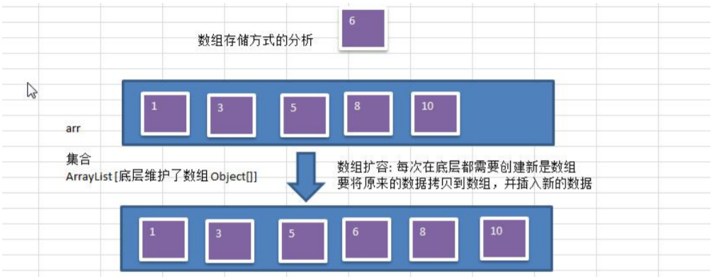
- 链式存储方式的分析
  优点：在一定程度上对数组存储方式有优化(比如：插入一个数值节点，只需要将插入节点，链接到链表中即可，
  删除效率也很好)。
  缺点：在进行检索时，效率仍然较低，比如(检索某个值，需要从头节点开始遍历)

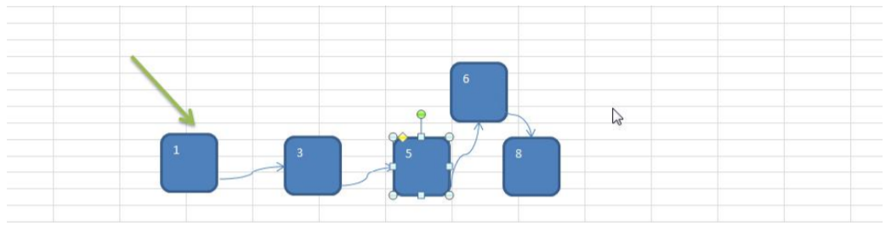

- 1)**树**存储方式的分析
  能提高数据**存储，读取**的效率,  比如利用 **二叉排序树**(Binary Sort Tree)，既可以保证数据的检索速度，同时也可以保证数据的插入，删除，修改的速度。【示意图,后面详讲】

**案例:\[7,3, 10, 1, 5, 9, 12\]**


### 10.1.2）树示意图

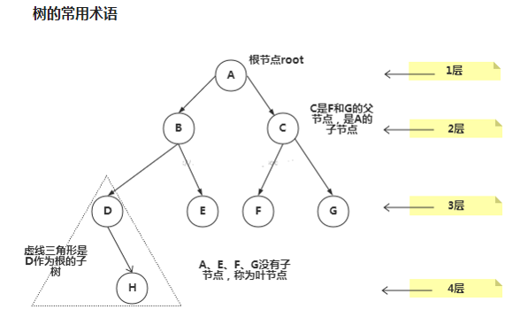

**树的常用术语(结合示意图理解):**       

- 1)节点
- 2)根节点
- 3)父节点
- 4)子节点
- 5)叶子节点 (没有子节点的节点)
- 6)节点的权(节点值)
- 7)路径(从root节点找到该节点的路线)
- 8)层
- 9)子树
- 10)树的高度(最大层数)
- 11)森林 :多颗子树构成森林

### 10.1.3）二叉树的概念

1)树有很多种，每个节点**最多只能有两个子节点**的一种形式称为二叉树。      

2)二叉树的子节点分为左节点和右节点。    

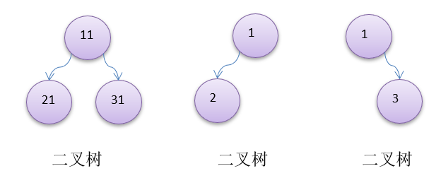

3)如果该二叉树的**所有叶子节点都在最后一层**，并且结点总数= 2^n -1 , n 为层数，则我们称为**满二叉树**。      

4)如果该二叉树的所有叶子节点都在最后一层或者倒数第二层，而且最后一层的叶子节点在左边连续，倒数第二层的叶子节点在右边连续，我们称为**完全二叉树。**

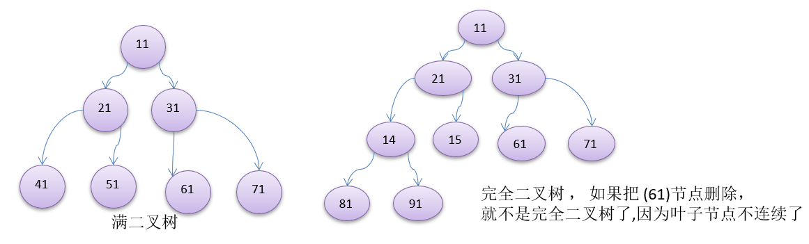

### 10.1.4）二叉树(前、中、后、序)遍历的说明

使用**前序**，**中序**和**后序**对下面的二叉树进行遍历

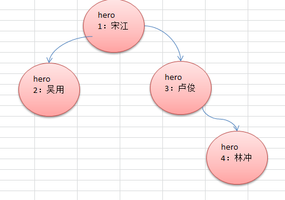

前序遍历: **先输出父节点**，再遍历左子树和右子树      

中序遍历: 先遍历左子树，**再输出父节点**，再遍历右子树      

后序遍历: 先遍历左子树，再遍历右子树，**最后输出父节点 **      

**小结**: 看输出父节点的顺序，就确定是前序，中序还是后序     

### 10.1.5）二叉树遍历应用实例(前序,中序,后序)

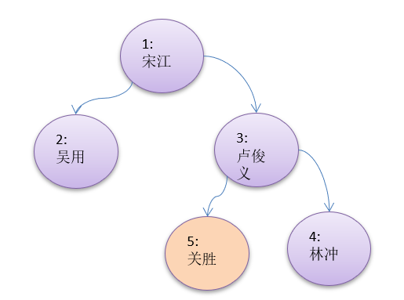

### 10.1.6）代码实现

```java
package com.wck.tree;

/**
 * @author YuXiangKaoChi
 * @createTime 2020-05-16 17:41:55 类说明： 前中后序
 */
public class BinaryTreeDemo {
	
	public static void main(String[] args) {
		//构造节点
		HeroNode root = new HeroNode(1, "宋江");
		HeroNode node2 = new HeroNode(2, "吴用");
		HeroNode node3 = new HeroNode(3, "卢俊义");
		HeroNode node4 = new HeroNode(4, "林冲");
		HeroNode node5 = new HeroNode(5, "关胜");
		
		//树的关系建立
		root.setLeft(node2);
		root.setRight(node3);
		
		node3.setLeft(node5);
		node3.setRight(node4);
		
		BinaryTree binaryTree = new BinaryTree();
		binaryTree.setRoot(root);
		System.out.println("前序遍历：");
		binaryTree.prevOrder();
		System.out.println("中序遍历：");
		binaryTree.infixOrder();
		System.out.println("后序遍历：");
		binaryTree.postOrder();
		
	}
	

}

//二叉树
class BinaryTree {
	// 根节点
	private HeroNode root;

	public void setRoot(HeroNode root) {
		this.root = root;
	}

	// 前序遍历
	public void prevOrder() {
		this.root.prevOrder();
	}

	// 中序遍历
	public void infixOrder() {
		this.root.infixOrder();
	}

	// 后序遍历
	public void postOrder() {
		this.root.postOrder();
	}

}


//英雄节点类
class HeroNode {
	// 英雄编号
	private int no;
	// 英雄姓名
	private String name;

	// 左边的节点
	private HeroNode left;
	// 右边的节点
	private HeroNode right;

	public HeroNode(int no, String name) {
		this.no = no;
		this.name = name;
	}

	public int getNo() {
		return no;
	}

	public void setNo(int no) {
		this.no = no;
	}

	public String getName() {
		return name;
	}

	public void setName(String name) {
		this.name = name;
	}

	public HeroNode getLeft() {
		return left;
	}

	public void setLeft(HeroNode left) {
		this.left = left;
	}

	public HeroNode getRight() {
		return right;
	}

	public void setRight(HeroNode right) {
		this.right = right;
	}

	@Override
	public String toString() {
		return "HeroNode [no=" + no + ", name=" + name + "]";
	}

	// 前序遍历(根左右)
	public void prevOrder() {
		// 输出根节点
		// 根
		System.out.println(this);
		// 左
		if (this.left != null) {
			this.left.prevOrder();
		}
		// 右
		if (this.right != null) {
			this.right.prevOrder();
		}
	}

	// 中序遍历(左根右)
	public void infixOrder() {
		// 左
		if (this.left != null) {
			this.left.infixOrder();
		}
		// 根
		System.out.println(this);
		// 右
		if (this.right != null) {
			this.right.infixOrder();
		}
	}
	// 后序遍历(左右根)
	public void postOrder() {
		// 左
		if (this.left != null) {
			this.left.postOrder();
		}
		// 右
		if (this.right != null) {
			this.right.postOrder();
		}
		// 根
		System.out.println(this);
	}
}
```

### 10.1.7）二叉树-查找指定节点

**要求**

- 1)请编写前序查找，中序查找和后序查找的方法。
- 2)并分别使用三种查找方式，查找 heroNO = 5 的节点
- 3)并分析各种查找方式，分别比较了多少次

### 10.1.8）二叉树-查找指定节点-分析

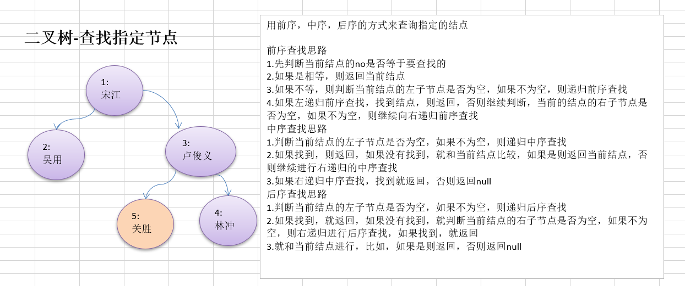

用前序，中序，后序的方式来查询指定的结点

- 前序查找思路         

1.先判断当前结点的no是否等于要查找的          

2.如果是相等，则返回当前结点

3.如果不等，则判断当前结点的左子节点是否为空，如果不为空，则递归前序查找

4.如果左递归前序查找，找到结点，则返回，否则继续判断，当前的结点的右子节点是否为空，如果不为空，则继续向右递归前序查找

- 中序查找思路

1.判断当前结点的左子节点是否为空，如果不为空，则递归中序查找

2.如果找到，则返回，如果没有找到，就和当前结点比较，如果是则返回当前结点，否则继续进行右递归的中序查找

3.如果右递归中序查找，找到就返回，否则返回null

- 后序查找思路

1.判断当前结点的左子节点是否为空，如果不为空，则递归后序查找

2.如果找到，就返回，如果没有找到，就判断当前结点的右子节点是否为空，如果不为空，则右递归进行后序查找，如果找到，就返回

3.就和当前结点进行，比如，如果是则返回，否则返回null

### 10.1.8）二叉树-查找指定节点-代码实现

```java
package com.wck.tree;

/**
 * @author YuXiangKaoChi
 * @createTime 2020-05-16 17:41:55 类说明： 前中后序
 */
public class BinaryTreeDemo {
	
	public static void main(String[] args) {
		//构造节点
		HeroNode root = new HeroNode(1, "宋江");
		HeroNode node2 = new HeroNode(2, "吴用");
		HeroNode node3 = new HeroNode(3, "卢俊义");
		HeroNode node4 = new HeroNode(4, "林冲");
		HeroNode node5 = new HeroNode(5, "关胜");
		
		//树的关系建立
		root.setLeft(node2);
		root.setRight(node3);
		
		node3.setLeft(node5);
		node3.setRight(node4);
		
		BinaryTree binaryTree = new BinaryTree();
		binaryTree.setRoot(root);
		System.out.println("前序遍历：");
		binaryTree.prevOrder();
		System.out.println("中序遍历：");
		binaryTree.infixOrder();
		System.out.println("后序遍历：");
		binaryTree.postOrder();
		
		//前中后序的查找
		//前序查找 次数 4
		int no=5;
		/*
		System.out.println("前序查找:");
		HeroNode resNode = binaryTree.prevOrderSearch(no);
		if(resNode != null) {
			System.out.println("找到了："+resNode.toString());
		}else {
			System.out.println("没有找到，no："+no);
		}
		*/

		/*
		//中序查找 次数 3
		System.out.println("中序查找:");
		HeroNode resNode2 = binaryTree.infixOrderSearch(no);
		if(resNode2 != null) {
			System.out.println("找到了："+resNode2.toString());
		}else {
			System.out.println("没有找到，no："+no);
		}
		*/
		//后序查找 次数 2
		System.out.println("后序查找:");
		HeroNode resNode3 = binaryTree.postOrderSearch(no);
		if (resNode3 != null) {
			System.out.println("找到了：" + resNode3.toString());
		} else {
			System.out.println("没有找到，no：" + no);
		}
	}
	

}

//二叉树
class BinaryTree {
	// 根节点
	private HeroNode root;

	public void setRoot(HeroNode root) {
		this.root = root;
	}

	// 前序遍历
	public void prevOrder() {
		this.root.prevOrder();
	}

	// 中序遍历
	public void infixOrder() {
		this.root.infixOrder();
	}

	// 后序遍历
	public void postOrder() {
		this.root.postOrder();
	}
	
	
	//前序查找
	public HeroNode prevOrderSearch(int no) {
		return this.root.prevOrderSearch(no);
	}
	
	//中序查找
	public HeroNode infixOrderSearch(int no) {
		return this.root.infixOrderSearch(no);
	}
	
	//后序查找
	public HeroNode postOrderSearch(int no) {
		return this.root.postOrderSearch(no);
	}

}

//英雄节点类
class HeroNode {
	// 英雄编号
	private int no;
	// 英雄姓名
	private String name;

	// 左边的节点
	private HeroNode left;
	// 右边的节点
	private HeroNode right;

	public HeroNode(int no, String name) {
		this.no = no;
		this.name = name;
	}

	public int getNo() {
		return no;
	}

	public void setNo(int no) {
		this.no = no;
	}

	public String getName() {
		return name;
	}

	public void setName(String name) {
		this.name = name;
	}

	public HeroNode getLeft() {
		return left;
	}

	public void setLeft(HeroNode left) {
		this.left = left;
	}

	public HeroNode getRight() {
		return right;
	}

	public void setRight(HeroNode right) {
		this.right = right;
	}

	@Override
	public String toString() {
		return "HeroNode [no=" + no + ", name=" + name + "]";
	}

	// 前序遍历(根左右)
	public void prevOrder() {
		// 输出根节点
		// 根
		System.out.println(this);
		// 左
		if (this.left != null) {
			this.left.prevOrder();
		}
		// 右
		if (this.right != null) {
			this.right.prevOrder();
		}
	}

	// 中序遍历(左根右)
	public void infixOrder() {
		// 左
		if (this.left != null) {
			this.left.infixOrder();
		}
		// 根
		System.out.println(this);
		// 右
		if (this.right != null) {
			this.right.infixOrder();
		}
	}

	// 后序遍历(左右根)
	public void postOrder() {
		// 左
		if (this.left != null) {
			this.left.postOrder();
		}
		// 右
		if (this.right != null) {
			this.right.postOrder();
		}
		// 根
		System.out.println(this);
	}
	
	//前序遍历查找(根左右)
	public HeroNode prevOrderSearch(int no) {
		System.out.println("前序查找次数");
		//查找根
		if(this.no == no) {
			return this;
		}
		HeroNode resNode=null;
		//左查找
		if(this.left !=null) {
			resNode=this.left.prevOrderSearch(no);
		}
		
		//左边的分支节点找到
		if(resNode != null) {
			return resNode;
		}
		
		//右查找
		if(this.right !=null) {
			resNode=this.right.prevOrderSearch(no);
		}
		return resNode;
	}
	
	//中序遍历查找(左根右)
	public HeroNode infixOrderSearch(int no) {
		HeroNode resNode = null;
		// 左查找
		if (this.left != null) {
			resNode = this.left.infixOrderSearch(no);
		}
		// 左边的分支节点找到
		if (resNode != null) {
			return resNode;
		}
		System.out.println("中序查找次数");
		// 查找根
		if (this.no == no) {
			return this;
		}

		// 右查找
		if (this.right != null) {
			resNode = this.right.infixOrderSearch(no);
		}
		return resNode;
	}
	
	// 后序遍历查找(左右根)
	public HeroNode postOrderSearch(int no) {
		HeroNode resNode = null;
		// 左查找
		if (this.left != null) {
			resNode = this.left.postOrderSearch(no);
		}
		// 左边的分支节点找到
		if (resNode != null) {
			return resNode;
		}

		// 右查找
		if (this.right != null) {
			resNode = this.right.postOrderSearch(no);
		}
		// 右边的分支节点找到
		if (resNode != null) {
			return resNode;
		}
		System.out.println("后序查找次数");
		// 查找根
		if (this.no == no) {
			return this;
		}
		return resNode;
	}
	
}
```

### 10.1.9）二叉树-删除节点

**要求**          

- 1)如果删除的节点是叶子节点，则删除该节点
- 2)如果删除的节点是非叶子节点，则删除该子树.
- 3)测试，删除掉 5号叶子节点 和 3号子树.

### 10.1.10）二叉树-删除节点-思路分析

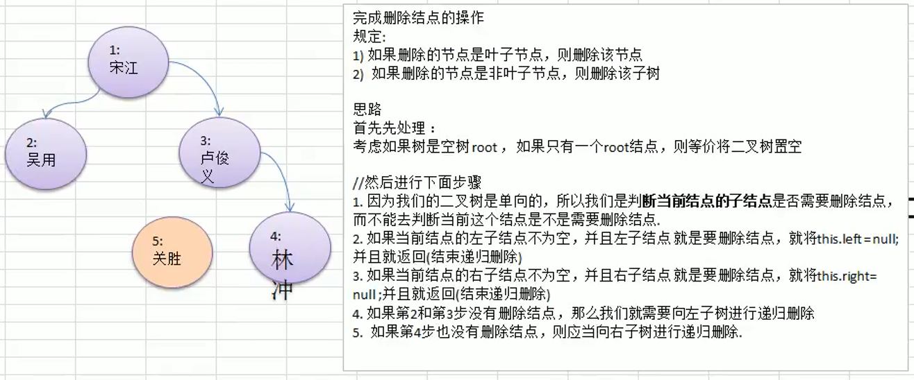


**完成删除结点的操作**

- 规定：
  - 1）如果删除的节点是叶子节点，则删除该节点
  - 2）如果删除的节点是非叶子节点，则删除该子树
- 思路
  首先先处理：
  - 考虑如果树是空树root，如果只有一个root结点，则等价将二又树置空
    //然后进行下面步骤
  - 1.因为我们的二叉树是单向的，所以我们是判断当前结点的子结点是否需要删除结点，而不能去判断当前这个结点是不是需要删除结点.
  - 2.如果当前结点的左子结点不为空，并且左子结点就是要删除结点，就将this.left=null并且就返回（结束递归删除）
  - 3.如果当前结点的右子结点不为空，并且右子结点就是要删除结点，就将this.right=null；并且就返回（结束递归删除）
  - 4.如果第2和第3步没有删除结点，那么我们就需要向左子树进行递归删除
  - 5.如果第4步也没有删除结点，则应当向右子树进行递归删除.

### 10.1.11）二叉树-删除节点-代码完成

```java
package com.wck.tree;

/**
 * @author YuXiangKaoChi
 * @createTime 2020-05-16 17:41:55 类说明： 前中后序
 */
public class BinaryTreeDemo {
	
	public static void main(String[] args) {
		//构造节点
		HeroNode root = new HeroNode(1, "宋江");
		HeroNode node2 = new HeroNode(2, "吴用");
		HeroNode node3 = new HeroNode(3, "卢俊义");
		HeroNode node4 = new HeroNode(4, "林冲");
		HeroNode node5 = new HeroNode(5, "关胜");
		
		//树的关系建立
		root.setLeft(node2);
		root.setRight(node3);
		
		node3.setLeft(node5);
		node3.setRight(node4);
		
		BinaryTree binaryTree = new BinaryTree();
		binaryTree.setRoot(root);
		/*
		binaryTree.setRoot(root);
		System.out.println("前序遍历：");
		binaryTree.prevOrder();
		System.out.println("中序遍历：");
		binaryTree.infixOrder();
		System.out.println("后序遍历：");
		binaryTree.postOrder();
		*/
		
		//前中后序的查找
		//前序查找 次数 4
		/*int no=5;
		System.out.println("前序查找:");
		HeroNode resNode = binaryTree.prevOrderSearch(no);
		if(resNode != null) {
			System.out.println("找到了："+resNode.toString());
		}else {
			System.out.println("没有找到，no："+no);
		}
		*/

		/*
		//中序查找 次数 3
		System.out.println("中序查找:");
		HeroNode resNode2 = binaryTree.infixOrderSearch(no);
		if(resNode2 != null) {
			System.out.println("找到了："+resNode2.toString());
		}else {
			System.out.println("没有找到，no："+no);
		}
		*/
		/*
		//后序查找 次数 2
		System.out.println("后序查找:");
		HeroNode resNode3 = binaryTree.postOrderSearch(no);
		if (resNode3 != null) {
			System.out.println("找到了：" + resNode3.toString());
		} else {
			System.out.println("没有找到，no：" + no);
		}
		*/
		
		//测试，删除掉 5号叶子节点 和 3号子树.
		System.out.println("删除前的前序为：");
		binaryTree.prevOrder();
		System.out.println("删除后的前序为：");
		binaryTree.delNode(5);
		binaryTree.prevOrder();
		
		
	}
	

}

//二叉树
class BinaryTree {
	// 根节点
	private HeroNode root;

	public void setRoot(HeroNode root) {
		this.root = root;
	}

	// 前序遍历
	public void prevOrder() {
		this.root.prevOrder();
	}

	// 中序遍历
	public void infixOrder() {
		this.root.infixOrder();
	}

	// 后序遍历
	public void postOrder() {
		this.root.postOrder();
	}
	
	
	//前序查找
	public HeroNode prevOrderSearch(int no) {
		return this.root.prevOrderSearch(no);
	}
	
	//中序查找
	public HeroNode infixOrderSearch(int no) {
		return this.root.infixOrderSearch(no);
	}
	
	//后序查找
	public HeroNode postOrderSearch(int no) {
		return this.root.postOrderSearch(no);
	}
	
	//删除节点
	public void delNode(int no) {
		//先判断根节点是否为null
		if(root!= null) {
			//根节点的no和待删除的no一样，直接删除
			if(root.getNo() == no) {
				root=null;
			}else {
				//查找删除
				root.delNode(no);
			}
		}else {
			System.out.println("该根节点为空，不能再删除了");
		}
		
	}

}

//英雄节点类
class HeroNode {
	// 英雄编号
	private int no;
	// 英雄姓名
	private String name;

	// 左边的节点
	private HeroNode left;
	// 右边的节点
	private HeroNode right;

	public HeroNode(int no, String name) {
		this.no = no;
		this.name = name;
	}

	public int getNo() {
		return no;
	}

	public void setNo(int no) {
		this.no = no;
	}

	public String getName() {
		return name;
	}

	public void setName(String name) {
		this.name = name;
	}

	public HeroNode getLeft() {
		return left;
	}

	public void setLeft(HeroNode left) {
		this.left = left;
	}

	public HeroNode getRight() {
		return right;
	}

	public void setRight(HeroNode right) {
		this.right = right;
	}

	@Override
	public String toString() {
		return "HeroNode [no=" + no + ", name=" + name + "]";
	}

	// 前序遍历(根左右)
	public void prevOrder() {
		// 输出根节点
		// 根
		System.out.println(this);
		// 左
		if (this.left != null) {
			this.left.prevOrder();
		}
		// 右
		if (this.right != null) {
			this.right.prevOrder();
		}
	}

	// 中序遍历(左根右)
	public void infixOrder() {
		// 左
		if (this.left != null) {
			this.left.infixOrder();
		}
		// 根
		System.out.println(this);
		// 右
		if (this.right != null) {
			this.right.infixOrder();
		}
	}

	// 后序遍历(左右根)
	public void postOrder() {
		// 左
		if (this.left != null) {
			this.left.postOrder();
		}
		// 右
		if (this.right != null) {
			this.right.postOrder();
		}
		// 根
		System.out.println(this);
	}
	
	
	//前序遍历查找(根左右)
	public HeroNode prevOrderSearch(int no) {
		System.out.println("前序查找次数");
		//查找根
		if(this.no == no) {
			return this;
		}
		HeroNode resNode=null;
		//左查找
		if(this.left !=null) {
			resNode=this.left.prevOrderSearch(no);
		}
		
		//左边的分支节点找到
		if(resNode != null) {
			return resNode;
		}
		
		//右查找
		if(this.right !=null) {
			resNode=this.right.prevOrderSearch(no);
		}
		return resNode;
	}
	
	//中序遍历查找(左根右)
	public HeroNode infixOrderSearch(int no) {
		HeroNode resNode = null;
		// 左查找
		if (this.left != null) {
			resNode = this.left.infixOrderSearch(no);
		}
		// 左边的分支节点找到
		if (resNode != null) {
			return resNode;
		}
		System.out.println("中序查找次数");
		// 查找根
		if (this.no == no) {
			return this;
		}

		// 右查找
		if (this.right != null) {
			resNode = this.right.infixOrderSearch(no);
		}
		return resNode;
	}
	
	// 后序遍历查找(左右根)
	public HeroNode postOrderSearch(int no) {
		HeroNode resNode = null;
		// 左查找
		if (this.left != null) {
			resNode = this.left.postOrderSearch(no);
		}
		// 左边的分支节点找到
		if (resNode != null) {
			return resNode;
		}

		// 右查找
		if (this.right != null) {
			resNode = this.right.postOrderSearch(no);
		}
		// 右边的分支节点找到
		if (resNode != null) {
			return resNode;
		}
		System.out.println("后序查找次数");
		// 查找根
		if (this.no == no) {
			return this;
		}

		return resNode;
	}
	
	//删除节点
	//传递待删除的no
	public void delNode(int no) {
		//要求的规则
		//如果删除的节点是叶子节点，则删除该节点
		//如果删除的节点是非叶子节点，则删除该子树.
		//测试，删除掉 5号叶子节点 和 3号子树.

		//先判断左边的是否是待删除的节点
		if(this.left !=null && this.left.no == no) {
			this.left=null;
		}
		
		//判断右边的是否是待删除的节点
		if(this.right != null && this.right.no == no) {
			this.right=null;
		}
		
		//向左节点递归
		if(this.left !=null) {
			this.left.delNode(no);
		}
		// 向右节点递归
		if (this.right != null) {
			this.right.delNode(no);
		}
	}
	
}
```

### 10.1.12）二叉树-删除节点-附加思考题

- 1)如果要删除的节点是非叶子节点，现在我们不希望将该非叶子节点为根节点的子树删除，**需要指定规则,假如规定如下**:
- 2)如果该非叶子节点A只有一个子节点B，则子节点B替代节点A    
- 3)如果该非叶子节点A有左子节点B和右子节点C，则让左子节点B替代节点A。
- 4)思考，如何完成该删除功能,

### 10.1.13）顺序存储二叉树

#### 10.1.13.1）顺序存储二叉树的概念

- 基本说明

从数据存储来看，**数组存储方式和树的存储方式**可以相互转换，即数组可以转换成树，树也可以转换成数组，看下面的示意图。

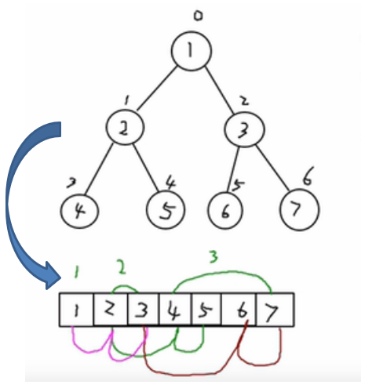

- 要求:

1)右图的二叉树的结点，要求以数组的方式来存放 arr : [1, 2, 3, 4, 5, 6, 6]

2)要求在遍历数组 arr时，仍然可以以 **前序遍历**，**中序遍历**和**后序遍历**的方式完成结点的遍历

- **顺序存储二叉树的特点(重点):**

1. 顺序二叉树通常只考虑完全二叉树
2. 第n个元素的左子节点为  `2 * n + 1` 
3. 第n个元素的右子节点为  `2 * n + 2`
4. 第n个元素的父节点为  `(n-1) / 2`
5. n : 表示二叉树中的第几个元素(按0开始编号 如上图所示)

#### 10.1.13.2）顺序存储二叉树遍历实例

- 需求: 

  给你一个数组 *{*1,2,3,4,5,6,7}，要求以二叉树前序遍历的方式进行遍历。
  前中后序遍历的结果应当为：

  - 前序 1 2 4 5 3 6 7

  - 中序  4 2 5 1 6 3 
  - 后序 4 5 2 6 3 7 1

#### 10.1.13.3）顺序存储二叉树遍历实例-代码实现

```java
package com.wck.tree;

/**
 * 
 * @author YuXiangKaoChi
 * @createTime 2020-05-17 18:14:00
 * 	类说明：顺序存储二叉树遍历
 *  顺序二叉树通常只考虑完全二叉树
 */
public class ArrBinaryTreeDemo {

	public static void main(String[] args) {
		int[] arr = { 1, 2, 3, 4, 5, 6, 7 };
		ArrBinaryTree arrBinaryTree = new ArrBinaryTree(arr);
		//前序 1 2 4 5 3 6 7
		//arrBinaryTree.arrPrevOrder();
		//中序  4 2 5 1 6 3 7
		//arrBinaryTree.arrInfixOrder();
		//后序 4 5 2 6 3 7 1 
		arrBinaryTree.arrPostOrder();
	}
}

/**
 * 用数组来遍历前、中、后序
 * @author YuXiangKaoChi
 * @createTime 2020-05-17 18:15:13
 * 	类说明：
 * 顺序存储二叉树的特点:
   顺序二叉树通常只考虑完全二叉树
	第n个元素的左子节点为  2 * n + 1 
	第n个元素的右子节点为  2 * n + 2
	第n个元素的父节点为  (n-1) / 2
	n : 表示二叉树中的第几个元素(按0开始编号如图所示)

 */
class ArrBinaryTree{
	
	private int[] arr;
	
	public ArrBinaryTree(int[] arr) {
		//初始化数组
		this.arr=arr;
	}
	
	//前序遍历重载方法
	public void arrPrevOrder() {
		arrPrevOrder(0);
	}
	
	//中序遍历重载方法
	public void arrInfixOrder() {
		arrInfixOrder(0);
	}
	
	//后序遍历重载方法
	public void arrPostOrder() {
		arrPostOrder(0);
	}
	//前序遍历 根左右
	public void arrPrevOrder(int index) {
		//检查数组是否为空
		if(this.arr == null || this.arr.length == 0) {
			System.out.println("当前的数组为空，不能遍历");
		}
		//根
		System.out.println("前序遍历为："+arr[index]);
		//左
		if((2*index+1) < arr.length) {
			this.arrPrevOrder(2*index+1);
		}
		//右
		if((2 * index + 2) < arr.length) {
			this.arrPrevOrder(2*index+2);
		}
	}
	
	
	//中序遍历 左根右
	public void arrInfixOrder(int index) {
		//检查数组是否为空
		if (this.arr == null || this.arr.length == 0) {
			System.out.println("当前的数组为空，不能遍历");
		}
		// 左
		if ((2 * index + 1) < arr.length) {
			this.arrInfixOrder(2 * index + 1);
		}
		// 根
		System.out.println("中序遍历为：" + arr[index]);
		// 右
		if ((2 * index + 2) < arr.length) {
			this.arrInfixOrder(2 * index + 2);
		}
	}
	
	// 后序遍历 左右根
	public void arrPostOrder(int index) {
		// 检查数组是否为空
		if (this.arr == null || this.arr.length == 0) {
			System.out.println("当前的数组为空，不能遍历");
		}
		// 左
		if ((2 * index + 1) < arr.length) {
			this.arrPostOrder(2 * index + 1);
		}
		// 右
		if ((2 * index + 2) < arr.length) {
			this.arrInfixOrder(2 * index + 2);
		}
		// 根
		System.out.println("后序遍历为：" + arr[index]);
	}
}
```

### 10.1.14）线索化二叉树

- **先看一个问题**

将数列 {1, 3, 6, 8, 10, 14  } 构建成一颗二叉树.  n+1=7

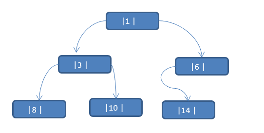

- 问题分析: 
  - 1)当我们对上面的二叉树进行中序遍历时，数列为 {8, 3, 10, 1, 14 ,6 }
  - 2)但是 6, 8, 10, 14 这几个节点的 左右指针，并没有完全的利用上.
  - 3)如果我们希望**充分的利用 各个节点的左右指针**， 让各个节点可以指向自己的前后节点,怎么办?
  - 4)解决方案-线索二叉树

#### 10.1.14.1）线索二叉树基本介绍

- 1)n个结点的二叉链表中含有n+1  【公式 2n-(n-1)=n+1】 个空指针域。利用二叉链表中的空指针域，存放指向**该结点在某种遍历次序**下的前驱和后继结点的指针（这种附加的指针称为"线索"）
- 2)这种加上了线索的二叉链表称为**线索链表**，相应的二叉树称为**线索二叉树(ThreadedBinaryTree)**。根据线索性质的不同，线索二叉树可分为**前序线索二叉树、中序线索二叉树**和**后序线索二叉树**三种
- 3)一个结点的前一个结点，称为**前驱**结点
- 4)一个结点的后一个结点，称为**后继**结点

#### 10.1.14.2）线索二叉树应用案例

**应用案例说明**：将下面的二叉树，进行**中序线索二叉树**。中序遍历的数列为{8,3, 10, 1, 14, 6}


#### 10.1.14.3）线索二叉树应用案例-思路分析

**思路分析**:  [左根右]中序遍历的结果：{8,3, 10, 1, 14, 6}

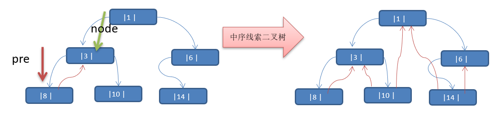

**说明当线索化二叉树后，Node节点的 属性left 和right，有如下情况:**

1)left 指向的是左子树，也可能是指向的前驱节点. 比如 **① 节点 left 指向的左子树, 而 ⑩ 节点的 left 指向的就是前驱节点.**      

2)right指向的是右子树，也可能是指向后继节点，比如 **① 节点right 指向的是右子树，而⑩ 节点的right 指向的是后继节点.**

#### 10.1.14.4）线索二叉树应用案例-代码实现

```java
package com.wck.tree.threadedbinarytree;

/**
 * 
 * @author YuXiangKaoChi
 * @createTime 2020-05-18 10:46:12
 * 	类说明：线索化二叉树
 */
public class ThreadedBinaryTreeDemo {

	public static void main(String[] args) {
		// 测试一把中序线索二叉树的功能
		HeroNode root = new HeroNode(1, "tom");
		HeroNode node2 = new HeroNode(3, "jack");
		HeroNode node3 = new HeroNode(6, "smith");
		HeroNode node4 = new HeroNode(8, "mary");
		HeroNode node5 = new HeroNode(10, "king");
		HeroNode node6 = new HeroNode(14, "dim");

		// 二叉树，后面我们要递归创建, 现在简单处理使用手动创建
		root.setLeft(node2);
		root.setRight(node3);
		node2.setLeft(node4);
		node2.setRight(node5);
		node3.setLeft(node6);

		// 测试中序线索化
		ThreadedBinaryTree threadedBinaryTree = new ThreadedBinaryTree();
		threadedBinaryTree.setRoot(root);
		threadedBinaryTree.threadedNodes();

		// 测试: 以10号节点测试
		HeroNode leftNode = node5.getLeft();
		HeroNode rightNode = node5.getRight();
		System.out.println("10号结点的前驱结点是 =" + leftNode); // 3
		System.out.println("10号结点的后继结点是=" + rightNode); // 1
		
		//线索化二叉树遍历【中序】
		threadedBinaryTree.threadedList();
	}

}

class ThreadedBinaryTree {
	//需要传递的根节点
	private HeroNode root ;

	public void setRoot(HeroNode root) {
		this.root = root;
	}
	
	//为了实现线索化，需要创建要给指向当前结点的前驱节点指针
	//在递归进行线索化时，pre总是保留前一个节点
	private HeroNode pre;
	
	public void threadedNodes() {
		threadedNodes(this.root);
	}
	
	
	// 线索化二叉树遍历
	// 遍历线索化二叉树的方法
	public void threadedList() {
		// 定义一个变量，存储当前遍历的结点，从root开始
		HeroNode node = root;
		while (node != null) {
			// 循环的找到leftType == 1的结点，第一个找到就是8结点
			// 后面随着遍历而变化,因为当leftType==1时，说明该结点是按照线索化
			// 处理后的有效结点
			while (node.getLeftType() == 0) {
				node = node.getLeft();
			}

			// 打印当前这个结点
			System.out.println(node);
			// 如果当前结点的右指针指向的是后继结点,就一直输出
			while (node.getRightType() == 1) {
				// 获取到当前结点的后继结点
				node = node.getRight();
				System.out.println(node);
			}
			// 替换这个遍历的结点
			node = node.getRight();

		}
	}
	
	/**
	 * 中序线索化 左根右
	 * 线索化方法，需要线索化的节点
	 * @param node
	 */
	public void threadedNodes(HeroNode node) {
		//线索化的节点为空，直接返回
		if(node == null) {
			return;
		}
		//一、线索化左
		threadedNodes(node.getLeft());
		
		//二、线索化根
		//处理当前结点的前驱结点
		//以8结点来理解
		//8结点的.left = null , 8结点的.leftType = 1
		if(node.getLeft() == null) {
			//让当前结点的左指针指向前驱结点 
			node.setLeft(pre);
			//修改当前结点的左指针的类型,指向前驱结点
			node.setLeftType(1);
		}
		//处理后继结点
		if(pre != null && pre.getRight() == null) {
			//让前驱结点的右指针指向当前结点
			pre.setRight(node);
			//修改前驱结点的右指针类型
			pre.setRightType(1);
		}
		//!!! 每处理一个结点后，让当前结点是下一个结点的前驱结点
		pre=node;
		
		//三、线索化右
		threadedNodes(node.getRight());
		
	}
	
}
//英雄节点类
class HeroNode {
	// 英雄编号
	private int no;
	// 英雄姓名
	private String name;

	// 左边的节点
	private HeroNode left;
	// 右边的节点
	private HeroNode right;
	
	//左边节点的类型，0:子树 1：前驱节点
	private int leftType;
	//右边节点的类型，0:子树 1：后继节点
	private int rightType;

	public HeroNode(int no, String name) {
		this.no = no;
		this.name = name;
	}

	public int getNo() {
		return no;
	}

	public void setNo(int no) {
		this.no = no;
	}

	public String getName() {
		return name;
	}

	public void setName(String name) {
		this.name = name;
	}

	public HeroNode getLeft() {
		return left;
	}

	public void setLeft(HeroNode left) {
		this.left = left;
	}

	public HeroNode getRight() {
		return right;
	}

	public void setRight(HeroNode right) {
		this.right = right;
	}

	public int getLeftType() {
		return leftType;
	}

	public void setLeftType(int leftType) {
		this.leftType = leftType;
	}

	public int getRightType() {
		return rightType;
	}

	public void setRightType(int rightType) {
		this.rightType = rightType;
	}

	@Override
	public String toString() {
		return "HeroNode [no=" + no + ", name=" + name + "]";
	}
}
```

#### 10.1.14.5）遍历线索化二叉树

**说明：**对前面的中序线索化的二叉树， 进行遍历

**分析**：因为线索化后，各个结点指向有变化，因此，这时需要使用新的方式，各个节点可以通过线型方式遍历，因此无需使用递归方式，这样也提高了遍历的效率。 

#### 10.1.14.6）遍历线索化二叉树-代码实现

```java
package com.wck.tree.threadedbinarytree;

/**
 * 
 * @author YuXiangKaoChi
 * @createTime 2020-05-18 10:46:12
 * 	类说明：线索化二叉树
 */
public class ThreadedBinaryTreeDemo {

	public static void main(String[] args) {
		// 测试一把中序线索二叉树的功能
		HeroNode root = new HeroNode(1, "tom");
		HeroNode node2 = new HeroNode(3, "jack");
		HeroNode node3 = new HeroNode(6, "smith");
		HeroNode node4 = new HeroNode(8, "mary");
		HeroNode node5 = new HeroNode(10, "king");
		HeroNode node6 = new HeroNode(14, "dim");

		// 二叉树，后面我们要递归创建, 现在简单处理使用手动创建
		root.setLeft(node2);
		root.setRight(node3);
		node2.setLeft(node4);
		node2.setRight(node5);
		node3.setLeft(node6);

		// 测试中序线索化
		ThreadedBinaryTree threadedBinaryTree = new ThreadedBinaryTree();
		threadedBinaryTree.setRoot(root);
		threadedBinaryTree.threadedNodes();

		// 测试: 以10号节点测试
		HeroNode leftNode = node5.getLeft();
		HeroNode rightNode = node5.getRight();
		System.out.println("10号结点的前驱结点是 =" + leftNode); // 3
		System.out.println("10号结点的后继结点是=" + rightNode); // 1
		
		//线索化二叉树遍历【中序】
		threadedBinaryTree.threadedList();
	}

}

class ThreadedBinaryTree {
	//需要传递的根节点
	private HeroNode root ;

	public void setRoot(HeroNode root) {
		this.root = root;
	}
	
	//为了实现线索化，需要创建要给指向当前结点的前驱节点指针
	//在递归进行线索化时，pre总是保留前一个节点
	private HeroNode pre;
	
	public void threadedNodes() {
		threadedNodes(this.root);
	}
	
	
	// 线索化二叉树遍历
	// 遍历线索化二叉树的方法
	public void threadedList() {
		// 定义一个变量，存储当前遍历的结点，从root开始
		HeroNode node = root;
		while (node != null) {
			// 循环的找到leftType == 1的结点，第一个找到就是8结点
			// 后面随着遍历而变化,因为当leftType==1时，说明该结点是按照线索化
			// 处理后的有效结点
			while (node.getLeftType() == 0) {
				node = node.getLeft();
			}

			// 打印当前这个结点
			System.out.println(node);
			// 如果当前结点的右指针指向的是后继结点,就一直输出
			while (node.getRightType() == 1) {
				// 获取到当前结点的后继结点
				node = node.getRight();
				System.out.println(node);
			}
			// 替换这个遍历的结点
			node = node.getRight();

		}
	}
	
	/**
	 * 中序线索化 左根右
	 * 线索化方法，需要线索化的节点
	 * @param node
	 */
	public void threadedNodes(HeroNode node) {
		//线索化的节点为空，直接返回
		if(node == null) {
			return;
		}
		//一、线索化左
		threadedNodes(node.getLeft());
		
		//二、线索化根
		//处理当前结点的前驱结点
		//以8结点来理解
		//8结点的.left = null , 8结点的.leftType = 1
		if(node.getLeft() == null) {
			//让当前结点的左指针指向前驱结点 
			node.setLeft(pre);
			//修改当前结点的左指针的类型,指向前驱结点
			node.setLeftType(1);
		}
		//处理后继结点
		if(pre != null && pre.getRight() == null) {
			//让前驱结点的右指针指向当前结点
			pre.setRight(node);
			//修改前驱结点的右指针类型
			pre.setRightType(1);
		}
		//!!! 每处理一个结点后，让当前结点是下一个结点的前驱结点
		pre=node;
		
		//三、线索化右
		threadedNodes(node.getRight());	
	}	
}
//英雄节点类
class HeroNode {
	// 英雄编号
	private int no;
	// 英雄姓名
	private String name;

	// 左边的节点
	private HeroNode left;
	// 右边的节点
	private HeroNode right;
	
	//左边节点的类型，0:子树 1：前驱节点
	private int leftType;
	//右边节点的类型，0:子树 1：后继节点
	private int rightType;

	public HeroNode(int no, String name) {
		this.no = no;
		this.name = name;
	}

	public int getNo() {
		return no;
	}

	public void setNo(int no) {
		this.no = no;
	}

	public String getName() {
		return name;
	}

	public void setName(String name) {
		this.name = name;
	}

	public HeroNode getLeft() {
		return left;
	}

	public void setLeft(HeroNode left) {
		this.left = left;
	}

	public HeroNode getRight() {
		return right;
	}

	public void setRight(HeroNode right) {
		this.right = right;
	}

	public int getLeftType() {
		return leftType;
	}

	public void setLeftType(int leftType) {
		this.leftType = leftType;
	}

	public int getRightType() {
		return rightType;
	}

	public void setRightType(int rightType) {
		this.rightType = rightType;
	}

	@Override
	public String toString() {
		return "HeroNode [no=" + no + ", name=" + name + "]";
	}
}
```

#### 10.1.14.7）课后作业

我这里讲解了中序线索化二叉树，前序线索化二叉树和后序线索化二叉树的分析思路类似，同学们作为课后作业完成.

# 第十一章 树结构实际应用


## 11.1）堆排序

**基本介绍 ：**        

- 1)堆排序是利用**堆**这种数据结构而设计的一种排序算法，堆排序是一种**选择排序，**它的最坏，最好，平均时间复杂度均为O(nlogn)，它也是不稳定排序。

-  2)堆是具有以下性质的完全二叉树：每个结点的值都大于或等于其左右孩子结点的值，称为大顶堆, **注意** : 没有要求结点的左孩子的值和右孩子的值的大小关系。

- 3)每个结点的值都小于或等于其左右孩子结点的值，称为小顶堆
- 4)**一般升序采用大顶堆，降序采用小顶堆** 

### 11.1.1）大顶堆举例说明

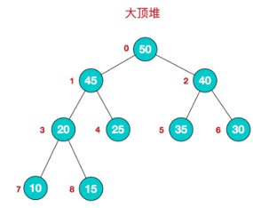

我们对堆中的结点按层进行编号，映射到数组中就是下面这个样子: 

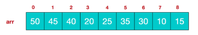

大顶堆特点：`arr[i] >= arr[2*i+1] && arr[i] >= arr[2*i+2]`  // i 对应第几个节点，i从0开始编号

### 11.1.2）小顶堆举例说明

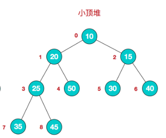

小顶堆特点：`arr[i] <= arr[2*i+1] && arr[i] <= arr[2*i+2]` // i 对应第几个节点，i从0开始编号

### 11.1.3）堆排序基本思想

堆排序的基本思想是：

1. 将待排序序列构造成一个大顶堆
2. 此时，整个序列的**最大值就是堆顶的根节点**。
3. 将其与**末尾元素进行交换，此时末尾就为最大值**。
4. 然后**将剩余n-1个元素重新构造成一个堆**，这样会**得到n个元素的次小值**。**如此反复执行，便能得到一个有序序列了。**

可以看到**在构建大顶堆的过程中，元素的个数逐渐减少，最后就得到一个有序序列了**.

### 11.1.4）堆排序步骤图解说明

要求：给你一个数组 {4,6,8,5,9} , 要求使用堆排序法，将数组升序排序。

**步骤一 构造初始堆。将给定无序序列构造成一个大顶堆（一般升序采用大顶堆，降序采用小顶堆)。**  

1) .假设给定无序序列结构如下      

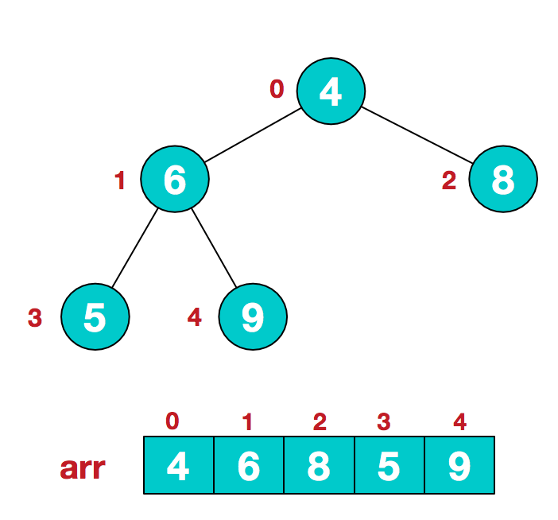

2) .此时我们从最后一个非叶子结点开始（叶结点自然不用调整，第一个非叶子结点 `arr.length/2-1=5/2-1=1`，**也就是下面的6结点），从左至右，从下至上进行调整。**

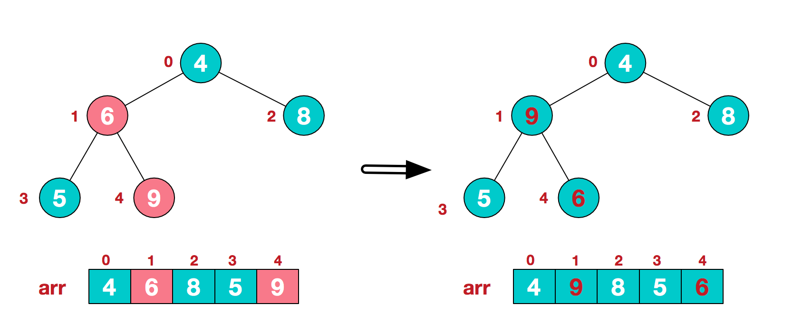

3) .找到第二个非叶节点4，由于\[4,9,8\]中9元素最大，4和9交换。

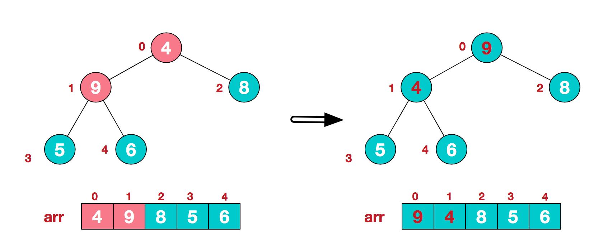

4) 这时，交换导致了子根[4,5,6]结构混乱，继续调整，[4,5,6]中6最大，交换4和6。

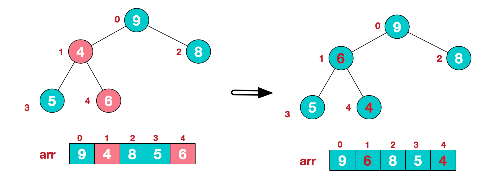

此时，我们就将一个无序序列构造成了一个大顶堆。    

**步骤二 将堆顶元素与末尾元素进行交换，使末尾元素最大。然后继续调整堆，再将堆顶元素与末尾元素交换，得到第二大元素。如此反复进行交换、重建、交换。**

1) .将堆顶元素9和末尾元素4进行交换

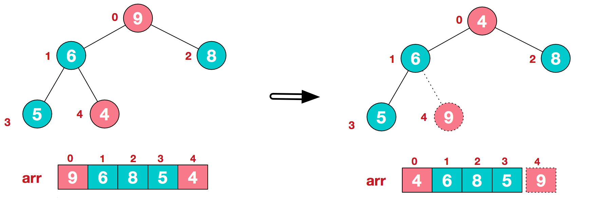

2) .重新调整结构，使其继续满足堆定义

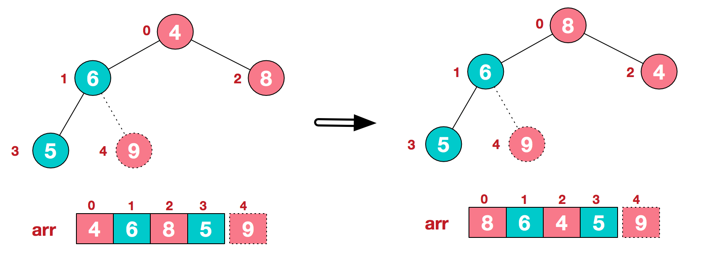

3) .再将堆顶元素8与末尾元素5进行交换，得到第二大元素8.

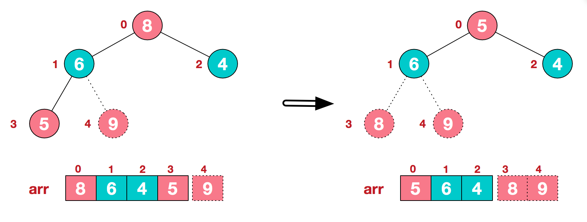

4) 后续过程，继续进行调整，交换，如此反复进行，最终使得整个序列有序

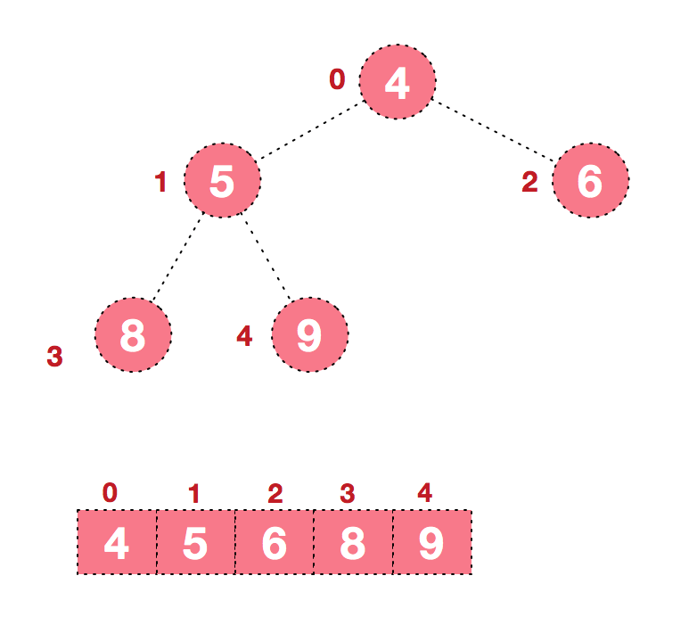

**再简单总结下堆排序的基本思路：**  

- **1).将无序序列构建成一个堆，根据升序降序需求选择大顶堆或小顶堆;**

- **2).将堆顶元素与末尾元素交换，将最大元素"沉"到数组末端;**

- **3).重新调整结构，使其满足堆定义，然后继续交换堆顶元素与当前末尾元素，反复执行调整+交换步骤，直到整个序列有序。**

### 11.1.5）堆排序代码实现

要求：给你一个数组 {4,6,8,5,9} , 要求使用堆排序法，将数组升序排序(从小到大)。

说明：堆排序的**速度非常快**，在我的机器上 8百万数据 3 秒左右。O(nlogn) 

```java
package com.wck.tree;

import java.util.Arrays;

/**
 * 
 * @author YuXiangKaoChi
 * @createTime 2020-05-19 20:25:39
 * 类说明：堆排序（重点比较难理解）
 */
public class HeapSortDemo {

	//堆排序测试
	public static void main(String[] args) {
//		int arr[] = { 4, 6, 8, 5, 9 };
//		heapSort(arr);
		
		int[] arr=new int[8000000];
		for (int i = 0; i < 8000000; i++) {
			arr[i]=(int)(Math.random()*800000000);
		}
		System.out.println("排序前的时间：");
		long currentTimeMillis = System.currentTimeMillis();
		System.out.println(currentTimeMillis);
		heapSort(arr);
		System.out.println("排序后的时间：");
		System.out.println(System.currentTimeMillis()-currentTimeMillis);
		
//		排序前的时间：
//		1589895484721
//		排序后的时间：
//		1617
	}
	
	/**
	 * 堆排序
	 * @param arr 传入待排序的数组
	 */
	public static void heapSort(int[] arr) {	
		/*
		//第一次大顶堆排序
		adjustHeap(arr,1,arr.length);
		System.out.println(Arrays.toString(arr));
		//第二次大顶堆排序
		adjustHeap(arr,0,arr.length);
		System.out.println(Arrays.toString(arr));
		*/
		int temp=0;//用于交换缓存值
		//通过遍历，处理非叶子节点的树，为大顶堆
		for(int i=arr.length/2-1;i>=0;i--) {
			adjustHeap(arr,i,arr.length);
		}
//		System.out.println(Arrays.toString(arr));
		//将堆顶元素与末尾元素进行交换，使末尾元素最大
		//[9, 6, 8, 5, 4]
		for(int j=arr.length-1;j>0;j--) {
			temp=arr[j];//缓存最小的值
			arr[j]=arr[0];//交换值
			arr[0]=temp;//交换值
			adjustHeap(arr, 0, j);
		}
//		System.out.println("数组=" + Arrays.toString(arr)); 
		
	}
	/**
	 * 将传入的数组，以 i 为根节点的树，进行大顶堆的排序
	 * @param arr 数组
	 * @param i  要排序的i(索引)为根节点
	 * @param length 需要排序的长度
	 */
	public static void adjustHeap(int[] arr, int i, int length) {
		int temp = arr[i];// 将要比较的这个根节点缓存起来
		// 从第一个非叶子节点开始进行，大顶堆得排序
		for (int k = i*2 + 1; k <length; k = k*2 + 1) {
			// 查找所有的节点，找到最大的那一个的下标
			if (k+1 < length && arr[k] < arr[k + 1]) {
				k++;
			}
			// 下面的左右节点有一个比根节点大，则需要进行交换
			if (arr[k] > temp) {
				arr[i] = arr[k];// 交换
				i = k;// 交换完成后，i所指向的为k 这个索引
			} else {
				// 如果不大于，则直接进行跳出返回
				break;
			}
		}

		// 到这一步，说明最大的顶堆已经找到，则需要把缓存的值，赋值给索引为i的值
		arr[i] = temp;
	}
}
```

## 11.2）赫夫曼树

### 11.2.1）基本介绍

- 1)给定n个权值作为n个叶子结点，构造一棵二叉树，若该树的带权路径长度(wpl)达到最小，称这样的二叉树为**最优二叉树**，也称为**哈夫曼树(Huffman Tree)**, 还有的书翻译为**霍夫曼树**。

- 2)赫夫曼树是**带权路径长度最短的树，权值较大的结点离根较近**。

### 11.2.2）赫夫曼树几个重要概念和举例说明

1)路径和路径长度：在一棵树中，从一个结点往下可以达到的孩子或孙子结点之间的通路，称为路径。通路中分支的数目称为路径长度。**若规定根结点的层数为1，则从根结点到第L层结点的路径长度为L-1**      

2)**结点的权及带权路径长度：**若将树中结点赋给一个有着某种含义的数值，则这个数值称为该结点的权。**结点的带权路径长度**为：从根结点到该结点之间的路径长度与该结点的权的乘积

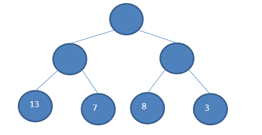

3)**树的带权路径长度：**树的带权路径长度规定为所有**叶子结点**的带权路径长度之和，记为WPL(weighted path length) ,权值越大的结点离根结点越近的二叉树才是最优二叉树。

4)**WPL最小的就是赫夫曼树**

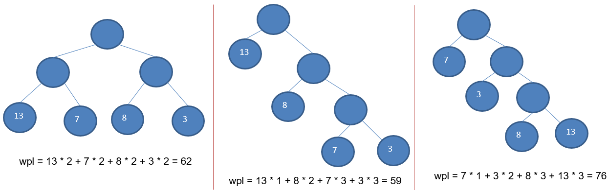

### 11.2.3）赫夫曼树创建思路图解

给你一个数列 {13, 7, 8, 3, 29, 6, 1}，要求转成一颗赫夫曼树.

{13, 7, 8, 3, 20, 6, 1}  

构成赫夫曼树的步骤

1) 从小到大进行排序, 将每一个数据，每个数据都是一个节点 ， 每个节点可以看成是一颗最简单的二叉树.

2) 取出根节点权值最小的两颗二叉树 

3) 组成一颗新的二叉树, 该新的二叉树的根节点的权值是前面两颗二叉树根节点权值的和  

4)  再将这颗新的二叉树，以根节点的权值大小 再次排序， 不断重复  1-2-3-4 的步骤，直到数列中，所有的数据都被处理，就得到一颗赫夫曼树

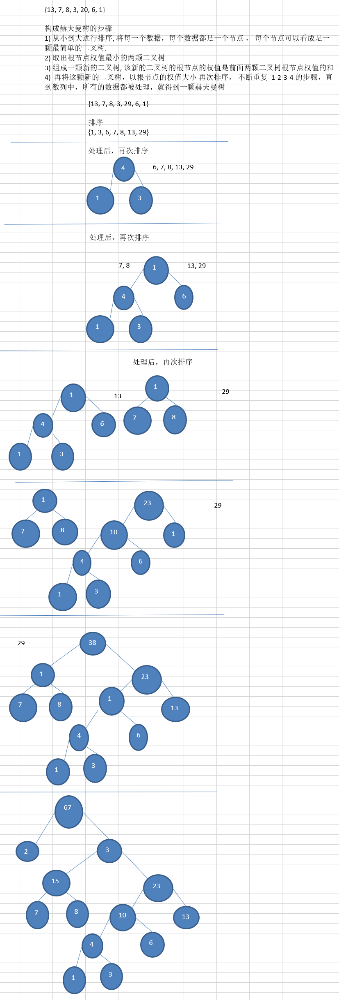

### 11.2.4）赫夫曼树的代码实现

```java
package com.wck.tree;

import java.util.ArrayList;
import java.util.Collections;

public class HuffmanTree {

	public static void main(String[] args) {
		
		int[] arr= {13, 7, 8, 3, 29, 6, 1};
		Node tree = createHuffmanTree(arr);
		prevOrder(tree);
	}
	
	public static void prevOrder(Node root) {
		root.prevOrder();
	}
	
	//创建哈夫曼树
	public static Node createHuffmanTree(int[] arr) {
		//将传入的数组，转换成树节点
		ArrayList<Node> nodes = new ArrayList<Node>();
		for(int value:arr) {
			nodes.add(new Node(value));
		}
//		int count=0;
		while (nodes.size() >1) {
//			System.out.println("排序前："+nodes);
			Collections.sort(nodes);
//			System.out.println("排序后："+nodes);

			//获取第一个最小的值，当做左结点
			Node leftNode=nodes.get(0);
			//获取第二个最小的值，当做右结点
			Node rightNode=nodes.get(1);
			//创建父节点，结点的值为 左右节点的和
			Node parentNode=new Node(leftNode.value+rightNode.value);
			//设置左结点
			parentNode.left=leftNode;
			//设置右结点
			parentNode.right=rightNode;
			
			//去掉刚刚组合的左右结点
			nodes.remove(leftNode);//左节点
			nodes.remove(rightNode);//右节点
			
			//把新的父节点加入到结点列表中去
			nodes.add(parentNode);
			
//			System.out.println("第"+(++count)+"次选取后："+nodes);
		}
		//返回最后调整完的结点
		return nodes.get(0);
		
	}
}
//树节点
class Node implements Comparable<Node>{
	//结点的值，权
	int value;
	//左侧的结点
	Node left;
	//右侧的结点
	Node right;
	public Node(int value) {
		this.value=value;
	}	
	//前序遍历,根左右
	public void prevOrder() {
		//根
		System.out.print(this.value + "  ");
		//左
		if(this.left != null) {
			this.left.prevOrder();
		}
		//右
		if(this.right != null) {
			this.right.prevOrder();
		}
	}
	@Override
	public int compareTo(Node node) {
		//升序
		return this.value - node.value;
	}
	@Override
	public String toString() {
		return "Node [value=" + value + "]";
	}
}
```


