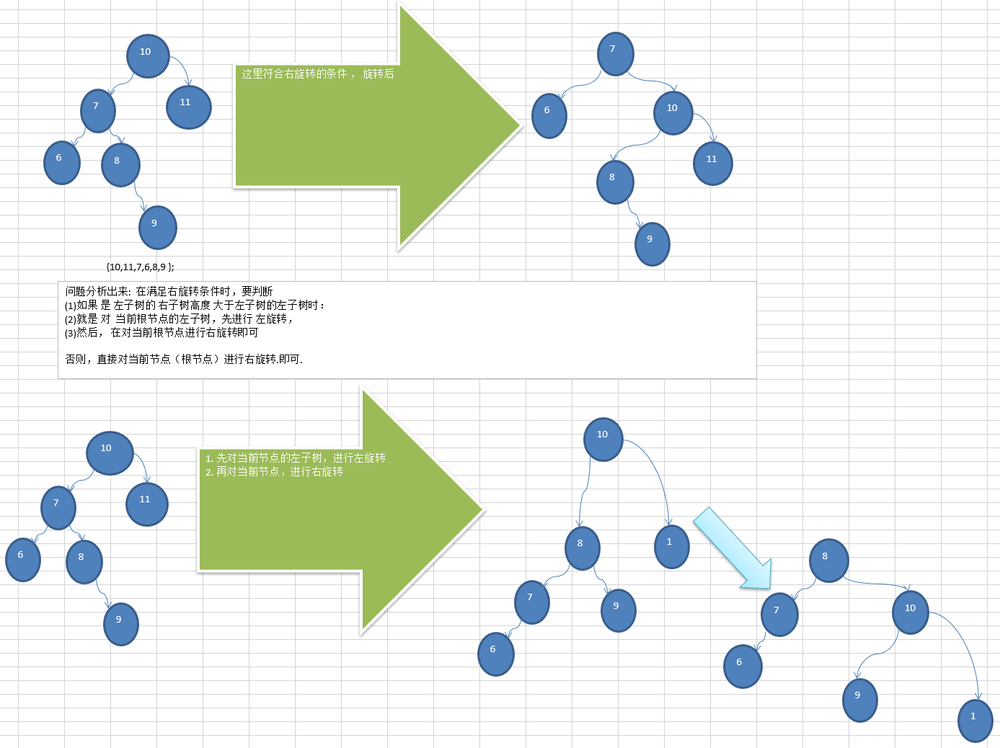
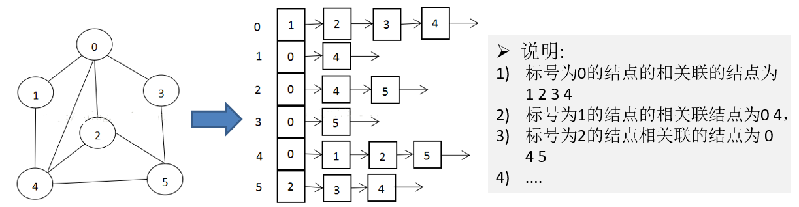

11.4）二叉排序树

### 11.4.1）先看一个需求

给你一个数列(7,3, 10, 12, 5, 1, 9)，要求能够高效的完成对数据的查询和添加

### 11.4.2）解决方案分析

- 使用数组

1)数组未排序， 优点：直接在数组尾添加，速度快。 缺点：查找速度慢. 

2)数组排序，优点：可以使用二分查找，查找速度快，缺点：为了保证数组有序，在添加新数据时，找到插入位置后，后面的数据需整体移动，速度慢。

- 使用链式存储-链表
   不管链表是否有序，查找速度都慢，添加数据速度比数组快，不需要数据整体移动。


- 使用二叉排序树

### 11.4.3）二叉排序树介绍

二叉排序树：BST: (Binary Sort(Search) Tree), 对于二叉排序树的任何一个非叶子节点，**要求左子节点的值比当前节点的值小，右子节点的值比当前节点的值大。**

**特别说明**：如果有相同的值，可以将该节点放在左子节点或右子节点

比如针对前面的数据 (7,3, 10, 12, 5, 1, 9) ，对应的二叉排序树为：


### 11.4.4）二叉排序树创建和遍历

一个数组**创建**成对应的二叉排序树，并使用**中序遍历二叉排序树**，比如: 数组为 *Array*(7, 3, 10, 12, 5, 1, 9) ，
创建成对应的二叉排序树为 :


### 11.4.5）二叉排序树的删除

二叉排序树的删除情况比较复杂，有下面三种情况需要考虑

1)删除叶子节点 (比如：2, 5, 9, 12)

2)删除只有一颗子树的节点 (比如：1)

3)删除有两颗子树的节点. (比如：7, 3，10 )


#### 11.4.5.1）删除叶子节点

删除的节点是叶子节点，**即该节点下没有左右子节点**。
 比如这里的 (比如：2, 5, 9, 12)

1)思路分析

**第一种情况:**

删除叶子节点 (比如：2, 5, 9, 12)

思路

- (1) 需求先去找到要删除的结点  `targetNode`

- (2)  找到`targetNode` 的 父结点 `parent` 

- (3)  确定 `targetNode` 是 `parent`的左子结点 还是右子结点

- (4)  根据前面的情况来对应删除

  左子结点 `parent.left = null;`

  右子结点 `parent.right = null;`

2)代码实现

#### 11.4.5.2）删除节点有一个子节点

删除节点有一个子节点
 删除的节点有一个子节点，**即该节点有左子节点或者右子节点**。比如这里的 (比如：1 )

1)思路分析

**第二种情况**: **删除只有一颗子树的节点** **比如** **1**

思路

- (1) 需求先去找到要删除的结点  `targetNode`
- (2)  找到`targetNode` 的 父结点 `parent` 
- (3) 确定`targetNode` 的子结点是左子结点还是右子结点
- (4) `targetNode` 是 `parent` 的左子结点还是右子结点
- (5) 如果`targetNode` 有左子结点
  - 5.1 如果 `targetNode` 是 `parent` 的左子结点  `parent.left = targetNode.left;`
  - 5.2 如果 `targetNode` 是 `parent` 的右子结点 `parent.right = targetNode.left;`
- 如果`targetNode` 有右子结点
  - 6.1 如果 `targetNode` 是 `parent` 的左子结点 `parent.left = targetNode.right;`
  - 6.2 如果 `targetNode` 是 `parent` 的右子结点 `parent.right = targetNode.right`

2)代码实现

#### 11.4.5.3）删除节点有两个子节点

删除节点有两个子节点
 删除的节点有两个子节点，**即该节点有左子节点和右子节点**。比如这里的 (比如：7,3,10)

1)思路分析

**情况三 ： 删除有两颗子树的节点.** (比如：7, 3，**10** )

思路

- (1) 需求先去找到要删除的结点  `targetNode`
- (2)  找到`targetNode` 的 父结点 `parent` 
- (3)  从`targetNode` 的**右子树找到最小的结点**
- (4) 用一个临时变量，将 最小结点的值保存 `temp = 11`
- (5)  删除该最小结点
- (6)  `targetNode.value = temp`

2)代码实现

3)课后练习：完成老师代码，并使用第二种方式来解决


### 11.4.6）二叉排序树代码章节代码实现

```java
package com.wck.binarysorttree;

public class BinarySortTreeDemo {

	public static void main(String[] args) {
		
		int[] arr= {7, 3, 10, 12, 5, 1, 9,2};
		//创建二叉排序树对象
		BinarySortTree binarySortTree = new BinarySortTree();
		for (int i = 0; i < arr.length; i++) {
			binarySortTree.add(new Node(arr[i]));
		}
		//中序遍历
		binarySortTree.infixOrder();
		
		//删除叶子结点 第一种情况： 删除叶子结点
//		binarySortTree.delNode(2);
//		binarySortTree.delNode(5);
//		binarySortTree.delNode(9);
//		binarySortTree.delNode(12);
//		binarySortTree.delNode(1);
//		System.out.println();
//		System.out.println("第一种情况删除叶子结点：");
//		//中序遍历
//		binarySortTree.infixOrder();
		
		//删除叶子结点 第二种情况：删除只有一颗子树的节点 比如 1
//		System.out.println();
//		System.out.println("第二种情况删除只有一颗子树的节点");
//		binarySortTree.delNode(1);
//		//中序遍历
//		binarySortTree.infixOrder();	
		
		//删除叶子结点 第三种情况：删除有两颗子树的节点. (比如：7, 3，10 )
//		System.out.println();
//		System.out.println("第三种情况删除有两颗子树的节点");
//		binarySortTree.delNode(10);
//		//中序遍历
//		binarySortTree.infixOrder();	
		binarySortTree.delNode(1);
		binarySortTree.delNode(9);
		binarySortTree.delNode(2);
		binarySortTree.delNode(7);
		binarySortTree.delNode(3);
		binarySortTree.delNode(10);
		binarySortTree.delNode(12);
		binarySortTree.delNode(5);
		binarySortTree.infixOrder();
		System.out.println("root:="+binarySortTree.getRoot());
		binarySortTree.infixOrder();
	}
}

class BinarySortTree{
	// 根节点
	private Node root;

	public Node getRoot() {
		return root;
	}

	public void setRoot(Node root) {
		this.root = root;
	}
	// 查找要删除的节点
	public Node search(int value) {
		if (root == null) {
			return null;
		} else {
			return root.search(value);
		}
	}
	// 查找要删除的父节点
	public Node searchParent(int value) {
		if (root == null) {
			return null;
		} else {
			return root.searchParent(value);
		}
	}
	/**
	 * 1.查找以该传入的节点为根节点的左子树的最小的值，因为二叉排序树左边的值比根节点的小
	 * 2.删除该最小结点
	 * @param node 需要查找的数的根节点
	 * @return
	 */
	public int delRightTreeMin(Node node) {
		Node temp=node;
		while (temp.left != null) {
			temp=temp.left;
		}
		delNode(temp.value);//删除这个最小的节点
		return temp.value;//返回这个最小节点的值
	}
	
	//删除节点
	public void delNode(int value) {
		//先找到删除的节点
		Node targetNode = search(value);
		if (targetNode == null) {//说明没有找到删除的节点，删除的节点不存在
			return;
		}
		
		//当前的二叉排序树只有一个节点的时候
		if(root.left == null && root.right == null) {
			root=null;//把根节点置为空，删除该节点
			return;
		}
		
		//找到targetNode 的 父结点 parent 
		Node parent = searchParent(value);
		//第一种情况：删除叶子节点 
		if(targetNode.left == null && targetNode.right == null) {
			//确定 targetNode 是 parent的左子结点 还是右子结点
			if(parent.left != null && parent.left.value == value) {//左子结点的情况
				parent.left=null;//删除左子叶子结点
			}
			
			if(parent.right != null && parent.right.value == value) {//右子结点的情况
				parent.right=null;//删除左子叶子结点
			}
		}else if(targetNode.left != null && targetNode.right != null) {//删除左右两个子结点的情况
			
			int min = delRightTreeMin(targetNode.right);//找当前的节点的右边的最小值
			targetNode.value=min;//重新赋值给targetNode
			
		}else {//删除只有一个子结点的情况
			
			//确定targetNode 的子结点是左子结点还是右子结点
			if(targetNode.left !=null) {//左节点
				if(parent != null ) {
					if(parent.left.value == value) {//父节点的左结点等于要删除的值
						parent.left=targetNode.left;
					}else {
						parent.right=targetNode.left;//父节点的右结点等于要删除的值
					}
				}else {
					root=targetNode.left;
				}
				
				
			}else {//右节点
				if(parent != null) {
					if(parent.left.value == value) {//父节点的左结点等于要删除的值
						parent.left=targetNode.right;
					}else {
						parent.right=targetNode.right;//父节点的右结点等于要删除的值
					}
				}else {
					root=targetNode.right;
				}		
			}
		}
	}
	
	//添加节点
	public void add(Node node) {
		//根节点为空
		if(root == null) {
			root=node;
			return;
		}
		//添加根节点
		root.add(node);
	}
	
	//中序遍历
	public void infixOrder() {
		if(this.root == null) {
			System.out.println("二叉排序树为空，不可遍历");
		}else {
			this.root.infixOrder();
		}
	}
	
}

//树节点类
class Node{
	//值
	int value;
	//左子结点
	Node left;
	//右子结点
	Node right;
	public Node(int value) {
		this.value = value;
	}
	@Override
	public String toString() {
		return "Node [value=" + value + "]";
	}
	
	//需求先去找到要删除的结点  targetNode
	/**
	 * 查找 要删除的结点  targetNode
	 * @param value 删除的value值
	 * @return
	 */
	public Node search(int value) {
		//先判断当前的值是否是要找的值
		if(this.value == value) {
			return this;
		}
		//左递归查找
		if(value < this.value) {
			//防止查找到最后一个节点，还继续查找
			if(this.left == null) {
				return null;//查找了最后的一个叶子结点
			}
			return this.left.search(value);
		}else {//右递归查找
			
			if(this.right == null) {
				return null;//查找了最后的一个叶子结点
			}
			return this.right.search(value);
		}
		
	}
	
	/**
	 * 查找要删除的value的父节点
	 * @param value 要删除的值
	 * @return
	 */
	public Node searchParent(int value) {
		//左侧的节点不为null,且左侧的节点value值和查找的值相同
		//或者右侧的节点不为null,且右侧的节点value值和查找的值相同
		if((this.left != null && this.left.value == value) || 
				(this.right !=null && this.right.value == value)) {
			return this;
		}else {
			
			//如果查找的值，小于当前的左结点
			if(value < this.value && this.left !=null) {
				return this.left.searchParent(value);
			}else if(value >= this.value && this.right !=null){
				//如果查找的值，大于当前的右结点
				return this.right.searchParent(value);
			}else {
				return null;//没有父节点
			}
		}
	}
	/**
	 * 添加子结点
	 * 二叉排序树（二叉搜索树）特点：
	 * 左侧结点比根节点小，右侧结点比根节点大
	 * @param node 需要添加的结点
	 */
	public void add(Node node) {
		//添加的结点比根节点小，放在左边
		if(node.value < this.value) {
			if(this.left == null) {//左子结点为空，则直接进行插入
				this.left=node;
			}else {
				this.left.add(node);//继续向左递归添加
			}
		}else {
			if(this.right == null) {//右边的结点为空，直接进行插入
				this.right=node;
			}else {
				this.right.add(node);//继续向右递归添加
			}
		}
	}
	
	//中序遍历
	public void infixOrder() {
		//左
		if(this.left != null) {
			this.left.infixOrder();
		}
		//根
		System.out.println(this);
		//右
		if(this.right != null) {
			this.right.infixOrder();
		}
	}	
}
```

## 11.5）平衡二叉树(AVL树)

### 11.5.1）看一个案例(说明二叉排序树可能的问题)

给你一个数列{1,2,3,4,5,6}，要求创建一颗二叉排序树(BST), 并分析问题所在.


**上图BST存在的问题分析**:

1)左子树全部为空，从形式上看，更像**一个单链表.**

2)插入速度没有影响

3)**查询速度明显降低**(因为需要依次比较), 不能发挥BST的优势，因为**每次还需要比较左子树，其查询速度比单链表还慢**

4)**解决方案-平衡二叉树(AVL)** 

### 11.5.2）基本介绍

1)平衡二叉树也叫平衡二叉搜索树（Self-balancing binary search tree）又被称为AVL树， 可以**保证查询效率较高**。

2)具有以下**特点**：**它是一 棵空树或它的左右两个子树的高度差的绝对值不超过1**，并且左右两个子树都是一棵**平衡二叉树**。平衡二叉树的常用实现方法有[红黑树](https://baike.baidu.com/item/红黑树/2413209)、[AVL](https://baike.baidu.com/item/AVL/7543015)、[替罪羊树](https://baike.baidu.com/item/替罪羊树/13859070)、[Treap](https://baike.baidu.com/item/Treap)、[伸展树](https://baike.baidu.com/item/伸展树/7003945)等。

3)举例说明, 看看下面哪些AVL树, 为什么?


> ##### :strawberry:一颗二叉排序树调整成平衡二叉树方法
>
> 1.首先查找不平衡的结点是哪个，找出来按照下面图示的四种类型进行调整
>
> 2.如果有多个不平衡的结点，则选出调整节点最少的那个不平衡结点进行调整
>
> 

### 11.5.3）应用案例-单旋转(左旋转)

1)要求: 给你一个数列，创建出对应的平衡二叉树.数列 {4,3,6,5,7,8}

2)思路分析(示意图)


问题：当插入8 时
`rightHeight() - leftHeight() > 1` 成立，此时，不再是一颗avl树了.

怎么处理--进行左旋转.
1. 创建一个新的节点 `newNode` (以4这个值创建),创建一个新的节点，值等于当前根节点的值
2. 把新节点的左子树设置了当前节点的左子树`newNode.left = left` 
3. 把新节点的右子树设置为当前节点的右子树的左子树`newNode.right =right.left;`
4. 把当前节点的值换为右子节点的值 `value=right.value;` 
5. 把当前节点的右子树设置成右子树的右子树 `right=right.right;`
6. 把当前节点的左子树设置为新节点  `left=newLeft;`

3)代码实现 

### 11.5.4）应用案例-单旋转(右旋转)

1)要求: 给你一个数列，创建出对应的平衡二叉树.数列 {10,12, 8, 9, 7, 6}


2)思路分析(示意图)


问题：当插入6 时
`leftHeight()  - rightHeight()  > 1` 成立，此时，不再是一颗avl树了.
怎么处理--进行右旋转.     [就是降低左子树的高度], 这里是将9 这个节点，通过右旋转，到右子树

1. 创建一个新的节点 `newNode` (以10这个值创建),创建一个新的节点，值等于当前根节点的值
2. 把新节点的右子树设置了当前节点的右子树 `newNode.right = right` 
3. 把新节点的左子树设置为当前节点的左子树的右子树 `newNode.left =left.right;`
4. 把当前节点的值换为左子节点的值 `value=left.value;` 
5. 把当前节点的左子树设置成左子树的左子树 `left=left.left;`
6. 把当前节点的右子树设置为新节点 `right=newLeft;`

3)代码实现 

### 11.5.5）应用案例-双旋转

前面的两个数列，进行单旋转(即一次旋转)就可以将非平衡二叉树转成平衡二叉树,但是在某些情况下，单旋转不能完成平衡二叉树的转换。比如数列

**int[]** **arr** **= { 10, 11, 7, 6, 8, 9 };**  **运行原来的代码可以看到，并没有转成AVL树** 

**int[]** **arr** **= {2,1,6,5,7,3}; //** **运行原来的代码可以看到，并没有转成AVL树** 

1)解决思路分析(主要解决的思路在代码部分体现)




2)代码实现

### 11.5.6）平衡二叉树章节的代码实现

```java
package com.wck.avl;


public class AVLTreeDemo {
	public static void main(String[] args) {
		
		//左旋
//		int[] arr = { 4,3,6,5,7,8 };
		//右旋
//		int[] arr = { 10,12, 8, 9, 7, 6 };
		
		//双旋
		int[] arr = { 10, 11, 7, 6, 8, 9 };  
		AVLTree avlTree = new AVLTree();
		
		for (int i = 0; i < arr.length; i++) {
			avlTree.add(new Node(arr[i]));
		}

		System.out.println("调整后中序遍历：");
		avlTree.infixOrder();
		System.out.println("树的高度：");
		System.out.println(avlTree.getRoot().height());
		System.out.println("树的左侧高度：");
		System.out.println(avlTree.getRoot().leftHeight());
		System.out.println("树的右侧高度：");
		System.out.println(avlTree.getRoot().rightHeight());
		System.out.println("根节点为："+avlTree.getRoot());
		System.out.println("根下左节点为："+avlTree.getRoot().left);//4
		System.out.println("根下右节点为："+avlTree.getRoot().right);//7
	}

}

//二叉平衡树
class AVLTree{
	// 根节点
	private Node root;

	public Node getRoot() {
		return root;
	}
	//添加节点
	public void add(Node node) {
		//根节点为空
		if(root == null) {
			root=node;
			return;
		}
		//添加根节点
		root.add(node);
	}
	
	//中序遍历
	public void infixOrder() {
		if(this.root == null) {
			System.out.println("二叉排序树为空，不可遍历");
		}else {
			this.root.infixOrder();
		}	
	}
}


//树节点类
class Node{
	//值
	int value;	
	//左子结点
	Node left;
	//右子结点
	Node right;
	public Node(int value) {
		this.value = value;
	}
	@Override
	public String toString() {
		return "Node [value=" + value + "]";
	}
	/**
	 * 返回左侧的二叉排序树（左子树）的层数
	 * @return
	 */
	public int leftHeight() {
		if(left== null) {
			return 0;
		}
		return left.height();
	}
	
	/**
	 * 返回右侧的二叉排序树（右子树）的层数
	 * @return
	 */
	public int rightHeight() {
		if(right== null) {
			return 0;
		}
		return right.height();
	}
	
	/**
	 * 返回二叉排序树中的层数
	 * @return
	 */
	public int height() {
		return Math.max(left == null ? 0 : left.height(), right == null ? 0 : right.height())+1;
	}
	
	/**
	 * 左旋的方法
	 */
	private void leftRotate() {
		//1 创建一个新的节点 newNode (以4这个值创建),创建一个新的节点，值等于当前根节点的值
		Node temp=new Node(value);
		//2 把新节点的左子树设置了当前节点的左子树
		temp.left=left;
		//3 把新节点的右子树设置为当前节点的右子树的左子树
		temp.right=right.left;
		//4 把当前节点的值换为右子节点的值
		value=right.value;
		//5 把当前节点的右子树设置成右子树的右子树
		right=right.right;
		//6 把当前节点的左子树设置为新节点
		left=temp;
	}
	
	/**
	 * 右旋的方法
	 */
	private void rightRotate() {
		//1 创建一个新的节点 newNode (以10这个值创建),创建一个新的节点，值等于当前根节点的值
		Node temp=new Node(value);
		//2 把新节点的右子树设置了当前节点的右子树
		temp.right=right;
		//3 把新节点的左子树设置为当前节点的左子树的右子树
		temp.left=left.right;
		//4 把当前节点的值换为左子节点的值
		value=left.value;
		//5 把当前节点的左子树设置成左子树的左子树
		left=left.left;
		//6 把当前节点的右子树设置为新节点
		right=temp;
	}
	

	/**
	 * 添加子结点
	 * 二叉排序树（二叉搜索树）特点：
	 * 左侧结点比根节点小，右侧结点比根节点大
	 * @param node 需要添加的结点
	 */
	public void add(Node node) {
		//添加的结点比根节点小，放在左边
		if(node.value < this.value) {
			if(this.left == null) {//左子结点为空，则直接进行插入
				this.left=node;
			}else {
				this.left.add(node);//继续向左递归添加
			}
		}else {
			if(this.right == null) {//右边的结点为空，直接进行插入
				this.right=node;
			}else {
				this.right.add(node);//继续向右递归添加
			}
		}
		
		//在这里处理平衡二叉树
		//第一种情况，当 （右子树的高度-左子树的高度）> 1 需要左旋
		if(rightHeight()- leftHeight() > 1) {
			System.out.println("需要左旋");
			//如果它的右子树的左子树的高度大于它的右子树的右子树的高度
			if(right !=null && right.leftHeight() > right.rightHeight()) {
				//先对右子结点进行右旋转
				right.rightRotate();
				//然后在对当前结点进行左旋转
				leftRotate(); //左旋转..
			}else {
				//直接进行左旋转即可
				leftRotate();//左旋
			}
			return ; //必须要!!!
		}
		
		if(leftHeight()- rightHeight() > 1) {
			System.out.println("需要右旋");
			//(1)如果 是 左子树的 右子树高度 大于左子树的左子树时：双旋
			if(left != null && left.rightHeight() > left.leftHeight()) {
				//(2)就是 对  当前根节点的左子树，先进行 左旋转，
				left.leftRotate();
				//(3)然后， 在对当前根节点进行右旋转即可
				rightRotate();
			}else {
				//直接进行右旋转即可
				rightRotate();
			}
		}
		
	}
	//中序遍历
	public void infixOrder() {
		//左
		if(this.left != null) {
			this.left.infixOrder();
		}
		//根
		System.out.println(this);
		//右
		if(this.right != null) {
			this.right.infixOrder();
		}
	}
}
```

## 11.6）多路查找树

### 11.6.1）二叉树与B树

#### 11.6.1.1）二叉树的问题分析

二叉树的操作效率较高，但是也存在问题, 请看下面的二叉树


二叉树需要加载到内存的，如果二叉树的节点少，没有什么问题，但是如果二叉树的节点很多(比如1亿)， 就存在如下问题:

- 问题1：**在构建二叉树时，需要多次进行i/o操作**(海量数据存在数据库或文件中)，节点海量，构建二叉树时，速度有影响
- 问题2：**节点海量，也会造成二叉树的高度很大，会降低操作速度.**

#### 11.6.1.2）多叉树

在**二叉树中，每个节点有数据项，最多有两个子节点。如果允许每个节点可以有更多的数据项和更多的子节点，就是多叉树（multiway tree）**

后面我们讲解的**2-3树，2-3-4树就是多叉树**，**多叉树通过重新组织节点，减少树的高度，能对二叉树进行优化。**
举例说明(下面2-3树就是一颗多叉树


#### 11.6.1.3）B树的基本介绍

**B树通过重新组织节点，降低树的高度，并且减少i/o读写次数来提升效率**。


1. 如图B树通过**重新组织节点， 降低了树的高度.**
2. **文件系统及数据库系统的设计者利用了磁盘预读原理，将一个节点的大小设为等于一个页(页得大小通常为4k)，这样每个节点只需要一次I/O就可以完全载入**
3. 将树的度M设置为1024，在6亿个元素中最多只需要4次I/O操作就可以读取到想要的元素, B树(B+)广泛应用于文件存储系统以及数据库系统中

#### 11.6.1.4）2-3树基本介绍

2-3树是最简单的B树结构, 具有如下特点:

1. **2-3树的所有叶子节点都在同一层.(只要是B树都满足这个条件)**
2. 有**两个子节点的节点叫二节点**，**二节点要么没有子节点，要么有两个子节点.**
3. 有**三个子节点的节点叫三节点，三节点要么没有子节点，要么有三个子节点.**
4. **2-3树是由二节点和三节点构成的树。**

#### 11.6.1.5）2-3树应用案例

将数列{16, 24, 12, 32, 14, 26, 34, 10, 8, 28,38, 20} 构建成2-3树，并保证数据插入的大小顺序。(演示一下构建2-3树的过程.)

**插入规则(详见当前目录下的2-3树笔记文件):**

- 1)2-3树的所有叶子节点都在同一层.(只要是B树都满足这个条件)
- 2)有两个子节点的节点叫二节点，二节点要么没有子节点，要么有两个子节点.
- 3)有三个子节点的节点叫三节点，三节点要么没有子节点，要么有三个子节点
- 4)当按照规则插入一个数到某个节点时，不能满足上面三个要求，就需要拆，先向上拆，如果上层满，则拆本层，拆后仍然需要满足上面3个条件。 
- 5)对于三节点的子树的值大小仍然遵守(BST 二叉排序树)的规则


#### 11.6.1.6）其它说明

除了23树，还有234树等，概念和23树类似，也是一种B树。 如图:


#### 11.6.1.7）B树的介绍

 B-tree树即B树，B即Balanced，平衡的意思。有人把B-tree翻译成B-树，容易让人产生误解。会以为B-树是一种树，而B树又是另一种树。实际上，**B-tree就是指的B树。**       

前面已经介绍了**2-3树和2-3-4树，他们就是B树(英语：B-tree 也写成B-树)**，这里我们再做一个说明，我们在**学习Mysql时**，经常听到说**某种类型的索引是基于B树或者B+树的**，如图:

**B树的说明:**

- 1)**B树的阶**：**节点的最多子节点个数**。**比如2-3树的阶是3，2-3-4树的阶是4**
- 2)**B-树的搜索，从根结点开始，对结点内的关键字（有序）序列进行二分查找，如果命中则结束，否则进入查询关键字所属范围的儿子结点；重复，直到所对应的儿子指针为空，或已经是叶子结点**
- 3)**关键字集合分布在整颗树中, 即叶子节点和非叶子节点都存放数据.**
- 4)**搜索有可能在非叶子结点结束**
- 5)**其搜索性能等价于在关键字全集内做一次二分查找**


#### 11.6.1.8）B+树的介绍

B+树是B树的变体，也是一种多路搜索树

**B+树的说明:**

1)B+树的搜索与B树也基本相同，区别是**B+树只有达到叶子结点才命中**（**B树可以在非叶子结点命中**），其性能也等价于**在关键字全集做一次二分查找**

2)所有**关键字都出现在叶子结点的链表中**（即数据只能在叶子节点【也叫稠密索引】），**且链表中的关键字(数据)恰好是有序的。**

3)**不可能在非叶子结点命中**

4)**非叶子结点相当于是叶子结点的索引**（稀疏索引），叶子结点相当于是存储（关键字）数据的数据层

5)**更适合文件索引系统**

6)B树和B+树各有自己的应用场景，不能说B+树**完全比**B树好，反之亦然.


#### 11.6.1.9）B\*树的介绍

B\*树是B\+树的变体，在B\+树的非根和非叶子结点再增加指向兄弟的指针。

**B树的说明:**

1)B*树定义了非叶子结点关键字个数至少为(2/3)*M，即块的最低使用率为2/3，而B+树的块的最低使用率为B+树的1/2。

2)从第1个特点我们可以看出，B*树分配新结点的概率比B+树要低，空间使用率更高


#  第十二章 图

## 12.1）图基本介绍

### 12.1.1）为什么要有图

- 1)前面我们学了线性表和树
- 2)线性表局限于一个直接前驱和一个直接后继的关系
- 3)树也只能有一个直接前驱也就是父节点
- 4)当我们**需要表示多对多的关系时**， 这里我们**就用到了图**

## 12.2）图的举例说明

**图是一种数据结构**，其中**结点可以具有零个或多个相邻元素**。两个**结点之间的连接称为边**。
**结点也可以称为顶点**。如图：


## 12.3）图的常用概念

1. 顶点(vertex)
2. 边(edge)
3. 路径
4. 无向图


- **无向图**： **顶点之间的连接没有方向**，比如A-B,
  即可以是 A-> B 也可以 B->A 

- **路径**:  **比如从 D -> C 的路径有**
  **1) D->B->C**
  **2) D->A->B->C**

5. 有向图
6. 带权图


## 12.4）图的表示方式

图的表示方式有两种：**二维数组表示（邻接矩阵）；链表表示（邻接表）**。

### 12.4.1）邻接矩阵

邻接矩阵**是表示图形中顶点之间相邻关系的矩阵**，对于n个顶点的图而言，矩阵是的row和col表示的是1....n个点。


### 12.4.2）邻接表

1. **邻接矩阵需要为每个顶点都分配n个边的空间，其实有很多边都是不存在,会造成空间的一定损失.**
2. **邻接表的实现只关心存在的边，不关心不存在的边。因此没有空间浪费，邻接表由数组+链表组成（类似哈希表）**



## 12.5）图的快速入门案例

1. 要求: 代码实现如下图结构.


2. 思路分析
   1.  存储顶点String 使用 `ArrayList` 
   2.  保存矩阵 `int[][] edges` 

3. 代码实现（见在后面的图的章节汇总）

## 12.6）图的遍历

### 12.6.1）图遍历介绍

所谓**图的遍历，即是对结点的访问**。一个图有那么多个结点，如何遍历这些结点，需要特定策略，一般有两种访问策略: 

- (1)深度优先遍历 
- (2)广度优先遍历

### 12.6.2）深度优先遍历基本思想（DFS）

#### 12.6.2.1）图的深度优先搜索(Depth First Search) 

1. 深度优先遍历，从初始访问结点出发，初始访问结点可能有多个邻接结点，深度优先遍历的策略就是首先访问第一个邻接结点，然后再以这个被访问的邻接结点作为初始结点，访问它的第一个邻接结点， 可以这样理解：每次都在访问完**当前结点**后首先访问**当前结点的第一个邻接结点**。
2. 我们可以看到，**这样的访问策略是优先往纵向挖掘深入**，而不是对一个结点的所有邻接结点进行横向访问。
3. 显然，**深度优先搜索是一个递归的过程**

#### 12.6.2.2）深度优先遍历算法步骤

1. 访问初始结点v，并标记结点v为已访问。
2. 查找结点v的第一个邻接结点w。
3. 若w存在，则继续执行4，如果w不存在，则回到第1步，将从v的下一个结点继续。
4. 若w未被访问，对w进行深度优先遍历递归（即把w当做另一个v，然后进行步骤123）。
5. 查找结点v的w邻接结点的下一个邻接结点，转到步骤3。

#### 12.6.2.3）**看一个具体案例分析**:


1.  要求：对下图进行**深度优先搜索**, 从 **A** 开始遍历
2. 思路分析 ：见上图的右侧 邻接矩阵 
3. 代码实现（见在后面的图的章节汇总）

### 12.6.3）广度优先遍历基本思想

图的广度优先搜索(Broad First Search) 。

**类似于一个分层搜索的过程**，**广度优先遍历需要使用一个队列以保持访问过的结点的顺序**，**以便按这个顺序来访问这些结点的邻接结点**

#### 12.6.3.1）广度优先遍历算法步骤

1. 访问初始结点v并标记结点v为已访问。
2. 结点v入队列
3. 当队列非空时，继续执行，否则算法结束。
4. 出队列，取得队头结点u。
5. 查找结点u的第一个邻接结点w。
6. 若结点u的邻接结点w不存在，则转到步骤3；否则循环执行以下三个步骤：
   1. 若结点w尚未被访问，则访问结点w并标记为已访问。
   2. 结点w入队列  
   3. 查找结点u的继w邻接结点后的下一个邻接结点w，转到步骤6。

#### 12.6.3.2）广度优先举例说明


#### 12.6.3.3）广度优先代码实现

即 图这章节的代码汇总

```java
package com.wck.graph;

import java.util.ArrayList;
import java.util.Arrays;
import java.util.LinkedList;

public class Graph {

	// 存储顶点的集合
	private ArrayList<String> vertexList;
	// 存储图对用的邻接矩阵
	private int[][] edges;
	// 表示边的数目
	private int numOfEdges;
	// 表示是否已经访问过了的数组
	private boolean[] isVisited;

	public static void main(String[] args) throws InterruptedException {

		// 测试一把图是否创建ok
		int n = 8; // 结点的个数
//		String Vertexs[] = { "A", "B", "C", "D", "E" };
		String Vertexs[] = {"1", "2", "3", "4", "5", "6", "7", "8"};

		// 创建图对象
		Graph graph = new Graph(n);
		// 循环的添加顶点
		for (String vertex : Vertexs) {
			graph.insertVertex(vertex);
		}

		// 添加边
		// A-B A-C B-C B-D B-E
//		graph.insertEdge(0, 1, 1); // A-B
//		graph.insertEdge(0, 2, 1); //
//		graph.insertEdge(1, 2, 1); //
//		graph.insertEdge(1, 3, 1); //
//		graph.insertEdge(1, 4, 1); //
		
		
		graph.insertEdge(0, 1, 1);
		graph.insertEdge(0, 2, 1);
		graph.insertEdge(1, 3, 1);
		graph.insertEdge(1, 4, 1);
		graph.insertEdge(3, 7, 1);
		graph.insertEdge(4, 7, 1);
		graph.insertEdge(2, 5, 1);
		graph.insertEdge(2, 6, 1);
		graph.insertEdge(5, 6, 1);

		graph.showGraph();
		Thread.sleep(1);
		System.out.println("深度访问:");
		graph.dfs();
		System.out.println();
		System.out.println("广度访问:");
		graph.bfs();

	}

	public Graph(int n) {
		// 初始化顶点的集合为 n
		vertexList = new ArrayList<String>(n);
		// 初始化邻接矩阵的值
		edges = new int[n][n];
		// 总边数 初始化
		numOfEdges = 0;
		// 初始化是否已经访问的数组
		isVisited = new boolean[n];
	}

	/**
	 * 获取以行开始的第一个 邻接节点的下标
	 * 
	 * @param index 行的下标
	 * @return
	 */
	public int getFirstNeighbor(int index) {
		for (int i = 0; i < vertexList.size(); i++) {
			if (edges[index][i] != 0) {
				return i;// 找到不等于0的节点，即就是 该index 行的第一个邻接节点
			}
		}
		return -1;
	}

	/**
	 * 根据前一个节点的下标，来获取下一个节点的下标索引
	 * 
	 * @param v1 行的下标
	 * @param v2 列的下标
	 * @return
	 */
	public int getNextNeighbor(int v1, int v2) {

		for (int i = v2 + 1; i < vertexList.size(); i++) {
			if (edges[v1][i] > 0) {
				return i;
			}
		}
		return -1;
	}

	/**
	 * 深度遍历 该 i行的数据进行深度访问
	 * 
	 * @param isVisited 是否已经访问过
	 * @param i         行的索引下标
	 */
	private void dfs(boolean[] isVisited, int i) {
		System.out.print(getValueByIndex(i) + "->");
		isVisited[i] = true;
		int w = getFirstNeighbor(i);
		while (w != -1) {// 表明该 i索引行的 第一个节点存在
			// 没有访问过则继续深度访问
			if (!isVisited[w]) {
				dfs(isVisited, w);
			}
			// 如果w结点已经被访问过
			w = getNextNeighbor(i, w);
		}
	}

	// 对一个结点进行广度优先遍历的方法
	private void bfs(boolean[] isVisited, int i) {
		int u; // 表示队列的头结点对应行的索引下标
		int w; // 邻接结点w
		// 队列，记录结点访问的顺序
		LinkedList queue = new LinkedList();
		// 访问结点，输出结点信息
		System.out.print(getValueByIndex(i) + "=>");
		// 标记为已访问
		isVisited[i] = true;
		// 将结点加入队列
		queue.addLast(i);

		while (!queue.isEmpty()) {
			// 取出队列的头结点下标
			u = (Integer) queue.removeFirst();
			// 得到第一个邻接结点的下标 w
			w = getFirstNeighbor(u);
			while (w != -1) {// 找到
				// 是否访问过
				if (!isVisited[w]) {
					System.out.print(getValueByIndex(w) + "=>");
					// 标记已经访问
					isVisited[w] = true;
					// 入队
					queue.addLast(w);
				}
				// 以u为前驱点，找w后面的下一个邻结点
				w = getNextNeighbor(u, w); // 体现出我们的广度优先
			}
		}

	}

	/**
	 * 深度遍历
	 */
	public void dfs() {
		// 遍历行进行所有的深度访问
		for (int i = 0; i < vertexList.size(); i++) {
			if (!isVisited[i]) {
				dfs(isVisited, i);
			}
		}
	}

	// 遍历所有的结点，都进行广度优先搜索
	public void bfs() {
		isVisited = new boolean[vertexList.size()];
		for (int i = 0; i < getNumOfVertex(); i++) {
			if (!isVisited[i]) {
				bfs(isVisited, i);
			}
		}
	}

	// 图中常用的方法
	// 返回结点的个数
	public int getNumOfVertex() {
		return vertexList.size();
	}

	// 显示图对应的矩阵
	public void showGraph() {
		for (int[] link : edges) {
			System.err.println(Arrays.toString(link));
		}
	}

	/**
	 * 得到边数
	 * 
	 * @return
	 */
	public int getNumOfEdges() {
		return numOfEdges;
	}

	/**
	 * 根据下标返回相对应得 值 如 1--> A 2--> B
	 * 
	 * @param i
	 * @return
	 */
	public String getValueByIndex(int i) {
		return vertexList.get(i);
	}

	/**
	 * 返回 v1 和 v2的权值
	 * 
	 * @return
	 */
	public int getWeight(int v1, int v2) {
		return edges[v1][v2];
	}
	/**
	 * 添加顶点
	 * 
	 * @param vertex
	 */
	public void insertVertex(String vertex) {
		vertexList.add(vertex);
	}
	/**
	 * 添加边 无向图
	 * 
	 * @param v1     表示顶点的x的下标
	 * @param v2     表示顶点的y的下标
	 * @param weight 权值
	 */
	public void insertEdge(int v1, int v2, int weight) {
		// 无向图
		edges[v1][v2] = weight;
		edges[v2][v1] = weight;
		numOfEdges++;
	}
}
```

## 12.7）图的深度优先VS 广度优先

### 12.7.1）应用实例(代码在 12.6.3.3汇总里面)


```
graph.insertEdge(0, 1, 1);
graph.insertEdge(0, 2, 1);
graph.insertEdge(1, 3, 1);
graph.insertEdge(1, 4, 1);
graph.insertEdge(3, 7, 1);
graph.insertEdge(4, 7, 1);
graph.insertEdge(2, 5, 1);
graph.insertEdge(2, 6, 1);
graph.insertEdge(5, 6, 1);

//深度优先遍历顺序为 1->2->4->8->5->3->6->7
//广度优先算法的遍历顺序为：1->2->3->4->5->6->7->8 
```

