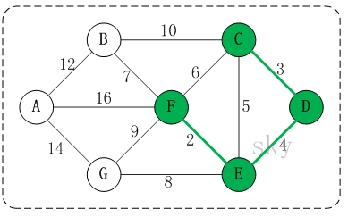

# 第十三章 常用的十种算法

## 13.1）二分查找算法(非递归)

### 13.1.1）二分查找算法(非递归)介绍

1. 前面我们讲过了二分查找算法，是使用递归的方式，下面我们讲解二分查找算法的非递归方式
2. 二分查找法只适用于从有序的数列中进行查找(比如数字和字母等)，将数列排序后再进行查找
3. 二分查找法的运行时间为对数时间`O(㏒₂n)` ，即查找到需要的目标位置**最多**只需要`㏒₂n`步，假设从[0,99]的队列(100个数，即n=100)中寻到目标数30，则需要查找步数为`㏒₂100` , 即**最多**需要查找7次( `2^6 < 100 < 2^7`)

### 13.1.2）二分查找算法(非递归)代码实现

数组 {1,3, 8, 10, 11, 67, 100}, 编程实现二分查找， 要求使用非递归的方式完成.

**思路分析**：

**代码实现**：

```java
package com.wck.binarysearchnorecursion;

/**
 * 
 * @author YuXiangKaoChi
 * @createTime 2020-05-31 23:00:53
 * 	类说明：二分查找非递归的方式
 */
public class BinarySearchNorecursion {

	public static void main(String[] args) {
		
		int[] arr={1,3, 8, 10, 11, 67, 100};
		
		int binarySearch = binarySearch(arr, -100);
		System.out.println("binarySearch="+binarySearch);
	}
	/**
	 * 二分查找
	 * @param arr 查找的数组
	 * @param target 查找的目标数
	 * @return
	 */
	public static int binarySearch(int[] arr,int target) {
		//最小的左侧下标
		int left=0;
		//右侧的最大下边
		int right=arr.length-1;
		int mid;
		//循环查找
		while (left <= right) {
			//中间的下标索引值
			mid=(left+right)/2;
			if(target == arr[mid]) {//找到了值
				return mid;
			}else if (target < arr[mid]) {//向左进行查找
				right=mid-1;
			}else {//向右查找
				left=mid+1;
			}
		}
		//没有找到，返回 -1 
		return -1;		
	}
}
```

## 13.2）分治算法

### 13.2.1）分治算法介绍

1. 分治法是一种很重要的算法。字面上的解释是“**分而治之**”，就是把一个复杂的问题分成两个或更多的相同或相似的子问题，再把子问题分成更小的子问题……直到最后子问题可以简单的直接求解，原问题的解即子问题的解的合并。这个技巧是很多高效算法的基础，如排序算法([快速排序](http://www.cnblogs.com/xsyfl/p/6901315.html)，[归并排序](http://www.cnblogs.com/xsyfl/p/6905974.html))，傅立叶变换(快速傅立叶变换)……
2. 分治算法可以**求解的一些经典问题**

- 二分搜索
- 大整数乘法
- 棋盘覆盖
- [合并排序](http://www.cnblogs.com/xsyfl/p/6905974.html)
- [快速排序](http://www.cnblogs.com/xsyfl/p/6901315.html)
- 线性时间选择
- 最接近点对问题
- 循环赛日程表
- **汉诺塔**

### 13.2.2）分治算法的基本步骤

分治法在每一层递归上都有三个步骤：

1. **分解**：将原问题分解为若干个规模较小，相互独立，与原问题形式相同的子问题
2. **解决**：若子问题规模较小而容易被解决则直接解，否则递归地解各个子问题
3. **合并**：将各个子问题的解合并为原问题的解。

### 13.2.3）分治(Divide-and-Conquer(P))算法设计模式如下


- 其中`|P|`表示问题P的规模；
- `n0`为一阈值，表示当问题P的规模不超过`n0`时，问题已容易直接解出，不必再继续分解。
- `ADHOC(P)`是该分治法中的基本子算法，用于直接解小规模的问题P。
- 因此，当P的规模不超过n0时直接用算法`ADHOC(P)`求解。
- 算法`MERGE(y1,y2,…,yk)`是该分治法中的合并子算法，用于将P的子问题`P1,P2 ,…,Pk`的相应的解`y1,y2,…,yk`合并为P的解。

### 13.2.4）分治算法最佳实践-汉诺塔

1. 汉诺塔的传说
   汉诺塔：汉诺塔（又称河内塔）问题是源于印度一个古老传说的益智玩具。大梵天创造世界的时候做了三根金刚石柱子，在一根柱子上从下往上按照大小顺序摞着64片黄金圆盘。大梵天命令婆罗门把圆盘从下面开始按大小顺序重新摆放在另一根柱子上。并且规定，在小圆盘上不能放大圆盘，在三根柱子之间一次只能移动一个圆盘。

2. 假如每秒钟一次，共需多长时间呢？移完这些金片需要5845.54亿年以上，太阳系的预期寿命据说也就是数百亿年。真的过了5845.54亿年，地球上的一切生命，连同梵塔、庙宇等，都早已经灰飞烟灭。


### 13.2.5）分治算法最佳实践-汉诺塔-代码实现

#### 13.2.5.1）汉诺塔游戏的思路分析:    

1. 如果是有一个盘， A->C

   如果我们有 n >= 2 情况，我们总是可以看做是两个盘 1.最下边的盘 2. 上面的盘

2. 先把 最上面的盘 A->B
3. 把最下边的盘 A->C
4. 把B塔的所有盘 从 B->C   

#### 13.2.5.2）汉诺塔游戏的代码实现:   

```java
package com.wck.dac;

/**
 * 
 * @author YuXiangKaoChi
 * @createTime 2020-06-01 15:22:24
 * 类说明：汉诺塔 分治问题
 */
public class HanoiTower {
    //统计次数的变量
	static int count=0;
	public static void main(String[] args) {
		hanoiTower(5, 'A', 'B', 'C');
		System.out.println("总计次数："+count);
	}
	/**
	 * 汉诺塔游戏的演示和思路分析:    
		如果是有一个盘， A->C
		如果我们有 n >= 2 情况，我们总是可以看做是两个盘 1.最下边的盘 2. 上面的盘
		先把 最上面的盘 A->B
		把最下边的盘 A->C
		把B塔的所有盘 从 B->C   
	 * @param num 总共多少个盘
	 * @param a a柱子
	 * @param b b柱子
	 * @param c c柱子
	 */
	public static void hanoiTower(int num,char a,char b,char c) {
		count++;
		//当盘就一个的时候，直接从 a->c柱子
		if(num == 1) {
			System.out.println("第" + num + "个盘从 " + a + "->" + c);
		}
		//大于等于2的情况，把盘分成两个部分，
		//第一部分是除了最下面的最大盘，其余所有的盘
		//第二部分是最下面的那一个最大盘
		if(num >=2) {
			//1.先把 最上面的盘 A->B
			hanoiTower(num-1, a, c, b);
			//2.把最下边的盘 A->C
			System.out.println("第" + num + "个盘从 " + a + "->" + c);
			//3.把B塔的所有盘 从 B->C   
			hanoiTower(num-1, b, a, c);
		}
	}
}
```

## 13.3）动态规划算法

### 13.3.1）应用场景-背包问题

背包问题：有一个背包，容量为4磅 ，
现有如下物品

| **物品** | **重量** | **价格** |
| -------- | -------- | -------- |
| 吉他(G)  | 1        | 1500     |
| 音响(S)  | 4        | 3000     |
| 电脑(L)  | 3        | 2000     |

1. 要求达到的目标为装入的背包的总价值最大，并且重量不超出
2. 要求装入的物品不能重复

### 13.3.2）动态规划算法介绍

1. 动态规划(**Dynamic Programming**)算法的核心思想是：将大问题划分为小问题进行解决，从而一步步获取最优解的处理算法
2. 动态规划算法与分治算法类似，其基本思想也是将待求解问题分解成若干个子问题，先求解子问题，然后从这些子问题的解得到原问题的解。
3. 与分治法不同的是，**适合于用动态规划求解的问题，经分解得到子问题往往不是互相独立的。** ( 即下一个子阶段的求解是建立在上一个子阶段的解的基础上，进行进一步的求解 )
4. 动态规划可以通过**填表的方式**来逐步推进，得到最优解.

### 13.3.3）动态规划算法最佳实践-背包问题

3. **思路分析和图解**

- 背包问题主要是指一个给定容量的背包、若干具有一定价值和重量的物品，如何选择物品放入背包使物品的价值最大。其中又分01背包和完全背包(完全背包指的是：每种物品都有无限件可用)

- 这里的问题属于01背包，即每个物品最多放一个。而无限背包可以转化为01背包。

算法的**主要思想，利用动态规划来解决**。

1. 每次遍历到的第i个物品，根据w\[i\]和v\[i\]来确定是否需要将该物品放入背包中。
2. 即对于给定的n个物品，设v\[i\]、w\[i\]分别为第i个物品的价值和重量，C为背包的容量。
3. 再令v\[i\]\[j\]表示在前i个物品中能够装入容量为j的背包中的最大价值。则我们有下面的结果：

```java
(1)  v[i][0]=v[0][j]=0; //表示 填入表 第一行和第一列是0
(2) 当w[i]> j 时：v[i][j]=v[i-1][j]   // 当准备加入新增的商品的容量大于 当前背包的容量时，就直接使用上一个单元格的装入策略
(3) 当j>=w[i]时： v[i][j]=max{v[i-1][j], v[i]+v[i-1][j-w[i]]}  
// 当 准备加入的新增的商品的容量小于等于当前背包的容量,
// 装入的方式:
	v[i-1][j]： 就是上一个单元格的装入的最大值
	v[i] : 表示当前商品的价值 
	v[i-1][j-w[i]] ： 装入i-1商品，到剩余空间j-w[i]的最大值
	当j>=w[i]时： v[i][j]=max{v[i-1][j], v[i]+v[i-1][j-w[i]]} : 
```

### 13.3.4）背包问题-代码实现

```java
package com.wck.dynamic;

import java.util.Arrays;

/**
 * 
 * @author YuXiangKaoChi
 * @createTime 2020-06-02 14:34:55
 * 类说明：背包问题
 */
public class KnapsackProblem {

	public static void main(String[] args) {
		//物品的重量
		int[] w= {1,4,3};
		//物品的价值
		int[] val= {1500,3000,2000};
		//物品的名称
		String[] gName= {"吉他","音箱","电脑"};
		int m=4;//背包的容量
		int n=val.length;//商品的个数
		//创建二维数组
		//v[i][j] 表示当前从第1个商品到 当前第i个商品中，
		//在背包为j的容量下，所能放下的最大价值
		int[][] v=new int[n+1][m+1];
		
		int[][] path=new int[n+1][m+1];
		
		//(1)  v[i][0]=v[0][j]=0; //表示 填入表 第一行和第一列是0
		for(int i=0;i<v.length;i++) {
			v[i][0]=0;//处理行
		}
		for(int i=0;i<v[0].length;i++) {
			v[0][i]=0;//处理列
		}
		
		// 当准备加入新增的商品的容量大于 当前背包的容量时，就直接使用上一个单元格的装入策略
		for (int i = 1; i < v.length; i++) {
			for (int j = 1; j < v[0].length; j++) {
				if (w[i - 1] > j) {// 加入的新商品的重量大于背包的容量
					v[i][j] = v[i - 1][j];
				} else {// 当j>=w[i]
						// v[i][j]=max{v[i-1][j], v[i]+v[i-1][j-w[i]]}  
					//当 准备加入的新增的商品的容量小于等于当前背包的容量,
						// v[i][j]=Math.max(v[i-1][j], val[i-1]+v[i-1][j-w[i-1]]);
					if (v[i - 1][j] < val[i - 1] + v[i - 1][j - w[i - 1]]) {
						v[i][j]=val[i - 1] + v[i - 1][j - w[i - 1]];
						path[i][j] = 1;
					}else {
						v[i][j]=v[i - 1][j];
					}

				}
			}
		}	
		for (int i = 0; i < v.length; i++) {
			//遍历输出
			System.out.println(Arrays.toString(v[i]));
		}
		System.out.println("path:");
		
		for (int i = 0; i < path.length; i++) { // 遍历输出
			System.out.println(Arrays.toString(path[i]));
		}

		for (int i = 0; i < path.length; i++) {
			for (int j = 0; j < path[i].length; j++) {
				if (path[i][j] == 1) {
					System.out.printf("第%d个商品放入到背包\n", i);
				}
			}
		}		
		int i=path.length-1;//行的最大索引下标
		int j=path[0].length-1;//列的最大索引下标
		System.out.println("最终...");
		while (i > 0 && j>0) {
			if(path[i][j] == 1) {
				System.out.printf("第%d个商品:%s,放入到背包\n", i,gName[i-1]); 
				j -= w[i-1]; //w[i-1]
			}
			i--;
		}
		//物品的重量
		//int[] w= {1,4,3};
		//物品的价值
		//int[] val= {1500,3000,2000};
	}
}
```

## 13.4）KMP算法

### 13.4.1）应用场景-字符串匹配问题

字符串匹配问题：

1)有一个字符串 str1= "界哈哈嗝你好世界啦啦啦啦，和一个子串 str2="哈哈"

2)**现在要判断** **str1** **是否含有** **str2**, 如果存在，就返回第一次出现的位置, 如果没有，则返回-1

### 13.4.2）暴力匹配算法

如果用暴力匹配的思路，并假设现在str1匹配到 i 位置，子串str2匹配到 j 位置，则有:

- 1)如果当前字符匹配成功（即str1\[i\] == str2\[j\]），则i++，j++，继续匹配下一个字符

- 2)如果失配（即str1\[i\]! = str2\[j\]），令i = i - (j - 1)，j = 0。相当于每次匹配失败时，i 回溯，j 被置为0。

- 3)用暴力方法解决的话就会有大量的回溯，每次只移动一位，若是不匹配，移动到下一位接着判断，浪费了大量的时间。(不可行!)

- 4)暴力匹配算法实现.

```java
package com.wck.kmp;

/**
 * 
 * @author YuXiangKaoChi
 * @createTime 2020-06-03 09:48:56
 * 类说明：暴力匹配
 */
public class ViolenceMatch {

	public static void main(String[] args) {
		//源字符串
		String str1="界哈哈嗝你好世界啦啦啦啦";
		//查找的字符串
		String str2="哈哈";
		int match = violenceMatch(str1,str2);
		System.out.println("match="+match);
	}
	/**
	 * 暴力匹配
	 * @param str1 源字符串
	 * @param str2  查找的字符串
	 * @return
	 */
	public static int violenceMatch(String str1,String str2) {
		//转成字符数组
		char[] str1CharArray = str1.toCharArray();
		//转成字符数组
		char[] str2CharArray = str2.toCharArray();
		
		//源字符串的数组长度
		int str1Len=str1CharArray.length;
		//查找字符串的数组长度
		int str2Len=str2CharArray.length;
		int i=0;
		int j=0;	
		while (i < str1Len && j< str2Len) {
			//如果查找到了，则继续下移查找
			if(str1CharArray[i] == str2CharArray[j]) {
				i++;
				j++;
			}else {
				//移动到源字符串的下一个索引，继续查找
				i=i-j+1;
				//把查找的字符串 重新置成索引为0，重新继续查找
				j=0;
			}
		}	
		if(j==str2Len) {
			System.out.println("说明找到了");
			return i-j;
		}	
		return -1;
	}
}
```

### 13.4.3）KMP算法介绍

1)KMP是一个解决模式串在文本串是否出现过，如果出现过，最早出现的位置的经典算法

2)Knuth-Morris-Pratt **字符串查找算法**，简称为 “KMP算法”，常用于在一个文本串S内查找一个模式串P 的出现位置，这个算法由Donald Knuth、Vaughan Pratt、James H. Morris三人于1977年联合发表，故取这3人的姓氏命名此算法.

3)KMP方法算法就利用之前判断过信息，通过一个next数组，保存模式串中前后最长公共子序列的长度，每次回溯时，通过next数组找到，前面匹配过的位置，省去了大量的计算时间

4)参考资料：https://www.cnblogs.com/ZuoAndFutureGirl/p/9028287.html 

### 13.4.4）KMP算法最佳应用-字符串匹配问题

**字符串匹配问题：**

1)有一个字符串 str1= "BBC ABCDAB ABCDABCDABDE"，和一个子串 str2="ABCDABD"

2)**现在要判断** **str1** **是否含有** **str2**, 如果存在，就返回第一次出现的位置, 如果没有，则返回-1

3)要求：使用KMP算法完成判断，不能使用简单的暴力匹配算法.

> **KMP算法思路分析：**
>
> 举例来说，有一个字符串 `Str1 = “BBC ABCDABABCDABCDABDE”`，判断，里面是否包含另一个字符串 `Str2 = “ABCDABD”`？ 

1. 首先，用`Str1`的第一个字符和`Str2`的第一个字符去比较，不符合，关键词向后移动一位 


2. 重复第一步，还是不符合，再后移 


3. 一直重复，直到Str1有一个字符与Str2的第一个字符符合为止 


4. 接着比较字符串和搜索词的下一个字符，还是符合。


5. 遇到Str1有一个字符与Str2对应的字符不符合


6. 这时候，想到的是继续遍历Str1的下一个字符，重复第1步。(其实是很不明智的，因为此时BCD已经比较过了，没有必要再做重复的工作，一个基本事实是，当空格与D不匹配时，你其实知道前面六个字符是”ABCDAB”。KMP 算法的想法是，设法利用这个已知信息，不要把”搜索位置”移回已经比较过的位置，继续把它向后移，这样就提高了效率。) 


7. 怎么做到把刚刚重复的步骤省略掉？可以对Str2计算出一张《部分匹配表》，这张表的产生在后面介绍 


8. 已知空格与D不匹配时，前面六个字符”ABCDAB”是匹配的。查表可知，最后一个匹配字符B对应的”部分匹配值”为2，因此按照下面的公式算出向后移动的位数： 

   移动位数 = 已匹配的字符数 - 对应的部分匹配值 

   因为 6 - 2 等于4，所以将搜索词向后移动 4 位。 

9. 因为空格与Ｃ不匹配，搜索词还要继续往后移。这时，已匹配的字符数为2（”AB”），对应的”部分匹配值”为0。所以，移动位数 = 2 - 0，结果为 2，于是将搜索词向后移 2 位


10. 因为空格与A不匹配，继续后移一位。 


11. 逐位比较，直到发现C与D不匹配。于是，移动位数 = 6 - 2，继续将搜索词向后移动 4 位。 


12. 逐位比较，直到搜索词的最后一位，发现完全匹配，于是搜索完成。如果还要继续搜索（即找出全部匹配），移动位数 = 7 - 0，再将搜索词向后移动 7 位，这里就不再重复了。


13. 介绍《部分匹配表》怎么产生的 

先介绍前缀，后缀是什么 


“部分匹配值”就是”前缀”和”后缀”的最长的共有元素的长度。以”`ABCDABD`”为例， 

－”`A`”的前缀和后缀都为空集，共有元素的长度为0； 

－”`AB`”的前缀为`[A]`，后缀为`[B]`，共有元素的长度为0； 

－”`ABC`”的前缀为`[A, AB]`，后缀为`[BC, C]`，共有元素的长度0； 

－”`ABCD`”的前缀为`[A, AB, ABC]`，后缀为`[BCD, CD, D]`，共有元素的长度为0； 

－”`ABCDA`”的前缀为`[A, AB, ABC, ABCD]`，后缀为`[BCDA, CDA, DA, A]`，共有元素为”`A`”，长度为1； 

－”`ABCDAB`”的前缀为`[A, AB, ABC, ABCD, ABCDA]`，后缀为`[BCDAB, CDAB, DAB, AB, B]`，共有元素为”`AB`”，长度为2； 

－”`ABCDABD`”的前缀为`[A, AB, ABC, ABCD, ABCDA, ABCDAB]`，后缀为`[BCDABD, CDABD, DABD, ABD, BD, D]`，共有元素的长度为0。 

14. ”部分匹配”的实质是，有时候，字符串头部和尾部会有重复。比如，”ABCDAB”之中有两个”AB”，那么它的”部分匹配值”就是2（”AB”的长度）。搜索词移动的时候，第一个”AB”向后移动 4 位（字符串长度-部分匹配值），就可以来到第二个”AB”的位置。 


到此KMP算法思想分析完毕!

### 13.4.5）KMP算法最佳应用-代码实现

```java
package com.wck.kmp;

import java.util.Arrays;

public class KMPAlgorithm {
	public static void main(String[] args) {
		// TODO Auto-generated method stub
		String str1 = "BBC ABCDAB ABCDABCDABDE";
		String str2 = "ABCDABD";
		//String str2 = "BBC";
		
		int[] next = kmpNext("ABCDABD"); //[0, 1, 2, 0]
		System.out.println("next=" + Arrays.toString(next));
		
		int index = kmpSearch(str1, str2, next);
		System.out.println("index=" + index); // 15了
	}
	//写出我们的kmp搜索算法
	/**
	 * 
	 * @param str1 源字符串
	 * @param str2 子串
	 * @param next 部分匹配表, 是子串对应的部分匹配表
	 * @return 如果是-1就是没有匹配到，否则返回第一个匹配的位置
	 */
	public static int kmpSearch(String str1, String str2, int[] next) {
		
		//遍历 
		for(int i = 0, j = 0; i < str1.length(); i++) {
			
			//需要处理 str1.charAt(i) ！= str2.charAt(j), 去调整j的大小
			//KMP算法核心点, 可以验证...
			while( j > 0 && str1.charAt(i) != str2.charAt(j)) {
				j = next[j-1]; 
			}
			
			if(str1.charAt(i) == str2.charAt(j)) {
				j++;
			}			
			if(j == str2.length()) {//找到了 // j = 3 i 
				return i - j + 1;
			}
		}
		return  -1;
	}
	//获取到一个字符串(子串) 的部分匹配值表
	public static  int[] kmpNext(String dest) {
		//创建一个next 数组保存部分匹配值
		int[] next = new int[dest.length()];
		next[0] = 0; //如果字符串是长度为1 部分匹配值就是0
		for(int i = 1, j = 0; i < dest.length(); i++) {
			//当dest.charAt(i) != dest.charAt(j) ，我们需要从next[j-1]获取新的j
			//直到我们发现 有  dest.charAt(i) == dest.charAt(j)成立才退出
			//这时kmp算法的核心点
			while(j > 0 && dest.charAt(i) != dest.charAt(j)) {
				j = next[j-1];
			}
			
			//当dest.charAt(i) == dest.charAt(j) 满足时，部分匹配值就是+1
			if(dest.charAt(i) == dest.charAt(j)) {
				j++;
			}
			next[i] = j;
		}
		return next;
	}
}
```

## 13.4）贪心算法

### 13.4.1）贪心算法介绍

1. 贪婪算法(贪心算法)是指在对问题进行求解时，在每一步选择中都采取最好或者最优(即最有利)的选择，从而希望能够导致结果是最好或者最优的算法

2. 贪婪算法所得到的结果**不一定是最优的结果(有时候会是最优解)**，但是都是相对近似(接近)最优解的结果

### 13.4.2）应用场景-集合覆盖问题

1. 假设存在下面需要付费的广播台，以及广播台信号可以覆盖的地区。 **如何选择最少的广播台**，让所有的地区都可以接收到信号

| 广播台 | 覆盖地区               |
| ------ | ---------------------- |
| K1     | "北京", "上海", "天津" |
| K2     | "广州", "北京", "深圳" |
| K3     | "成都", "上海", "杭州" |
| K4     | "上海", "天津"         |
| K5     | "杭州", "大连"         |

2. **思路分析:** 

- 如何找出覆盖所有地区的广播台的集合呢，使用穷举法实现,列出每个可能的广播台的集合，这被称为幂集。假设总的有n个广播台，则广播台的组合总共有2ⁿ -1 个,假设每秒可以计算10个子集，
  如图:

| 广播台数量n | 子集总数2ⁿ | 需要的时间 |
| ----------- | ---------- | ---------- |
| 5           | 32         | 3.2秒      |
| 10          | 1024       | 102.4秒    |
| 32          | 4294967296 | 13.6年     |
| 100         | 1.26*100³º | 4x10²³年   |

- 使用贪婪算法，效率高:

**目前并没有算法可以快速计算得到准备的值， 使用贪婪算法，则可以得到非常接近的解，并且效率高。选择策略上，因为需要覆盖全部地区的最小集合:**

1)遍历所有的广播电台, 找到一个覆盖了最多**未覆盖的地区**的电台(此电台可能包含一些已覆盖的地区，但没有关系） 

2)将这个电台加入到一个集合中(比如ArrayList), 想办法把该电台覆盖的地区在下次比较时去掉。

3)重复第1步直到覆盖了全部的地区


### 13.4.3)代码实现贪心算法案例

```java
package com.wck.greedy;

import java.util.ArrayList;
import java.util.HashMap;
import java.util.HashSet;
import java.util.Map.Entry;
import java.util.Set;

/**
 * 
 * @author YuXiangKaoChi
 * @createTime 2020-06-04 19:19:03
 * 	类说明：贪心算法
 */
public class GreedyAlgorithm {

	public static void main(String[] args) {
		//存放所有电台频道和地区的map
		HashMap<String, Set<String>> broadcastMap = new HashMap<String, Set<String>>();
		
		HashSet<String> hashSet1 = new HashSet<String>();
		hashSet1.add("北京");
		hashSet1.add("上海");
		hashSet1.add("天津");
		
		HashSet<String> hashSet2 = new HashSet<String>();
		hashSet2.add("广州");
		hashSet2.add("北京");
		hashSet2.add("深圳");
		
		HashSet<String> hashSet3 = new HashSet<String>();
		hashSet3.add("成都");
		hashSet3.add("上海");
		hashSet3.add("杭州");
		
		HashSet<String> hashSet4 = new HashSet<String>();
		hashSet4.add("上海");
		hashSet4.add("天津");

		
		HashSet<String> hashSet5 = new HashSet<String>();
		hashSet5.add("杭州");
		hashSet5.add("大连");
		
		
		broadcastMap.put("K1", hashSet1);
		broadcastMap.put("K2", hashSet2);
		broadcastMap.put("K3", hashSet3);
		broadcastMap.put("K4", hashSet4);
		broadcastMap.put("K5", hashSet5);
		
		//System.out.println(broadcastMap);
		
		//存放所有地区的HashSet
		Set<String> allArea = new HashSet<String>();
		for (Entry<String, Set<String>> b:broadcastMap.entrySet()) {
			//System.out.println("key:"+b.getKey()+",val:"+b.getValue());
			allArea.addAll(b.getValue());
		}
		
		System.out.println(allArea);
		//存放最后的电台结果
		ArrayList<String> resultList = new ArrayList<String>();
		//用于存放每一轮的缓存set
		Set<String> tempHashSet = new HashSet<String>();
		
		//包含的最大城市的标记 maxKey
		String maxKey=null;
		//用于记录每轮中最大值 最大包含 城市的个数
		int maxKeySize = 0;
		
		while (allArea.size() > 0) {
			maxKey=null;
			for (Entry<String, Set<String>> b:broadcastMap.entrySet()) {
				//System.out.println("key:"+b.getKey()+",val:"+b.getValue());
				tempHashSet.clear();
//				tempHashSet=b.getValue();
				tempHashSet.addAll(b.getValue());
				//取交集的部分
				tempHashSet.retainAll(allArea);
				if(maxKey !=null) {
					//获取最大maxKey所包含的城市
					Set<String> maxKeySet = broadcastMap.get(maxKey);
					//和当前的所有城市取交集
					maxKeySet.retainAll(allArea);
					maxKeySize=maxKeySet.size();
				}
				//如果 交集中的个数大于0 并且（maxKey 不为 null 或者 交集中的个数大于 最大的maxKeySize）
				if(tempHashSet.size() > 0 && (maxKey== null || tempHashSet.size() > maxKeySize)) {
					//赋值最大个数的key
					maxKey=b.getKey();
				}
			}	
			if(maxKey !=null) {
				//把maxKey加入到结果集合
				resultList.add(maxKey);
				//从所有地区中取出已经加入到结果集合的地区
				allArea.removeAll(broadcastMap.get(maxKey));
				
			}
			
		}	
		System.out.println("最后的结果为resultList："+resultList);	
	}
}
```

### 13.4.4）贪心算法注意事项和细节

1. (1)**贪婪算法所得到的结果不一定是最优的结果(有时候会是最优解)，但是都是相对近似(接近)最优解的结**

2. (2)**比如上题的**算法选出的是K1, K2, K3, K5，符合覆盖了全部的地区

3. (3)但是我们发现 K2, K3,K4,K5 也可以覆盖全部地区，如果K2 的使用成本低于K1,那么我们上题的 K1, K2, K3, K5 虽然是满足条件，但是并不是最优的.

## 13.5）普里姆算法

### 13.5.1）应用场景-修路问题

看一个应用场景和问题：


1) 有胜利乡有7个村庄(A, B, C, D, E, F, G) ，**现在需要修路把7个村庄连通**

2) 各个村庄的距离用边线表示(权) ，比如 A – B 距离 5公里

3) 问：如何修路保证各个村庄都能连通，并且总的修建公路总里程最短?

思路: 将10条边，连接即可，但是总的里程数不是最小.

**正确的思路**，就是尽可能的选择少的路线，**并且每条路线最小，保证总里程数最少** 

### 13.5.2）最小生成树

修路问题本质就是就是最小生成树问题， 先介绍一下最小生成树**(Minimum Cost Spanning Tree)，简称MST。**

1) 给定一个带权的无向连通图,如何选取一棵生成树,使树上所有**边上权的总和为最小**,这叫最小生成树 

2) N个顶点，一定有N-1条边

3) 包含全部顶点

4) N-1条边都在图中

5) 举例说明(如图:)

求最小生成树的算法主要是**普里姆算法和克鲁斯卡尔算法**


### 13.5.3）普里姆算法介绍

1) 普利姆(Prim)算法求最小生成树，也就是在包含n个顶点的连通图中，找出只有(n-1)条边包含所有n个顶点的连通子图，也就是所谓的**极小连通子图**

2) 普利姆的算法如下:

(1) 设`G=(V,E)`是连通网，`T=(U,D)`是最小生成树，`V,U`是顶点集合，`E,D`是边的集合 

(2) 若从顶点`u`开始构造最小生成树，则从集合V中取出顶点`u`放入集合`U`中，标记顶点`v`的`visited[u]=1`

(3) 若集合`U`中顶点`ui`与集合`V-U`中的顶点`vj`之间存在边，则寻找这些边中权值最小的边，但不能构成回路，将顶点`vj`加入集合`U`中，将边`（ui,vj）`加入集合`D`中，标记`visited[vj]=1`

(4) 重复步骤②，直到`U`与`V`相等，即所有顶点都被标记为访问过，此时`D`中有`n-1`条边

提示：单独看步骤很难理解，我们通过代码来讲解，比较好理解

### 13.5.4）普里姆算法最佳实践(修路问题)


1)有胜利乡有7个村庄(A, B, C, D, E, F, G) ，现在需要修路把7个村庄连通

2)各个村庄的距离用边线表示(权) ，比如 A – B 距离 5公里

3)问：如何修路保证各个村庄都能连通，并且总的修建公路总里程最短?

### 13.5.5）普里姆算法-修路问题-思路分析


1. 从`<A>`顶点开始处理  `======> <A,G> 2`

`A-C [7] A-G[2] A-B[5]` 

2. `<A,G>` 开始 , 将A 和 G 顶点和他们相邻的还没有访问的顶点进行处理`<A,G,B>`

`A-C[7] A-B[5]  G-B[3] G-E[4] G-F[6]`

3. `<A,G,B>` 开始，将A,G,B 顶点 和他们相邻的还没有访问的顶点进行处理`=><A,G,B,E>`

`A-C[7] G-E[4] G-F[6] B-D[9]`     

 .....

4. `{A,G,B,E}->F`//第4次大循环 ，  对应 边`<E,F>` 权值：5
5. `{A,G,B,E,F}->D`//第5次大循环 ， 对应 边`<F,D>` 权值：4
6. `{A,G,B,E,F,D}->C`//第6次大循环 ， 对应 边`<A,C>` 权值：7 `===> <A,G,B,E,F,D,C>`

### 13.5.6)代码实现普利姆修路问题

```java
package com.wck.prim;

import java.util.Arrays;

/**
 * 
 * @author YuXiangKaoChi
 * @createTime 2020-06-05 15:28:15
 * 	类说明：普利姆算法解决修路最小带权子图（最小生成树问题）
 */
public class primAlgorithm {

	public static void main(String[] args) {
		
		char[] data= {'A','B','C','D','E','F','G'};
		int verxs=data.length;
		MinTree minTree = new MinTree();
		MGraph graph = new MGraph(verxs);
		
		//邻接矩阵的关系使用二维数组表示,10000这个大数，表示两个点不联通
		int [][]weight=new int[][]{
            {10000,5,7,10000,10000,10000,2},
            {5,10000,10000,9,10000,10000,3},
            {7,10000,10000,10000,8,10000,10000},
            {10000,9,10000,10000,10000,4,10000},
            {10000,10000,8,10000,10000,5,4},
            {10000,10000,10000,4,5,10000,6},
            {2,3,10000,10000,4,6,10000}};
		
		minTree.createGraph(graph, verxs, data, weight);
		System.out.println("邻接矩阵：");
		minTree.showGraph(graph);
		minTree.prim(graph, 0);
		
	}
}

//最小生成树的类
class MinTree{
	
	/**
	 * 创建图的邻接矩阵
	 * @param graph 路图的对象
	 * @param verxs 顶点个数
	 * @param data 顶点的值
	 * @param weight 顶点的邻接矩阵
	 */
	public void createGraph(MGraph graph,int verxs,char[] data,int[][] weight) {
		for (int i = 0; i < weight.length; i++) {
			graph.data[i]=data[i];//顶点的值
			for (int j = 0; j < weight.length; j++) {
				graph.weight[i][j]=weight[i][j];//邻接矩阵
			}
		}
	}
	
	/**
	 * 显示图的邻接矩阵
	 * @param graph
	 */
	public void showGraph(MGraph graph) {
		//遍历邻接矩阵
		for(int[] i:graph.weight) {
			System.out.println(Arrays.toString(i));
		}
	}
	
	/**
	 * 普利姆算法
	 * @param graph
	 * @param v
	 */
	public void prim(MGraph graph,int v) {
		//创建一个用于记录是否访问过的顶点的数组
		int[] visited=new int[graph.verxs];
		
		//把当前传进来的顶点标记为已访问
		visited[v]=1;
		
		//用于记录访问过的下标
		int h1=-1;
		//用于记录即将访问的下标
		int h2=-1;
		//用于记录每轮的最小值，初始值为10000，即最大值，后面会被小值替换掉		
		int minWeight=10000;
		
		int countWeight=0;
		//因为有 graph.verxs顶点，普利姆算法结束后，有 graph.verxs-1边
		for (int i = 1; i < visited.length; i++) {
			//这个是确定每一次生成的子图 ，和哪个结点的距离最近
			for(int j=0;j<visited.length;j++) {// j结点表示被访问过的结点
				for(int k =0;k<visited.length;k++) {//k结点表示还没有访问过的结点
					if(visited[j] == 1 && visited[k] == 0 && graph.weight[j][k]  < minWeight) {
						//替换minWeight(寻找已经访问过的结点和未访问过的结点间的权值最小的边)
						minWeight=graph.weight[j][k];
						h1=j;
						h2=k;
					}
				}
			}
			countWeight+=minWeight;
			System.out.println("<"+graph.data[h1]+","+graph.data[h2]+"> 最小权值为："+minWeight);
			//把新寻找到的顶点放入已访问的数组中
			visited[h2]=1;
			//重置最小权重值为 10000
			minWeight=10000;
		
		}
		
		System.out.println("最后的总长度为："+countWeight);
	}
}

//路图的类
class MGraph{
	//存放图中节点的个数
	int verxs;
	//存放图中的各个顶点的名称
	char[] data;
	//存放邻接矩阵
	int[][] weight;
	
	public MGraph(int verxs) {
		//初始化顶点个数
		this.verxs=verxs;
		//初始化顶点数据
		data=new char[verxs];
		//存放边，初始化邻接矩阵
		weight=new int[verxs][verxs];
	}
	
}

```

## 13.6）克鲁斯卡尔算法

### 13.6.1）应用场景-公交站问题

看一个应用场景和问题：


1) 某城市新增7个站点(A, B, C, D, E, F, G) ，现在需要修路把7个站点连通

2) 各个站点的距离用边线表示(权) ，比如 A – B 距离 12公里

3) 问：如何修路保证各个站点都能连通，并且总的修建公路总里程最短? 

### 13.6.2）克鲁斯卡尔算法介绍

1) 克鲁斯卡尔(Kruskal)算法，是用来求加权连通图的最小生成树的算法。

2) **基本思想**：按照权值从小到大的顺序选择n-1条边，并保证这n-1条边不构成回路

3) **具体做法**：首先构造一个只含n个顶点的森林，然后依权值从小到大从连通网中选择边加入到森林中，并使森林中不产生回路，直至森林变成一棵树为止

### 13.6.3）克鲁斯卡尔算法图解说明

> 以城市公交站问题来图解说明 克鲁斯卡尔算法的原理和步骤：
>
> 克鲁斯卡尔算法图解分析

在含有n个顶点的连通图中选择n-1条边，构成一棵极小连通子图，并使该连通子图中n-1条边上权值之和达到最小，则称其为连通网的最小生成树。 


例如，对于如上图G4所示的连通网可以有多棵权值总和不相同的生成树。


**详细图解：**

以上图G4为例，来对克鲁斯卡尔进行演示(假设，用**数组R保存最小生成树结果**)。


1. 第1步：将边`<E,F>`加入R中。 

边<E,F>的权值最小，因此将它加入到最小生成树结果R中。 

2. 第2步：将边`<C,D>`加入R中。

上一步操作之后，边`<C,D>`的权值最小，因此将它加入到最小生成树结果R中。

3. 第3步：将边`<D,E>`加入R中。 

上一步操作之后，边`<D,E>`的权值最小，因此将它加入到最小生成树结果R中。

4. 第4步：将边`<B,F>`加入R中。

上一步操作之后，边`<C,E>`的权值最小，但`<C,E>`会和已有的边构成回路；因此，跳过边`<C,E>`。同理，跳过边`<C,F>`。将边`<B,F>`加入到最小生成树结果R中。

5. 第5步：将边`<E,G>`加入R中

上一步操作之后，边`<E,G>`的权值最小，因此将它加入到最小生成树结果R中。 

6. 第6步：将边`<A,B>`加入R中。

上一步操作之后，边`<F,G>`的权值最小，但`<F,G>`会和已有的边构成回路；因此，跳过边`<F,G>`。同理，跳过边`<B,C>`。将边`<A,B>`加入到最小生成树结果R中。
此时，最小生成树构造完成！它包括的边依次是：`<E,F> <C,D> <D,E> <B,F> <E,G> <A,B>`。


**克鲁斯卡尔算法分析**

根据前面介绍的克鲁斯卡尔算法的基本思想和做法，我们能够了解到，克鲁斯卡尔算法重点需要解决的以下两个问题： 
 **问题一** 对图的所有边按照权值大小进行排序。 
 **问题二** 将边添加到最小生成树中时，怎么样判断是否形成了回路。

问题一很好解决，采用排序算法进行排序即可。

问题二，处理方式是：记录顶点在"最小生成树"中的终点，顶点的终点是"在最小生成树中与它连通的最大顶点"。然后每次需要将一条边添加到最小生存树时，判断该边的两个顶点的终点是否重合，重合的话则会构成回路。


**如何判断是否构成回路-举例说明(如图)**



在将`<E,F> <C,D> <D,E>`加入到最小生成树R中之后，这几条边的顶点就都有了终点：

**(01)** C的终点是F。 
**(02)** D的终点是F。 
**(03)** E的终点是F。 
**(04)** F的终点是F。

**关于终点的说明**：

1. 就是将**所有顶点按照从小到大的顺序排列好之后；某个顶点的终点就是"与它连通的最大顶点"**。 
2. 因此，接下来，虽然`<C,E>`是权值最小的边。但是C和E的终点都是F，即它们的终点相同，因此，将`<C,E>`加入最小生成树的话，会形成回路。这就是判断回路的方式。也就是说，我们加入的边的两个顶点不能都指向同一个终点，否则将构成回路。【后面有代码说明】

### 13.6.4）克鲁斯卡尔算法-公交站-代码实现

```java
package com.wck.kruskal;

import java.util.Arrays;

/**
 * 克鲁斯卡尔算法
 * @author YuXiangKaoChi
 * @createTime 2020-06-08 09:45:33
 * 类说明：公交站问题解决
 */
public class KruskalDemo {

	//顶点的数组
	private char[] vertexs;
	//边的个数
	private int edgeNum;
	//邻接矩阵
	private int[][] matrix;
	
	private final static int INF=Integer.MAX_VALUE;
	
	public static void main(String[] args) {
		char[] vertexs = {'A', 'B', 'C', 'D', 'E', 'F', 'G'};
		//克鲁斯卡尔算法的邻接矩阵  
	      int matrix[][] = {
	      /*A*//*B*//*C*//*D*//*E*//*F*//*G*/
	/*A*/ {   0,  12, INF, INF, INF,  16,  14},
	/*B*/ {  12,   0,  10, INF, INF,   7, INF},
	/*C*/ { INF,  10,   0,   3,   5,   6, INF},
	/*D*/ { INF, INF,   3,   0,   4, INF, INF},
	/*E*/ { INF, INF,   5,   4,   0,   2,   8},
	/*F*/ {  16,   7,   6, INF,   2,   0,   9},
	/*G*/ {  14, INF, INF, INF,   8,   9,   0}}; 
	         
	      KruskalDemo kruskal = new KruskalDemo(vertexs,matrix);
	      kruskal.kruskal();  
	}
	
	
	public KruskalDemo(char[] vertexs,int[][] matrix) {
		
		int vlen=vertexs.length;
		
		//顶点的数组
		this.vertexs=new char[vlen];
		this.matrix=new int[vlen][vlen];
		
		//顶点的数组赋值，复制拷贝的方式
		for (int i = 0; i < vlen; i++) {
			this.vertexs[i]=vertexs[i];
		}
		//邻接矩阵的初始化，复制拷贝的方式
		for (int i = 0; i < vlen; i++) {
			for (int j = 0; j < vlen; j++) {
				this.matrix[i][j]=matrix[i][j];
			}
		}
		
		//统计边的数量
		for (int i = 0; i < vlen; i++) {
			for (int j = i+1; j < vlen; j++) {
				if(this.matrix[i][j] != INF) {
					edgeNum++;
				}
			}
		}
		
	      //System.out.println("构造方法，总计边数："+edgeNum);
	     // print();
	}
	
	//克鲁斯卡尔算法
	public void kruskal() {
		int index=0;
		int[] ends =new int[edgeNum];
		//获得所有的边
		EData[] edges = getEdges();
		//边进行排序
		sortEdges(edges);
		//创建结果数组，保存最后生成的最小带权图
		EData[] rets = new EData[edgeNum];
		System.out.println("边为："+Arrays.deepToString(edges)+"总共边的条数为："+edges.length);
		for (int i = 0; i < edgeNum; i++) {
			//开始顶点的下标
			int p1=getPosition(edges[i].start);
			//结束顶点的下标
			int p2=getPosition(edges[i].end);
			
			//获取p1这个顶点在已有的最小生成树的终点
			int m = getEnd(ends, p1);
			//获取p2这个顶点在已有的最小生成树的终点
			int n = getEnd(ends, p2);
			//要加入的边的终点不相同
			if(m!=n) {
				ends[m]=n; // 设置m 在"已有最小生成树"中的终点 <E,F> [0,0,0,0,5,0,0,0,0,0,0,0]
				rets[index]=edges[i];
				index++;
			}
		}
		
		System.out.println("最小生成树为");
		for(int i = 0; i < index; i++) {
			System.out.println(rets[i]);
		}
		
	}
	//打印邻接矩阵
	public void print() {
		for (int i = 0; i < matrix.length; i++) {
			for (int j = 0; j < matrix.length; j++) {
				System.out.printf("%12d",matrix[i][j]);
			}
			System.out.println();
		}
		/*
		EData[] edges = getEdges();
		System.out.println("图中边的实例：");
		System.out.println(Arrays.deepToString(edges));
		
		System.out.println("排序");
		sortEdges(edges);
		System.out.println(Arrays.deepToString(edges));
		*/
	}
	
	
	/**
	 * 对边进行排序处理
	 * @param edges 边的集合
	 */
	private void sortEdges(EData[] edges) {
		for (int i = 0; i < edges.length; i++) {
			for (int j = 0; j < edges.length - (i+1); j++) {
				if (edges[j].weight > edges[j + 1].weight) {
					EData temp = edges[j];// 大的值
					edges[j] = edges[j + 1];
					edges[j + 1] = temp;
				}
			}
		}
	}	
	/**
	 * 返回顶点对应的下标
	 * @param ch 顶点的值，比如'A','B'
	 * @return 返回ch顶点对应的下标，如果找不到，返回-1
	 */
	private int getPosition(char ch) {
		for (int i = 0; i < vertexs.length; i++) {
			if(vertexs[i] == ch) {
				return i;
			}
		}
		return -1;
	}
	

	/**
	 * 功能: 获取图中边，放到EData[] 数组中，后面我们需要遍历该数组
	 * 是通过matrix 邻接矩阵来获取
	 * EData[] 形式 [['A','B', 12], ['B','F',7], .....]
	 * @return
	 */
	private EData[] getEdges() {
		int index=0;
		
		EData[] edges=new EData[edgeNum];
		
		for (int i = 0; i < matrix.length; i++) {
			for (int j= i+1; j< matrix.length; j++) {
				//不是最大的说明有权值
				if(matrix[i][j] != INF) {
					//构造边的实例
					edges[index]=new EData(vertexs[i], vertexs[j], matrix[i][j]);
					index++;
				}
			}
		}
		return edges;
	}
	
	/**
	 * 功能: 获取下标为i的顶点的终点, 用于后面判断两个顶点的终点是否相同
	 * @param ends ： 数组就是记录了各个顶点对应的终点是哪个,ends 数组是在遍历过程中，逐步形成
	 * @param i : 表示传入的顶点对应的下标
	 * @return 返回的就是 下标为i的这个顶点对应的终点的下标, 
	 */
	private int getEnd(int[] ends,int i) { // i = 4 [0,0,0,0,5,0,0,0,0,0,0,0] 
		//一直找到没有终点的i
        while (ends[i] !=0) {
			i= ends[i];
		}
		return i;
	}
}
/**
 * 创建一个边的类，它的实例就是一条边的实例
 * @author YuXiangKaoChi
 * @createTime 2020-06-08 10:35:27
 * 	类说明：
 */
class EData{
	
	//一条边所连接的一个顶点
	char start;
	//一条边所连接的另一个顶点
	char end;
	//边的权重
	int weight;
	
	public EData(char start,char end,int weight) {
		this.start=start;
		this.end=end;
		this.weight=weight;
	}

	@Override
	public String toString() {
		return "EData [start=" + start + ", end=" + end + ", weight=" + weight + "]\n";
	}
}
```

