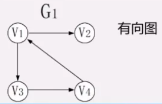
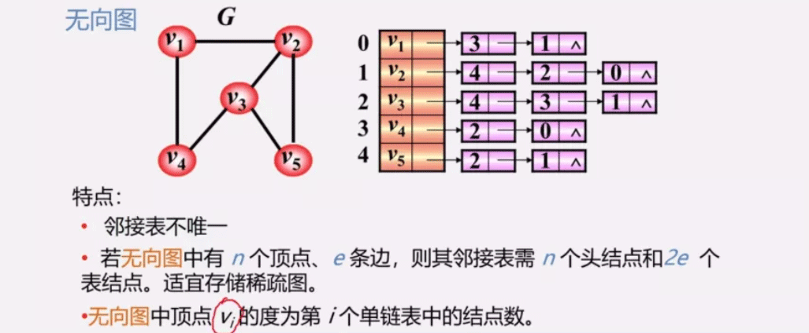
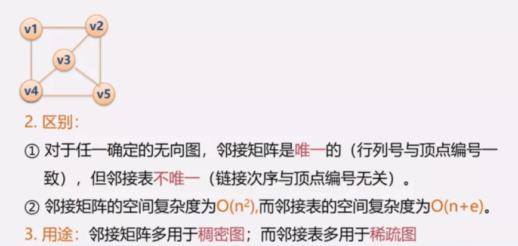
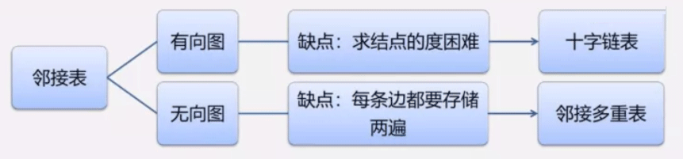
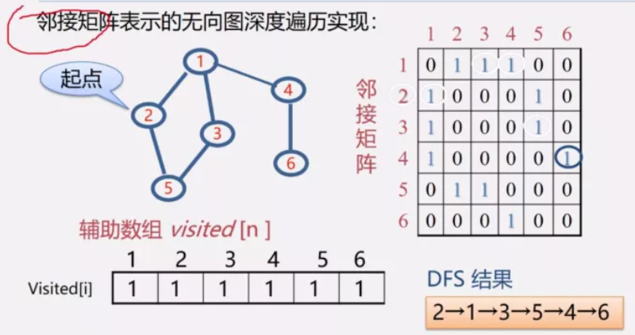

# 图

## 1.1）图的定义和基本术语

### 1.1.1）图

`G=（V，E）  Graph=（Vertex，Edge）`

- V：顶点（数据元素）的有穷非空集合；
- E：边的有穷集合。

### 1.1.2）无向图

无向图：每条边都是无方向的

### 1.1.3）有向图

有向图：每条边都是有方向的

### 1.1.4）完全图

任意两个点都有一条边相连

### 1.1.5）稀疏图

稀疏图：有很少边或弧（有向图的边）的图（e<nlogn）

### 1.1.6）稠密图

稠密图：有较多边或弧的图。

### 1.1.7）网

网：边/弧带权的图。

### 1.1.8）邻接

- 有边/弧相连的两个顶点之间的关系。
- 存在（Vi，Vj），则称Vi和Vj互为邻接点；
- 存在<Vi，Vj>，则称vi邻接到Vj，vj邻接于Vi；

### 1.1.9）关联（依附）

关联（依附）：边/弧与顶点之间的关系。

- 存在（Vi，Vj）或者<Vi，Vj>，则称该边/弧关联于Vi和Vj；

### 1.1.10）顶点的度

与**该顶点相关联的边的数目**，记为TD(v)      

在有向图中，顶点的度等于该顶点的入度与出度之和。       

顶点v的**入度**是**以v为终点**的有向边的条数，记作ID(v)

顶点v的**出度**是**以v为始点**的有向边的条数，记作OD（v）

例：图中各顶点的度

### 1.1.11）有向树

|**问**：当有向图中**仅1个顶点的入度为0，其余顶点的入度均为1**，此时是何形状？   
|**答**：**是树！而且是一棵有向树**！

### 1.1.12）路径

路径：接续的边构成的顶点序列。

### 1.1.13）路径长度

路径长度：路径上边或弧的数目/权值之和。

### 1.1.14）回路（环）

回路（环）：第一个顶点和最后一个顶点相同的路径。

### 1.1.15）简单路径

简单路径：除路径起点和终点可以相同外，其余顶点均不相同的路径。

### 1.1.16）简单回路（简单环）

简单回路（简单环）：除路径起点和终点可以相同外，其余顶点均不相同的路径。

### 1.1.17）连通图（强连通图）

连通图（强连通图）：在无（有）向图G=（V，{E}）中，若对任何两个顶点v、u都存在从v到u的路径，则**称G是连通图（强连通图）。**

### 1.1.18）权与网

权与网：     

- **图中边或弧所具有的相关数称为权**。表明从一个顶点到另一个顶点的距离或耗费。         

- **带权的图称为网**。

### 1.1.19）子图

子图：设有两个图G=（V，{E}）、G1=（V1，{E1}），若 V1 $\subseteq$  V，E1 $\subseteq$ E，则称G1是G的**子图**。

例：（b）、（c）是（a）的子图

### 1.1.20）连通分量（强连通分量）

- 无向图G的**极大连通子图**称为G的**连通分量**。
  - 极大连通子图意思是：该子图是G连通子图，将G的任何不在该子图中的顶点加入，子图不再连通。

### 1.1.21）强连通分量。

- 有向图G的**极大强连通子图**称为**G的强连通分量**。
  - 极大强连通子图意思是：该子图是G的强连通子图，将D的任何不在该子图中的顶点加入，子图不再是强连通的。

### 1.1.22）极小连通子图

该子图是G的连通子图，在该子图中删除任何一条边，子图不再连通。

### 1.1.23）生成树

生成树：包含无向图G所有顶点的极小连通子图。

### 1.1.24）生成森林

生成森林：对非连通图，由各个连通分量的生成树的集合。

## 1.2）案例引入

“六度空间”理论又称作六度分隔（Six Degrees of Separation）理论。这个理论可以通俗地阐述为：“你和任何一个陌生人之间所间隔的人不会超过六个，也就是说，最多通过六个人你就能够认识任何一个陌生人。”该理论产生于20世纪60年代，由美国心理学家米尔格伦提出。

但是米尔格兰姆的理论从来没有得到过严谨的证明，虽然屡屡应验，虽然很多社会学家一直都对其兴趣浓厚，但它只是一种假说。现在，许多科学家对此进行研究，它们都不约而同地使用了网络时代的新型通讯手段对“小世界现象”进行验证。把六度空间理论中的人际关系网络抽象成一个无向图G。用图G中的一个顶点表示一个人，两个人认识与否用代表这两个人的顶点之间是否有一条边来表示。从任一顶点出发用广度优先方法对图进行遍历，统计所有路径长度不超过7的顶点

## 1.3）图的类型定义

## 1.4）图的存储结构

### 1.4.1）图的逻辑结构：多对多

图没有顺序存储结构，但可以借助二维数组来表示元素间的关系

1. 数组表示法（邻接矩阵）
2. 链式存储结构（多重链表）
   - 邻接表
   - 邻接多重表
   - 十字链表

3. 重点介绍：
   - 邻接矩阵（数组）表示法
   - 邻接表（链式）表示法
     

### 1.4.2）数组表示法（邻接矩阵）

### 1.4.3）邻接矩阵的存储表示

### 1.4.4）采用邻接矩阵表示法创建无向网

### 1.4.5）邻接表表示法（链式）

#### 

### 1.4.6）无向图-链式

### 1.4.7）有向图-链式

### 1.4.8）练习：已知某网的邻接（出边）表，请画出该网络。

### 1.4.9）图的邻接表存储表示

### 1.4.10）邻接表操作举例说明

### 1.4.11）采用邻接表表示法创建无向网

### 1.4.12）邻接表特点

### 1.4.13）邻接矩阵与邻接表表示法的关系

### 1.4.14）十字链表，链接多重表-前言

### 1.4.15）十字链表——用于有向图

- 十字链表（Orthogonal List）是有向图的另一种链式存储结构。
- 我们也**可以把它看成是将有向图的邻接表和逆邻接表结合起来形成的一种链表**。
- 有**向图中的每一条弧对应十字链表中的一个弧结点**，同时有向图中的每个顶点在十字链表中对应有一个结点，叫做顶点结点。

### 1.4.16）邻接多重表（无向图的另一种链式存储结构）

回顾：

- 邻接表优点：容易求得顶点和边的信息。
- 缺点：某些操作不方便（如：删除一条边需找表示此边的两个结点）。

**具体思路：**

## 1.5）图的遍历

### 1.5.1）遍历定义

从已给的连通图中某一顶点出发，沿着一些边访遍图中所有的顶点，且使每个顶点仅被访问一次，就叫做**图的遍历**，它是图的**基本运算**。

**遍历实质**：找每个顶点的邻接点的过程。

### 1.5.2）图的特点

图中可能存在回路，且图的任一顶点都可能与其它顶点相通，在访问完某个顶点之后可能会沿着某些边又回到了曾经访问过的顶点。

**怎样避免重复访问？**

**解决思路：设置辅助数组visited[n]，用来标记每个被访问过的顶点。**

- 初始状态visited [i]为0
- 顶点i被访问，改visited [i]为1，防止被多次访问

### 1.5.3）图常用的遍历

深度优先搜索（Depth_First Search—DFS）
广度优先搜索（Breadth_Frist Search—BFS）

### 1.5.4）深度优先遍历（Depth First Search—DFS）

#### 1.5.4.1)图解深度优先遍历（DFS）

#### 1.5.4.2)深度优先遍历方法

#### 1.5.4.3)邻接矩阵表示的无向图深度遍历实现

#### 1.5.4.4）DFS算法效率分析

- 用邻接矩阵来表示图，遍历图中每一个顶点都要从头扫描该顶点所在行，时间复杂度为O（n2）。

- 用邻接表来表示图，虽然有（2e个表结点，但只需扫描e个结点即可完成遍历，加上访问n个头结点的时间，时间复杂度为O（n+e）。

  **结论：**

  - 稠密图适于在邻接矩阵上进行深度遍历；
  - ·稀疏图用于在邻接表上进行深度遍历。

#### 1.5.4.5）非连通图遍历

## 1.6）广度优先搜索（BFS-Breadth First Search）

### 1.6.1）图解广度优先搜索（BFS）

### 1.6.2）广度优先搜索方法：

### 1.6.3）非连通图的广度遍历

### 1.6.4)广度优先搜索实现

### 1.6.5）BFS算法效率分析

- 如果使用邻接矩阵，则BFS对于每一个被访问到的顶点，都要循环检测矩阵中的整整一行（n个元素），总的时间代价为O（n2）。
- 用邻接表来表示图，虽然有2e个表结点，但只需扫描e个结点即可完成遍历，加上访问n个头结点的时间，时间复杂度为O（n+e）。

- 空间复杂度相同，都是O（n）（借用了堆栈或队列）；
- 时间复杂度只与存储结构，（邻接矩阵或邻接表）有关，而与搜索路径无关。