# 第一章 内容介绍

## 1.1）数据结构和算法内容介绍

### 1.1.1）先看几个经典的算法面试题

#### ①字符串匹配问题

有一个字符串 str1= ""你好世界  你好是吉恩世界 你好是世界""，和一个子串 str2="你好是世界"      

现在要判断 str1 是否含有 str2, 如果存在，就返回第一次出现的位置, 如果没有，则返回-1         

要求用最快的速度来完成匹配     

你的思路是什么？     

- 暴力匹配【简单但是效率低下】
- **KMP算法《部分匹配表》**

#### ②汉诺塔游戏问题

汉诺塔游戏, 请完成汉诺塔游戏的代码: 

要求：

- 1) 将A塔的所有圆盘移动到C塔。并且规定，
- 2) 在小圆盘上不能放大圆盘，
- 3)在三根柱子之间一次只能移动一个圆盘


#### ③八皇后问题

八皇后问题  

是一个古老而著名的问题，是回溯算法的典型案例。

该问题是国际西洋棋棋手马克斯·贝瑟尔于1848年提出：

在8×8格的国际象棋上摆放八个皇后，使其不能互相攻击，

即：**任意两个皇后都不能处于同一行、同一列或同一斜线上，问有多少种摆法**。【92】=>**分治算法**

**使用到回溯算法**
高斯认为有76种方案。

1854年在柏林的象棋杂志上不同的作者发表了40种不同的解，**后来有人用图论的方法解出92种结果**。计算机发明后，有多种计算机语言可以解决此问题。【小游戏链接：http://www.7k7k.com/swf/49842.htm】


#### ④马踏棋盘问题

马踏棋盘算法介绍和游戏演示    
马踏棋盘算法也被称为骑士周游问题  
**将马随机放在国际象棋的8×8棋盘Board\[0～7][0～7]的某个方格中，马按走棋规则(马走日字)进行移动**。    

要求每个方格只进入一次，**走遍棋盘上全部64个方格**     

**会使用到图的深度优化遍历算法(DFS) + 贪心算法优化**

小游戏链接演示: http://www.4399.com/flash/146267_2.htm 


### 1.1.2）数据结构和算法的重要性

- **1）算法是程序的灵魂，优秀的程序可以在海量数据计算时，依然保持高速计算**
- 2）一般来讲 **程序会使用了内存计算框架(比如Spark)和缓存技术(比如Redis等)来优化程序**,再深入的思考一下，这些计算框架和缓存技术， 它的核心功能是哪个部分呢？
- **3）如果你不想永远都是代码工人,那就花时间来研究下数据结构和算法**

# 第二章 数据结构和算法概述

## 2.1）数据结构和算法的关系

- 数据data结构(structure)是一门**研究组织数据**方式的学科，有了编程语言也就有了数据结构.学好数据结构可以编写出更加漂亮,更加有效率的代码。
- 要学习好数据结构就要多多考虑如何将生活中遇到的问题,用程序去实现解决.
- **程序 = 数据结构 + 算法**
- 数据结构是算法的基础, 换言之，想要学好算法，需要把**数据结构学到位**。

## 2.2）看几个实际编程中遇到的问题

### 2.2.1）问题一，字符串替换问题

```java

Java代码:
	 public static void main(String[] args) {
		String str = "Java,Java, hello,world!";
		String newStr = str.replaceAll("Java", "wck~"); //算法
		System.out.println("newStr=" + newStr);
	}
```

问：         

试写出用单链表表示的字符串类及字符串结点类的定义，并依次实现它的构造函数、以及计算串长度、串赋值、判断两串相等、求子串、两串连接、求子串在串中位置等7个成员函数。    

小结：需要使用到**单链表数据结构**

### 2.2.2）问题二，一个五子棋程序


问：如何判断游戏的输赢，并可以完成存盘退出和继续上局的功能      

- 棋盘=>**二维数组**=>(**稀疏数组)**-> 写入文件  【存档功能】 

-   读取文件-》稀疏数组-》二维数组 -》 棋盘 【接上局】   

  

小结：需要用到**二维数组，稀疏数组**

### 2.2.3）问题三，约瑟夫(Josephu)问题(丢手帕问题)


- 1）Josephu  问题为：设编号为1，2，… n的n个人围坐一圈，约定编号为k（1<=k<=n）的人从1开始报数，数到m 的那个人出列，它的下一位又从1开始报数，数到m的那个人又出列，依次类推，直到所有人出列为止，由此产生一个出队编号的序列。
- 2）提示：用一个不带头结点的循环链表来处理Josephu 问题：先构成一个有n个结点的单循环链表（单向环形链表），然后由k结点起从1开始计数，计到m时，对应结点从链表中删除，然后再从被删除结点的下一个结点又从1开始计数，直到最后一个结点从链表中删除算法结束

小结：需要用到**单向环形链表**

### 2.2.4）其它常见算法问题


- 1）**修路问题  => 最小生成树(加权值)【数据结构】+ 普利姆算法**
- 2）**最短路径问题  => 图+弗洛伊德算法**
- 3）**汉诺塔 => 分支算法** 
- 4）**八皇后问题 => 回溯法**

## 2.3）线性结构和非线性结构

数据结构包括：**线性**结构和**非线性**结构。    

### 2.3.1）线性结构

- 1）线性结构作为最常用的数据结构，其特点是**数据元素之间存在一对一的线性关系**
- 2）线性结构有两种不同的存储结构，即**顺序存储结构和链式存储结构**。**顺序存储的线性表称为顺序表，顺序表中的存储元素是连续的**
- 3）链式存储的线性表称为链表，链表中的**存储元素不一定是连续**的，**元素节点中存放数据元素以及相邻元素的地址信息**
- 4）线性结构常见的有：**数组、队列、链表和栈**

### 2.3.2）非线性结构

- 非线性结构包括：**二维数组，多维数组，广义表，树结构，图结构**

# 第三章 稀疏数组和队列

## 3.1）稀疏sparsearray数组

### 3.1.1）先看一个实际的需求

- 编写的五子棋程序中，有存盘退出和续上盘的功能。


- 分析问题: 
  因为该二维数组的很多值是默认值0, 因此记录了**很多没有意义的数据-**>**稀疏数组**

### 3.1.2）基本介绍

**当一个数组中大部分元素为０，或者为同一个值的数组时，可以使用稀疏数组来保存该数组。**

稀疏数组的处理方法是:

- 记录数组**一共有几行几列，有多少个不同的值**
- 把**具有不同值的元素的行列及值记录在一个小规模的数组中，从而缩小程序的规模**


稀疏数组的举例：


### 3.1.3）应用实例

- 使用稀疏数组，来保留类似前面的二维数组(棋盘、地图等等)
- 把稀疏数组存盘，并且可以从新恢复原来的二维数组数
- 整体思路分析


思路：

- 二维数组 转 稀疏数组的思路
  - 1）遍历原始的二维数组，**得到有效的数据个数sum**
  - 2）根据sum就可以**创建稀疏数组 sparseArr int\[sum+1\]\[3\]**
  - 3）将二维数组的**有效数据存入到稀疏数组**

- 稀疏数组转原始的二维数组的思路
  - 1）**先读取稀疏数组的第一行**，根据第一行的数据，**创建原始的二维数组**，比如上面的chessArr2=int \[11\]\[11\]
  - 2）**再读取**稀疏数组**后几行的数据**，并**赋值给原始的二维数据即可**


### 3.1.4）代码实现

```java
package com.wck.sparsearray;

import java.io.BufferedReader;
import java.io.File;
import java.io.FileReader;
import java.io.FileWriter;
import java.io.IOException;
import java.util.ArrayList;
import java.util.Arrays;
/*
 *稀疏数组，棋盘问题 
 并写入到磁盘中文件中和读取磁盘文件
 将稀疏数组保存到磁盘上，比如 map.data
 恢复原来的数组时，读取map.data 进行恢复
 */
public class SparseArray {
	public static void main(String[] args) throws IOException {
		// 创建一个二维数组 11 * 11
		// 0:没有棋子 1：表示 黑子 2：表示蓝子
		int[][] chessArray = new int[11][11];
		chessArray[1][2] = 1;// 黑子
		chessArray[2][3] = 2;// 蓝子
//		chessArray[2][4]=2;//蓝子
		// 输出原始的二维数组
//		System.out.println(Arrays.deepToString(chessArray));
		System.out.println("原始二维数组：");
		printArray(chessArray);// 打印二维数组
		// 二维数组 转 稀疏数组
		/**
		 * 
		 * - 1）遍历原始的二维数组，**得到有效的数据个数sum** 
		 * - 2）根据sum就可以**创建稀疏数组 sparseArr
		 * int\[sum+1\]\[3\]** - 3）将二维数组的**有效数据存入到稀疏数组**
		 */
		// 统计有效数据的个数
		int sum = 0;
		// 行数
		int row = chessArray.length;
		// System.out.println("行数："+row);
		int col = chessArray[0].length;
		// System.out.println("列数："+col);
		for (int i = 0; i < chessArray.length; i++) {
			for (int j = 0; j < chessArray[i].length; j++) {
				if (chessArray[i][j] != 0) {
					// System.out.println(chessArray[i][j]);
					sum++;// 统计计算有效的数值个数
				}
			}
		}
		System.out.println("有效数字总数sum:" + sum);
		int[][] chessArr1 = new int[sum + 1][3];
		chessArr1[0][0] = row;// 行
		chessArr1[0][1] = col;// 列
		chessArr1[0][2] = sum;// 有效个数
		int count = 0;
		for (int i = 0; i < chessArray.length; i++) {
			for (int j = 0; j < chessArray[i].length; j++) {
				if (chessArray[i][j] != 0) {
					count++;
					chessArr1[count][0] = i;
					chessArr1[count][1] = j;
					chessArr1[count][2] = chessArray[i][j];
				}
			}
		}
		System.out.println("稀疏二维数组：");
		 printArray(chessArr1);
		writerArray(chessArr1);// 写入到文件
		// 稀疏数组恢复转换为原始的二维数组
		/**
		 * - 1）**先读取稀疏数组的第一行**，根据第一行的数据，**创建原始的二维数组**，比如上面的chessArr2=int [11][11] 
		 * -2）**再读取**稀疏数组**后几行的数据**，并**赋值给原始的二维数据即可**
		 */
		// 1. 先读取稀疏数组的第一行，根据第一行的数据，创建原始的二维数组
		
		//方式一：使用IO流恢复二维数组
		System.out.println("使用IO流恢复二维数组：");
		int[][] readerArray = readerArray();
		printArray(readerArray);
		
		int[][] chessArr2 = new int[readerArray[0][0]][readerArray[0][1]];
		System.out.println("恢复的数组为：");
		// 2. 在读取稀疏数组后几行的数据，并赋给 原始的二维数组 即可.
		for (int i = 1; i < readerArray.length; i++) {
			chessArr2[readerArray[i][0]][readerArray[i][1]] = readerArray[i][2];
		}
		printArray(chessArr2);
		//方式二：直接读取的数组
		/*int[][] chessArr2 = new int[chessArr1[0][0]][chessArr1[0][1]];
		System.out.println("恢复的数组为：");
		// 2. 在读取稀疏数组后几行的数据，并赋给 原始的二维数组 即可.
		for (int i = 1; i < chessArr1.length; i++) {
			chessArr2[chessArr1[i][0]][chessArr1[i][1]] = chessArr1[i][2];
		}
		printArray(chessArr2);*/
	}

	/**
	 * 打印二维数组
	 * 
	 * @param printArray 要打印的二维数组
	 * @throws IOException
	 */
	public static void printArray(int[][] printArray) throws IOException {

		for (int[] row : printArray) {
			for (int data : row) {
				// \t 代表按一下tab键
				System.out.printf("%d\t", data);
			}
			System.out.println();
		}
	}

	/**
	 * 写入数组到文件
	 * @param printArray
	 * @throws IOException
	 */
	public static void writerArray(int[][] printArray) throws IOException {
		FileWriter fw = new FileWriter(new File("map.data"));
		for (int[] row : printArray) {
			StringBuilder sb = new StringBuilder("");
			for (int data : row) {
				// \t 代表按一下tab键
				//System.out.printf("%d\t", data);
				sb.append(data + "&");//添加分隔符&
			}
			sb.append("\n");
			fw.write(sb.toString());
			//System.out.println(sb.toString());
			//System.out.println();
		}
		fw.close();
	}
	
	/**
	 * 读取文件返回一个二维数组
	 * @return
	 * @throws IOException
	 */
	public static int[][] readerArray() throws IOException {
	FileReader fr=new FileReader(new File("map.data"));
	BufferedReader br=new BufferedReader(fr);
	String s=null;
	int count=0;
	while(br.readLine()!=null) {
		count++;
	}
	//System.out.println("count:"+count);//总行数
	int falg=0;
	int[][] resultArr=new int[count][3];
	FileReader fr1=new FileReader(new File("map.data"));
	BufferedReader br1=new BufferedReader(fr1);
	while((s=br1.readLine())!=null) {
		System.out.println(s);
		String[] split = s.split("&");
//		System.out.println("分隔后的数组为："+Arrays.deepToString(split));
		resultArr[falg]=stringToIntArr(split);
		falg++;
	}
	br.close();
	br1.close();
	return resultArr;
	}
	
	/**
	 * 将String一维数组转换为int 一维数组
	 * @param sArr
	 * @return
	 */
	public static int[] stringToIntArr(String [] sArr) {
		int[] intArr=new int[sArr.length];
		for (int i = 0; i < sArr.length; i++) {
			System.out.println("获取到的值："+sArr[i]);
			intArr[i]=Integer.parseInt(sArr[i]);
		}
		return intArr;
	}
}
```

## 3.2）队列

### 3.2.1）银行排队的案例:

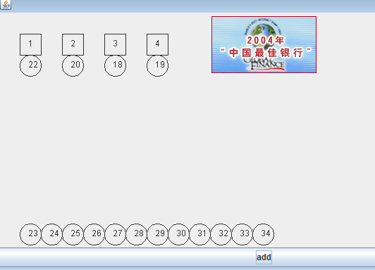


### 3.2.2）队列介绍

- 1）队列是一个**有序列表**，可以用**数组或是链表**来实现。
- 2）遵循**先入先出的原则**。即：先存入队列的数据，要先取出。后存入的要后取出
- 示意图：(使用数组模拟队列示意图)


### 3.2.3）数组模拟队列思路

- 1）队列本身是有序列表，若使用数组的结构来存储队列的数据，则队列数组的声明如下图, 其中 **maxSize 是该队列的最大容量。**
- 2）因为队列的输出、输入是分别从前后端来处理，因此需要两个变量 **front及 rear分别记录队列前后端的下标**，**front 会随着数据输出而改变，而 rear则是随着数据输入而改变**，如图所示:


**代码实现的思路分析：**

- 3）当我们将数据存入队列时称为”addQueue”，addQueue 的处理需要有两个步骤：思路分析 
  - **将尾指针往后移：rear+1 , 当front == rear 【空】**
  - **若尾指针 rear 小于队列的最大下标 maxSize-1，则将数据存入 rear所指的数组元素中，否则无法存入数据。 rear  == maxSize - 1[队列满]**

### 3.2.4）数组模拟队列代码实现

```java
package com.wck.queue;

import java.util.Scanner;

public class ArrayQueueDemo {

	public static void main(String[] args) {
		//测试一把
				//创建一个队列
				ArrayQueue queue = new ArrayQueue(3);
				char key = ' '; //接收用户输入
				Scanner scanner = new Scanner(System.in);//
				boolean loop = true;
				//输出一个菜单
				while(loop) {
					System.out.println("s(show): 显示队列");
					System.out.println("e(exit): 退出程序");
					System.out.println("a(add): 添加数据到队列");
					System.out.println("g(get): 从队列取出数据");
					System.out.println("h(head): 查看队列头的数据");
					key = scanner.next().charAt(0);//接收一个字符
					switch (key) {
					case 's':
						queue.showQueue();
						break;
					case 'a':
						System.out.println("输出一个数");
						int value = scanner.nextInt();
						queue.addQueue(value);
						break;
					case 'g': //取出数据
						try {
							int res = queue.getQueue();
							System.out.printf("取出的数据是%d\n", res);
						} catch (Exception e) {
							// TODO: handle exception
							System.out.println(e.getMessage());
						}
						break;
					case 'h': //查看队列头的数据
						try {
							int res = queue.headQueue();
							System.out.printf("队列头的数据是%d\n", res);
						} catch (Exception e) {
							// TODO: handle exception
							System.out.println(e.getMessage());
						}
						break;
					case 'e': //退出
						scanner.close();
						loop = false;
						break;
					default:
						break;
					}
				}
				System.out.println("程序退出~~");
	}
}
//使用数组模拟队列，编写一个ArrayQueue类
class ArrayQueue{
	private int maxSize;//表示数组的最大容量
	private int front;//队列头
	private int rear;//队列尾
	private int[] arr;//用于存放队列的数组
	/**
	 * 
	 * @param maxSize 传入数组队列的大小
	 */
	public ArrayQueue(int maxSize) {
		this.maxSize=maxSize;
		this.front=-1;//指向队列的头部，分析出front是指向队列头的前一个位置
		this.rear=-1;//指向队列的尾部，指向队列尾的数组，（即就是队列最后一个数据）
		arr=new int[maxSize];
	}
	//判断队列是否已经满
	public boolean isFull() {
		return rear==maxSize-1;
	}
	//判断队列是否为空
	public boolean isEmpty() {
		return front==rear;
	}
	/**
	 * 
	 * @param n 加入队列的数据
	 */
	public void addQueue(int n) {
		//判断队列是否已经满
		if(isFull()) {
			System.out.println("队列满，不能加入数据！");
			return;
		}
		rear++;//队尾加1
		arr[rear]=n;//加入数据到队列
	}
	/**
	 * 获取队列的值
	 * @return
	 */
	public int getQueue() {
		//判断队列是否为空
		if(isEmpty()) {
			//
			throw new RuntimeException("队列空不能取数据！");
		}
		front++;//取数据front加一
		return arr[front];//返回数据
	}
	/**
	 * 打印队列
	 */
	public void showQueue() {
		if (isEmpty()) {
			System.out.println("showQueue队列为空！没有数据");
		}
		//遍历输出队列
		for (int i = 0; i < arr.length; i++) {
			System.out.printf("arr[%d]=%d\n",i,arr[i]);
		}	
	}
	/**
	 * 查看队列的头数据
	 * @return
	 */
	public int headQueue() {
		//判断是否为空
		if(isEmpty()) {
			throw new RuntimeException("headQueue队列为空！没有数据");
		}
		System.out.println("当前的front为："+front);	
		return arr[front+1];
	}
}
```

### 3.2.5）问题分析并优化

- 1）目前数组使用一次就不能使用了，没有重复利用的效果
- 2）将这个数组使用算法，**改进成一个环形的队列 使用  % ：取模**

### 3.2.6）数组模拟环形队列

对前面的数组模拟队列的优化，充分利用数组. 因此**将数组看做是一个环形的**。(**通过取模的方式来实现即可**)

**分析说明：**

- 尾索引的下一个为头索引时表示队列满，**即将队列容量空出一个作为约定**,这个在做判断队列满的时候需要注意 (rear + 1) % maxSize == front 【满】 rear == front 【空】
- 之前的分析示意图:


**思路如下：**

- 1）**front 变量的含义做了调整**，**front 指向队列的第一个元素，也就是说arr\[front\]就是队列的第一个元素，front的初始值为0**

- 2）**rear变量的含义做了调整**，**rear指向队列的最后一个元素的后一个位置，因为希望腾出一个空闲的空间作为约定，rear的初始值为 0**

- 3）**当队列满的时候，条件为 (rear+1)%maxSize == front 为\[满\]**
- 4）**当队列为空的时候，条件为 rear==front \[空\]**

- 5）**当我们这样分析，队列中的有效的数据个数为（rear-front+maxSize）% maxSize**  
- 6）我们就可以在原先的队列基础上修改为环形队列

### 3.2.7）代码实现

**表格分析**：         

**maxSize 为4 ,rear  为 ：0 front 为：0**

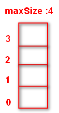

**入队满->全出队**

| 出/入队  | arr\[\]值  | rear | front |
| -------- | ---------- | ---- | ----- |
| 初始状态 |            | 0    | 0     |
| 入队     | arr\[0\]=3 | 1    | 0     |
| 入队     | arr\[1\]=2 | 2    | 0     |
| 入队     | arr\[2\]=1 | 3    | 0     |
| 出队     | arr\[0\]=3 | 3    | 1     |
| 出队     | arr\[1\]=2 | 3    | 2     |
| 出队     | arr\[2\]=1 | 3    | 3     |


**入队->出队->入队（超出最大索引的情况）**

| 出/入队  | arr[]值    | rear | front |
| -------- | ---------- | ---- | ----- |
| 初始状态 |            | 0    | 0     |
| 入队     | arr\[0\]=3 | 1    | 0     |
| 入队     | arr\[1\]=2 | 2    | 0     |
| 出队     | arr\[0\]=3 | 2    | 1     |
| 出队     | arr\[1\]=2 | 2    | 2     |
| 入队     | arr\[2\]=1 | 3    | 2     |
| 入队     | arr\[3\]=6 | 0    | 2     |
| 出队     | arr\[2\]=1 | 0    | 3     |
| 出队     | arr\[3\]=6 | 0    | 0     |

```java
package com.wck.queue;

import java.util.Scanner;

public class CircleArrayQueueDemo {
	public static void main(String[] args) {
		//测试一把
		//创建一个队列
		CircleArray queue = new CircleArray(4);
		char key = ' '; //接收用户输入
		Scanner scanner = new Scanner(System.in);//
		boolean loop = true;
		//输出一个菜单
		while(loop) {
			System.out.println("s(show): 显示队列");
			System.out.println("e(exit): 退出程序");
			System.out.println("a(add): 添加数据到队列");
			System.out.println("g(get): 从队列取出数据");
			System.out.println("h(head): 查看队列头的数据");
			key = scanner.next().charAt(0);//接收一个字符
			switch (key) {
			case 's':
				queue.showQueue();
				break;
			case 'a':
				System.out.println("输出一个数");
				int value = scanner.nextInt();
				queue.addQueue(value);
				break;
			case 'g': //取出数据
				try {
					int res = queue.getQueue();
					System.out.printf("取出的数据是%d\n", res);
				} catch (Exception e) {
					// TODO: handle exception
					System.out.println(e.getMessage());
				}
				break;
			case 'h': //查看队列头的数据
				try {
					int res = queue.headQueue();
					System.out.printf("队列头的数据是%d\n", res);
				} catch (Exception e) {
					// TODO: handle exception
					System.out.println(e.getMessage());
				}
				break;
			case 'e': //退出
				scanner.close();
				loop = false;
				break;
			default:
				break;
			}
		}
		System.out.println("程序退出~~");
	}
}
class CircleArray{
	private int maxSize;//表示数组的最大容量
	//front永远指向队列的头部
	//front的初始值 为 0
	private int front;
	//rear指向队列最后一个元素的后一个元素的位置，因为希望腾出一个空间作为约定
	//rear的初始值 为 0
	private int rear;
	private int[] arr;//用于存放队列的数组
	
	public CircleArray(int maxSize) {
		this.maxSize=maxSize;
		arr=new int[maxSize];
		//默认不赋值也是0
		//this.front=0;
		//默认不赋值也是0
		//this.rear=0;
	}
	//判断队列是否已经满
	public boolean isFull() {
		//此时的rear指的是 当前队尾的 值 后面的一个位置
		/**
		 * maxSize 为 4
		 * 则 当前的 arr[2]=1 //也就是当前的是 第三个值 此时 rear的值 为索引 （2+1） 为 3
		 * 则（3+1）%4 =0 ，此时队满，留了一个空闲的位置
		 */
		return (rear+1)%maxSize ==front;
	}
	
	//判断队列是否为空
	public boolean isEmpty() {
		//此时的front 和rear 都是取模后的值
		//即都是 front 和 rear 加1 后的值
		return front==rear;
	}
	
	/**
	 * 
	 * @param n 加入队列的数据
	 */
	public void addQueue(int n) {
		//判断队列是否已经满
		if(isFull()) {
			System.out.println("队列满，不能加入数据！");
			return;
		}
		//直接将数据加入
		arr[rear] = n;
		//将 rear 后移, 这里必须考虑取模
		rear = (rear + 1) % maxSize;
	}
	// 获取队列的数据, 出队列
	public int getQueue() {
		// 判断队列是否空
		if (isEmpty()) {
			// 通过抛出异常
			throw new RuntimeException("队列空，不能取数据");
		}
		// 这里需要分析出 front是指向队列的第一个元素
		// 1. 先把 front 对应的值保留到一个临时变量
		// 2. 将 front 后移, 考虑取模
		// 3. 将临时保存的变量返回
		int value = arr[front];
		front = (front + 1) % maxSize;
		return value;
	}
	/**
	 * 打印队列
	 */
	public void showQueue() {
		if (isEmpty()) {
			System.out.println("showQueue队列为空！没有数据");
			return ;
		}
		for(int i=front ;i < front +size();i++) {
			System.out.printf("arr[%d]=%d\n",i%maxSize,arr[i%maxSize]);
		}	
	}
	/**
	 * 获取当前队列中有效值得个数
	 * @return
	 */
	public int size() {
		return (rear-front+maxSize)%maxSize;
	}
	
	/**
	 * 查看队列的头数据
	 * @return
	 */
	public int headQueue() {
		//判断是否为空
		if(isEmpty()) {
			throw new RuntimeException("headQueue队列为空！没有数据");
		}
		System.out.println("当前的front为："+front);	
		return arr[front];
	}
}
```


# 第四章 链表

## 4.1）链表(Linked List)介绍

链表是**有序的列表**，但是它在内存中是存储如下


**上图小结：**

- 1）链表是**以结点的方式来存储**，是链式存储
- 2）每个结点**包含data域，next域，next域指向下一个结点**
- 3）如上图，**发现链表的各个结点不一定是连续的存储**
- 4）链表**分带头结点的链表和没有头结点的链表**，根据实际的需求来确定


## 4.2）单链表介绍

单链表(带头结点) 逻辑结构示意图如下


## 4.3）单链表的应用实例

使用带head头的**单向链表实现** –水浒英雄排行榜管理完成对**英雄人物**的**增删改查**操作， 注: 删除和修改,查找(这个代码没有实现)

### 4.3.1）添加-第一种方式思路分析（追加）

- 1）**第一种**方法在添加英雄时，**直接添加到链表的尾部**

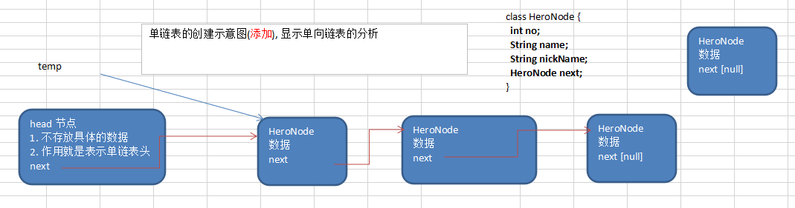

**添加创建大体步骤**

1）先创建一个head头结点，作用就是表时单链表的头             

2）后面我们每添加一个结点，就直接加入到链表的最后      

**遍历：**     

1）通过一个辅助的变量遍历，帮助遍历整个链表

### 4.3.2）添加-第二种方式思路分析（有序）

- 2）**第二种**方式在添加英雄时，**根据排名将英雄插入到指定位置**(**如果有这个排名**，则添加失败，**并给出提示)**

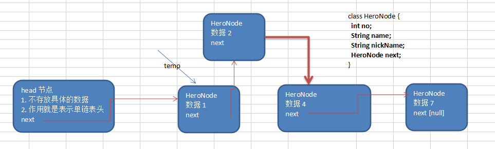


**添加的大体步骤：**

需要按照编号的顺序添加

1）首先找到新添加的节点的位置, 是通过辅助变量(指针), 通过遍历来搞定

2）`新的节点.next = temp.next`

3）将`temp.next = 新的节点`

### 4.3.3）修改-单链表的结点

思路：

1）通过遍历，先找到该节点        

2）直接修改该结点 `temp.name=newHeroNode.name;temp.nickName=newHeroNode.nickName;`

### 4.3.4）删除-单链表的结点

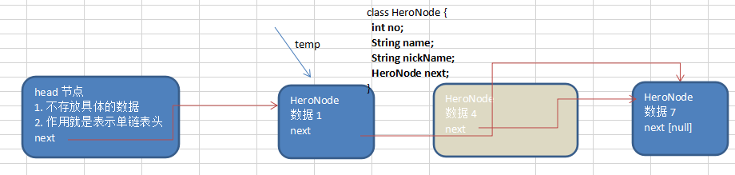

**从单链表中删除一个节点的大体思路步骤：**

1）我们先找到 需要删除的这个节点的前一个节点 temp

2）`temp.next = temp.next.next`

3）被删除的节点，将不会有其它引用指向，会被垃圾回收机制回收

### 4.3.5）完成的代码

```java
package com.wck.linkedlist;

public class SingleLinkedListDemo {
	
	public static void main(String[] args) {
		//创建英雄节点
		//先创建节点
		HeroNode hero1 = new HeroNode(1, "宋江", "及时雨");
		HeroNode hero2 = new HeroNode(2, "卢俊义", "玉麒麟");
		HeroNode hero3 = new HeroNode(3, "吴用", "智多星");
		HeroNode hero4 = new HeroNode(4, "林冲", "豹子头");
		
		SingleLinkedList singleLinkedList = new SingleLinkedList();
		/*
		singleLinkedList.add(hero1);
		singleLinkedList.add(hero2);
		singleLinkedList.add(hero3);
		singleLinkedList.add(hero4);
		*/
		
		singleLinkedList.addByOrder(hero1);
		singleLinkedList.addByOrder(hero2);
		singleLinkedList.addByOrder(hero3);
		singleLinkedList.addByOrder(hero4);
		System.out.println("更新之前单链表为：");
		singleLinkedList.list();
		
		HeroNode newHeroNode=new HeroNode(4, "wck", "wck");
		System.out.println("更新之后单链表为：");
		singleLinkedList.update(newHeroNode);
		singleLinkedList.list();
		
		System.out.println("删除后的单链表为：");
		singleLinkedList.del(1);
		singleLinkedList.del(4);
		singleLinkedList.del(2);
		singleLinkedList.del(3);
		
		singleLinkedList.list();
	}
}
class SingleLinkedList{
	
	//首先有一个头结点，这个头结点不允许动,不存放任何数据，作用就是表示单链表的头
	private HeroNode head=new HeroNode(0, "", "");
	/**
	 * 添加链表节点
	 * @param heroNode 要添加的节点
	 */
	public void add(HeroNode heroNode) {
		HeroNode temp=head;//把头结点存入临时的变量中
		while(true) {
			//判断next节点为 null 就退出循环
			if(temp.next == null) {
				break;
			}
			//把链表的指针向后移动一个
			temp=temp.next;
		}
		
		//将找到最后的节点指向添加的这个节点
		temp.next=heroNode;
	}
	/**
	 * 添加链表节点
	 * @param heroNode 要添加的节点,按照顺序插入到链表
	 */
	public void addByOrder(HeroNode heroNode) {
		//临时变量用于存储 头结点
		//因为头节点不能动，因此我们仍然通过一个辅助指针(变量)来帮助找到添加的位置
		//因为单链表，因为我们找的temp 是位于 添加位置的前一个节点，否则插入不了
		HeroNode temp=head;
		//用于标记是否该结点已经存在，默认为false ,
		//如果找到 则为true
		boolean flag=false;
		while(true) {
			//这种是没有后续的结点情况
			if(temp.next == null) {
				break;
			}
			if(temp.next.no > heroNode.no) {
				break;
			}else if(temp.next.no == heroNode.no) {
				//这个时候就是找到了相同的no，把标记置为true
				flag=true;
				break;
			}
			//后移结点
			temp=temp.next;
		}
		
		//插入结点
		if(flag) {
			System.out.printf("不可以加入，已经存在no:%d\n",heroNode.no);
		}else {
			//插入到后续结点中去
			heroNode.next=temp.next;
			temp.next=heroNode;
		}
	}
	
	/**
	 * 修改结点，但是no编号不能修改
	 * @param newHeroNode
	 */
	public void update(HeroNode newHeroNode) {
		if(head.next== null) {//说明是空链表，不能修改
			System.out.println("空链表，不能修改！");
			return;
		}
		
		//定义一个临时的变量用于存放结点
		HeroNode temp=head.next;//这里注意直接存放的是当前的结点
		
		//flag 用于标记是否已经找到要更新的结点信息
		//false 没找到， true 找到了
		boolean flag=false;
		
		while(true) {
			if(temp==null) {//最后一个结点，也没找到的情况
				System.out.printf("没有找到要修改的no:%d结点信息\n",newHeroNode.no);
				break;
			}
			if(temp.no == newHeroNode.no) {
				flag=true;
				break;
			}
			//指向后一个结点
			temp=temp.next;
		}
		if(flag) {
			temp.name=newHeroNode.name;
			temp.nickName=newHeroNode.nickName;
		}
	}
	
	/**
	 * 删除指定结点
	 * @param no
	 */
	public void del(int no) {
		//缓存头结点变量
		HeroNode temp=head;
		//用于标记是否已经找到要删除的结点
		boolean flag=false;
		while(true) {
			if(temp.next == null) {//说明没有找到
				break;
			}
			if(temp.next.no == no) {//说明找到了
				flag=true;
				break;
			}
			temp=temp.next;//指向下一个结点
		}
		
		if(flag) {
			temp.next=temp.next.next;
		}else {
			System.out.printf("没有找到要删除的no:%d\n",no);
		}	
	}
	/**
	 * 打印链表
	 */
	public void list() {
		//首先缓存头结点到临时变量
		HeroNode temp=head;
		if(temp.next == null) {
			System.out.println("该单链表为空！");
			return;
		}
		while(true) {
			//判断是否是最后一个节点
			if(temp.next == null) {
				break;
			}
			//把节点指向下一个节点
			temp=temp.next;
			//打印节点
			System.out.println(temp);
		}			
	}
}

class HeroNode{
	//编号
	public int no;
	//姓名
	public String name;
	//昵称
	public String nickName;
	//下一个节点英雄
	public HeroNode next;
	//创建英雄
	public HeroNode(int no, String name, String nickName) {
		this.no = no;
		this.name = name;
		this.nickName = nickName;
	}
	@Override
	public String toString() {
		return "HeroNode [no=" + no + ", name=" + name + ", nickName=" + nickName + "]";
	}	
}
```

## 4.4）单链表面试题(新浪、百度、腾讯)

-单链表的常见面试题有如下:

- 1）求单链表中有效节点的个数
- 2）查找单链表中的倒数第k个结点 【新浪面试题】
- 3）单链表的反转【腾讯面试题，有点难度】
- 4）从尾到头打印单链表 【百度，要求方式1：反向遍历 。 方式2：Stack栈】
- 5）合并两个有序的单链表，合并之后的链表依然有序【课后练习.】

### 4.4.1）求单链表中有效节点的个数

```java
	/**
	 *  求单链表中有效节点的个数(头结点不算)
	 * @param head 传入头结点
	 * @return 链表结点个数
	 */
	public static int getLength(HeroNode head) {
		int length=0;
		if (head.next == null) {//链表结点为空
			return length;
		}
		//定义一个辅助变量
		HeroNode temp=head.next;
		while (temp != null) {
			length++;
			temp=temp.next;
		}
		return length;
	}
```

### 4.4.2）查找单链表中的倒数第k个结点 【新浪面试题】

```java
	/**
	  * 查找单链表中的倒数第k个结点 【新浪面试题】
	//1. 编写一个方法，接收head节点，同时接收一个index 
	//2. index 表示是倒数第index个节点
	//3. 先把链表从头到尾遍历，得到链表的总的长度 getLength
	//4. 得到size 后，我们从链表的第一个开始遍历 (size-index)个，就可以得到
	//5. 如果找到了，则返回该节点，否则返回nulll
	 * @param head 头结点
	 * @param index 倒数第几个
	 * @return 
	 */
	public static HeroNode findLastIndexHeroNode(HeroNode head,int index) {
		if(head.next == null) {//单链表为空，直接返回null
			return null;
		}
		//定义一个临时的变量用于存储结点
		HeroNode temp=head;
		int size=getLength(head);//有效的链表结点个数
		if(index <=0 || index > size) {
			return null;
		}
		//遍历获得倒数第index个结点
		for(int i=0;i<=size-index;i++) {
			temp=temp.next;
		}
		return temp;
	}
```

### 4.4.3）单链表的反转【腾讯面试题，有点难度】

- 1）思路分析图解

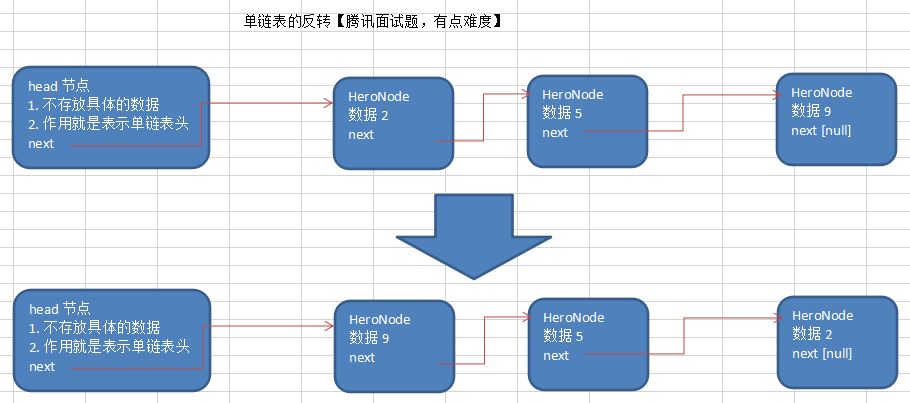

- 2）思路: 

  - 1）先定义一个节点 `reverseHead = new HeroNode();`
  - 2）从头到尾遍历原来的链表，每遍历一个节点，就将其取出，并放在新的链表`reverseHead` 的最前端.
  - 3）原来的链表的`head.next = reverseHead.next`

  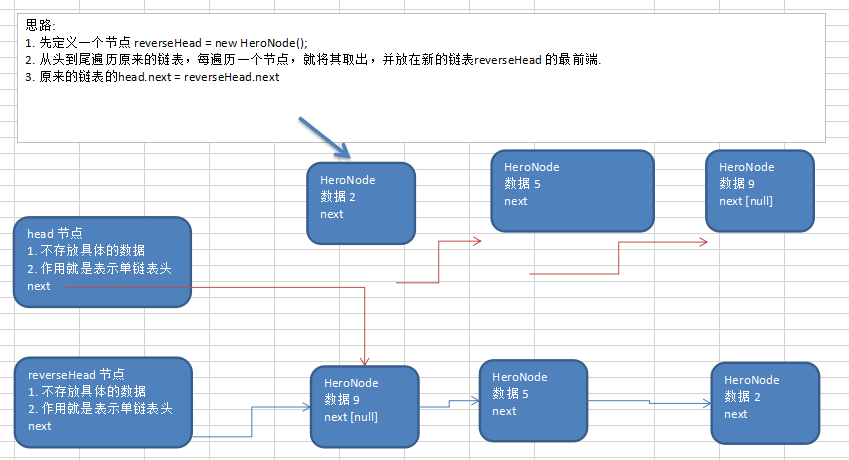

- 3）代码

```java

	/**
	  *将单链表反转【腾讯面试题，有点难度】
	 *1.有一个新的链表reverseHead节点
	 *2.定义一个缓存变量用于记录下一个节点的信息
	 *3.定义一个缓存变量存放当前节点的信息
	 *3往后移动一下节点
	 */
	public static void reverseList(HeroNode head) {
		//单链表的为空或者就一个节点直接返回，不需要反转
		if(head.next == null || head.next.next == null) {
			return;
		}
		HeroNode reverseHead =new HeroNode(0, "", "");
		HeroNode cur=head.next;//当前的节点
		HeroNode next=null;//当前节点的下一个节点
		while(cur !=null ) {
			next=cur.next;//记录下一个节点的
			cur.next=reverseHead.next;//把新的reverseHead的头结点的第一个节点赋值给当前的结点的下一个节点（next）
			reverseHead.next=cur;//把当前的这个节点赋值给新的reverseHead的头结点的第一个节点
			cur=next;//把节点后移
		}
		head.next=reverseHead.next;//把reverseHead中的所有结点赋值给原head
	}
	
```

### 4.4.5）从尾到头打印单链表 【百度，要求方式1：反向遍历 。 方式2：Stack栈】

- 思路分析图解

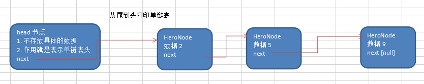


- 上面的题的要求就是逆序打印单链表.
  - 方式1： 先将单链表**进行反转操作**，然后再遍历即可，这样的做的问题是**会破坏原来的单链表的结构，不建议**
  - 方式2：可以**利用栈这个数据结构**，将**各个节点压入到栈中**，然后**利用栈的先进后出的特点**，就实现了逆序打印的效果.

- 代码

```java
/**
	  * 从尾到头打印单链表 【百度，要求方式1：反向遍历 。 方式2：Stack栈】
	 *使用的方式是栈 
	 * @param head 
	 */
	public static void reversePrint(HeroNode head) {
		if(head.next == null) {//代表着是空的单链表
			return;
		}
		
		HeroNode temp=head.next;
		Stack<HeroNode> stack=new Stack<HeroNode>();
		
		while(temp !=null) {
			stack.push(temp);//入栈
			temp=temp.next;//移到下一个节点
		}
		
		//出栈打印
		while(stack.size() > 0) {
			System.out.println(stack.pop());
		}
	}
```

### 4.4.6)作业

合并两个有序的单链表，合并之后的链表依然有序【课后练习.】


## 4.5）双向链表应用实例

**使用带head头的双向链表实现** –水浒英雄排行榜

### 4.5.1）管理单向链表的缺点分析: 

- 1）**单向链表**，查找的方向**只能是一个方向**，而**双向链表**可以**向前或者向后查找**。
- 2）**单向链表不能自我删除**，需要靠辅助节点 ，而**双向链表，则可以自我删除**，所以前面我们单链表删除的节点，总是找到temp,temp是待删除节点的前一个节点。

### 4.5.2）双向链表的遍历、添加、修改、删除

- 思路分析

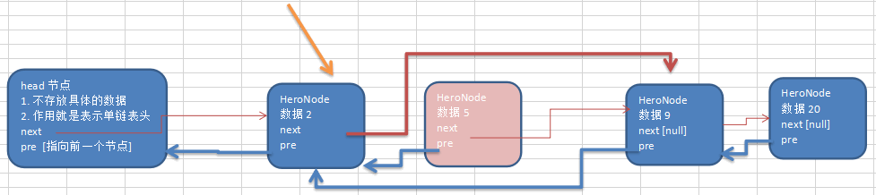

### 4.5.3）分析 双向链表的遍历，添加，修改，删除的操作思路

- 1) **遍历 方式和 单链表一样**，只是**可以向前**，也**可以向后**查找
- 2) 添加 (**默认添加到双向链表的最后**)
  - (1) 先找到双向链表的最后这个节点
  - (2) `temp.next = newHeroNode`
  - (3) `newHeroNode.pre = temp;`
- 3) **修改** 思路**和 原来的单向链表一样**.
- 4) 删除
  - (1) 因为是**双向链表**，因此，我们**可以实现自我删除某个节点**
  - (2) **直接找到要删除的这个节点**，比如temp
  - (3)  `temp.pre.next = temp.next`
  - (4) `temp.next.pre = temp.pre;`

### 4.5.4）双向链表的代码实现

```java
package com.wck.linkedlist;
/**
* @author YuXiangKaoChi
* @createTime：2020-04-25 22:31:29
*   类说明：双向链表
*/
public class DoubleLinkedListDemo {

	public static void main(String[] args) {

		//先创建节点
		HeroNode2 hero1 = new HeroNode2(1, "宋江", "及时雨");
		HeroNode2 hero2 = new HeroNode2(2, "卢俊义", "玉麒麟");
		HeroNode2 hero3 = new HeroNode2(3, "吴用", "智多星");
		HeroNode2 hero4 = new HeroNode2(4, "林冲", "豹子头");
		
		DoubleLinkedList doubleLinkedList = new DoubleLinkedList();
		doubleLinkedList.add(hero1);
		doubleLinkedList.add(hero2);
		doubleLinkedList.add(hero3);
		doubleLinkedList.add(hero4);
		
		System.out.println("双链表的结点为：");
		doubleLinkedList.list();
		
		HeroNode2 updateHeroNode = new HeroNode2(4, "wck", "wck");
		doubleLinkedList.update(updateHeroNode);
		System.out.println("修改后双链表的结点为：");
		doubleLinkedList.list();
		
		doubleLinkedList.del(1);
		doubleLinkedList.del(4);
		
		System.out.println("删除后双链表的结点为：");
		doubleLinkedList.list();	
	}

}

//创建双向链表的类
class DoubleLinkedList{
	//首先有一个头结点，这个头结点不允许动,不存放任何数据，作用就是表示单链表的头
	private HeroNode2 head=new HeroNode2(0, "", "");
	public HeroNode2 getHead() {
		return head;
	}
	
	/**
	 * 添加到双向链表的最后
	 * @param heroNode 添加的结点
	 */
	public void add(HeroNode2 heroNode) {
		HeroNode2 temp=head;//把头结点存入临时的变量中
		while(true) {
			//判断next节点为 null 就退出循环
			if(temp.next == null) {
				break;
			}
			//把链表的指针向后移动一个
			temp=temp.next;
		}
		
		//将找到最后的节点指向添加的这个节点，形成一个双向链表
		temp.next=heroNode;
		//添加前一个节点到 temp
		heroNode.pre=temp;
	}
	
	/**
	 * 修改双向链表和前面的单向链表一样
	 * 只是结点的类型改成了 HeroNode2
	 * @param newHeroNode 传递要修改的结点
	 */
	public void update(HeroNode2 newHeroNode) {
		if(head.next== null) {//说明是空链表，不能修改
			System.out.println("空链表，不能修改！");
			return;
		}
		
		//定义一个临时的变量用于存放结点
		HeroNode2 temp=head.next;//这里注意直接存放的是当前的结点
		
		//flag 用于标记是否已经找到要更新的结点信息
		//false 没找到， true 找到了
		boolean flag=false;
		
		while(true) {
			if(temp==null) {//最后一个结点，也没找到的情况
				System.out.printf("没有找到要修改的no:%d结点信息\n",newHeroNode.no);
				break;
			}
			if(temp.no == newHeroNode.no) {
				flag=true;
				break;
			}
			//指向后一个结点
			temp=temp.next;
		}
		if(flag) {
			temp.name=newHeroNode.name;
			temp.nickName=newHeroNode.nickName;
		}
	}
	
	/**
	 * 删除双向链表的指定结点
	 * @param no
	 */
	public void del(int no) {
		//判断当前的链表是否为空
		if(head.next == null) {
			System.out.println("双向链表为空，不能删除！");
			return;
		}
		
		//缓存头结点变量
		HeroNode2 temp=head.next;
		//用于标记是否已经找到要删除的结点
		boolean flag=false;
		while(true) {
			if(temp == null) {//说明没有找到
				break;
			}
			if(temp.no == no) {//说明找到了
				flag=true;
				break;
			}
			temp=temp.next;//指向下一个结点
		}
		
		if(flag) {
			temp.pre.next=temp.next;
			//如果是最后一个节点就不需要执行下面的这句话，否则会报空指针异常
			if(temp.next != null) {
				temp.next.pre=temp.pre;
			}
		}else {
			System.out.printf("没有找到要删除的no:%d\n",no);
		}
	}
	
	/**
	 * 打印双向链表
	 */
	public void list() {
		//首先缓存头结点到临时变量
		HeroNode2 temp=head;
		if(temp.next == null) {
			System.out.println("该单链表为空！");
			return;
		}
		
		while(true) {
			//判断是否是最后一个节点
			if(temp.next == null) {
				break;
			}
			//把节点指向下一个节点
			temp=temp.next;
			//打印节点
			System.out.println(temp);
		}
	}
}

//英雄类
class HeroNode2{
	//编号
	public int no;
	//姓名
	public String name;
	//昵称
	public String nickName;
	//指向下一个节点英雄
	public HeroNode2 next;
	//指向前一个节点英雄
	public HeroNode2 pre;
	//创建英雄
	public HeroNode2(int no, String name, String nickName) {
		this.no = no;
		this.name = name;
		this.nickName = nickName;
	}
	@Override
	public String toString() {
		return "HeroNode [no=" + no + ", name=" + name + ", nickName=" + nickName + "]";
	}
		
}

```

### 4.5.5）作业

双向链表的第二种添加方式,按照编号顺序;按照单链表的顺序添加，稍作修改即可.


## 4.6）单向环形链表应用场景


### 4.6.1)单向环形链表介绍


### 4.6.2）Joseph问题（约瑟夫问题）

- Joseph问题
  Joseph 问题为：设编号为1，2，… n的**n个人围坐一圈**，约定**编号为k（1<=k<=n）的人从1开始报数**，**数到m** 的那个人**出列**，它的**下一位又从1开始报数**，**数到m**的那个人**又出列**，**依次类推**，直到所有人出列为止，由此**产生一个出队编号的序列**。

- 提示
  用一个**不带头结点的循环链表来处理Joseph问题**：先构成一个**有n个结点的单循环链表**，然后由**k结点起从1开始计数**，**计到m**时，**对应结点从链表中删除**，然后再从**被删除结点的下一个结点又从1开始计数**，**直到最后一个结点从链表中删除算法结束。**

#### 4.6.2.1）创建环形单链表和打印遍历的思路

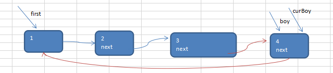

**构建一个单向的环形链表思路**：

- 1）先**创建第一个节点，让first 指向自己**，形成一个环形
- 2）后面我们**每创建一个新的节点**，**就**把该节点**添加到已有的环形链表中**即可

**遍历环形链表思路**

- 1）先让**一个辅助结点curBoy 指向first 结点**
- 2）通过一个while循环遍历该链表，最后结束的条件为 **curBoy.next == first**,即可。

#### 4.6.2.2）约瑟夫问题，小孩出圈的思路分析

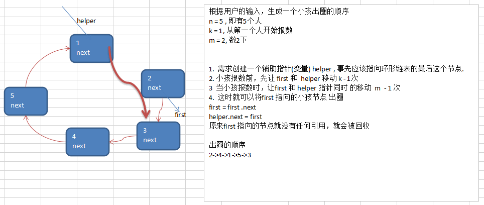

分析：

- 根据用户的输入，生成一个小孩出圈的顺序    
  n = 5 , 即有5个人     
  k = 1, 从第一个人开始报数    
  m = 2, 数2下         

- 1）需求创建一个**辅助指针(变量) helper** , 事先**应该指向环形链表的最后这个节点**.**first指向头结点**。

- 2）小孩报数前，**先让 first 和  helper 移动 k - 1次**

-  3）当小孩报数时，**让first 和 helper 指针同时 的移动  m  - 1 次**

- 4）这时就可以**将first 指向的小孩节点 出圈**

  ``first = first .next` 
  `helper.next = first` 

  原来first 指向的节点就没有任何引用，就会被回收

  出圈的顺序
  2->4->1->5->3

#### 4.6.2.3）代码实现

```java
package com.wck.linkedlist;
/**
* @author YuXiangKaoChi
* @createTime：2020-04-26 22:46:41
* 类说明：
*   约瑟夫问题
*   Josephu  问题为：设编号为1，2，… n的n个人围坐一圈，约定编号为k（1<=k<=n）的人从1开始报数，
*   数到m 的那个人出列，它的下一位又从1开始报数，数到m的那个人又出列，依次类推，
*   直到所有人出列为止，由此产生一个出队编号的序列。
*/
public class Joseph {
	
	public static void main(String[] args) {
		CircleSingleLinkedList circleSingleLinkedList = new CircleSingleLinkedList();
		circleSingleLinkedList.addBoy(5);
		System.out.println("打印环形单链表：");
		circleSingleLinkedList.showBoy();
		//出圈
		circleSingleLinkedList.countBoy(1, 2, 5);	
	}

}

/**
 * 单向循环列表
 * @author YuXiangKaoChi
 *
 */
class CircleSingleLinkedList{
	//第一个孩子，头结点
	private Boy first=null;
	
	/**
	 * 添加孩子结点
	 * @param num 孩子结点的数量
	 */
	public void addBoy(int num) {
		//检查传递的结点数量
		if(num <1) {
			System.out.println("传入的孩子数必须大于0 ！");
			return;
		}
		//定义一个缓存的变量（指针），用于遍历
		Boy curBoy=null;
		for(int i=1;i<=num;i++) {
			Boy boy=new Boy(i);
			if(i==1) {
				first=boy;//第一个孩子结点赋值给头结点
				first.setNext(boy);//头结点把下一个节点指向头结点
				curBoy=boy;//缓存的变量（指针）指向当前的结点
			}else {
				curBoy.setNext(boy);//添加孩子结点
				boy.setNext(first);//把添加进来的孩子结点指向头结点，形成环
				curBoy=boy;//缓存的变量指针，向后移动一下
			}
		}
	}
	
	/**
	 * 
	 * @param startNo 从哪一个编号开始数
	 * @param countNum 表时数几下
	 * @param nums 单向循环链表的结点个数
	 */
	public void countBoy(int startNo,int countNum,int nums) {
		//先对数据进行校验
		if(first == null || startNo <1 || startNo > nums) {
			System.out.println("你的参数输入有误！");
			return;
		}
		
		//1 找到辅助结点helper和第一个节点 
		//定义一个辅助的孩子结点,把头结点赋值给 helperBoy
		Boy helper=first;
		while(true) {
			if(helper.getNext() == first) {//当是最后一个节点的时候，退出循环
				break;
			}
			
			helper=helper.getNext();//移动到下一个孩子结点
		}
		//2.从startNo这个编号开始数
		for(int i=1;i<=(startNo-1);i++) {
			first=first.getNext();//头结点向后移动
			helper=helper.getNext();//辅助结点向后移动
		}
		
		while(true) {
			if(helper == first) {
				break;
			}
			for(int j=1;j<=(countNum-1);j++) {
				first=first.getNext();
				helper=helper.getNext();
			}
			System.out.println("这个节点就是要删除的结点："+first);
			first=first.getNext();
			helper.setNext(first);
			
		}
		
		System.out.println("最后一个出圈的孩子结点是："+helper);
	}
	
	/**
	 * 打印当前环形单链表
	 */
	public void showBoy() {
		if(first == null) {
			System.out.println("当前的环形单链表为空！");
			return;
		}
		Boy curBoy=first;//缓存的变量（指针）指向当前的头结点
		//System.out.println(curBoy);//打印当前的孩子结点
		while (true) {
			System.out.println(curBoy);//打印当前的孩子结点
			if(curBoy.getNext() == first) {
				break;
			}
			curBoy=curBoy.getNext();//把当前的缓存的变量（指针）向后移动一下
		}
	}
}

/**
 * 孩子类
 * @author YuXiangKaoChi
 *
 */
class Boy{
	//编号
	private int no;
	//指向下一个的结点 next
	private Boy next;
	
	public Boy(int no) {
		super();
		this.no = no;
	}
	public int getNo() {
		return no;
	}
	public void setNo(int no) {
		this.no = no;
	}
	public Boy getNext() {
		return next;
	}
	public void setNext(Boy next) {
		this.next = next;
	}
	@Override
	public String toString() {
		return "Boy [no=" + no + "]";
	}
}
```


