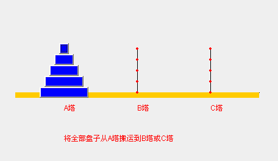
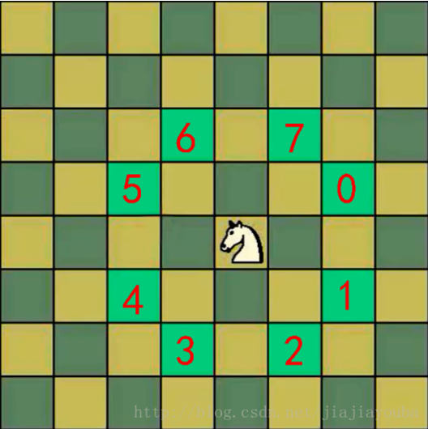
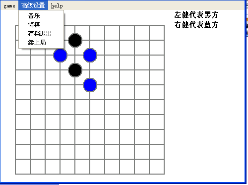
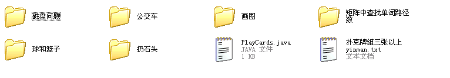
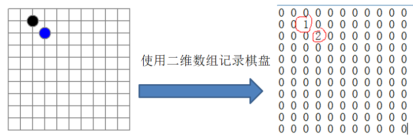
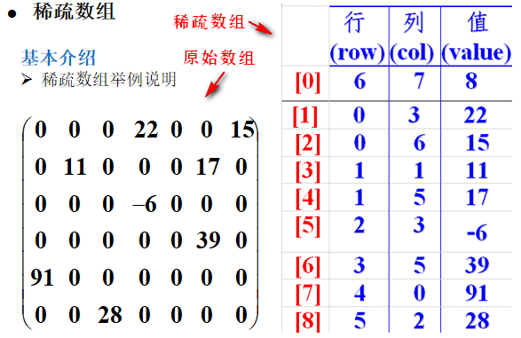
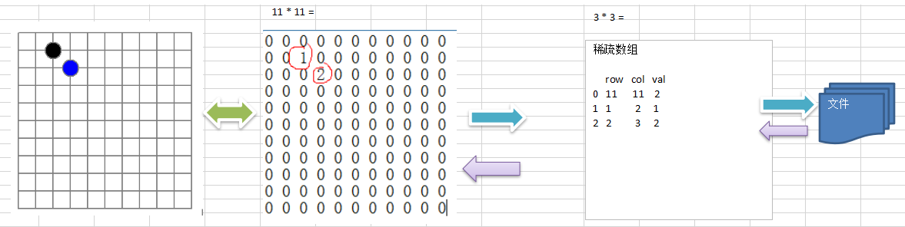

# 第一章 内容介绍

## 1.1）数据结构和算法内容介绍

### 1.1.1）先看几个经典的算法面试题

#### ①字符串匹配问题

有一个字符串 str1= ""你好世界  你好是吉恩世界 你好是世界""，和一个子串 str2="你好是世界"      

现在要判断 str1 是否含有 str2, 如果存在，就返回第一次出现的位置, 如果没有，则返回-1         

要求用最快的速度来完成匹配     

你的思路是什么？     

- 暴力匹配【简单但是效率低下】
- **KMP算法《部分匹配表》**

#### ②汉诺塔游戏问题

汉诺塔游戏, 请完成汉诺塔游戏的代码: 

要求：

- 1) 将A塔的所有圆盘移动到C塔。并且规定，
- 2) 在小圆盘上不能放大圆盘，
- 3)在三根柱子之间一次只能移动一个圆盘



#### ③八皇后问题

八皇后问题  

是一个古老而著名的问题，是回溯算法的典型案例。

该问题是国际西洋棋棋手马克斯·贝瑟尔于1848年提出：

在8×8格的国际象棋上摆放八个皇后，使其不能互相攻击，

即：**任意两个皇后都不能处于同一行、同一列或同一斜线上，问有多少种摆法**。【92】=>**分治算法**

**使用到回溯算法**
高斯认为有76种方案。

1854年在柏林的象棋杂志上不同的作者发表了40种不同的解，**后来有人用图论的方法解出92种结果**。计算机发明后，有多种计算机语言可以解决此问题。【小游戏链接：http://www.7k7k.com/swf/49842.htm】


#### ④马踏棋盘问题

马踏棋盘算法介绍和游戏演示    
马踏棋盘算法也被称为骑士周游问题  
**将马随机放在国际象棋的8×8棋盘Board\[0～7][0～7]的某个方格中，马按走棋规则(马走日字)进行移动**。    

要求每个方格只进入一次，**走遍棋盘上全部64个方格**     

**会使用到图的深度优化遍历算法(DFS) + 贪心算法优化**

小游戏链接演示: http://www.4399.com/flash/146267_2.htm 



### 1.1.2）数据结构和算法的重要性

- **1）算法是程序的灵魂，优秀的程序可以在海量数据计算时，依然保持高速计算**
- 2）一般来讲 **程序会使用了内存计算框架(比如Spark)和缓存技术(比如Redis等)来优化程序**,再深入的思考一下，这些计算框架和缓存技术， 它的核心功能是哪个部分呢？
- **3）如果你不想永远都是代码工人,那就花时间来研究下数据结构和算法**

# 第二章 数据结构和算法概述

## 2.1）数据结构和算法的关系

- 数据data结构(structure)是一门**研究组织数据**方式的学科，有了编程语言也就有了数据结构.学好数据结构可以编写出更加漂亮,更加有效率的代码。
- 要学习好数据结构就要多多考虑如何将生活中遇到的问题,用程序去实现解决.
- **程序 = 数据结构 + 算法**
- 数据结构是算法的基础, 换言之，想要学好算法，需要把**数据结构学到位**。

## 2.2）看几个实际编程中遇到的问题

### 2.2.1）问题一，字符串替换问题

```java

Java代码:
	 public static void main(String[] args) {
		String str = "Java,Java, hello,world!";
		String newStr = str.replaceAll("Java", "wck~"); //算法
		System.out.println("newStr=" + newStr);
	}
```

问：         

试写出用单链表表示的字符串类及字符串结点类的定义，并依次实现它的构造函数、以及计算串长度、串赋值、判断两串相等、求子串、两串连接、求子串在串中位置等7个成员函数。    

小结：需要使用到**单链表数据结构**

### 2.2.2）问题二，一个五子棋程序



问：如何判断游戏的输赢，并可以完成存盘退出和继续上局的功能      

- 棋盘=>**二维数组**=>(**稀疏数组)**-> 写入文件  【存档功能】 

-   读取文件-》稀疏数组-》二维数组 -》 棋盘 【接上局】   

  

小结：需要用到**二维数组，稀疏数组**

### 2.2.3）问题三，约瑟夫(Josephu)问题(丢手帕问题)


- 1）Josephu  问题为：设编号为1，2，… n的n个人围坐一圈，约定编号为k（1<=k<=n）的人从1开始报数，数到m 的那个人出列，它的下一位又从1开始报数，数到m的那个人又出列，依次类推，直到所有人出列为止，由此产生一个出队编号的序列。
- 2）提示：用一个不带头结点的循环链表来处理Josephu 问题：先构成一个有n个结点的单循环链表（单向环形链表），然后由k结点起从1开始计数，计到m时，对应结点从链表中删除，然后再从被删除结点的下一个结点又从1开始计数，直到最后一个结点从链表中删除算法结束

小结：需要用到**单向环形链表**

### 2.2.4）其它常见算法问题



- 1）**修路问题  => 最小生成树(加权值)【数据结构】+ 普利姆算法**
- 2）**最短路径问题  => 图+弗洛伊德算法**
- 3）**汉诺塔 => 分支算法** 
- 4）**八皇后问题 => 回溯法**

## 2.3）线性结构和非线性结构

数据结构包括：**线性**结构和**非线性**结构。    

### 2.3.1）线性结构

- 1）线性结构作为最常用的数据结构，其特点是**数据元素之间存在一对一的线性关系**
- 2）线性结构有两种不同的存储结构，即**顺序存储结构和链式存储结构**。**顺序存储的线性表称为顺序表，顺序表中的存储元素是连续的**
- 3）链式存储的线性表称为链表，链表中的**存储元素不一定是连续**的，**元素节点中存放数据元素以及相邻元素的地址信息**
- 4）线性结构常见的有：**数组、队列、链表和栈**

### 2.3.2）非线性结构

- 非线性结构包括：**二维数组，多维数组，广义表，树结构，图结构**

# 第三章 稀疏数组和队列

## 3.1）稀疏sparsearray数组

### 3.1.1）先看一个实际的需求

- 编写的五子棋程序中，有存盘退出和续上盘的功能。



- 分析问题: 
  因为该二维数组的很多值是默认值0, 因此记录了**很多没有意义的数据-**>**稀疏数组**

### 3.1.2）基本介绍

**当一个数组中大部分元素为０，或者为同一个值的数组时，可以使用稀疏数组来保存该数组。**

稀疏数组的处理方法是:

- 记录数组**一共有几行几列，有多少个不同的值**
- 把**具有不同值的元素的行列及值记录在一个小规模的数组中，从而缩小程序的规模**


稀疏数组的举例：



### 3.1.3）应用实例

- 使用稀疏数组，来保留类似前面的二维数组(棋盘、地图等等)
- 把稀疏数组存盘，并且可以从新恢复原来的二维数组数
- 整体思路分析



思路：

- 二维数组 转 稀疏数组的思路
  - 1）遍历原始的二维数组，**得到有效的数据个数sum**
  - 2）根据sum就可以**创建稀疏数组 sparseArr int\[sum+1\]\[3\]**
  - 3）将二维数组的**有效数据存入到稀疏数组**

- 稀疏数组转原始的二维数组的思路
  - 1）**先读取稀疏数组的第一行**，根据第一行的数据，**创建原始的二维数组**，比如上面的chessArr2=int \[11\]\[11\]
  - 2）**再读取**稀疏数组**后几行的数据**，并**赋值给原始的二维数据即可**


### 3.1.4）代码实现

```java
package com.wck.sparsearray;

import java.io.BufferedReader;
import java.io.File;
import java.io.FileReader;
import java.io.FileWriter;
import java.io.IOException;
import java.util.ArrayList;
import java.util.Arrays;
/*
 *稀疏数组，棋盘问题 
 并写入到磁盘中文件中和读取磁盘文件
 将稀疏数组保存到磁盘上，比如 map.data
 恢复原来的数组时，读取map.data 进行恢复
 */
public class SparseArray {
	public static void main(String[] args) throws IOException {
		// 创建一个二维数组 11 * 11
		// 0:没有棋子 1：表示 黑子 2：表示蓝子
		int[][] chessArray = new int[11][11];
		chessArray[1][2] = 1;// 黑子
		chessArray[2][3] = 2;// 蓝子
//		chessArray[2][4]=2;//蓝子
		// 输出原始的二维数组
//		System.out.println(Arrays.deepToString(chessArray));
		System.out.println("原始二维数组：");
		printArray(chessArray);// 打印二维数组
		// 二维数组 转 稀疏数组
		/**
		 * 
		 * - 1）遍历原始的二维数组，**得到有效的数据个数sum** 
		 * - 2）根据sum就可以**创建稀疏数组 sparseArr
		 * int\[sum+1\]\[3\]** - 3）将二维数组的**有效数据存入到稀疏数组**
		 */
		// 统计有效数据的个数
		int sum = 0;
		// 行数
		int row = chessArray.length;
		// System.out.println("行数："+row);
		int col = chessArray[0].length;
		// System.out.println("列数："+col);
		for (int i = 0; i < chessArray.length; i++) {
			for (int j = 0; j < chessArray[i].length; j++) {
				if (chessArray[i][j] != 0) {
					// System.out.println(chessArray[i][j]);
					sum++;// 统计计算有效的数值个数
				}
			}
		}
		System.out.println("有效数字总数sum:" + sum);
		int[][] chessArr1 = new int[sum + 1][3];
		chessArr1[0][0] = row;// 行
		chessArr1[0][1] = col;// 列
		chessArr1[0][2] = sum;// 有效个数
		int count = 0;
		for (int i = 0; i < chessArray.length; i++) {
			for (int j = 0; j < chessArray[i].length; j++) {
				if (chessArray[i][j] != 0) {
					count++;
					chessArr1[count][0] = i;
					chessArr1[count][1] = j;
					chessArr1[count][2] = chessArray[i][j];
				}
			}
		}
		System.out.println("稀疏二维数组：");
		 printArray(chessArr1);
		writerArray(chessArr1);// 写入到文件
		// 稀疏数组恢复转换为原始的二维数组
		/**
		 * - 1）**先读取稀疏数组的第一行**，根据第一行的数据，**创建原始的二维数组**，比如上面的chessArr2=int [11][11] 
		 * -2）**再读取**稀疏数组**后几行的数据**，并**赋值给原始的二维数据即可**
		 */
		// 1. 先读取稀疏数组的第一行，根据第一行的数据，创建原始的二维数组
		
		//方式一：使用IO流恢复二维数组
		System.out.println("使用IO流恢复二维数组：");
		int[][] readerArray = readerArray();
		printArray(readerArray);
		
		int[][] chessArr2 = new int[readerArray[0][0]][readerArray[0][1]];
		System.out.println("恢复的数组为：");
		// 2. 在读取稀疏数组后几行的数据，并赋给 原始的二维数组 即可.
		for (int i = 1; i < readerArray.length; i++) {
			chessArr2[readerArray[i][0]][readerArray[i][1]] = readerArray[i][2];
		}
		printArray(chessArr2);
		//方式二：直接读取的数组
		/*int[][] chessArr2 = new int[chessArr1[0][0]][chessArr1[0][1]];
		System.out.println("恢复的数组为：");
		// 2. 在读取稀疏数组后几行的数据，并赋给 原始的二维数组 即可.
		for (int i = 1; i < chessArr1.length; i++) {
			chessArr2[chessArr1[i][0]][chessArr1[i][1]] = chessArr1[i][2];
		}
		printArray(chessArr2);*/
	}

	/**
	 * 打印二维数组
	 * 
	 * @param printArray 要打印的二维数组
	 * @throws IOException
	 */
	public static void printArray(int[][] printArray) throws IOException {

		for (int[] row : printArray) {
			for (int data : row) {
				// \t 代表按一下tab键
				System.out.printf("%d\t", data);
			}
			System.out.println();
		}
	}

	/**
	 * 写入数组到文件
	 * @param printArray
	 * @throws IOException
	 */
	public static void writerArray(int[][] printArray) throws IOException {
		FileWriter fw = new FileWriter(new File("map.data"));
		for (int[] row : printArray) {
			StringBuilder sb = new StringBuilder("");
			for (int data : row) {
				// \t 代表按一下tab键
				//System.out.printf("%d\t", data);
				sb.append(data + "&");//添加分隔符&
			}
			sb.append("\n");
			fw.write(sb.toString());
			//System.out.println(sb.toString());
			//System.out.println();
		}
		fw.close();
	}
	
	/**
	 * 读取文件返回一个二维数组
	 * @return
	 * @throws IOException
	 */
	public static int[][] readerArray() throws IOException {
	FileReader fr=new FileReader(new File("map.data"));
	BufferedReader br=new BufferedReader(fr);
	String s=null;
	int count=0;
	while(br.readLine()!=null) {
		count++;
	}
	//System.out.println("count:"+count);//总行数
	int falg=0;
	int[][] resultArr=new int[count][3];
	FileReader fr1=new FileReader(new File("map.data"));
	BufferedReader br1=new BufferedReader(fr1);
	while((s=br1.readLine())!=null) {
		System.out.println(s);
		String[] split = s.split("&");
//		System.out.println("分隔后的数组为："+Arrays.deepToString(split));
		resultArr[falg]=stringToIntArr(split);
		falg++;
	}
	br.close();
	br1.close();
	return resultArr;
	}
	
	/**
	 * 将String一维数组转换为int 一维数组
	 * @param sArr
	 * @return
	 */
	public static int[] stringToIntArr(String [] sArr) {
		int[] intArr=new int[sArr.length];
		for (int i = 0; i < sArr.length; i++) {
			System.out.println("获取到的值："+sArr[i]);
			intArr[i]=Integer.parseInt(sArr[i]);
		}
		return intArr;
	}
}
```


