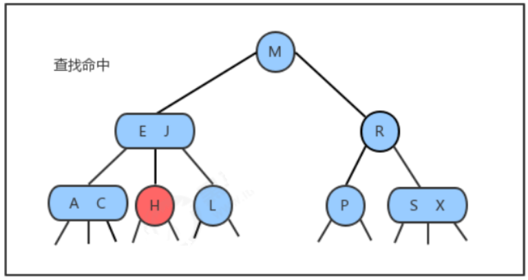
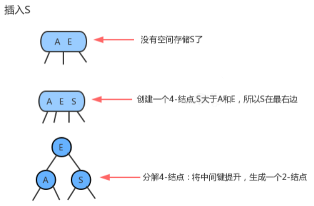
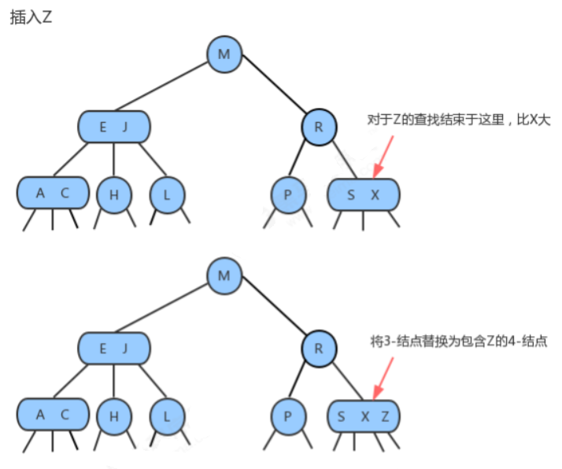
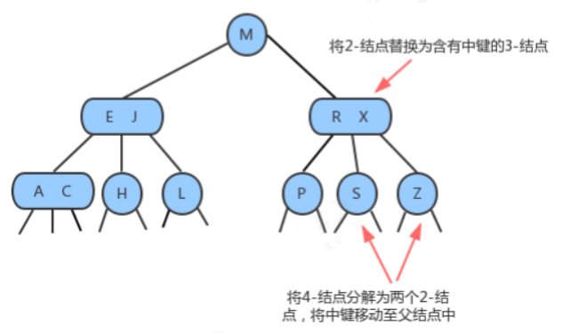
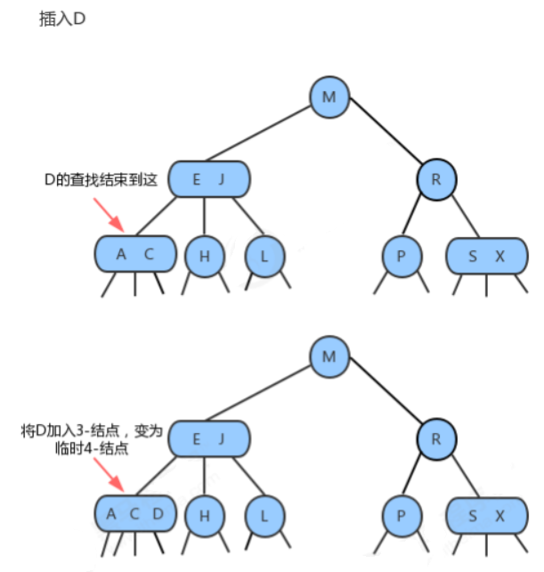
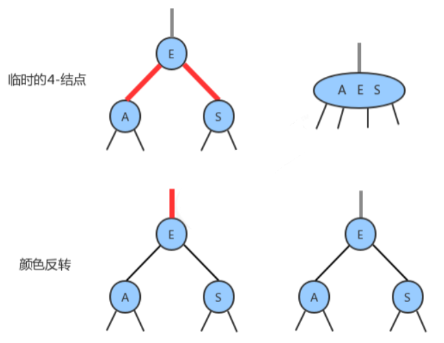
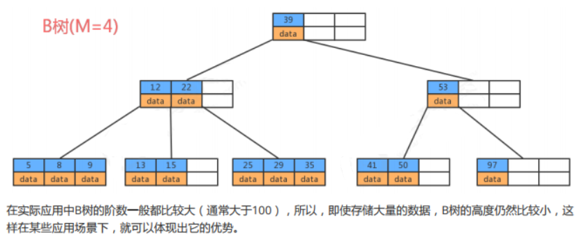

#  一 、2-3 查找树

## 1.1）2-3查找树的定义

- **2-结点：**

含有一个键(及其对应的值)和两条链，左链接指向2-3树中的键都小于该结点，右链接指向的2-3树中的键都大
于该结点。

- **3-结点：**

含有两个键(及其对应的值)和三条链，左链接指向的2-3树中的键都小于该结点，中链接指向的2-3树中的键都
位于该结点的两个键之间，右链接指向的2-3树中的键都大于该结点。


## 1.2）查找

将二叉查找树的查找算法一般化我们就能够直接得到2-3树的查找算法。要判断一个键是否在树中，我们先将它和
根结点中的键比较。如果它和其中任意一个相等，查找命中；否则我们就根据比较的结果找到指向相应区间的连
接，并在其指向的子树中递归地继续查找。如果这个是空链接，查找未命中。

- **对于H的命中查找**





## 1.3）插入

### 1.3.1）向2-结点中插入新键

往2-3树中插入元素和往二叉查找树中插入元素一样，首先要进行查找，然后将节点挂到未找到的节点上。2-3树之
所以能够保证在最差的情况下的效率的原因在于**其插入之后仍然能够保持平衡状态**。如果**查找后未找到的节点是一**
**个2-结点**，那么很容易，我们**只需要将新的元素放到这个2-结点里面使其变成一个3-结点即可**。但是如果查找的节
点结束于一个3-结点，那么可能有点麻烦。


### 1.3.2）向一棵只含有一个3-结点的树中插入新键

假设2-3树只**包含一个3-结点**，这个结点有两个键，没有空间来插入第三个键了，最自然的方式是**我们假设这个结**
**点能存放三个元素，暂时使其变成一个4-结点**，同时他**包含四条链接**。然后，我们将**这个4-结点的中间元素提升**，
**左边的键作为其左子结点，右边的键作为其右子结点**。插入完成，变为平衡2-3查找树，**树的高度从0变为1**。



### 1.3.3）向一个父结点为2-结点的3-结点中插入新键

和上面的情况一样一样，我们也可以**将新的元素插入到3-结点中**，使其**成为一个临时的4-结点**，然后，**将该结点中**
**的中间元素提升到父结点即2-结点中**，**使其父结点成为一个3-结点**，然后**将左右结点分别挂在这个3-结点的恰当位**
**置。**





### 1.3.4）向一个父结点为3-结点的3-结点中插入新键

当我们插入的结点是3-结点的时候，我们将该结点拆分，**中间元素提升至父结点，但是此时父结点是一个3-结点，**
**插入之后，父结点变成了4-结点**，**然后继续将中间元素提升至其父结点，直至遇到一个父结点是2-结点**，**然后将其**
**变为3-结点，不需要继续进行拆分。**




### 1.3.5）分解根结点

**当插入结点到根结点的路径上全部是3-结点的时候，最终我们的根结点会变成一个临时的4-结点，此时，就需要将**
**根结点拆分为两个2-结点，树的高度加1。**


## 1.4）2-3树的性质

通过对2-3树插入操作的分析，我们发现在插入的时候，2-3树需要做一些局部的变换来保持2-3树的平衡。
一棵完全平衡的2-3树具有以下性质：
1.任意空链接到根结点的路径长度都是相等的。
2. 4-结点变换为3-结点时，树的高度不会发生变化，只有当根结点是临时的4-结点，分解根结点时，树高+1。
3. 2-3树与普通二叉查找树最大的区别在于，普通的二叉查找树是自顶向下生长，而2-3树是自底向上生长。

## 1.5）2-3树的实现

直接实现2-3树比较复杂，因为：     
**需要处理不同的结点类型，非常繁琐；    
需要多次比较操作来将结点下移；**       

需要上移来拆分4-结点；                      

拆分4-结点的情况有很多种；             
2-3查找树实现起来比较复杂，在某些情况插入后的平衡操作可能会使得效率降低。但是2-3查找树作为一种比较重      要的概念和思路对于我们后面要讲到的红黑树、B树和B+树非常重要。     

# 二、红黑树

- 我们前面介绍了2-3树，可以看到**2-3树能保证在插入元素之后**，树**依然保持平衡状态**，它的**最坏情况下所有子结点**
  **都是2-结点**，树的高度为lgN,相比于我们普通的二叉查找树，最坏情况下树的高度为N，确实保证了最坏情况下的
  时间复杂度，但是2-3树实现起来过于复杂，所以我们介绍一种2-3树思想的简单实现：红黑树。

- **红黑树主要是对2-3树进行编码，红黑树背后的基本思想是用标准的二叉查找树(完全由2-结点构成)和一些额外的信息(替换3-结点)来表示2-3树。我们将树中的链接分为两种类型：**

**红链接**：将两个2-结点连接起来构成一个3-结点；    

**黑链接**：则是2-3树中的普通链接。    

**确切的说，我们将3-结点表示为：由一条左斜的红色链接(两个2-结点其中之一是另一个的左子结点)相连的两个2-结点。这种表示法的一个优点是，我们无需修改就可以直接使用标准的二叉查找树的get方法。**


## 2.1 红黑树的定义

**红黑树**是**含有红黑链接**并**满足下列条件的二叉查找树：**

1. **红链接均为左链接；**
2. **没有任何一个结点同时和两条红链接相连；**
3. **该树是完美黑色平衡的，即任意空链接到根结点的路径上的<u>黑链接数量相同</u>；**

下面是红黑树与2-3树的对应关系：


## 2.2 红黑树结点API

因为**每个结点都只会有一条指向自己的链接（从它的父结点指向它）**，**我们可以在之前的Node结点中添加一个布尔类型的变量color来表示链接的颜色。如果指向它的链接是红色的，那么该变量的值为true，如果链接是黑色的，那么该变量的值为false。**


**API设计：**

| 类名     | Node<Key,Value>                                              |
| -------- | ------------------------------------------------------------ |
| 构造方法 | Node(Key key, Value value, Node left, Node right，boolean color)：创建Node对象 |
| 成员变量 | 1.public Node left:记录左子结点<br/>2.public Node right:记录右子结点<br/>3.public Key key:存储键<br/>4.public Value value:存储值<br/>5.public boolean color:由其父结点指向它的链接的颜色 |

```java
private class Node < Key, Value > {
    //存储键
    public Key key;
    //存储值
    private Value value;
    //记录左子结点
    public Node left;
    //记录右子结点
    public Node right;
    //由其父结点指向它的链接的颜色
    public boolean color;
    public Node(Key key, Value value, Node left, Node right, boolean color) {
        this.key = key;
        this.value = value;
        this.left = left;
        this.right = right;
        this.color = color;
    }
}
```

## 2.3 平衡化

在**对红黑树进行一些增删改查的操作后**，很**有可能会出现红色的右链接或者两条连续红色的链接**，而**这些都不满足红黑树的定义，所以我们需要对这些情况通过旋转进行修复，让红黑树保持平衡**。

### 2.3.1）左旋

1. 当**某个结点的左子结点为黑色，右子结点为红色，此时需要左旋**。
2. 前提：**当前结点为h，它的右子结点为x；**
3. 左旋过程：
    1.让x的左子结点变为h的右子结点：`h.right=x.left;`
    2.让h成为x的左子结点：`x.left=h;`
    3.让h的color属性变为x的color属性值：`x.color=h.color;`
    4.让h的color属性变为RED：`h.color=true;`


### 2.3.2）右旋

1. 当**某个结点的左子结点是红色，且左子结点的左子结点也是红色，需要右旋**
2. 前提：**当前结点为h，它的左子结点为x**；
3. 右旋过程：
   1. 让x的右子结点成为h的左子结点：`h.left = x.right;`
   2. 让h成为x的右子结点：`x.right=h;`
   3. 让x的color变为h的color属性值：`x.color = h.color;`
   4. 让`h的color为RED；`


## 2.4）向单个2-结点中插入新键

**一棵只含有一个键的红黑树只含有一个2-结点。插入另一个键后，我们马上就需要将他们旋转。**

- 如果新键小于当前结点的键，我们只需要新增一个红色结点即可，新的红黑树和单个3-结点完全等价。


- 如果**新键大于当前结点的键**，那么**新增的红色结点将会产生一条红色的右链接，此时我们需要通过左旋，把**
  **红色右链接变成左链接，插入操作才算完成。形成的新的红黑树依然和3-结点等价，其中含有两个键，一条红**
  **色链接。**


## 2.5）向底部的2-结点插入新键

用和二叉查找树相同的方式向一棵红黑树中插入一个新键，会在树的底部新增一个结点（可以保证有序性），唯一
区别的地方是我们会用红链接将新结点和它的父结点相连。如果它的父结点是一个2-结点，那么刚才讨论的两种方
式仍然适用。


## 2.6）颜色反转

当**一个结点的左子结点和右子结点的color都为RED时**，也就是**出现了临时的4-结点**，此时只需要把**左子结点和右子结点的颜色变为BLACK，同时让当前结点的颜色变为RED即可。**



## 2.7）向一棵双键树(即一个3-结点)中插入新键

这种情况有可以分为三种子情况：

1. **新键大于原树中的两个键**


2. **新键小于原树中的两个键**


3. **新键介于原数中两个键之间**


## 2.8）根结点的颜色总是黑色

之前我们介绍结点API的时候，在结点Node对象中color属性表示的是父结点指向当前结点的连接的颜色，**由于根**
**结点不存在父结点，所以每次插入操作后，我们都需要把根结点的颜色设置为黑色。**

## 2.9 向树底部的3-结点插入新键

假设**在树的底部的一个3-结点下加入一个新的结点**。前面我们所讲的3种情况都会出现。指向新结点的链接可能是
3-结点的右链接（此时我们只需要转换颜色即可），或是左链接(此时我们需要进行右旋转然后再转换)，或是中链
接(此时需要先左旋转然后再右旋转，最后转换颜色)。颜色转换会使中间结点的颜色变红，相当于将它送入了父结
点。这意味着父结点中继续插入一个新键，我们只需要使用相同的方法解决即可，直到遇到一个2-结点或者根结点
为止。


## 2.10 红黑树的API设计

| 类名     | RedBlackTree, Value>                                         |
| -------- | ------------------------------------------------------------ |
| 构造方法 | RedBlackTree()：创建RedBlackTree对象                         |
| 成员方法 | 1.private boolean isRed(Node x)：判断当前结点的父指向链接是否为红色<br/>2.private Node rotateLeft(Node h):左旋调整<br/>3.private Node rotateRight(Node h):右旋调整<br/>4.private void flipColors(Node h)：颜色反转,相当于完成拆分4-结点<br/>5.public void put(Key key, Value val):在整个树上完成插入操作<br/>6.private Node put(Node h, Key key, Value val):在指定树中，完成插入操作,并返回添加元素后新的树<br/>7.public Value get(Key key):根据key，从树中找出对应的值<br/>8.private Value get(Node x, Key key):从指定的树x中，找出key对应的值<br/>9.public int size():获取树中元素的个数 |
| 成员变量 | 1.private Node root : 记录根结点<br/>2.private int N:记录树中元素的个数<br/>3.private static final boolean RED：红色链接标识<br/>4.private static final boolean BLACK:黑色链接标识 |

## 2.11 红黑树的实现代码

```java
package com.wck.tree.redblacktree;

public class RedBlackTreeDemo {
	
	public static void main(String[] args) {
		RedBlackTree<String, String> tree = new RedBlackTree<String,String>();
		 //往树中插入元素
        tree.put("1","张三");
        tree.put("2","李四");
        tree.put("3","王五");
        tree.put("4","赵七");
        //从树中获取元素
        String r1 = tree.get("1");
        System.out.println(r1);
        String r2 = tree.get("2");
        System.out.println(r2);
        String r3 = tree.get("3");
        System.out.println(r3);
	}
}

class RedBlackTree<Key extends Comparable<Key>, Value> {
    //根节点
    private Node root;
    //记录树中元素的个数
    private int N;
    //红色链接
    private static final boolean RED = true;
    //黑色链接
    private static final boolean BLACK = false;
	//结点类
    private class Node {
        //存储键
        public Key key;
        //存储值
        private Value value;
        //记录左子结点
        public Node left;
        //记录右子结点
        public Node right;
        //由其父结点指向它的链接的颜色
        public boolean color;

        public Node(Key key, Value value, Node left, Node right, boolean color) {
            this.key = key;
            this.value = value;
            this.left = left;
            this.right = right;
            this.color = color;
        }

		@Override
		public String toString() {
			return "Node [key=" + key + ", value=" + value + ", color=" + color + "]";
		}
    }
    //获取树中元素的个数
    public int size() {
        return N;
    }
    /**
     * 判断当前节点的父指向链接是否为红色
     *
     * @param x
     * @return
     */
    private boolean isRed(Node x) {
        if (x==null){
            return false;
        }
        return x.color==RED;
    }

    /**
     * 左旋转
     *
     * @param h
     * @return
     */
    private Node rotateLeft(Node h) {
        //找到h结点的右子结点x
        Node x = h.right;
        //找到x结点的左子结点，让x结点的左子结点称为h结点的右子结点
        h.right = x.left;
        //让h结点称为x结点的左子结点
        x.left = h;
        //让x结点的color属性变为h结点的color属性
        x.color = h.color;
        //让h结点的color属性变为RED
        h.color = RED;

        return x;
    }

    /**
     * 右旋
     *
     * @param h
     * @return
     */
    private Node rotateRight(Node h) {
        //找到h结点的左子结点 x
        Node x = h.left;
        //让x结点的右子结点成为h结点的左子结点
        h.left = x.right;
        //让h结点成为x结点的右子结点
        x.right = h;
        //让x结点的color属性变为h结点的color属性
        x.color = h.color;
        //让h结点的color属性为RED
        h.color = RED;

        return x;
    }

    /**
     * 颜色反转,相当于完成拆分4-节点
     *
     * @param h
     */
    private void flipColors(Node h) {
        //当前结点变为红色
        h.color = RED;
        //左子结点和右子结点变为黑色
        h.left.color=BLACK;
        h.right.color = BLACK;
    }

    /**
     * 在整个树上完成插入操作
     *
     * @param key
     * @param val
     */
    public void put(Key key, Value val) {
        root = put(root,key,val);
        //根结点的颜色总是黑色
        root.color = BLACK;
    }

    /**
     * 在指定树中，完成插入操作,并返回添加元素后新的树
     *
     * @param h
     * @param key
     * @param val
     */
    private Node put(Node h, Key key, Value val) {
        //判断h是否为空，如果为空则直接返回一个红色的结点就可以了
        if (h == null){
            //数量+1
            N++;
            return new Node(key,val,null,null,RED);
        }

        //比较h结点的键和key的大小
        int cmp = key.compareTo(h.key);
        if (cmp<0){
            //继续往左
            h.left = put(h.left,key,val);

        }else if (cmp>0){
            //继续往右
            h.right = put(h.right,key,val);

        }else{
            //发生值的替换
            h.value = val;
        }

        //进行左旋:当当前结点h的左子结点为黑色，右子结点为红色，需要左旋
        if (isRed(h.right) && !isRed(h.left)){
            h = rotateLeft(h);
        }

        //进行右旋：当当前结点h的左子结点和左子结点的左子结点都为红色，需要右旋
        if (isRed(h.left) && isRed(h.left.left)){
            rotateRight(h);
        }

        //颜色反转：当前结点的左子结点和右子结点都为红色时，需要颜色反转
        if (isRed(h.left) && isRed(h.right)){
            flipColors(h);
        }
        return h;
    }
    //根据key，从树中找出对应的值
    public Value get(Key key) {
        return get(root,key);
    }
    //从指定的树x中，查找key对应的值
    public Value get(Node x, Key key) {
        if (x == null){
            return null;
        }
        //比较x结点的键和key的大小
        int cmp = key.compareTo(x.key);
        if (cmp<0){
            return get(x.left,key);
        }else if (cmp>0){
            return get(x.right,key);
        }else{
           return x.value;
        }
    }
}
```

# 三、B(Balanced)-树

前面我们已经学习了**二叉查找树、2-3树以及它的实现红黑树**。**2-3树中，一个结点做多能有两个key**，它的实现**红黑树中使用对链接染色的方式去表达这两个key**。接下来我们学习另外一种**树型结构B树，这种数据结构中，一个结点允许多于两个key的存在。**
**B树是一种树状数据结构，它能够存储数据、对其进行排序并允许以O(logn)的时间复杂度进行查找、顺序读取、插入和删除等操作。**

## 3.1） B树的特性

**B树中允许一个结点中包含多个key，可以是3个、4个、5个甚至更多**，并不确定，**需要看具体的实现**。现在我们**选择一个参数M，来构造一个B树，我们可以把它称作是M阶的B树，那么该树会具有如下特点**：

- 每个结点最多有`M-1`个key，并且以升序排列；
- 每个结点最多能有`M`个子结点；
- 根结点至少有两个子结点；



在**实际应用中B树的阶数一般都比较大（通常大于100）**，所以，**即使存储大量的数据，B树的高度仍然比较小，这样在某些应用场景下，就可以体现出它的优势。**

## 3.2）B树存储数据

若参数**M选择为5**，那么**每个结点最多包含4个键值对**，我们以5阶B树为例，看看B树的数据存储。


## 3.3）B树在磁盘文件中的应用

**在我们的程序中，不可避免的需要通过IO操作文件，而我们的文件是存储在磁盘上的。计算机操作磁盘上的文件是通过文件系统进行操作的，在文件系统中就使用到了B树这种数据结构**。

### 3.3.1）磁盘

磁盘能够保存大量的数据，从GB一直到TB级，但是它的读取速度比较慢，因为涉及到机器操作，读取速度为毫秒级 。


1. 磁盘由盘片构成,每个盘片有两面，又称为盘面 。
2. 盘片中央有一个可以旋转的主轴，他使得盘片以固定的旋转速率旋转，通常是5400rpm或者是7200rpm,一个磁盘中包含了多个这样的盘片并封装在一个密封的容器内 。
3. 盘片的每个表面是由一组称为磁道同心圆组成的 ，每个磁道被划分为了一组扇区 ，
4. 每个扇区包含相等数量的数据位，通常是512个子节，
5. 扇区之间由一些间隙隔开,这些间隙中不存储数据 。

### 3.3.2）磁盘IO


1. 磁盘用磁头来读写存储在盘片表面的位，而磁头连接到一个移动臂上，移动臂沿着盘片半径前后移动，可以将磁头定位到任何磁道上，**这称之为寻道操作**。
2. 一旦定位到磁道后，盘片转动，磁道上的每个位经过磁头时，读写磁头就可以感知到该位的值，也可以修改值。**对磁盘的访问时间分为 寻道时间，旋转时间，以及传送时间**。
3. 由于**存储介质的特性**，**磁盘本身存取就比主存慢很多**，再加上机械运动耗费，因此**为了提高效率，要尽量减少磁盘I/O，减少读写操作。**
4.  为了达到这个目的，磁盘往往不是严格按需读取，而是**每次都会预读**，**即使只需要一个字节，磁盘也会从这个位置开始，顺序向后读取一定长度的数据放入内存。**
5. 这样做的理论依据是**计算机科学中著名的局部性原理**：当一个数据被用到时，其附近的数据也通常会马上被使用。**由于磁盘顺序读取的效率很高（不需要寻道时间，只需很少的旋转时间），因此预读可以提高I/O效率。**
6. **页是计算机管理存储器的逻辑块**，硬件及操作系统往往**将主存和磁盘存储区分割为连续的大小相等的块**，**每个存储块称为一页**（1024个字节或其整数倍），**预读的长度一般为页的整倍数**。
7. **主存和磁盘以页为单位交换数据**。
8. 当程序要读取的数据不在主存中时，会触发一个**缺页异常**，此时系统会向磁盘发出读盘信号，磁盘会找到数据的起始位置并向后连续读取一页或几页载入内存中，然后异常返回，程序继续运行。
9. **文件系统的设计者利用了磁盘预读原理**，将**一个结点的大小设为等于一个页**（1024个字节或其整数倍），这样每个结点只需要一次I/O就可以完全载入。
10. 那么3层的B树可以容纳1024\*1024\*1024差不多10亿个数据，如果换成二叉查找树，则需要30层！假定操作系统一次读取一个节点，并且根节点保留在内存中，那么B树在10亿个数据中查找目标值，只需要小于3次硬盘读取就可以找到目标值，但红黑树需要小于30次，因此B树大大提高了IO的操作效率。

# 四、B+树

B+树是对B树的一种变形树，它与B树的差异在于：
1. **非叶结点仅具有索引作用，也就是说，非叶子结点只存储key，不存储value**；
2. **树的所有叶结点构成一个有序链表，可以按照key排序的次序遍历全部数据。**

## 4.1）B+树存储数据

若**参数M选择为5**，那么**每个结点最多包含4个键值对**，我们**以5阶B+树为例**，看看B+树的数据存储。


## 4.2）B+树和B树的对比

- B+ 树的优点在于：

1.  由于B+树在非叶子结点上不包含真正的数据，只当做索引使用，因此在内存相同的情况下，能够存放更多的key。
2.  B+树的叶子结点都是相连的，因此对整棵树的遍历只需要一次线性遍历叶子结点即可。而且由于数据顺序排列并且相连，所以便于区间查找和搜索。而B树则需要进行每一层的递归遍历。

- B树的优点在于：

由于B树的每一个节点都包含key和value，因此我们根据key查找value时，只需要找到key所在的位置，就能找到value，但B+树只有叶子结点存储数据，索引每一次查找，都必须一次一次，一直找到树的最大深度处，也就是叶子结点的深度，才能找到value。

## 4.3）B+树在数据库中的应用

1. 在数据库的操作中，查询操作可以说是最频繁的一种操作，因此在设计数据库时，必须要考虑到查询的效率问题，
2. 在很多数据库中，都是用到了B+树来提高查询的效率；
3. 在操作数据库时，我们为了提高查询效率，可以基于某张表的某个字段建立索引，就可以提高查询效率，那其实这个索引就是B+树这种数据结构实现的。

### 4.3.1）未建立主键索引查询


执行 `select * from user where id=18` ,需要从第一条数据开始，一直查询到第6条，发现id=18，此时才能查询出目标结果，**共需要比较6次；**

### 4.3.2）建立主键索引查询


### 4.3.3）区间查询

执行 `select * from user where id>=12 and id<=18` ,如果有了索引，由于B+树的叶子结点形成了一个有序链表，所以我们只需要找到id为12的叶子结点，按照遍历链表的方式顺序往后查即可，效率非常高。


