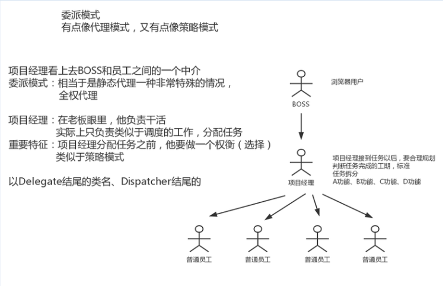

## 委派模式

应用场景：不属于 23 种设计模式之一，是面向对象设计模式中常用的一种模式。这种模式的原理为类 B
和类 A 是两个互相没有任何关系的类，B 具有和 A 一模一样的方法和属性；并且调用 B 中的方法，属性
就是调用 A 中同名的方法和属性。B 好像就是一个受 A 授权委托的中介。第三方的代码不需要知道 A 的
存在，也不需要和 A 发生直接的联系，通过 B 就可以直接使用 A 的功能，这样既能够使用到 A 的各种功
能，又能够很好的将 A 保护起来了，一举两得。


归类：行为型模式

特点 ：1.要和代理模式区分开来。2.持有被委托人的引用。3.不关心过程，只关心结果。

穷举：经 理 派 发 工 作 任 务 、Dispatcher



```java
└─src
    └─com
        └─vip
            └─pattern
                └─delegate
                    └─mvc
                        │  ServletDispatcher.java
                        │  
                        └─controller
                                MemberAction.java
                                OrderAction.java
                                SystemAction.java
```

```java
package com.vip.pattern.delegate.mvc.controller;

/**
 * @author 御香烤翅
 * @create 2020-01-14 13:52
 */
public class MemberAction {

    public void getMemberById(String mid){

    }

}
```

```java
package com.vip.pattern.delegate.mvc.controller;

/**
 * @author 御香烤翅
 * @create 2020-01-14 13:53
 */
public class OrderAction {

    public void getOrderById(String orderId){

    }
}
```

```java
package com.vip.pattern.delegate.mvc.controller;

/**
 * @author 御香烤翅
 * @create 2020-01-14 13:53
 */
public class SystemAction {

    public void logout(){

    }
}
```

```java
package com.vip.pattern.delegate.mvc;

import com.vip.pattern.delegate.mvc.controller.MemberAction;

import javax.servlet.http.HttpServletRequest;
import javax.servlet.http.HttpServletResponse;
import java.lang.reflect.InvocationTargetException;
import java.lang.reflect.Method;
import java.util.ArrayList;
import java.util.List;

/**
 * @author 御香烤翅
 * @create 2020-01-14 13:54
 */
public class ServletDispatcher {

    private List<Hander> handerMapping =new ArrayList<>();

    public ServletDispatcher(){
        Class<?> memberActionClass=MemberAction.class;
        try {
            handerMapping.add(new Hander().setController(memberActionClass.newInstance())
            .setMethod(memberActionClass.getMethod("getMember",new Class[]{String.class}))
            .setUrl("/web/getMemberById.json"));
        } catch (Exception e) {
            e.printStackTrace();
        }
    }


    public void doService(HttpServletRequest request, HttpServletResponse response){
        doDispatch(request,response);
    }


    public void doDispatch(HttpServletRequest request, HttpServletResponse response){

        //1.拿到请求中的uri
        //  如果按照J2EE的标准、每个url对应一个servlet,url有浏览器输入

        String uri=request.getRequestURI();

        //2.servlet拿到url，要做权衡（要做判断，要做选择）
        //  根据用户请求的url，去找到这个url对应的某一个java的方法

        //3、通过拿到的url去handerMapping（我们把它认为是策略常量）
        Hander hander=null;
        // 通过Handler 负责分发任务
        for(Hander h:handerMapping){
            if(uri.equals(h.getUrl())){
                hander=h;
            }
        }

        //4.将具体的方法分配给Method(通过反射区调用其对应的方法)
        Object object=null;
        try {
            object= hander.getMethod().invoke(hander.getController(),null);

        } catch (IllegalAccessException e) {
            e.printStackTrace();
        } catch (InvocationTargetException e) {
            e.printStackTrace();
        }


        //获取到Method执行的结果，最后把调用得到的结果返回 response 写出 出去
//        response.getWriter().write(object);

    }


}

//定义了一个内部的处理类
class Hander{

    private Object controller;
    private Method method;
    private String url;

    public Object getController() {
        return controller;
    }

    public Hander setController(Object controller) {
        this.controller = controller;
        return this;
    }

    public Method getMethod() {
        return method;
    }

    public Hander setMethod(Method method) {
        this.method = method;
        return this;
    }

    public String getUrl() {
        return url;
    }

    public Hander setUrl(String url) {
        this.url = url;
        return this;
    }
}
```


总结：委派模式就是 把请求（分配到的任务），有策略的分配给其他人去做。就是自己不干活，功劳全是自己的。

