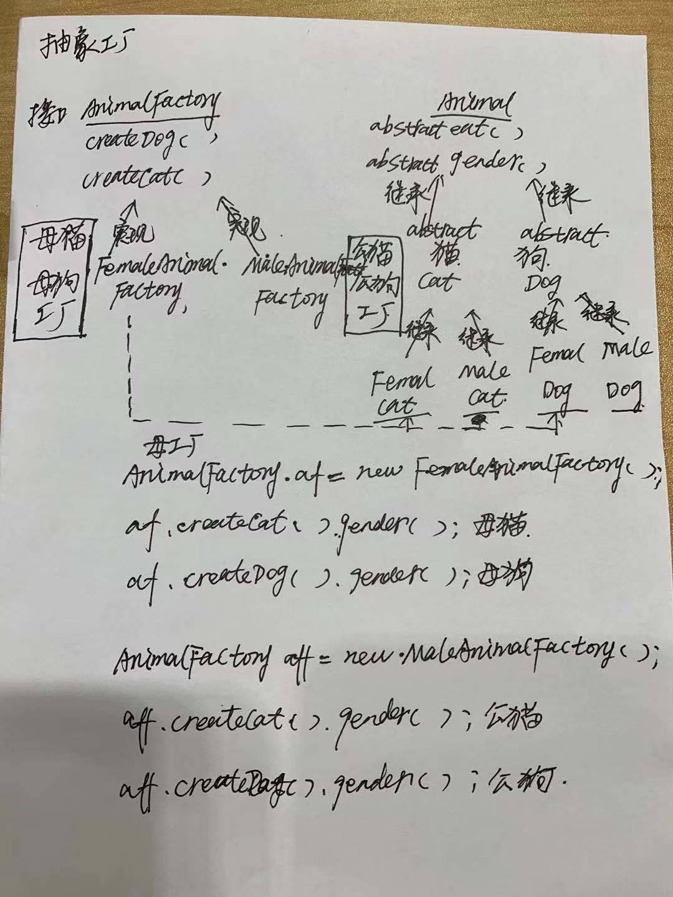

工厂模式可以分成三类：

- 简单/静态工厂模式
- 工厂方法模式
- 抽象工厂模式

下面我就逐一来介绍一下每一种工厂模式有什么不一样~

三种模式都以：要买宠物的例子来讲解~

方法工厂模式：

抽象工厂模式：

简单来说：工厂方法模式的工厂是创建出**一种**产品，而抽象工厂是创建出**一类**产品。

- 一类的产品我们称之为**产品族**。

- - 猫是一类的，狗也是一类的。所以AnimalFactory定义了两类产品--->`Animal createDog();`和`Animal createCat();`

- 产品的**继承结构**称之为**产品等级**。

- - 所有的动物都是会吃东西的，它们都是有性别的，这是最普遍的。所以Animal定义了两个抽象方法：`public abstract void eat();`和`public abstract void gender();`

  - 所有的狗都是会吃肉的，所以Dog实现了`eat()`方法

  - - 狗又分成了公狗和母狗，所以定义了两个类FemaleDog和MaleDog继承了Dog，实现了`gender()`方法

  - 所有的猫都是会吃鱼的，所以Cat实现了`eat()`方法

  - - 猫又分成了公猫和母猫，所以定义了两个类FemaleCat和MaleCat继承了Cat，实现了`gender()`方法

- 具体的工厂是**面向多个产品等级结构进行生产**。

- - 所以FemaleAnimalFactory定义了`createDog()`和`createCat()`生产母狗和母猫
  - 所以MaleAnimalFactory定义了`createDog()`和`createCat()`生产公狗和共猫

- 找到母工厂就可以创建母猫和母狗，找到公工厂就可以创建公猫和公狗

  

https://zhuanlan.zhihu.com/p/37095996