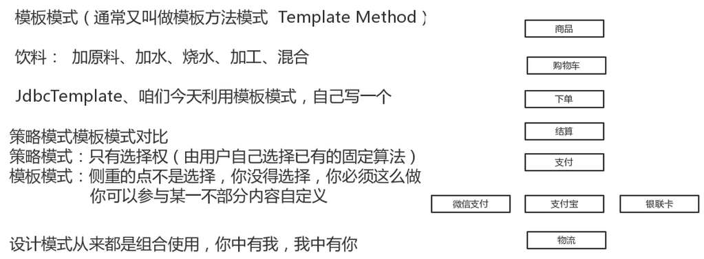

## 模板模式


定义一个操作中的算法的骨架，而将一些步骤延迟到子类中。Template Method 使得子类可以不改变一个算法的结构即可重定义该算法的某些特定步骤。
Template Method 模式一般是需要继承的。这里想要探讨另一种对 Template Method 的理解。

Spring中的 JdbcTemplate，在用这个类时并不想去继承这个类，因为这个类的方法太多，但是我们还是想用到 JdbcTemplate 已有的稳定的、公用的数据库连接，那么我们怎么办呢？我们可以把变化的东西抽出来作为一个参数传入 JdbcTemplate 的方法中。但是变化的东西是一段代码，而且这段代码会用到JdbcTemplate 中的变量。怎么办？那我们就用回调对象吧。在这个回调对象中定义一个操纵JdbcTemplate 中变量的方法，我们去实现这个方法，就把变化的东西集中到这里了。然后我们再传入这个回调对象到 JdbcTemplate，从而完成了调用。这就是 Template Method 不需要继承的另一种实现方式。


归类：行为型模式

特点：执行流程固定，但中间有些步骤有细微差别（运行时才确定）。可实现批量生产。

穷举：Spring ORM 数据模型



代码实现如下：

```java
│                                  
└─src
    └─com
        └─vip
            └─pattern
                └─template
                    │  JdbcTemplate.java
                    │  MemberDaoTest.java
                    │  RowMapper.java
                    │  
                    ├─dao
                    │      MemberDao.java
                    │      
                    └─entity
                            Member.java
```


```java
package com.vip.pattern.template.entity;

/**
 * @author 御香烤翅
 * @create 2020-01-13 20:15
 */
public class Member {

    private String username;
    private String password;
    private String nickName;

    private int age;
    private String addr;

    public String getUsername() {
        return username;
    }

    public void setUsername(String username) {
        this.username = username;
    }

    public String getPassword() {
        return password;
    }

    public void setPassword(String password) {
        this.password = password;
    }

    public String getNickName() {
        return nickName;
    }

    public void setNickName(String nickName) {
        this.nickName = nickName;
    }

    public int getAge() {
        return age;
    }

    public void setAge(int age) {
        this.age = age;
    }

    public String getAddr() {
        return addr;
    }

    public void setAddr(String addr) {
        this.addr = addr;

    }

    public Member(String username, String password, String nickName, int age, String addr) {
        this.username = username;
        this.password = password;
        this.nickName = nickName;
        this.age = age;
        this.addr = addr;
    }

    public Member() {
    }
}

```

```java
package com.vip.pattern.template.dao;

import com.vip.pattern.template.JdbcTemplate;
import com.vip.pattern.template.RowMapper;
import com.vip.pattern.template.entity.Member;

import java.sql.ResultSet;
import java.util.List;

/**
 * @author 御香烤翅
 * @create 2020-01-13 20:17
 */

//解耦，为什么不是继承 JdbcTemplate ，因为这样可以解耦
public class MemberDao {

    private JdbcTemplate jdbcTemplate=new JdbcTemplate(null);

    public List<?> query() throws Exception{
        String sql="select * from t_member where id= 1";
        return jdbcTemplate.executQuery(sql, new RowMapper<Member>() {
            @Override
            public Member mapRow(ResultSet rs, int rowNum) throws Exception{
                Member member=new Member();
                member.setUsername(rs.getString("username"));
                member.setPassword(rs.getString("password"));
                member.setAddr(rs.getString("addr"));
                member.setAge(rs.getInt("age"));
                return member;
            }
        },null) ;

    }
}

```

```java
package com.vip.pattern.template;

import javax.sql.DataSource;
import java.sql.Connection;
import java.sql.PreparedStatement;
import java.sql.ResultSet;
import java.util.ArrayList;
import java.util.List;

/**
 * @author 御香烤翅
 * @create 2020-01-13 19:46
 */
public class JdbcTemplate {

    private DataSource dataSource;

    public JdbcTemplate(DataSource dataSource) {
        this.dataSource = dataSource;
    }

    //连接的方法
    private Connection getConnection() throws Exception {
        return dataSource.getConnection();
    }

    //预编译sql 语句
    private PreparedStatement createPreparedStatement(Connection conn, String sql) throws Exception {
        return conn.prepareStatement(sql);
    }

    //执行sql语句，获取结果集
    private ResultSet executeQuery(PreparedStatement pstmt, Object[] values) throws Exception {
        for (int i = 0; i < values.length; i++) {
            pstmt.setObject(i, values[i]);
        }
        return pstmt.executeQuery();
    }


    //解析结果集
    private List<?> parseResultSet(ResultSet re, RowMapper rowMapper) throws Exception {

        List<Object> result = new ArrayList<>();
        int rowNum = 1;
        while (re.next()) {
            result.add(rowMapper.mapRow(re, rowNum++));
        }
        return result;
    }

    //关闭 PreparedStatement
    private void closePreparedStatement(PreparedStatement pstmt) throws Exception {
        pstmt.close();
    }

    //关闭连接
    private void closeConnection(Connection conn) throws Exception {
        //conn.close();
        //通常是放进连接池进行回收
    }


    public List<?> executQuery(String sql, RowMapper rowMapper, Object[] values) throws Exception {

        //加载驱动
        //建立连接
        Connection conn = this.getConnection();

        //执行语句
        PreparedStatement pstmt = this.createPreparedStatement(conn, sql);

        //获取执行的结果
        ResultSet rs = this.executeQuery(pstmt, values);

        //解析结果
        List<?> list = this.parseResultSet(rs, rowMapper);

        //关闭PreparedStatement
        this.closePreparedStatement(pstmt);

        //关闭连接
        this.closeConnection(conn);

        return list;
    }
}

```

```java
package com.vip.pattern.template;

import java.sql.ResultSet;

/**
 * @author 御香烤翅
 * @create 2020-01-13 20:07
 */
public interface RowMapper<T> {

    public T mapRow(ResultSet rs,int rowNum) throws Exception;
}

```

```java
package com.vip.pattern.template;

import com.vip.pattern.template.dao.MemberDao;

/**
 * @author 御香烤翅
 * @create 2020-01-13 20:25
 */
public class MemberDaoTest {

    public static void main(String[] args) throws Exception {
        MemberDao memberDao=new MemberDao();
        memberDao.query();
    }
}
```


总结：模板模式就是按照规定的流程不能变更，但是流程里面的部分步骤可以自己实现。

