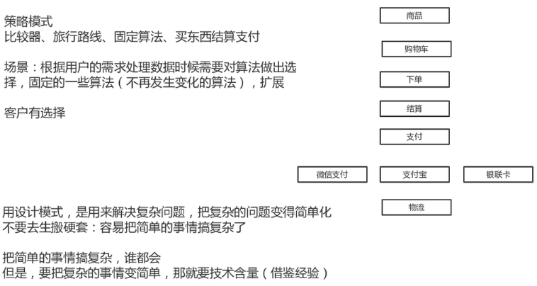

## 策略模式

应用场景：

定义一系列的算法，把它们一个个封装起来，并且使它们可相互替换。本模式使得算法可独立于使用它的客户而变化。
Spring 中在实例化对象的时候用到 Strategy 模式，在 SimpleInstantiationStrategy 有使用。



```java
 └─com
        └─vip
            └─pattern
                └─strategy   //订单
                    │  Order.java
                    │  PayStatus.java
                    │  StrategyTest.java      
                    └─paymentway //支付的方式
                            AliPay.java
                            Payment.java
                            PayType.java
                            WeChatPay.java
```

paymentway：

```java
package com.vip.pattern.strategy.paymentway;

import com.vip.pattern.strategy.PayStatus;

/**
 * @author 御香烤翅
 * @create 2020-01-09 20:03
 */
public interface Payment {

    PayStatus pay(String uid,double money);

}
```

```java
package com.vip.pattern.strategy.paymentway;

import com.vip.pattern.strategy.PayStatus;

/**
 * @author 御香烤翅
 * @create 2020-01-09 20:10
 */
public class AliPay implements Payment {

    @Override
    public PayStatus pay(String uid,double money) {
        System.out.println("使用了阿里支付宝进行支付...");
        return new PayStatus("200",money,"支付成功");
    }
}
```

```java
package com.vip.pattern.strategy.paymentway;

import com.vip.pattern.strategy.PayStatus;

/**
 * @author 御香烤翅
 * @create 2020-01-09 20:52
 */
public class WeChatPay implements Payment {
    @Override
    public PayStatus pay(String uid, double money) {
        System.out.println("使用了微信支付进行支付...");
        return new PayStatus("200",money,"支付成功");
    }
}
```

```java
package com.vip.pattern.strategy.paymentway;

/**
 * @author 御香烤翅
 * @create 2020-01-09 20:07
 */
public enum PayType {

    ALI_PAY(new AliPay()), //阿里支付
    WE_CHAT_PAY(new WeChatPay()); //微信支付

    private Payment payment;

    //每调用一次常量，则就调用了一次构造方法
    PayType(Payment payment){
        this.payment=payment;
    }

    public Payment get(){
        return this.payment;
    }
}
```

strategy：

```java
package com.vip.pattern.strategy;

import com.vip.pattern.strategy.paymentway.PayType;

/**
 * @author 御香烤翅
 * @create 2020-01-09 20:01
 */
public class Order {

    private String uid;
    private String orderNo;
    private double money;

    public Order(String uid, String orderNo, double money) {
        this.uid = uid;
        this.orderNo = orderNo;
        this.money = money;
    }


    PayStatus pay(PayType payType){
        return payType.get().pay(this.uid,this.money);
    }
}

```

```java
package com.vip.pattern.strategy;

/**
 * @author 御香烤翅
 * @create 2020-01-09 20:03
 */
public class PayStatus {

    private String code;
    private Object data;
    private String msg;

    public PayStatus(String code, Object data, String msg) {
        this.code = code;
        this.data = data;
        this.msg = msg;
    }

    @Override
    public String toString() {
        return "支付成功{" +
                "支付状态='" + code + '\'' +
                ", 支付信息-data=" + data +
                ", 支付提示信息-msg='" + msg + '\'' +
                '}';
    }
}

```

```java
package com.vip.pattern.strategy;

import com.vip.pattern.strategy.paymentway.PayType;

/**
 * @author 御香烤翅
 * @create 2020-01-09 20:07
 */
public class StrategyTest {

    public static void main(String[] args) {
        System.out.println("模拟支付...");

        Order order=new Order("001","0000",12.3);

        order.pay(PayType.ALI_PAY);//这里就是直接点选，用户直接选择就行了

    }
}
```

