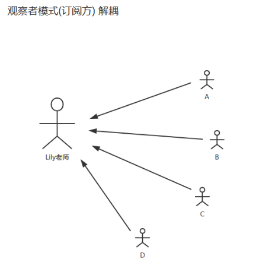

## 观察者模式2

应用场景：定义对象间的一种一对多的依赖关系，当一个对象的状态发生改变时，所有依赖于它的对象都得到通知并被自动更新。
Spring 中 Observer 模式常用的地方是 Listener 的实现。如 ApplicationListener。


归类 ：行为型模式 

特点 ：一般由两个角色组成：发布者和订阅者（观察者）。观察者通常有一个回调，也可以没有。

穷举：监听器、日志收集、短信通知、邮件通知




```java
└─src
    └─com
        └─vip
            └─pattern    
                └─observer2
                    │  IObserver.java
                    │  ISubject.java
                    │  Observer.java
                    │  ObserverTest.java
                    │  Subject.java
                    │  SubjectEventType.java
                    │  
                    └─core
                            Event.java
                            EventLisenter.java
                            Listener.java
                            
```


```java
package com.vip.pattern.observer2.core;

import java.lang.reflect.Method;

/**
 * 事件实体
 * @author 御香烤翅
 * @create 2020-01-15 15:15
 */
public class Event {

    //触发的事件源（被观察者）
    private Object source;

    //触发的事件目标-通知的目标（观察者）
    private Object target;

    //回调的方法
    private Method callback;

    //事件的名称
    private String trigger;

    //事件
    private long time;

    public Event(Object target, Method callback) {
        this.target = target;
        this.callback = callback;
    }

    @Override
    public String toString() {
        return "Event{\n\t" +
                "\tsource=" + source + ",\n" +
                "\t, target=" + target + ",\n" +
                "\t, callback=" + callback + ",\n" +
                "\t, trigger='" + trigger + '\'' + ",\n" +
                "\t, time=" + time + "\n" +
                '}';
    }

    public Object getSource() {
        return source;
    }

     void setSource(Object source) {
        this.source = source;
    }

    public Object getTarget() {
        return target;
    }

    Event setTarget(Object target) {
        this.target = target;
        return this;
    }

    public Method getCallback() {
        return callback;
    }

     Event setCallback(Method callback) {
        this.callback = callback;
        return this;
    }

    public String getTrigger() {
        return trigger;
    }

    Event setTrigger(String trigger) {
        this.trigger = trigger;
        return this;
    }

    public long getTime() {
        return time;
    }

    void setTime(long time) {
        this.time = time;
    }
}

```

```java
package com.vip.pattern.observer2.core;

import java.lang.reflect.Method;

/**
 * @author 御香烤翅
 * @create 2020-01-15 15:08
 */
public interface Listener {

    /**
     * 添加监听
     * @param eventType 监听的类型枚举
     * @param target  监听的目标对象（观察者）
     * @param callback 监听目标对象的回调方法（监听回调的方法）
     */
    void addLisenter(Enum eventType,Object target,Method callback);

}

```

```java
package com.vip.pattern.observer2.core;

import java.lang.reflect.InvocationTargetException;
import java.lang.reflect.Method;
import java.util.HashMap;
import java.util.Map;

/**
 * 监听事件
 * @author 御香烤翅
 * @create 2020-01-15 15:14
 */
public class EventLisenter implements Listener {

    protected Map<Enum,Event> events=new HashMap<>();

    @Override
    public void addLisenter(Enum eventType, Object target, Method callback) {
        System.out.println("添加监听");
        //添加监听
        events.put(eventType,new Event(target,callback));
    }


    //触发枚举类型中的 枚举
    public void trigger(Enum enumType){
        //枚举类型的枚举没有被注册监听到EventLisenter,直接返回
        if(!this.events.containsKey(enumType)){
            return;
        }

        Event event=events.get(enumType);
        event.setTrigger(enumType.toString());//事件的名称
        event.setSource(this);//？
        event.setTime(System.currentTimeMillis());
        try {
            //调用目标方法
            event.getCallback().invoke(event.getTarget(),event);
        } catch (IllegalAccessException e) {
            e.printStackTrace();
        } catch (InvocationTargetException e) {
            e.printStackTrace();
        }

    }
}

```

```java
package com.vip.pattern.observer2;

/**
 * 被观察者
 * @author 御香烤翅
 * @create 2020-01-15 15:57
 */
public interface ISubject {

    //添加方法
     void add();

     //删除方法
     void remove();
}

```

```java
package com.vip.pattern.observer2;

import com.vip.pattern.observer2.core.EventLisenter;

/**
 * @author 御香烤翅
 * @create 2020-01-15 15:58
 */
public class Subject extends EventLisenter implements ISubject {
    @Override
    public void add() {
        System.out.println("调用添加的方法");
        trigger(SubjectEventType.ON_ADD);
    }

    @Override
    public void remove() {
        System.out.println("调用去除的方法");
        trigger(SubjectEventType.ON_REMOVE);
    }
}

```

```java
package com.vip.pattern.observer2;

/**
 * @author 御香烤翅
 * @create 2020-01-15 15:59
 */
public enum SubjectEventType {
    ON_ADD,
    ON_REMOVE,
    ON_EDIT,
    ON_QUERY;
}

```

```java
package com.vip.pattern.observer2;

import com.vip.pattern.observer2.core.Event;

/**
 * @author 御香烤翅
 * @create 2020-01-15 16:02
 */
public interface IObserver {

    void advice(Event event);

}

```

```java
package com.vip.pattern.observer2;

import com.vip.pattern.observer2.core.Event;

/**
 * @author 御香烤翅
 * @create 2020-01-15 16:02
 */
public class Observer implements IObserver {
    @Override
    public void advice(Event event) {
        System.out.println("---调用了advice---"+event);
    }
}

```

```java
package com.vip.pattern.observer2;

import com.vip.pattern.observer2.core.Event;
import com.vip.pattern.observer2.core.EventLisenter;

import java.lang.reflect.Method;

/**
 * @author 御香烤翅
 * @create 2020-01-15 16:03
 */
public class ObserverTest {

    public static void main(String[] args) throws Exception{

        Subject subject=new Subject();

        Observer observer=new Observer();

        Method callback=Observer.class.getMethod("advice",new Class[]{Event.class});

        subject.addLisenter(SubjectEventType.ON_ADD,observer,callback);
        subject.addLisenter(SubjectEventType.ON_REMOVE,observer,callback);

        subject.add();
        subject.remove();

    }
}

```

