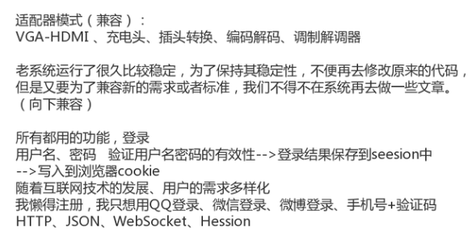

## 适配器模式

Spring AOP 模块对 BeforeAdvice、AfterAdvice、ThrowsAdvice 三种通知类型的支持实际上是借助适配器模式来实现的，这样的好处是使得框架允许用户向框架中加入自己想要支持的任何一种通知类型，上述三种通知类型是 Spring AOP 模块定义的，它们是 AOP 联盟定义的 Advice 的子类型。*最大的特性是兼容。*


归类 ：结构型模式

特点：1. 注重兼容、转换。2.适配者与被适配这之间没有层级关系，也没有必然联
系。3.满足 has-a 的关系。

穷举：编码解码、一拖三充电头、HDMI 转 VGA、Type-C 转 USB




```java
└─src
    └─com
        └─vip
            └─pattern
                └─adapter
                    │  Member.java
                    │  ResultMsg.java
                    │  
                    └─passport
                            SinginForThirdService.java
                            SinginService.java
```

```java
package com.vip.pattern.adapter;

/**
 * @author 御香烤翅
 * @create 2020-01-14 15:14
 */
public class Member {

    private String username;
    private String password;
    private String mid;
    private String info;

    public String getUsername() {
        return username;
    }

    public void setUsername(String username) {
        this.username = username;
    }

    public String getPassword() {
        return password;
    }

    public void setPassword(String password) {
        this.password = password;
    }

    public String getMid() {
        return mid;
    }

    public void setMid(String mid) {
        this.mid = mid;
    }

    public String getInfo() {
        return info;
    }

    public void setInfo(String info) {
        this.info = info;
    }

    public Member() {
    }
}

```

```java
package com.vip.pattern.adapter;

/**
 * @author 御香烤翅
 * @create 2020-01-14 15:15
 */
public class ResultMsg {

    private int code;
    private String msg;
    private Object data;

    public ResultMsg(int code, String msg, Object data) {
        this.code = code;
        this.msg = msg;
        this.data = data;
    }

    public int getCode() {
        return code;
    }

    public void setCode(int code) {
        this.code = code;
    }

    public String getMsg() {
        return msg;
    }

    public void setMsg(String msg) {
        this.msg = msg;
    }

    public Object getData() {
        return data;
    }

    public void setData(Object data) {
        this.data = data;
    }
}

```

```java
package com.vip.pattern.adapter.passport;

import com.vip.pattern.adapter.Member;
import com.vip.pattern.adapter.ResultMsg;

/**
 * 这是一个已经运行的和那就，很稳定的类
 * @author 御香烤翅
 * @create 2020-01-14 15:17
 */
public class SinginService {
    /**
     * 注册方法
     * @return
     */
    public ResultMsg register(String username,String password){
        return  new ResultMsg(200,"注册成功",new Member());
    }

    /**
     * 登录的方法
     * @param username
     * @param password
     * @return
     */
    public ResultMsg login(String username,String password){
        return null;
    }


}

```

```java
package com.vip.pattern.adapter.passport;

import com.vip.pattern.adapter.ResultMsg;

/**
 * 稳定的方法不动，直接继承下来
 * @author 御香烤翅
 * @create 2020-01-14 15:21
 */
public class SinginForThirdService extends SinginService {


    public ResultMsg loginForQQ(String openId){
        //1、openId是全局唯一，我们可以把它当做是一个用户名(加长)
        //2、密码默认为QQ_EMPTY
        //3、注册（在原有系统里面创建一个用户）

        //4、调用原来的登录方法

        return loginForRegist(openId,null);
    }

    //实现和loginForQQ 基本一样
    public ResultMsg loginForWechat(String openId){
        return null;
    }

    //主要就是调用父类的方法，来实现适配器
    public ResultMsg loginForRegist(String username,String password){
        super.register(username,null);//先调了依次注册
        return super.login(username,null);//再调用了登录
    }
}

```

总结：适配器模式就是，兼容，这个例子之中就是使用继承来实现。

